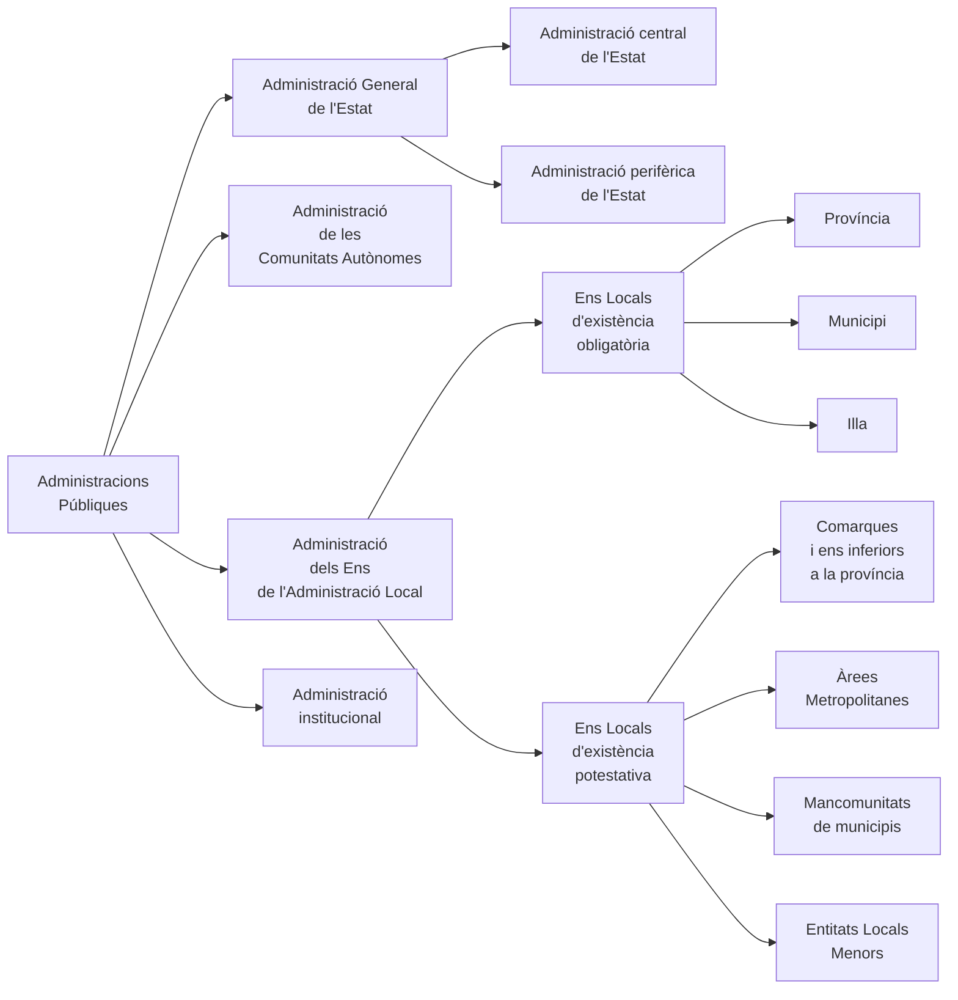

- fichero orginal: https://drive.google.com/drive/folders/1bSG4Sm50Gmksha3NehI8oScvGQD16-AJ?usp=drive_link
- Tècnic Superior Ajuntament de Barcelona - Temari comú - Temes 06 i 07 - Apunts

**TEMA 06**

- **L'ADMINISTRACIÓ PÚBLICA A L'ORDENAMENT ESPANYOL.**
- **PRINCIPIS CONSTITUCIONALS D'ACTUACIÓ.**
- **TIPOLOGIA DE LES ADMINISTRACIONS PÚBLIQUES.**
- **TEMA 07 (NUMERAT TAMBÉ COM A TEMA 06 A L'ÍNDEX)**
- **L'ADMINISTRACIÓ GENERAL DE L'ESTAT: REGULACIÓ, CARACTERÍSTIQUES**
- **GENERALS I PRINCIPIS D'ORGANITZACIÓ.**
- **ÒRGANS SUPERIORS I ÒRGANS DIRECTIUS.**
- **L'ADMINISTRACIÓ PERIFÈRICA DE L'ESTAT.**
- **ELS DELEGATS DEL GOVERN A LES COMUNITATS AUTÒNOMES.**

<!-- TOC START -->
**INDICE INTERACTIVO**

- [6.1 L'ADMINISTRACIÓ PÚBLICA: CONCEPTE I PRINCIPIS](#6-1-l-administracio-publica-concepte-i-principis)
  - [6.1.1 L'Administració Pública](#6-1-1-l-administracio-publica)
    - [6.1.1.1 Naixement i evolució històrica](#6-1-1-1-naixement-i-evolucio-historica)
    - [6.1.1.2 L'Administració Pública com a persona jurídica](#6-1-1-2-l-administracio-publica-com-a-persona-juridica)
    - [6.1.1.3 Les Administracions Públiques com a titulars de potestats públiques o administratives](#6-1-1-3-les-administracions-publiques-com-a-titulars-de-potestats-publiques-o-administratives)
  - [6.1.2 L'Administració Pública a l'ordenament jurídic espanyol: principis constitucionals informadors](#6-1-2-l-administracio-publica-a-l-ordenament-juridic-espanyol-principis-constitucionals-informadors)
    - [6.1.2.1 L'Administració Pública està integrada al poder executiu](#6-1-2-1-l-administracio-publica-esta-integrada-al-poder-executiu)
    - [6.1.2.2 L'activitat de l'Administració Pública no és tan sols una activitat executiva](#6-1-2-2-l-activitat-de-l-administracio-publica-no-es-tan-sols-una-activitat-executiva)
    - [6.1.2.3 Subjectes que integren l'Administració Pública](#6-1-2-3-subjectes-que-integren-l-administracio-publica)
  - [6.1.3 Principis reguladors de l'actuació administrativa](#6-1-3-principis-reguladors-de-l-actuacio-administrativa)
    - [6.1.3.1 Principis constitucionals](#6-1-3-1-principis-constitucionals)
      - [A) Legalitat i responsabilitat](#a-legalitat-i-responsabilitat)
      - [B) Objectivitat](#b-objectivitat)
      - [C) L'Administració Pública gestiona interessos col·lectius](#c-l-administracio-publica-gestiona-interessos-col-lectius)
      - [D) Eficàcia](#d-eficacia)
      - [E) Participació](#e-participacio)
      - [F) ACTUACIÓ INTERVENCIONISTA](#f-actuacio-intervencionista)
      - [G) TRACTACMENT COMÚ](#g-tractacment-comu)
      - [H) FACILITACIÓ DE LA PARTICIPACIÓ DELS CIUTADANS](#h-facilitacio-de-la-participacio-dels-ciutadans)
    - [6.1.3.2 Principis que afecten l'actuació de l'Administració Pública segons la L40/2015](#6-1-3-2-principis-que-afecten-l-actuacio-de-l-administracio-publica-segons-la-l40-2015)
  - [6.1.4 Principis organitzatius de l'Administració Pública](#6-1-4-principis-organitzatius-de-l-administracio-publica)
    - [6.1.4.1 Principis constitucionals d'organització de l'activitat de l'Administració Pública](#6-1-4-1-principis-constitucionals-d-organitzacio-de-l-activitat-de-l-administracio-publica)
      - [A) PPRINCIPI DE JERARQUIA](#a-pprincipi-de-jerarquia)
      - [B) PRINCIPI DE DESCENTRALITZACIÓ](#b-principi-de-descentralitzacio)
      - [C) PRINCIPI DE DESCONCENTRACIÓ](#c-principi-de-desconcentracio)
      - [D) PRINCIPI D'AUTONOMIA](#d-principi-d-autonomia)
      - [E) PRINCIPI DE COORDINACIÓ](#e-principi-de-coordinacio)
      - [F) LA SUBMISSIÓ DE L'ADMINISTRACIÓ A LA LLEI I AL DRET](#f-la-submissio-de-l-administracio-a-la-llei-i-al-dret)
    - [6.1.4.2 Principis d'organització interadministrativa](#6-1-4-2-principis-d-organitzacio-interadministrativa)
      - [A) PRINCIPIS GENERALS](#a-principis-generals)
      - [B) TÈCNIQUES ORGÀNIQUES DE COOPERACIÓ](#b-tecniques-organiques-de-cooperacio)
      - [C) ELS ÒRGANS DE LES ADMINISTRACIONS PÚBLIQUES](#c-els-organs-de-les-administracions-publiques)
        - [A) Creació d'òrgans administratius](#a-creacio-d-organs-administratius)
        - [B) Competència de l'òrgan](#b-competencia-de-l-organ)
        - [C) Delegació de competències](#c-delegacio-de-competencies)
        - [D) Avocació](#d-avocacio)
        - [E) Encàrrecs de gestió](#e-encarrecs-de-gestio)
        - [F) Delegació de signatura](#f-delegacio-de-signatura)
        - [G) Suplència o substitució](#g-suplencia-o-substitucio)
        - [H) Decisions sobre competència](#h-decisions-sobre-competencia)
  - [6.1.5 El principi de legalitat](#6-1-5-el-principi-de-legalitat)
    - [6.1.5.1 La vinculació positiva de l'Administració a la llei i al Dret](#6-1-5-1-la-vinculacio-positiva-de-l-administracio-a-la-llei-i-al-dret)
- [6.2 ORGANITZACIÓ I FUNCIONAMENT DE L'ADMINISTRACIÓ GENERAL DE L'ESTAT](#6-2-organitzacio-i-funcionament-de-l-administracio-general-de-l-estat)
  - [6.2.1 Concepte](#6-2-1-concepte)
  - [6.2.2 Configuració de l'Administració General de l'Estat](#6-2-2-configuracio-de-l-administracio-general-de-l-estat)
    - [6.2.2.1 Caràcters de l'Administració de l'Estat](#6-2-2-1-caracters-de-l-administracio-de-l-estat)
    - [6.2.2.2 Criteris generals d'actuació de l'Administració de l'Estat](#6-2-2-2-criteris-generals-d-actuacio-de-l-administracio-de-l-estat)
      - [A) PRINCIPIS ORGANITZATIUS](#a-principis-organitzatius)
      - [B) ORGANITZACIÓ DE L'ADMINISTRACIÓ GENERAL DE L'ESTAT](#b-organitzacio-de-l-administracio-general-de-l-estat)
      - [C) CLASSIFICACIÓ DEL ÒRGANS DE L'ADMINISTRACIÓ GENERAL DE L'ESTAT](#c-classificacio-del-organs-de-l-administracio-general-de-l-estat)
      - [D) UNITATS ADMINISTRATIVES](#d-unitats-administratives)
      - [E) CREACIÓ, MODIFICACIÓ I SUPRESSIÓ D'ÒRGANS](#e-creacio-modificacio-i-supressio-d-organs)
      - [F) FUNCIONAMENT DELS ÒRGANS COL·LEGIATS](#f-funcionament-dels-organs-col-legiats)
  - [6.2.3 Òrgans superiors i òrgans directius](#6-2-3-organs-superiors-i-organs-directius)
    - [6.2.3.1 El Consell de Ministres](#6-2-3-1-el-consell-de-ministres)
      - [A) NATURALES JURÍDICA](#a-naturales-juridica)
      - [B) COMPOSICIÓ](#b-composicio)
      - [C) PRESIDÈNCIA DEL CONSELL DE MINISTRES](#c-presidencia-del-consell-de-ministres)
      - [D) FUNCIONAMENT](#d-funcionament)
      - [E) FUNCIONS](#e-funcions)
        - [A) Funcions de deliberació](#a-funcions-de-deliberacio)
        - [B) Funcions executives](#b-funcions-executives)
        - [C) Funcions polítiques](#c-funcions-politiques)
        - [D) Funcions normatives](#d-funcions-normatives)
        - [E) Funció reglamentària](#e-funcio-reglamentaria)
        - [F) Funcions administratives](#f-funcions-administratives)
        - [G) Llistat de funcions el Consell de Ministres de l'Art. 5.1 LG](#g-llistat-de-funcions-el-consell-de-ministres-de-l-art-5-1-lg)
    - [6.2.3.2 Les comissions delegades del Govern](#6-2-3-2-les-comissions-delegades-del-govern)
      - [A) CREACIÓ, MODIFICACIÓ I SUPRESSIÓ](#a-creacio-modificacio-i-supressio)
      - [B) COMPOSICIÓ I FUNCIONAMENT](#b-composicio-i-funcionament)
      - [C) ATRIBUCIONS](#c-atribucions)
    - [6.2.3.3 El President del Govern, el Vicepresident](#6-2-3-3-el-president-del-govern-el-vicepresident)
    - [6.2.3.4 Els Ministres](#6-2-3-4-els-ministres)
    - [6.2.3.5 Els departaments ministerials](#6-2-3-5-els-departaments-ministerials)
    - [6.2.3.6 Secretaris d'Estat](#6-2-3-6-secretaris-d-estat)
      - [A) CONCEPTE](#a-concepte)
      - [B) NOMENAMENT, CESSAMENT, INCOMPATIBILITATS I SUBSTITUCIÓ](#b-nomenament-cessament-incompatibilitats-i-substitucio)
      - [C) ATRIBUCIONS](#c-atribucions-2)
    - [6.2.3.7 Sotssecretaris](#6-2-3-7-sotssecretaris)
      - [A) CONCEPTE](#a-concepte-2)
      - [B) NOMENAMENT I CESSAMENT](#b-nomenament-i-cessament)
      - [C) INCOMPATIBILITATS](#c-incompatibilitats)
      - [D) ATRIBUCIONS](#d-atribucions)
    - [6.2.3.8 Secretaris generals amb rang de sotssecretaris](#6-2-3-8-secretaris-generals-amb-rang-de-sotssecretaris)
    - [6.2.3.9 La Comissió General de Secretaris d'Estat i Sotssecretaris](#6-2-3-9-la-comissio-general-de-secretaris-d-estat-i-sotssecretaris)
    - [6.2.3.10 Els directors generals](#6-2-3-10-els-directors-generals)
    - [6.2.3.11 Els secretaris generals tècnics](#6-2-3-11-els-secretaris-generals-tecnics)
    - [6.2.3.12 Altres òrgans](#6-2-3-12-altres-organs)
- [6.3 L'ADMINISTRACIÓ PERIFÈRICA DE L'ESTAT](#6-3-l-administracio-periferica-de-l-estat)
  - [6.3.1 El Delegat del Govern a la Comunitat Autònoma](#6-3-1-el-delegat-del-govern-a-la-comunitat-autonoma)
    - [6.3.1.1 Concepte](#6-3-1-1-concepte)
    - [6.3.1.2 Nomenament i cessament](#6-3-1-2-nomenament-i-cessament)
    - [6.3.1.3 Incompatibilitats](#6-3-1-3-incompatibilitats)
    - [6.3.1.4 Seu i substitució](#6-3-1-4-seu-i-substitucio)
    - [6.3.1.5 Atribucions](#6-3-1-5-atribucions)
      - [A) DIRECCIÓ I COORDINACIÓ DE L'ADMINISTRACIÓ GENERAL DE L'ESTAT I ELS SEUS ORGANISMES PÚBLICS](#a-direccio-i-coordinacio-de-l-administracio-general-de-l-estat-i-els-seus-organismes-publics)
      - [B) INFORMACIÓ DE L'ACCIÓ DE GOVERN I INFORMACIÓ ALS CIUTADANS](#b-informacio-de-l-accio-de-govern-i-informacio-als-ciutadans)
      - [C) COORDINACIÓ I COL·LABORACIÓ AMB ALTRES ADMINISTRACIONS PÚBLIQUES](#c-coordinacio-i-col-laboracio-amb-altres-administracions-publiques)
      - [D) CONTROL DE LEGALITAT](#d-control-de-legalitat)
      - [E) POLÍTIQUES PÚBLIQUES](#e-politiques-publiques)
      - [F) ALTRES ATRIBUCIONS](#f-altres-atribucions)
  - [6.3.2 Els Subdelegats del Govern a les Províncies](#6-3-2-els-subdelegats-del-govern-a-les-provincies)
    - [6.3.2.1 Concepte](#6-3-2-1-concepte)
    - [6.3.2.2 Nomenament i cessament](#6-3-2-2-nomenament-i-cessament)
    - [6.3.2.3 Responsabilitats i incompatibilitats](#6-3-2-3-responsabilitats-i-incompatibilitats)
    - [6.3.2.4 Substitució o suplència](#6-3-2-4-substitucio-o-suplencia)
    - [6.3.2.5 Organització de la Subdelegació del Govern a la província](#6-3-2-5-organitzacio-de-la-subdelegacio-del-govern-a-la-provincia)
    - [6.3.2.6 Atribucions](#6-3-2-6-atribucions)
  - [6.3.3 Altres òrgans territorials de l'Administració perifèrica de l'Estat](#6-3-3-altres-organs-territorials-de-l-administracio-periferica-de-l-estat)
    - [6.3.3.1 Delegats territorials ministerials](#6-3-3-1-delegats-territorials-ministerials)
    - [6.3.3.2 Delegats d'Economia i Hisenda](#6-3-3-2-delegats-d-economia-i-hisenda)
    - [6.3.3.3 Directors insulars de l'Administració General de l'Estat](#6-3-3-3-directors-insulars-de-l-administracio-general-de-l-estat)
    - [6.3.3.4 La Comissió Territorial d'Assistència al delegat del Govern](#6-3-3-4-la-comissio-territorial-d-assistencia-al-delegat-del-govern)
    - [6.3.3.5 Comissió interministerial de coordinació de l'Administració perifèrica de l'Estat](#6-3-3-5-comissio-interministerial-de-coordinacio-de-l-administracio-periferica-de-l-estat)
    - [6.3.3.6 Els serveis territorials](#6-3-3-6-els-serveis-territorials)
- [6.4 TIPOLOGIA DE LES ADMINISTRACIONS PÚBLIQUES](#6-4-tipologia-de-les-administracions-publiques)
  - [6.4.1 L'Administració General de l'Estat](#6-4-1-l-administracio-general-de-l-estat)
  - [6.4.2 L'Administració de les Comunitats Autònomes](#6-4-2-l-administracio-de-les-comunitats-autonomes)
  - [6.4.3 Els ens que componen l'Administració Local](#6-4-3-els-ens-que-componen-l-administracio-local)
  - [6.4.4 L'Administració Institucional i Corporativa](#6-4-4-l-administracio-institucional-i-corporativa)
    - [6.4.4.1 Consideracions generals](#6-4-4-1-consideracions-generals)
    - [6.4.4.2 Ens públics institucionals](#6-4-4-2-ens-publics-institucionals)
    - [6.4.4.3 Ens públics corporatius](#6-4-4-3-ens-publics-corporatius)
  - [6.4.5 Esquema tipologies d'Administració Pública](#6-4-5-esquema-tipologies-d-administracio-publica)
<!-- TOC END -->


# 6.1 L'ADMINISTRACIÓ PÚBLICA: CONCEPTE I PRINCIPIS <a id="6-1-l-administracio-publica-concepte-i-principis"></a>

## 6.1.1 L'Administració Pública <a id="6-1-1-l-administracio-publica"></a>

### 6.1.1.1 Naixement i evolució històrica <a id="6-1-1-1-naixement-i-evolucio-historica"></a>

L'Administració Pública neix al s. XVIII amb el naixement dels règims constitucionals. Això no vol dir que anteriorment no existís, però responia a un concepte totalment diferent al de l'actualitat.

A Europa, el concepte d'Administració Pública neix vinculat a un seguit d'esdeveniments com ara el **parlamentarisme anglès, la Revolució Francesa i, especialment, la teoria de la divisió de poders de Montesquieu**.

L'Administració Pública neix com a organització **limitada per la llei** la qual ja no és la formalització de la voluntat d'un monarca sinó l'expressió de la voluntat majoritària, base de la convivència i que també **vincula i sotmet als poder públics. Aquest naixement del poder de l'Administració Pública determina la creació del Dret Administratiu**.

La Revolució Francesa (1789 - 1799) va tenir una especial importància en la creació de l'actual concepte d'Administració Pública i de Dret Administratiu. Gràcies a aquesta, a França es van instaurar un seguit de normes de Dret específiques per l'Administració i també es va crear una jurisdicció pròpia diferent de la civil. D'aquesta manera, el naixement del Dret Administratiu va coincidir amb el naixement de l'Administració contemporània i de l'Estat de Dret.

A Espanya aquest sistema s'implantà com a herència del sistema francès. A la Constitució de Cadis de 1812 ja s'instaurà la supremacia de la llei sobre el poder executiu així com una nova estructura administrativa i territorial (departaments administratius, províncies, etc.). El gran artífex de la implantació d'aquest model francès fou Javier de Burgos (sota al mandat de Ferran VII). Amb l'assumpció d'aquest model va néixer a Espanya el Dret Administratiu.

En aquest primer estadi de l'Administració Pública, la seva concepció era força funcionalista. El Dret Administratiu es limitava a la regulació de l'exercici del poder executiu.

Posteriorment el concepte d'Administració Pública ha evolucionat al llarg dels anys cap al concepte de subjecte de dret, amb un ventall d'accions més ampli que el mer exercici del poder executiu. Com tots sabem, l'Administració realitza també determinades activitats i serveis com ara la sanitat, l'educació, beneficència, etc.

El punt àlgid de transformació contemporània de l'Administració Pública fou la instauració de l'Estat social del benestar, el qual suposà una transformació radical de la mateixa, esdevenint una organització institucional de millora global de la societat. L'Administració Pública actual, en comparació amb el moment de la seva creació, mostra un augment de la intervenció d'aquesta en la societat tant a nivell social com econòmic.

### 6.1.1.2 L'Administració Pública com a persona jurídica <a id="6-1-1-2-l-administracio-publica-com-a-persona-juridica"></a>

En aquest apartat, quan parlem d'Administració Pública ho fem en un sentit ampli, referint-nos a totes les classes d'Administració que existeixen (i de les quals ja veurem la seva classificació més endavant).

Per Administracions Públiques (AAPP en endavant) entenem el **conjunt d'organitzacions de caràcter públic, dotades de personalitat jurídica, amb finalitat de servei als interessos generals i amb ple sotmetiment al dret i a la llei. Cada ens de l'Administració Pública té personalitat jurídica pròpia.**

Resumint les **característiques** de les AAPP podem fer la següent enumeració:

- **Són organitzacions al servei dels interessos generals.**
- **Són organitzacions amb personalitat jurídica pròpia per al desenvolupament de llurs activitats.**
- **Són titulars d'un conjunt de potestats administratives (poders) atorgades per l'ordenament jurídic.**
- **Estan sotmeses a la llei, al dret i al control de legalitat de les seves actuacions (poden ser portades a judici per motiu de llur actuació).**

Respecte al tema de la personalitat jurídica de les AAPP, l'Art. 3.4 L40/2015 estableix que "cadascuna de les AAPP actuen, per al compliment de llurs finalitats, amb personalitat jurídica única". **En virtut d'aquesta personalitat jurídica les AAPP poden estar dotades de facultats, atribucions, poden ser titulars de drets i d'obligacions, poden posseir patrimoni, realitzar actes administratius, etc.**

**L'actuació de les AAPP està sotmesa a Dret Administratiu com a norma general tot i que, excepcionalment, l'Administració també podrà actuar amb subjecció al Dret Privat quan aquesta actuï sense exercir cap de les seves potestats administratives**. Aquesta darrera afirmació, que pot semblar complicada d'entendre, realment no ho és pas. Un clar exemple és la contractació administrativa, amb la figura dels contractes privats. En ocasions, l'Administració actua com si fos un particular qualsevol.

### 6.1.1.3 Les Administracions Públiques com a titulars de potestats públiques o administratives <a id="6-1-1-3-les-administracions-publiques-com-a-titulars-de-potestats-publiques-o-administratives"></a>

Quan diem que les AAPP estan dotades de potestats públiques o administratives ens referim a que aquestes **són titulars d'un seguit d'aptituds específiques exclusives per a dur a terme determinats actes. Aquests poders els hi són atribuïts per a la consecució de les seves finalitats.** Són conseqüència del "poder d'imperi" de les AAPP. **Són poders de supremacia i superioritat respecte dels particulars.**

Així, per exemple, quan observem que l'Administració té la potestat sancionadora (posar-te una multa per estacionament), expropiadora (embargar-te el saldo del compte si no pagues la multa) o fins i tot l'ús legítim de la violència (carregar contra uns manifestants que estiguin causant disturbis) estem veien diferents exemples molt clars de la dotació de les AAPP de potestats administratives. Evidentment **no totes les AAPP estaran dotades de totes (ni de les mateixes) potestats administratives. Recordem que aquestes es concedeixen per a la consecució de les finalitats concretes de l'Administració en qüestió**.

## 6.1.2 L'Administració Pública a l'ordenament jurídic espanyol: principis constitucionals informadors <a id="6-1-2-l-administracio-publica-a-l-ordenament-juridic-espanyol-principis-constitucionals-informadors"></a>

A continuació veurem els principis constitucionals informadors de l'Activitat de l'Administració.

### 6.1.2.1 L'Administració Pública està integrada al poder executiu <a id="6-1-2-1-l-administracio-publica-esta-integrada-al-poder-executiu"></a>

La Constitució Espanyola (Art 97 CE) estableix que **el Govern dirigeix la política interior i exterior de l'Estat, l'Administració civil i militar i la defensa de l'Estat**. Exerceix la funció executiva i la potestat reglamentària, d'acord amb la Constitució i les lleis.

**El Govern té una doble funció:** **política,** quan dirigeix la política de les diferents àrees o matèries sobres les quals té competència, **i administrativa, quan dirigeix l'Administració**. En l'àmbit de l'Administració central ho fa mitjançant els diferents ministres, com a caps superiors d'un departament ministerial.

Seguint la doctrina més clàssica, es pot dir que **en el Poder executiu s'integren, doncs, l'Administració i el Govern**. Si bé, en l'aspecte orgànic, ambdós subjectes poden coincidir o confondre's, **el Govern** desenvolupa l'activitat política, subjecta bàsicament a un règim jurídic distint de l'Administració, però alhora **es constitueix en òrgan superior de l'Administració**.

### 6.1.2.2 L'activitat de l'Administració Pública no és tan sols una activitat executiva <a id="6-1-2-2-l-activitat-de-l-administracio-publica-no-es-tan-sols-una-activitat-executiva"></a>

**L'Administració pública**, a més d'efectuar funcions executives, **disposa també de la potestat reglamentària**, o capacitat de dictar reglaments, que com a normes jurídiques (d'obligat compliment però de rang jeràrquic inferior a la llei) dirigides a una col·lectivitat d'individus, pertanyen pròpiament al camp de les funcions legislatives. Ara bé, **els reglaments són dictats per l'Administració com a forma d'organitzar els serveis al seu càrrec i per disposar les estructures administratives cap a una millor prestació de serveis**.

### 6.1.2.3 Subjectes que integren l'Administració Pública <a id="6-1-2-3-subjectes-que-integren-l-administracio-publica"></a>

**L'Administració pública no és un ens públic únic, sinó que es desglossa en diverses Administracions públiques: Administració de l'Estat (central i perifèrica), Administració autonòmica, Administració local (ajuntaments, diputacions provincials i altres) i Administració institucional.**

L'Art. 2.3 L40/2015 fa una enumeració d'allò que s'entén per AAPP:

- L'Administració General de l'Estat (AGE).
- Les Administracions de les Comunitats Autònomes.
- Les Entitats que integren l'Administració Local.
- Els Organismes Públics o Entitats de Dret Públic vinculats o dependents de les AAPP.

## 6.1.3 Principis reguladors de l'actuació administrativa <a id="6-1-3-principis-reguladors-de-l-actuacio-administrativa"></a>

Els principis d'actuació administrativa estan continguts parcialment a l'Art. 103 CE en disposar que **l'Administració pública serveix amb objectivitat els interessos generals i actua d'acord amb els principis d'eficàcia, jerarquia, descentralització, desconcentració i coordinació, amb submissió plena a la llei i al dret**.

Al seu torn, la Llei Reguladora de les Bases del Règim Local (LRBRL; L7/1985), en parlar de l'actuació de les entitats locals, assenyala que la seva actuació haurà de respectar els principis d'eficàcia, descentralització, desconcentració i coordinació. Alguns d'aquests principis (concretament, eficàcia i coordinació, són principis de l'actuació administrativa).

També es fa esment a principis de funcionament i actuació a la L40/2015.

### 6.1.3.1 Principis constitucionals <a id="6-1-3-1-principis-constitucionals"></a>

#### A) Legalitat i responsabilitat <a id="a-legalitat-i-responsabilitat"></a>

En aquest tema dedicarem un apartat al principi de legalitat íntegrament. Tot i així, ara en farem un petit avançament. La CE estableix la plena submissió de les AAPP a la llei i al dret i també reconeixen el dret dels tercers a rebre una indemnització per causa de danys com a conseqüència del funcionament dels serveis públics.

Els principis de legalitat i responsabilitat, com a principis d'actuació administrativa, vénen consagrats en la Constitució als Art. 9, 103 i 106 CE. L'art. 103 CE preveu que **l'Administració** (igual que la resta de poders públics i ciutadans) **ha d'actuar amb submissió plena a la llei i al dret**, en paraules de Maurice Hauriou (jurista i sociòleg francès del s. XX) sintetitzant el sentiment popular sobre l'actuació administrativa "que actuï, però que obeeixi la llei; que actuï, però pagui el perjudici".

El segon dels aspectes indicats, el de la responsabilitat, ve consagrat en l'art. i 106 CE en els següents termes **"(...) Els particulars, en els termes establerts en la llei, tindran dret a ser indemnitzats per qualsevol lesió que pateixin en qualsevol dels seus béns i drets, llevat dels casos de força major, sempre que la lesió sigui conseqüència del funcionament dels serveis públics"**.

#### B) Objectivitat <a id="b-objectivitat"></a>

L'Administració és una estructura organitzativa, al servei dels ciutadans, que realitza una gestió imprescindible per a la convivència, subordinada sempre als interessos públics. Aquesta afirmació d'actuació objectiva i en defensa dels interessos generals ve consagrada a l'Art. 103 CE en preveure que **l'Administració pública serveix amb objectivitat els interessos generals**.

El principi d'objectivitat pot considerar-se **sinònim d'imparcialitat i apareix com una conseqüència de la interdicció de l'arbitrarietat dels poders públics establerta a l'Art. 9.3 CE**. Tanmateix, una conseqüència d'aquest principi és la **professionalització de l'Administració d'acord als postulats indicats a l'Art. 103.3 CE**, entre els quals destaca la necessitat **que la llei reguli el sistema d'incompatibilitats dels funcionaris i les garanties per a la imparcialitat en l'exercici de les seves funcions** **i que l'accés a la funció pública (a treballar com a funcionari) es realitzi mitjançant procediment que garanteixin els principis d'igualtat, mèrit i capacitat.**

#### C) L'Administració Pública gestiona interessos col·lectius <a id="c-l-administracio-publica-gestiona-interessos-col-lectius"></a>

**L'Administració persegueix l'interès públic general que s'entén com aquell que ajuda a la plena integració dels ciutadans a la societat** (promovent els valors de llibertat i igualtat esmentats als Art. 1.1 i 9.2 CE).

L'Administració pública ha estat definida com "una organització integrada per una sèrie d'ens, al servei de la comunitat, i que en gestionen els interessos col·lectius". El concepte d'interès públic és un concepte indeterminat que ha d'estar completat en base a la Constitució i a la societat mateixa. Pel que fa a la nostra Constitució, ha de tenir-se també en compte el contingut dels Art. 1 i 9 CE, i el concepte de l'Estat social, que obliga els poders públics (i l'Administració) a desenvolupar els mecanismes adequats per aconseguir la integració social dels ciutadans, **sempre dintre de la persecució de l'interès públic i general en les seves actuacions**.

Ara bé, **en la consecució de l'interès públic o general, l'Administració ha d'actuar sotmesa al dret i a la llei**, com qualsevol ciutadà o **com la resta dels poders públics de l'Estat**. Si no ajustés la seva actuació a la prossecució d'aquest interès públic i general es produiria el que administrativament s'anomena **desviació de poder**, cosa que permetria la revisió dels actes administratius que l'Administració ha dictat en l'ús de les prerrogatives que li són pròpies, però sense ajustar-se a la prossecució d'aquest interès públic i general que fonamenta la seva actuació, i permetria la disposició de prerrogatives especifiques en la seva gestió.

#### D) Eficàcia <a id="d-eficacia"></a>

El principi d'eficàcia, a l'igual que el de coordinació (de contingut obvi, a saber, que les diferents AAPP actuïn de manera coordinada) és, alhora, un principi d'actuació i d'organització.

**Eficàcia significa idoneïtat per a la consecució del resultat que es pretén**, la consecució del resultat que correspon als objectius o normes preestablertes per a l'organització dels objectius fixats pel que fa als mitjans disponibles.

Aquest principi està estretament lligat amb el principi organitzatiu d'eficiència. Com que **l'Art. 103 CE remarca que l'Administració ha d'actuar d'acord amb el principi d'eficàcia, l'obliga a obtenir resultats amb el màxim d'economia de tràmits i temps possible.** Ara bé, la seva realització pràctica no depèn de la seva proclamació constitucional, sinó de les actuacions concretes que es produeixin i dels mitjans personals i materials amb què compti l'Administració per al desenvolupament de les seves funcions.

#### E) Participació <a id="e-participacio"></a>

Aquest principi és una conseqüència del què disposa l'Art. 9.2 CE, ja que preveu que **correspon als poders públics facilitar la participació de tots els ciutadans en la vida política, econòmica, cultural i social**. A part d'aquest enunciat general, l'Art. 105 CE concreta les **formes de participació del ciutadà en l'Administració i preveu que la llei ha de regular les següents modalitats de participació:**

- **L'audiència dels ciutadans** directament o a través de les organitzacions i associacions reconegudes per la llei, **en el procediment d'elaboració de les disposicions administratives que els afectin.**
- **L'accés dels ciutadans als arxius i registres públics.**
- **L'audiència de l'interessat, quan escaigui, en el procediment** a través del qual han de produir-se els actes administratius.

#### F) ACTUACIÓ INTERVENCIONISTA <a id="f-actuacio-intervencionista"></a>

Present a l'Art. 53.3 CE, aquest principi **estableix que l'Administració haurà de ser proactiva en la seva actuació envers la societat.** L'Art. 53.3 CE ho especifica dient que **"el reconeixement, respecte i protecció dels principis rectors de la política social i econòmica informarà l'actuació dels poders públics".** En aquesta frase, el verb informar no té el sentit habitual de reportat informació sinó que és més aviat com "inspirarà". És a dir, que **l'Administració haurà de promoure per si sola una actuació pròpia que tendeixi a protegir i garantir els principis de política econòmica i social propis d'un estat social i democràtic de dret.**

#### G) TRACTACMENT COMÚ <a id="g-tractacment-comu"></a>

**Tractament comú** **de tots els administrats davant totes les AAPP dins l'Estat Autonòmic** (present a l'Art. 149.1.18a CE). Com tots sabem Espanya és un estat d'autonomies. Aquestes Comunitats Autònomes poden fer lleis, les quals són igualment vàlides que les lleis del Congrés dels Diputats i les quals tindran eficàcia dins el territori de la Comunitat Autònoma en qüestió. Ara bé, aquesta potestat legislativa (capacitat de fer lleis) de les Comunitats Autònomes es veurà limitada per motiu de la matèria en concret que es pretengui regular. Així doncs, la CE estableix un repartiment de matèries dins les quals algunes d'elles sí es podran regular per lleis de les Comunitats Cutònomes i d'altres no (matèries de competència exclusiva de l'Estat). Aquest esquema competencial és força més complex del que acabo d'exposar i és objecte d'explicació detallada en altres temes.

Ara bé, **el què ara hem d'entendre és que l'Estat té competència exclusiva en la regulació de les bases (d'allò que és bàsic) del règim jurídic de les AAPP i del procediment administratiu comú.** Per bàsic entenem allò que ha de ser denominador comú en totes les Comunitats Autònomes. És a dir que, tot i que les Comunitats Autònomes podran fer lleis sobre règim jurídic i procediment de les seves pròpies AAPP, aquestes lleis no podran regular aquelles coses que siguin bàsiques (és a dir, no podran entrar a regular allò que ha de ser igual per a totes les AAPP de totes les Comunitats Autònomes quant al seu funcionament) ja que la regulació d'aquests aspectes és competència exclusiva de l'Estat segons l'Art. 149.1.18a CE. Amb aquesta reserva constitucional d'exclusivitat es garanteix el tractament comú de tots els ciutadans per part de les AAPP independentment de la Comunitat Autònoma en què es trobin.

#### H) FACILITACIÓ DE LA PARTICIPACIÓ DELS CIUTADANS <a id="h-facilitacio-de-la-participacio-dels-ciutadans"></a>

Present en diversos articles CE com ara l'Art. 9.2 CE i 105 CE, trobem **diversos exemples de materialitzacions d'aquest principi com ara el tràmit d'audiència dels ciutadans en l'elaboració de les disposicions administratives (reglaments) que els afectin, el dret dels ciutadans d'accés a arxius i registres administratius (amb excepcions justificades) o el tràmit d'audiència dels interessats en els procediments administratius.**

### 6.1.3.2 Principis que afecten l'actuació de l'Administració Pública segons la L40/2015 <a id="6-1-3-2-principis-que-afecten-l-actuacio-de-l-administracio-publica-segons-la-l40-2015"></a>

L'Art. 3 L40/2015 estableix que **les Administracions Públiques serveixen amb objectivitat els interessos generals i actuen d'acord amb els principis d'eficàcia, jerarquia, descentralització, desconcentració i coordinació, amb submissió plena a la Constitució, a la llei i al dret**.

En la seva actuació i relacions hauran de respectar els principis següents:

- Servei efectiu als ciutadans.
- Simplicitat, claredat i proximitat als ciutadans.
- Participació, objectivitat i transparència de l'actuació administrativa.
- Racionalització i agilitat dels procediments administratius i de les activitats materials de gestió.
- Bona fe, confiança legítima i lleialtat institucional.
- Responsabilitat per la gestió pública.
- Planificació i direcció per objectius i control de la gestió i avaluació dels resultats de les polítiques públiques.
- Eficàcia en el compliment dels objectius fixats.
- Economia, suficiència i adequació estricta dels mitjans als fins institucionals.
- Eficiència en l'assignació i la utilització dels recursos públics.
- Cooperació, col·laboració i coordinació entre les administracions públiques.

Al seu torn, l'Art. 4 L40/2015 parla del principi de proporcionalitat en les actuacions administratives que limitin l'exercici de drets individuals.

## 6.1.4 Principis organitzatius de l'Administració Pública <a id="6-1-4-principis-organitzatius-de-l-administracio-publica"></a>

### 6.1.4.1 Principis constitucionals d'organització de l'activitat de l'Administració Pública <a id="6-1-4-1-principis-constitucionals-d-organitzacio-de-l-activitat-de-l-administracio-publica"></a>

#### A) PPRINCIPI DE JERARQUIA <a id="a-pprincipi-de-jerarquia"></a>

Esmentat a l'Art. 103.1 CE, és de contingut bastant obvi. En ocasions existeix una gradació jeràrquica entre diferents AAPP. Per exemple, qualsevol dels Instituts Municipals de Barcelona (com ara l'Institut Municipal de Persones amb Discapacitat) és un Organisme Autònom Municipal creat per l'Ajuntament de Barcelona i té una subordinació jeràrquica envers aquest. Això ho entendrem molt millor quan estudiem les diferents tipologies d'Administració Pública.

#### B) PRINCIPI DE DESCENTRALITZACIÓ <a id="b-principi-de-descentralitzacio"></a>

Esmentat a l'Art. 103.1 CE.

En un sentit **territorial**, el principi de descentralització implica que **les funcions administratives s'han d'atribuir preferentment a les Administracions autonòmica i local, i no pas a l'Administració General de l'Estat. Aquest principi respon a la voluntat d'apropar al màxim possible les potestats administratives a aquelles Administracions que tenen un contacte més proper i directe amb els ciutadans.**

En un sentit **funcional o institucional**, la descentralització consisteix en el **reconeixement de la personalitat administrativa i financera de determinats serveis d'activitat pública, creant ens auxiliars o instrumentals (organismes autònoms, empreses públiques, etc.) per a la seva gestió.**

#### C) PRINCIPI DE DESCONCENTRACIÓ <a id="c-principi-de-desconcentracio"></a>

Esmentat a l'Art. 103.1 CE i en d'altres com l'Art. 8.2 L40/2015.

Molt similar a l'anterior. Es materialitza també en la desconcentració (dispersió) de potestats administratives amb la darrera finalitat d'apropar els òrgans resolutoris de l'Administració a aquells entorns (espais, localitzacions) en els què les seves resolucions hauran de produir efectes.

**Consisteix en la transferència de competències de forma permanent d'un òrgan superior a un altre d'inferior, sigui central o perifèric, dins d'un mateix ens públic**. Es tracta de descongestionar el treball dels òrgans superiors transvasant part de les seves competències als inferiors.

#### D) PRINCIPI D'AUTONOMIA <a id="d-principi-d-autonomia"></a>

Esmentat en diversos Art. CE com ara l'Art. 137 CE, 140 CE i 141 CE**. Promou l'autonomia (llibertat) de cada Administració en l'exercici de llurs competències** (sens menystenir, lògicament, el principi de jerarquia).

#### E) PRINCIPI DE COORDINACIÓ <a id="e-principi-de-coordinacio"></a>

De contingut obvi.

#### F) LA SUBMISSIÓ DE L'ADMINISTRACIÓ A LA LLEI I AL DRET <a id="f-la-submissio-de-l-administracio-a-la-llei-i-al-dret"></a>

L'Art. 1 CE estableix que l'Estat espanyol és un **Estat de dret**. Al seu torn, l'Art. 9.3 CE estableix que **els ciutadans i els poders públics (incloent-hi l'Administració) estan sotmesos a la CE i a la resta de l'ordenament jurídic, al temps que garanteix la interdicció de l'arbitrarietat dels poders públics.**

**És per això que les AAPP, en la seva actuació, han de respectar les lleis. És a dir, que només poden exercir aquelles competències que la norma els permet exercir, no poden adoptar acords sense subjecció a algun tipus de norma (arbitràriament).**

**Per tant, les lleis compleixen una funció de límit positiu a l'activitat administrativa i garantia per als ciutadans.**

### 6.1.4.2 Principis d'organització interadministrativa <a id="6-1-4-2-principis-d-organitzacio-interadministrativa"></a>

#### A) PRINCIPIS GENERALS <a id="a-principis-generals"></a>

L'Art. 140 L40/2015 estableix els **principis que han de regir en les relacions entre les AAPP**.

Les diferents AAPP actuen i es relacionen amb altres AAPP i entitats o organismes que hi estan vinculats o en depenen d'acord amb els principis següents:

- Lleialtat institucional.
- Adequació a l'ordre de distribució de competències que estableixen la Constitució i els estatuts d'autonomia i la normativa del règim local.
- Col·laboració, entesa com el deure d'actuar amb la resta d'administracions públiques per assolir fins comuns.
- Cooperació, quan dues o més administracions publiques, de manera voluntària i en l'exercici de les seves competències, assumeixen compromisos específics en nom d'una acció comuna.
- Coordinació, en virtut del qual una Administració pública i, singularment, l'Administració General de l'Estat, té l'obligació de garantir la coherència de les actuacions de les diferents administracions públiques afectades per una mateixa matèria per a la consecució d'un resultat comú, quan així ho preveuen la Constitució i la resta de l'ordenament jurídic.
- Eficiència en la gestió dels recursos públics, compartint l'ús de recursos comuns, llevat que no sigui possible o es justifiqui en termes d'un millor aprofitament.
- Responsabilitat de cada Administració Pública en el compliment de les seves obligacions i compromisos.
- Garantia i igualtat en l'exercici dels drets de tots els ciutadans en les seves relacions amb les diferents administracions.
- Solidaritat interterritorial d'acord amb la Constitució.

#### B) TÈCNIQUES ORGÀNIQUES DE COOPERACIÓ <a id="b-tecniques-organiques-de-cooperacio"></a>

Es troben regulades als Art. 145 a 154 L40/2015.

- **Òrgans de cooperació:** són òrgans de composició multilateral o bilateral, d'àmbit general o especial, constituïts per **representants de l'AGE, de les Administracions de les Comunitats Autònomes o de les Ciutats Autònomes de Ceuta i Melilla i, si s'escau, de les entitats locals, per acordar voluntàriament actuacions que millorin l'exercici de les competències que té cada Administració Pública** i es regeixen pel que disposa la L40/2015 i per les disposicions específiques que els siguin d'aplicació. Els òrgans de cooperació entre diferents Administracions Públiques en què participi l'AGE, s'han d'inscriure en el registre estatal d'Òrgans i Instruments de Cooperació perquè resulti vàlida la seva sessió constitutiva i, excepte oposició per alguna de les parts, podran adoptar acords a través d'un procediment simplificat i per subscripció successiva de les parts, per qualsevol de les formes admeses en Dret, en els termes que s'estableixin en comú acord.
- **La Conferència de Presidents:** és un **òrgan de cooperació multilateral entre el Govern de la nació i els governs respectius de les Comunitats Autònomes** i està formada pel president del Govern, que la presideix, i pels presidents de les Comunitats Autònomes i de les ciutats de Ceuta i Melilla. La Conferència de Presidents té per objecte la **deliberació d'afers i l'adopció d'acords d'interès per a l'Estat i les Comunitats Autònomes**, i està assistida, per a la preparació de les seves reunions, per un comitè preparatori del qual formen part un ministre del Govern, que el presideix, i un conseller de cada Comunitat Autònoma.
- **Les Conferències Sectorials:** són uns **òrgans de cooperació, de composició multilateral i àmbit sectorial determinat**, que reuneixen, com a president, el membre del Govern que, en representació de l'AGE, resulti competent per raó de la matèria, i els membres corresponents dels Consells de Govern, en representació de les Comunitats Autònomes i de les ciutats de Ceuta i Melilla. Les conferències sectorials, o els òrgans sotmesos al seu règim jurídic amb una altra denominació, s'han d'inscriure al Registre electrònic estatal d'òrgans i instruments de cooperació perquè la seva constitució sigui vàlida. Cada conferència sectorial ha de disposar d'un reglament d'organització i funcionament intern aprovat pels seus membres. Exerceixen **funcions consultives, decisòries, o de coordinació, orientades a arribar a acords sobre matèries comunes.**
- **Les Comissions bilaterals de cooperació:** són òrgans de cooperació bilateral i d'àmbit general que reuneixen membres del Govern, en representació de l'AGE, i membres del Consell de Govern, en representació de la respectiva Comunitat Autònoma.
- **Les Comissions Territorials de Coordinació:** es podran crear quan la proximitat territorial o la concurrència de funcions administratives així ho requereixi.

#### C) ELS ÒRGANS DE LES ADMINISTRACIONS PÚBLIQUES <a id="c-els-organs-de-les-administracions-publiques"></a>

Els Art. 5 a 14 L40/2015 regulen els **principis generals en relació amb els òrgans administratius.**

##### A) Creació d'òrgans administratius <a id="a-creacio-d-organs-administratius"></a>

Correspon a cada Administració Pública delimitar, en el seu àmbit competencial respectiu, les unitats administratives que configuren els òrgans administratius propis de les especialitats derivades de la seva organització.

**La creació de qualsevol òrgan administratiu exigeix, almenys, que es compleixin els requisits següents:**

- **Determinar la seva forma d'integració en l'Administració Pública de què es tracti i la seva dependència jeràrquica.**
- **Delimitar les seves funcions i competències.**
- **Dotar dels crèdits necessaris per posar-lo en marxa i en funcionament.**

**No es poden crear nous òrgans que suposin la duplicació d'altres de ja existents** si alhora no se suprimeix o restringeix degudament la competència d'aquests. Amb aquest objecte, només es pot crear un nou òrgan després d'haver comprovat que no n'hi hagi un altre a la mateixa Administració Pública que exerceixi la mateixa funció sobre el mateix territori i població.

##### B) Competència de l'òrgan <a id="b-competencia-de-l-organ"></a>

La competència **és irrenunciable i l'han d'exercir els òrgans administratius que la tinguin atribuïda com a pròpia, excepte en els casos de delegació o avocació, quan s'efectuïn en els termes que preveu la L40/2015 o d'altres. La delegació de competències, els encàrrecs de gestió, la delegació de signatura i la suplència no suposen l'alteració de la titularitat de la competència.**

##### C) Delegació de competències <a id="c-delegacio-de-competencies"></a>

Es troba regulada a l'Art. 9 L40/2015. **Constitueix una transmissió temporal de competències d'un òrgan en favor d'un altre que, malgrat això, no afecta la seva titularitat**. L'òrgan delegant continua essent el titular de la competència. Els actes dictats per delegació s'entenen dictats per l'òrgan delegant.

##### D) Avocació <a id="d-avocacio"></a>

Es troba regulada a l'Art. 10 L40/2015. Constitueix la **tècnica mitjançant la qual un òrgan reclama o recupera el coneixement d'un assumpte la resolució del qual correspon, ordinàriament o per delegació, a un dels seus òrgans dependents**.

##### E) Encàrrecs de gestió <a id="e-encarrecs-de-gestio"></a>

La realització d'activitats de caràcter material o tècnic de la competència dels òrgans administratius o de les entitats de dret públic es pot encarregar a altres òrgans o entitats de dret públic de la mateixa Administració o d'una altra, sempre que entre les seves competències estiguin aquestes activitats, **per raons d'eficàcia o quan no es posseeixin els mitjans tècnics idonis per exercir-les.**

**L'encàrrec de gestió no suposa la cessió de la titularitat de la competència** ni dels elements substantius del seu exercici, i és responsabilitat de l'òrgan o entitat que l'encarrega dictar tots els actes o resolucions de caràcter jurídic que donin suport o en els quals s'integri l'activitat material concreta objecte d'encàrrec.

**La formalització dels encàrrecs de gestió s'ha d'ajustar a les regles legalment establertes** a l'Art. 11 L40/2015.

##### F) Delegació de signatura <a id="f-delegacio-de-signatura"></a>

Els titulars dels òrgans administratius poden, en matèries de la seva competència, que tinguin, bé per atribució, bé per delegació de competències, **delegar la signatura de les seves resolucions i actes administratius en els titulars dels òrgans o unitats administratives que depenguin d'ells**.

**La delegació de signatura no altera la competència de l'òrgan delegant**, i perquè sigui vàlida no cal publicar-la.

**En les resolucions i els actes que se signin per delegació s'ha de fer constar aquesta circumstància i l'autoritat de procedència.**

##### G) Suplència o substitució <a id="g-suplencia-o-substitucio"></a>

Aquesta figura està pensada per als **casos en què els titulars dels òrgans administratius hagin de ser substituïts temporalment en l'exercici de les seves funcions** (vacant, absència, malaltia, abstenció o recusació, etc.). Aquesta substitució **tampoc altera la titularitat de la competència.**

##### H) Decisions sobre competència <a id="h-decisions-sobre-competencia"></a>

**L'òrgan administratiu que es consideri incompetent per resoldre un afer ha de remetre directament les actuacions a l'òrgan que consideri competent, i ha de notificar aquesta circumstància als interessats.**

**Els interessats que siguin part en el procediment es poden dirigir a l'òrgan que estigui coneixent d'un afer perquè declini la seva competència i remeti les actuacions a l'òrgan competent. Així mateix, es poden dirigir a l'òrgan que considerin competent perquè requereixi la inhibició al que conegui de l'afer.**

**Els conflictes d'atribucions només es poden suscitar entre òrgans d'una mateixa administració no relacionats jeràrquicament, i respecte a afers sobre els quals no hagi finalitzat el procediment administratiu.**

## 6.1.5 El principi de legalitat <a id="6-1-5-el-principi-de-legalitat"></a>

Ja hem comentat l'origen històric de l'Estat de Dret, moment a partir del qual (amb el sorgiment del Dret Administratiu) l'Administració Pública passa a estar sotmesa al dret i a la llei. Aquest **sotmetiment al dret i a la llei és la característica essencial del principi de legalitat**.

Actualment el sotmetiment de l'Administració al dret i a la llei és ple. El Dret Administratiu configura l'activitat i organització de l'Administració Pública i també hi està sotmesa la part discrecional de l'actuació administrativa.

Qualsevol actuació singular dels poder públics requereix d'una llei prèvia ja que la legitimitat de l'exercici d'aquest poder procedeix de la voluntat comunitària, l'expressió última de la qual és la llei**. És per això que l'Administració està sotmesa a la llei, a l'execució de la qual limita les seves possibilitats d'actuació.**

És important tenir en compte que **aquesta legalitat que s'exigeix a l'Administració pot ser invocada pels particulars per una sèrie d'accions, és a dir, que implica la dotació d'una sèrie de drets subjectius en favor dels ciutadans.**

L'exigència d'existència d'una llei prèvia a qualsevol actuació singular de l'Administració parteix de dues justificacions clares:

- La legitimitat del poder de l'Administració procedeix de la voluntat comunitària, l'expressió típica de la qual és la llei, que prové d'un Parlament. L'únic poder és la llei.
- Principi tècnic de divisió de poders: el poder executiu existeix perquè existeix el poder legislatiu que limita, mitjançant l'elaboració de lleis, el marc previ d'actuació del poder executiu.

Aquest principi de legalitat i imperi del poder de la llei no entra pas en conflicte amb **la potestat reglamentària** de l'Administració tot i que aquesta és, en essència, el reconeixement a l'Administració de la possibilitat de fer normes jurídiques. Com ja sabem l'Administració pot crear normes jurídiques, d'obligat compliment, però de rang inferior a la llei i, per tant, que no poden contradir-les (a les lleis, ja que són normes jeràrquicament superiors). El naixement de la potestat reglamentària de l'Administració va respondre a una doble motivació:

- Reconeixement de legitimació del poder executiu.
- Voluntat de fer una acció legislativa intensa i complexa que el poder legislatiu no pot fer per sí sol (és a dir, la voluntat de què les normes jurídiques arribin a un nivell de regulació elevat; d'allò fonamental per part de la llei i dels aspectes més tècnics per part del reglament que desenvolupa la llei).

Altrament, la potestat reglamentària no és l'únic contrapunt al principi de legalitat. Existeixen altres figures que estudiarem en el seu moment que han suposat veritables fites en l'adquisició de potestats normatives per part de l'Administració, com ara l'existència dels Decrets Llei i Decrets Legislatius (legislació delegada) o la potestat reglamentària independent (deslegalització d'un seguit de matèries, la regulació de les quals no requereix cap llei, es poden regular íntegrament mitjançant reglaments).

### 6.1.5.1 La vinculació positiva de l'Administració a la llei i al Dret <a id="6-1-5-1-la-vinculacio-positiva-de-l-administracio-a-la-llei-i-al-dret"></a>

En un primer estadi del principi de legalitat, l'Administració només podia actuar a l'empara de l'autoritat de la llei. És en aquest estadi que es forjà el concepte d'acte administratiu, el qual s'entenia com una declaració concreta en la que l'Administració particularitzava o aplicava una previsió general normativa.

Amb els anys aquesta visió va anar canviant de tal manera que s'assumí que l'objectiu de l'Administració no era executar les lleis sinó servir els interessos generals, això sí, dins els límits de la legalitat. És en aquest context que va néixer el concepte d'activitat discrecional de l'Administració. L'Administració actua d'acord amb la llei en tot allò que aquesta li marca i, paral·lelament, disposa de plena autonomia d'actuació en tot allò que la llei no li prohibeix, en tot l'espai lliure de llei.

Aquesta concepció s'anomenà vinculació negativa de l'Administració per la llei. La llei operava com a límit extern a una llibertat bàsica d'actuació.

La primera línia de pensament oposat a aquesta idea fou el kelsenianisme (del jurista Hans Kelsen, 1881 - 1973), que no podia admetre cap poder jurídic que no fos en desenvolupament d'una atribució normativa precedent.

Altres juristes com Adolf Julius Merkl (1890 - 1970) van postular que tant l'Administració, en la seva existència, com també cada acció seva aïllada han d'estar condicionats per l'existència d'una Dret Administratiu previ.

D'aquesta manera es gestà el **principi de la vinculació positiva de l'Administració per la legalitat, universalment acceptat,** i estigué present en les primeres constitucions i normes constitucionals europees del s. XX.

**En la nostra CE, aquest principi de vinculació positiva es manifesta** en els Art. 103.1 i 97 segons es refereixi a l'Administració o al Govern respectivament i, en general, en l'Art. 9.1 CE.

Respecte del Govern, l'Art. 97 CE diu que la funció executiva i la potestat reglamentària s'hauran d'exercir d'acord amb la CE i les lleis. Pel que fa a l'Administració, l'Art. 103.1 CE diu que ha d'actuar amb ple sotmetiment a la llei i al dret, en un doble sentit:

- La vinculació de l'Administració és a tot l'ordenament jurídic, ja siguin normes formalitzades (fins i tot els seus propis reglaments, els quals no poden ser ignorats pel principi d'inderogabilitat singular dels reglaments) com de les no formalitzades (principis i costums).
- Vinculació plena de tota l'activitat de l'Administració (recordem que l'Art. 9.3 CE garanteix la interdicció de l'arbitrarietat dels poders públics).

Per últim, també hem de tenir en compte el que estableix l'Art. 34.2 de la Llei 39/2015 que diu que els actes administratius s'hauran d'ajustar a allò que disposi l'ordenament jurídic.

# 6.2 ORGANITZACIÓ I FUNCIONAMENT DE L'ADMINISTRACIÓ GENERAL DE L'ESTAT <a id="6-2-organitzacio-i-funcionament-de-l-administracio-general-de-l-estat"></a>

## 6.2.1 Concepte <a id="6-2-1-concepte"></a>

L'Administració de l'Estat està integrada per un conjunt d'òrgans de competència nacional i un altre de competència sectorial i territorial més limitada que formen les classificacions que coneixem **d'Administració central de l'Estat** (amb competències a tota Espanya) i **Administració perifèrica o territorial de l'Estat** (amb competències territorials més limitades, circumscrites a les CCAA o a la província).

Doctrinalment s'acostuma a definir **l'Administració de l'Estat com aquella part de l'Administració pública que té al seu càrrec la gestió a tot el territori nacional d'aquells serveis i aquelles funcions que es consideren fonamentals per a l'existència de la comunitat nacional.** Cal tenir en compte que, a partir de la CE de 1978 i com a conseqüència de la instauració de les Comunitats Autònomes com a ens polítics i territorials amb capacitat d'autogovern, **ha sorgit l'Administració de les Comunitats Autònomes que ha anat assumint part de les competències que tradicionalment havien estat reservades a l'Administració de l'Estat.** Aquesta última s'ha quedat la gestió d'aquells serveis i aquelles funcions que es consideren fonamentals per a l'existència de la comunitat nacional.

Dins l'Administració en sentit general podem diferenciar entre: **l'Administració activa, la consultiva i la fiscalitzadora**. La primera és la que gestiona els interessos públics concrets. La segona té per missió l'assessorament a la primera en la seva vessant tècnica o jurídica. La tercera ha de vetllar per tal que es produeixi la regularitat tècnica i el perfecte funcionament de l'Administració activa des del punt de vista jurídic i econòmic.

Quant al **règim jurídic de l'Administració de l'Estat**, ha de buscar-se a la L40/2015, d'1 d'octubre, de Règim Jurídic del Sector (que va derogar l'antiga LOFAGE). Ara bé, ni la L40/2015 ni l'anterior LOFAGE no es refereixen al Consell de Ministres ni al president del Govern ni a les comissions delegades del Govern, òrgans administratius que troben la seva regulació a la Llei 50/1997, de 27 de novembre, del Govern (LG).

Tanmateix, quant a l'àmbit d'actuació de la L40/2015 l'Art. 1 d'aquesta llei preveu que **estableix i regula les bases del règim jurídic de les Administracions Públiques, els principis del sistema de responsabilitat de les Administracions Públiques i de la potestat sancionadora, així com l'organització i funcionament de l'Administració General de l'Estat i del seu sector públic institucional per al desenvolupament de les seves activitats**.

## 6.2.2 Configuració de l'Administració General de l'Estat <a id="6-2-2-configuracio-de-l-administracio-general-de-l-estat"></a>

### 6.2.2.1 Caràcters de l'Administració de l'Estat <a id="6-2-2-1-caracters-de-l-administracio-de-l-estat"></a>

Les **característiques fonamentals** que hem d'identificar de l'Administració de l'Estat són:

- Gaudeix de **personalitat jurídica única**, circumstància que li permet actuar en el tràfic jurídic.
- És un **instrument bàsic de vertebració de l'Estat**.
- Té una **estructura jerarquitzada**.
- Té una **estructura departamental**, estructurada en ministeris amb competències sectorials.
- És una **Administració territorial**, amb determinació d'un territori on exercir les seves funcions.

### 6.2.2.2 Criteris generals d'actuació de l'Administració de l'Estat <a id="6-2-2-2-criteris-generals-d-actuacio-de-l-administracio-de-l-estat"></a>

#### A) PRINCIPIS ORGANITZATIUS <a id="a-principis-organitzatius"></a>

Tal i com hem comentat anteriorment en aquest mateix tema, l'Art. 3 L40/2015 preveu que **les Administracions Públiques serveixen amb objectivitat els interessos generals i actuen d'acord amb els principis d'eficàcia, jerarquia, descentralització, desconcentració i coordinació, amb ple sotmetiment a la CE, a la Llei i al Dret.**

**En la seva actuació i relacions hauran de respectar els següents principis:**

- Servei efectiu als ciutadans.
- Simplicitat, claredat i proximitat als ciutadans.
- Participació, objectivitat i transparència de l'actuació administrativa.
- Racionalització i agilitat dels procediments administratius i de les activitats materials de gestió.
- Bona fe, confiança legítima i lleialtat institucional.
- Responsabilitat per la gestió pública.
- Planificació i gestió per objectius i control de la gestió i avaluació dels resultats de les polítiques públiques.
- Eficàcia en el compliment dels objectius fixats.
- Economia, suficiència i adequació estricta dels mitjans als fins institucionals.
- Eficiència en l'assignació i utilització dels recursos públics.
- Cooperació, col·laboració i coordinació entre les Administracions Públiques.

#### B) ORGANITZACIÓ DE L'ADMINISTRACIÓ GENERAL DE L'ESTAT <a id="b-organitzacio-de-l-administracio-general-de-l-estat"></a>

L'Art. 55 L40/2015 estableix que **l'organització de l'Administració General de l'Estat respon als principis de divisió funcional en Departaments ministerials i de gestió territorial integrada en Delegacions del Govern a les Comunitats Autònomes,** tret de les excepcions previstes a la pròpia L40/2015.

#### C) CLASSIFICACIÓ DEL ÒRGANS DE L'ADMINISTRACIÓ GENERAL DE L'ESTAT <a id="c-classificacio-del-organs-de-l-administracio-general-de-l-estat"></a>

De l'examen de l'Art. 55 L40/2015, els òrgans de l'Administració General de l'Estat es classifiquen de la següent forma:

<div class="joplin-table-wrapper"><table border="1" cellpadding="8" cellspacing="0" style="border-collapse:collapse"><tbody><tr><td rowspan="2"><p>CENTRAL</p></td><td><p>Òrgans superiors</p></td><td><ul><li>Ministres</li><li>Secretaris d'Estat</li></ul></td></tr><tr><td><p>Òrgans directius</p></td><td><ul><li>Sotssecretaris</li><li>Secretaris generals</li><li>Directors generals</li><li>Secretaris generals tècnics</li><li>Sotsdirectors generals</li></ul></td></tr><tr><td rowspan="2"><p>TERRITORIAL</p></td><td><p>Directius</p></td><td><ul><li>Delegats del Govern a les Comunitats Autònomes</li><li>Subdelegats del Govern a les Províncies</li></ul></td></tr><tr><td><p>Altres</p></td><td><ul><li>Directors insulars</li><li>Serveis territorials:<ul><li>Integrats a les delegacions del Govern</li><li>No integrats a les delegacions del Govern</li></ul></li></ul></td></tr><tr><td rowspan="2"><p>EXTERIOR</p></td><td><p>Directius</p></td><td><ul><li>Ambaixadors</li><li>Representants permanents davant d'organitzacions internacionals</li></ul></td></tr><tr><td><p>Altres</p></td><td><ul><li>Cònsols</li></ul></td></tr></tbody></table></div>

#### D) UNITATS ADMINISTRATIVES <a id="d-unitats-administratives"></a>

Les unitats administratives en què s'estructura l'Administració **són elements organitzatius bàsics de les estructures orgàniques, però sols tindran la consideració d'òrgans en els supòsits què se'ls atribueixin funcions que tinguin efectes jurídics enfront de tercers o respecte a la que la seva actuació tinguí caràcter preceptiu** (Art. 5 L40/2015).

Les unitats administratives comprenen llocs de treball o dotacions de plantilla, vinculats funcionalment per raó de la seva funció i orgànicament per raó d'un cap comú. Poden existir unitats administratives complexes, que agrupen dues o més unitats menors.

Els caps de les unitats administratives són responsables del correcte funcionament de la unitat i de l'adequada execució de les funcions assignades.

#### E) CREACIÓ, MODIFICACIÓ I SUPRESSIÓ D'ÒRGANS <a id="e-creacio-modificacio-i-supressio-d-organs"></a>

Els òrgans de l'Administració General de l'Estat i dels seus organismes públics es creen, modifiquen i suprimeixen conforme al que disposa la L40/2015 en el seu Art. 59 i que es resumeix a continuació:

- **Ministeris i Secretaries d'Estat:** per Reial Decret del President el Govern.
- **Subsecretaries, Secretaries Generals, Secretaries Generals Tècniques, Direccions Generals, Subdireccions Generals i òrgans similars:** per Reial Decret del Consell de Ministres, a iniciativa del Ministre interessat i a proposta del Ministre d'Hisenda i Administracions Públiques.
- **Òrgans de nivell inferior a Subdirecció General:** per ordre del Ministre respectiu, prèvia autorització del Ministre d'Hisenda i Administracions Públiques.
- **Unitats administratives que no tinguin la consideració d'òrgans:** a través de les relacions de llocs de treball (RLTs).

Tanmateix, pel que fa a les **estructures orgàniques de les delegacions del Govern**, es determinaran per Reial Decret acordat en Consell de Ministres, a proposta del Ministeri d'Hisenda i Administracions Públiques (Art. 76.1 L40/2015).

D'altra banda, **l'organització dels serveis territorials no integrats en les estructures de les delegacions del Govern** es determinaran per Reial Decret a proposta conjunta del titular del Ministeri del que depenguin i del titular del Ministeri que tingui atribuïda la competència per a la racionalització, anàlisi i avaluació de les estructures organitzatives de l'AGE i els seus organismes públics, quan es refereixin a unitats amb nivell de Subdirecció General o equivalents, o per Ordre conjunta quan afecti a òrgans inferiors (Art. 71.2 L40/2015).

#### F) FUNCIONAMENT DELS ÒRGANS COL·LEGIATS <a id="f-funcionament-dels-organs-col-legiats"></a>

Per últim, convé fer referència als articles de la L40/2015 que regulen la constitució i funcionament dels òrgans col·legiats (Art. 15 a 22 L40/2015), i que es poden resumir en els següents paràgrafs i l'esquema adjunt.

Els òrgans col·legiats de les diferents Administracions Públiques en què participin organitzacions representatives d'interessos socials, així com els compostos per representacions de diferents administracions públiques, tinguin o no participació d'organitzacions representatives d'interessos socials, poden establir o completar les seves pròpies normes de funcionament. Els òrgans col·legiats a què es refereix aquest apartat han de quedar integrats en l'Administració Pública que correspongui, encara que sense participar en l'estructura jeràrquica d'aquesta, llevat que ho estableixin així les seves normes de creació o que es desprengui de les seves funcions o de la mateixa naturalesa de l'òrgan col·legiat.

Els òrgans col·legiats han de tenir un **secretari**, que pot ser un membre del mateix òrgan o una persona al servei de l'Administració Pública corresponent. Correspon al secretari vetllar per la legalitat formal i material de les actuacions de l'òrgan col·legiat, certificar les actuacions d'aquest i garantir que es respectin els procediments i les regles de constitució i adopció d'acords.

Tots els òrgans col·legiats es poden constituir, convocar, celebrar les seves sessions, adoptar acords i remetre actes tant de manera presencial com a distància, llevat que el seu reglament intern reculli expressament i excepcionalment el contrari. En les sessions que celebrin els òrgans col·legiats a distància, els seus membres poden estar en llocs diferents sempre que s'asseguri per mitjans electrònics, considerats també com a tals els telefònics i els audiovisuals, la identitat dels membres o les persones que els supleixin, el contingut de les seves manifestacions, el moment en què aquestes es produeixen, així com la interactivitat i intercomunicació entre ells en temps real i la disponibilitat dels mitjans durant la sessió. Entre d'altres, es consideren inclosos entre els mitjans electrònics vàlids el correu electrònic, les audioconferències i les videoconferències.

**Perquè la constitució de l'òrgan sigui vàlida, als efectes de la celebració de sessions, deliberacions i presa d'acords, es requereix l'assistència, presencial o a distància, del president i el secretari o, si s'escau, dels qui els supleixin, i la de la meitat, almenys, dels seus membres.**

![grafic1](data:image/webp;base64,UklGRuC/AABXRUJQVlA4INS/AACQNwKdASq/A/QBPm00lEekIyIhJxPLWIANiWlu/AATLozmOq/b37SDkwUB34+UHlP+hfjb/U/ix8O/QP6P/bf1o/r//p/zftX+H/I/0z+u/43/C/1v/5/6P6tvf794/x37qeuHzL+B/zH+I/xHsP/EvrL9e/sX+W/0f9k/c34S/wH94/ZD+6eif5L+vf4D+6fuT/fPkC/Gf49/Xf7H+1v9o/e/6a/dv8t/lPxy8UHOv8b/kv85+337//QL6cfJP7//Y/8b/z/8R7PnpP92/vn7Qf2////8L6G/JP6H/bv71/mP9n/Zv///0f0B/i/8v/vv91/b/+5f///xfW390/8P+D8in65/iP+j/k/gB/ln9L/3/+B/0H7UfRz+9/8v/F/7P/4f6H////n4lflf+E/53+O/1H/4/zX/////6B/yT+n/7L+8/5r/3/47////j76P/37n/3o///uzfu7///9qa9jhdkKBp3ZCgad2QlzGmNNtjx4GQbf1psytnNnVnHROgIDpwPORoP1Vr1aPALNM+e5Nsqj3mPXknnnnnFn8+TsTMul59PZeuVTg1HoT9UqIoedQCFL65rKQ95f6lXxStWljeaGtJxB5K7j2kETrPx3gKp9t30NN3dikeUQNO7IUDTuvJuGC8ePAx4peMOO/521+8jBddZg5mY1ByLNlMQpj8/v+xLDG5DlCFW4JsePAx1yTQaJyT2AHy1dRyOcaBulrxSuKFW2PeOuJvq5WqXEo8KkcLshQNO7IUDTuyExUMTREC8Rs5N2WCSXS2of8Rc1KQP5NgW4SymQKmwNmK7fflQDfAdLcKauP0nU36Zr96vy3Mjzi4g3Ez77nf0/vvEQIJJdUhTLeUQNO4DcEpbw96RwuAt2QoGndkKBp3ZCgadv7MGckmPSf4ugjPsMvwrDMzkCdI764E64BZSeX/6ZIBsLaUcdAE5D3Mtnvn5j5x+hUl5pIcLdK2jRV1oEcK9NbA/GPKFc3uN/d5NEq/9z8QjjozGW7hMACpsVkKBmXYjMTMdDpJPBmXil0wBCTfSulDjW0YfrshQNO7IT/RWVuWvfpWxUIUT3YI1h7BIZB+UjFOTizV3PnToArAl0K2vbPVvLS6p7Eyp94+CLFDSoGMQw1dZWCJvHaxEe/SitfDQeAO54xKf/Im3JcMzw+iC8G7h0XP/HGb835HpsuhBoPQqVFDNZ7/Ty7/YfmTNH4vN8oBjoad8UY6XYy1F09iPb3Tyz+IWivfvJgt+sPeqTbhtWlgu9I4XZCgaaz4HkJlBNTrJLbWvy39HUYRWy0D1fcBqz1E3D14U1qfPV0rEJlB0wJzoZ37XZiICFqkbHb5G8AGLrfRHXKjcvC/m1TJcCPYxvjOcMppDe4TRSdBqCZW7uxSPJZed9Rz9R2Y2LMPMKB9tjs3JSg5a5po1FlgkHBR4uBMemZKvRP/MQ7WskLXqKFwMTYL7yvJ7ZGffgJ/vhrqtnV+znQiySnOxaa2wIvUuse7FI8ogadqSSm+CKjRcLOzxGMHyzme6LQGbiv2wkg9lrBxX5BeKkl2SHi6uvtQ519UBPthbW5cIHzf124aR/Y8vdekwpv666ze/hA5ve73BAlzEQLxSPKIBb3CnFNsfxDBTN9o4ZW5uUHYESyG/nVkLcLiC5cH91jkWVQgBdteoAU2dF0/gHq+oom4Vomw9Q9fEIdANTIbTmK0CWs3wpg6D1g/Y46d2QoGndeDZ4q6fXr7IUDTbxAXIQNZkJiIokrI8h44c+dolmf3GTmnJqE6iayS2VChJDEfCb1owmdm6Vog6JC/cCw4LSo1w+0dI4XZCgZlvgjP8x8oJcEfrXJJIPn59NQvgmP09N8R9X8zbmra1AlK7+PRQNPOU1HvogvFI7TDd6h7VHvogvBuCfJwUclKX+edSgERAZ/ZbBDsn43kOceANJyTJgCzNi17ZTy86fgjcyd2KR5RAzOixBugXZCgZnHTuyFA07i8Xik2519kKBpn6RUAwez2gHIFegZFzi98T6DRT9n79IYJwCSJsj5olyhBpLbsEtF111111QQ1111111111yKPVJKN3h6666664p4ESOiXkxpqPLNF111wMtj5ExdvHm3HirVfjCFP2w/tABA/8PhmIS1D1imOtAC9JsoLNXw+AKkG6JZMYFS+LR9JFnrLNYWMSCDzFP9+Vp92xcFen0M4Kz0C/RBd/qxS77KOH8kL6/7qf4AVHa4gNGrkXd5TZUM3siVQGRkmiZegjEkVMC/KgOKSETzZK7FeHBY89am3kTn5ZqGIfDTijsyhfTr5iSzOTdanCLJ6FmNaAFgxmYncJbb3QujCXGcl0OuzmdBqBzwfmy8d6iKMEYHvDJlzTHHolkSJ9ONjb7Dn2gcvRGhmmXYQTqttchWebZhPVXdfT+IDq/WL/XldhRewdd12/SXKjY0edvK6UmJSQnroKqduKbFO55o+ISKct1synLOUUkrUkG1IuuHk+7ITFdAL3VFxnzNUvBIjMid17zYQzkfLI0vxuSIiB9D5GZVIJXY2sfkiglFF2zW/jkILr1u12zEqe6VgC1dh1asFXszhaC4zslTwJxP2tyBO+nhnvLN6Ikw9/qPpVkM4UmwNTu1jrBsT5XMomuP8ky5heUQNMwPbTCYFAkWW8JHQ40OB6f+1tGsLOvnxzNOvcN+bCB29hG1I8iJRXp06oa+yExXkEefffc7HzE8PEA5wuyExvoGnbDoP2bTtYUblb+KOTiPfRBeJ5Dlricqqp7ZGZ0yY7BPxMTbWVmGBM+XaPRdFRpn0A63LghF9sljuPeNc1/L42NLEFB/5VZ2CWi666666+HC7B26DqteQNO3KjSR5C8UjyiBk8O2UlTh9cdyONsNVgBbTvkq84dKGEiT7kMqWRkLAC3Oo0B+FdeMMcJFzkWIe0wfo+fcLqEwviLqVoItZrip/FTgiqvIPn2QgZluLYA9NHiE1jwB3qBjO6oyO/2ilWktqciq4oLlbxlDtwGANoKaaV32MBRUIyVoADGYW9l+l7PtviLc5jSd9rqWWmzrP3UlvFIcDV1ZLkUj3xdDdbIHYpHlD/rJ06lTZKwv5Et6azeTKT5MwQr6Y/SXbtmGy5C5wlTUCIcWHGej3VhX2hLaxeN/YJHTZ+rnDdzGr3QUjUW2zpeOP7N0O1EPe4beS5XG8H6ycHFNZTLzgyGAq9u9eb1XZVvKPecIKDS/1xcoELfqctjJVdeK5FZU/XWN01YT6kA+GLng7SeLbgnrWTZrfOdvyixpLjeQ3VgOwPtoDZgdQMjwaaJht+BT7oy006PwB3zZbl+Seeateel1rDs6wKtb7Uw+Lf+SlsxeTW95JZ2jAZhw9K++Gi5+/qKtVjm6Nr60nExX23nUP8i/zxokSBZgNH6PnTO3QLr/GvWOJ+8WzuygBYaaz4jso/yV1ALOlJhOqhnzP+bFZKSnwJTTbbXEWJ7uQrXvsZIm0t2OiUmGp8W3jEB1SuUJ/ljmAOm5wCCzUd7TvW8fWlq317EurVzYHpHC2iqy3NXOoMmQ3Q1nQZGMRTR1+2g9d6759IuqJWPC/cDLAHArqYaPvMoL7cHHnZXuehnhy5EQ/W9OZkVQMW7ZG9vx/d8atRE143N7F6WS3CPDNRzxslBmGruRe2pJk52NXcbttZL5+mrxQxXGycfaOE6NWXxUfOQJCg3tA2x+yftE1W37Xi7PFECKqWkbnSF+KoqfELckFI/VJICYiA1yXnmf0zN86FAMZOF3kKyNtP51nIvHOEewg6IVIvO/b36i03NsakmJ50a4xRIy7uhbkif5f+tWNSk6AwR9Bwbz5zHpIHG4tupD8EpdrRfSKTzWcxuW21Qsi0iNTodaI3Wz70jOcSO9dddc3XXhtpDsw0Rag9IORx50nZOVZJrPXlgTp2aPVJpuOO1FmISp8H4V+HI7Ci9PChopozKpPLwKLEDlYfRMs91d9dkV+MkbIOv+I4ADjTaLU3oRnLvAsFtTzqYn/A7LB++9cC5e21YgrK9uW9wGYiR8YNLKu4DjL5It9MEd8QbNFg2xig+bDUCua2oVK8DU0/784T/czaJEBWF2xJCihJqcRRAZzDxHh1z8GTX8/UhGmeOsbA50QXikeUQMywvLTPzmKYCZTI/jwNH5RN3OgKgWjzu1b9t2PNGmFilMfbF8bq/CFKf5+52VsJ1Nv+YAQo7MaZ0QXdK4h4DY8q1txb7im7lWopw05aXgmTR7BfoVvQzp795+h37noAW69mFXfl0XgwiX/dYN9u3Nixvbs4/Jb+KCjPXaz91/Ybd/FIk+yrG67xf5qGbYetWwNPQr6Xa5kKyvcOpcL/ZGoGoopFkLk+FdG8OYK2E8y55Ryv2BxMPWiaN3FLNeKpyC8UjyiBp3X946Tlz2NAVoVNQCvcZ+SKC3EugiDKxIAYBEhZYHyobzyVDHsSF3GYLcGoaPEerWa1lOzf+YQHSswLdFK/n0M05Wob6zZPlSYtK/k4szgx97cUqKEeWIjLeIzJ59tY7wjij9LdDvXUmub51Zp6lgkcsefjMxGZrm//+2aNpoRUDW684BKhWa5XlcO32QoGndkKBkJg75g4tTWl+nKqqqqqqMFL2pOUZfknm+U4g67NyuJFVxVyJUd+Er1sznLCMy+MrPIFp5f756+iC8UjyiBp3ZCgad2QoGndkKBp3ZCihr7IUDTuyFAmS12bDkcbb+yBp3ZCgad2QoGndkKBp3ZCgad2QoGndkKBp3ZCgadBGo+8bBa+uvkHpHC7IUDTuyFA07shQNO7IUDTuyFA07shQNO7IUCZLXZ9CXXkvbcbqtmBeKR5RA07shQNO7IUDTuyFA07shQNO7IUDTuxUnnBKN2VTbZofVbMC8UjyiBpq13CSVDCsk8EQpeis3Dw6HQrJD4n1ASF0aK/8FDeRZ/2kREQAZcN3Uh3txWBJGIhH/NAgKtcBPVHqEM57AbD71P1h4Tb7WSe/J8VsaNeDsx4nXZ6KyipmUvRoDGg8qdZPI/pQ8UtthlFuRHjWLmKuZnKHVr3K1Onaa+z89QNuKiyG49iwgRB08QIKk/Pi4l3IrSo1Y/eeXALfisiYPG34rM29476iUvKPfRBeDckx3QWBldFPJXA/VVdIg7Ugg3MWvW12dH+i8/KvM236w9mCYegNpTkVS3l78wBi5fpCZZ3gSwIBB1wOWzpL8im2P5Pp+oGSU4ip55PMuLEVaahfWnnXBWYRJcSpUveDfeMDg2zrbP5EodE51ROgZy7FZ7n8BET+Il7wIH2lYggTC2B73BQk4xiTXY9yUpAW/CsZRBkRb1esBKwjBSXHKiaEVI3XRBoRdMdIYN6uAdMnm8eHXft2LRNKqgoavsYlLqevouxLMwi7nz+9tAOgSyrr54rUues3MWn3pMBo/+NzbRdddddddb5eZcoW74LOu/N+krGGBbQM44vU+whghiPtHtAHLviPsxBNKjDfd36LgrKQbVV85RcUI7hj4KqMIkqjAWgGmcYoztuyx1Q11qg3xYEBmfwph/ck+0d/AQcCdmkX4/6d6J8gYOs6Ro4ofW7HwpRjyyMTpWdiKeOdXMrmIt3F+iC8T/GS10+T9MP2aBBAxrBdmKpKCw2KlmlwAZlcDRCVwEXDG35NNBJWtMU1cnCpi0RvjN1OIQw+O1rMA2N4bmxoHzufVePJ+LzmuXG5iN2gjyZgpzq68h/xve4Ua56B20BAiafaGBuCO4eHsDNzEFuXvdkOgAvL9EF4pHlEDTuyFALdLa14XBtvgjQJEyhVzgsCy84MFhXUeImFfYwWlcYXIfLlZGb4Fhu55wEJyxbYvqPunLagn7/KnHA7AmkwTw+SXN+SUcGHhDr5Yya7g/S9d6qw5pajTuuzk7jxy5qVb66a4IwzMbLXtP5sz0cSfufklIJBd/WWVWTHBCAHOX8d+NpXlXfOzT6iQkJdkKE7oCTHQcX38WOSPPEF+Ohik4IYs3mztCvkCIekQSK9KmlbcGZGPo9u3yeBzr7IUDTuyFA07rov9pcwTlVVW55554W4VVVVVVVVVVVVVVVVVVVIj2nKQAP7/XQDJGm1Q6F2PTORxHTBIHrHjPOW1m6OznG43nICIAKUZFMeH/hJQw9dw8V+7ekJ/B4DbwBnNNfH1sEDRUYqYLTC/FjhaLBpFDIRNha7eLBYTp5znojeLe4ycic/7dFGnM52KzxQf60cYxsnAGcXJZGvOzc0nbXUrXPPtSh9K9IEXowYYwJGEPcO8CPSrYWvDWURY0tNxL/eT2E8KAW8nA8nQ3i0o/JfUFdvn3n9H4c/TlTAqFOXsJgNEM4meOSlCcUH+BejEH1gb2CFPlCILZq+36uqQ0H+Rh4KALX323vXLmkEo+07rN9mJr9eOTxVvXY31xq3DHUK8KBiAgr2zx0c6iJT7HsaRfxKv5zfRgDY/1/7MK0Aa9tgUyCtWQOk5MxOnqIfKwX3BX4vTn4Uq7tBJmN06Rd3WQ+h79KuevFmNRke5KPwmPFs+nuOJ9uB/GBy9dnmdXPuE4jI/kRR+K3Tl++MNuC6puPKzGVSD1fDv1VHGnQcCblFJiE/ArGBCDxGykH/8UcY5EOaAwbaLuf4shz38K3+JTDO9eZDrX3wIlNJ6o0rsuc+wKnhoqTiLxzgAGkYb+tQ3vF/z1dYZB5DBGyvIzC8UUu9jZfnlaM95WdXO8N+AeN3QpvEEn136KbIHWcHe9y8xaHcpEsGb0uLmxk4N0MEZfXq5/eA/X8A2+LpS7Z54GSiFrkFHU3g9PagJvj8el8jXE8ucMVIabA+sQXy2Tsju2gqLy9LiIBS8xvvzubgZowkUYcPA9bxf9pVzz6IRR5xrPc7LyLlofZhzBij9lql4SuclDQEosX0jRzmtiAQ67Sv1UxwucGHz7+i0TrgOD8W5xA+GLVSy0nC40mXkGoJltLG/wvxfuuew/QXOuowfuo3VkQW7y04cat8/3P6eU8s203bXmM2HpVK40P20P6Cv2XUBAoR9Sam+zqxVZN70hItSCGlAlKVMd0pNkv4ZrhfR3X+I1LSHKz5ruGrpvnHagXI1WcPLbaQEy9RdjH4HArBd1q1yw6jTih6mNiBi7bBSA1Wn5DiNVb7xiH4aVJjBUUs0l0rm00Mi+WLtL6aVlwIZWRzvbXmPxAGLpA+u5DEu+xOYZg2M+5c/AHOLzMpZn7vZHOAdmL/NP6nf2YVDEnhbP7I31/YAOUuMkWivKEgOjoTgEYwcM5cm+MBfqw4CJNB/PQg9VYA6nICuMKX+mZjJEqBi0Arzz5e3T61cf7Sldbmy9FWZzxIC3MlQMuKa1Nootk78QCqNPjOrVXzHmNYfbLw2gAn4m6tQW5TZDIyE/jfbqKKZRJXQ3FvgBkfr7sfGdRhTsZcwp4MQNvKYsmNyg2BRDFtKsPKoj2cibUBfXGSpXDfFniEMEizoiRxryFhTtFMHbcltD1XwoKEYrXEn+bABmVWh3mpSzukyKTIxDGUvk4Wa9BKkcGD53c59vNX5zBa5g7l2L8syn9OnM0ZjH4nTmGzexXLIuwmuKO2pM3P+ECoxcd5cajfr6a+VozaW/I3dkXTq+b+wcnqzUftGABKQFmK2bvswPEcnkH+sK5mg243E5e92j90s+C9kdqbu6zB23oidXK8L8pvM/bE1UCVgKHrHxBcgv0WBVwihSO3xjiigbqiJ+eQcqybMHUKbucEicF4Jbh150Btq0pSTF4LGTjbyBzy4jPHwf1fFUpC20wI9W93Gt5+Ky7dDOg6QUzxUAk9D+ZRwqOlrcuVURuY+15hiMDACiIR+ALGL7SltZvzBFXXiw0L5EPk6Zh1FfXYCPWPAK5rabQ9LKoRQaim0PcKEPeYMSlNT+LatqCSYiqd3FYnO40dahC/Evf7tWv0gSfV8GzqQElgPZPC0Lbo5kiHXbgT4McxOod0qFHgOyHW7vorCYN1kiP5KcH0yJ+e9yyuDTd+8xeHe38LjE0/XZFQMnkYbxFzp+lIubGGt9067VWKB6XBQxBKoxk4adfobcSJHUOgk16je9yF7IWmKWKwDOUAIbFWD18mB/RO61+B5jucHZ3izrIPiFf/PSdCXqt5dBiUsKpvTXu4BP/gXXhOo4lqPB8ZSsk54lc3cUP334Snn8eX/2phN9dpH6zSsiZ/HMkNx8388zKmuRUIQb/gLh+p+SVeRb29NKgIWm3jz2HYnPAo2VEvZJate6+OTEMFMmMQlSlugP/3C73fQAJywU1XFBBg5p3tD6YsTNGOz7+0DUv4jGo++HiJcQsptHU+TDOgNiieHyiHHVG9v9BLfmowX/xy1K9RWeqFUQCTnBOR0jf6RgbdT65d3oAHHcw/KUVeueAFI/Phz8yIKWTy5hJW2WTDovN/wGYYbHxiLB89bcNsA9RjOR49pZ3M5sqVW4tMre1d3yrg28TddVnSxG+SE2dkkK/nfJf9fc4C/r+KKZ+gZegj05FIgrUb+hYN9V7SYFFzziC0DfYD3wROTi3TV3wxl3AqXHprAfguV68DVyRVOHvnjdM70wHpQ7BRudDfIdwlUTrIbQ4i2Fb2teRUZYvO6qv7epB3sOYW7/psUD/+D+jGWosGrkG+W6HzW5oHEudbciiSFKVqzn96sUrHZKbgs/xSjM+CVyxtQREtAKmP8FKFEOWgn05+ZUxMUaqJFVb93A5l89Lg5CDhbgw+ftRg3ZFe91cjqAIZu2P9r71zb85yzI3shuvQrjSaU+a0cYntna172kNr/hYpjKYeWlSOjErv2DGvwE2tO5iBStX1v0qlvpRgALKSPbT9YsuCu0dzgJmLz00TFqP+DNPGFG3kHh/G8P3opIm/KEGhYWs/8nGfjDseLReOktB4YPh9QuW7S8lJGaa/oat8MmqtynSMvXgHAkVSbKjJBxKw35/t7GxJxRctxwSB2N/59Nx8g+iIS7vek30NA9arXoYVvfpEvnJA9FveOFHh6n8m/UurjnOZ8N+1MS7vwsx0gQrW2D5HSfZvZD5OwXaqjy268o7UPpvLtQIbg+SO0doNWK1J0vSSCvX3CbMdMH15cWFULZ131q6pamQCzpii/VDp0+3TD9Cz932N8l32/RGQQGFasSZ2LB/c48pv/RHMPi1Gk1l4B/DpaOeRcyKp0S2BuOP7S3GKKkk0DF2savzl5gMWgbnwHtdeVWqqCCx8bWrMAkvaTioWRdXDUerfFfljEPce8Lgb7KONtGa+iJ2AlO+6yCooP5Ia0V9ixtIwINjT6GAm5pYXrcfsruw5bi2W/a+E6hp8APxsbyZobXIJYcIiWlITAoyzqIcYr0rLfFysC5S4aiMKCm7ZDJMdeQ0mWf/9pFL5BjuAyJRl5RpUHuMYUj4YCE/1IBsvpzmAZKfDy8/WwDAcxnmJxJRhrt+ZQOgSj7SUfKhFiJMKYNw0vR9BnS1VMzh23DoH5MtN8vtkIu6BptBFjlLAeawrgWCRkyueA2w6nPTUvvaOhdGoTgoIvMVPjAuOtbdbW13P2P5w0D2IkqVl+fG7ki+/FGaFVVAQ7t5daCvZDeFd88uFdLhbFTOp3HtVJ53P0sVoRbzyUv7ihp2zHftLhfm4KcgyMdSBH+HHgby/p62CnpSo2kE8JNgVg5EyBK7M78t5GmeQeGPZXD02hCPT4YySv67ngHKi0Zv0XptbZemHM55HgkWU169yFxFXuKxXSuZX/Rcc7kpVqF8623ZMigSqX6q5z3Xxb0l/hKqmksPVw18KcFu8479sd6HK6gecrehzO6aOdg7bq0qiNJVBSeuUhk9suDtTgFf54cWkhjA/eSsTexD4TeG7oS1yPZSQZxfVc2ohNx9Afyqsvb0j+HgW81i/x5xDBiPm3rjblZH+i1cEMvAKzpEF9q0YIBfmTHkavQB0gi89QJOJbEqxDhWfiaFS3KCa3/GsTEM/ceFyjyOkctc4NNkfAzoHSJpgnX6tHe6MQk0jbQ1w1piXu//WWmQrvIfFWXxBuY4gZpueRJZ3qPj+XLqm9gMqTiTIJhO4gqa56WVUNb9vMjeVi6D75Wa3NsA/qPPq6rkY1uedZHSPMcd0ipX50OR4zMnZCaCYhDo2PX6WP4ij+rJiny5B7bc7MURN5fu9vkaO74sCrr2CXVEen4Zs6TfrlYPwuZnrCGtuYZjLGSmvoDLYD5OgtiaU28n5h2bEwVmnnR0GmsPm2ideli9Fl0M1MFwuLQN4Y60dxH7fx6VFlLdvb5BMVHeR56cRLoYqmqyLwAbKBpasb3QVxl9EUgiIYadpGQCOPQRw/IniC0lylBwWSUObJgTFI0sPJiiSGOZdtjM7zc9nMxggYw1IrbRbKpoWKCpMmV2vytDgLPeEXzXdM0A+tFmxewyUg/bcuwMAXpbtEx3HkdjO13J+VZbMYEhBueWj1UDUodSj9dS2/J/fOFFDQLsbvi/fOpP6SAa0mau7j4ua33FrYolqV6/nwBC6cI3wuLUYLpo3GEvMstezsFGuGk6q2Mov7n3IoG+b6bI/hXRw3KUlMyeJ6pipmr73lHoy8EM+ljCEwbdI+iaRiLXK74cCbU9TLN3Uk79ECIBDra3Jv76KGdGKx6HkUzLajDxWpF8LaHNeKt8rvof6gNiBXDFKpjoYT+GNdeVxOVDkfKgbK1LFvErIpLsEWBOtpw6hB8ZECVHPDyRIf7/iN0OfMQ9GTMPk4jYNlIzBlum3PVupivza4VM7VI3FsYwA82YhdMXawqimbirhgwip2HghGCwtO+csd7wk1azIhJ7c+L713hfg6C6dHFDvrDyn/BqcwBJtmd8nUaK8xa007Yb9F5yq/x+HGJ3uylRg79+gTsexb7f5R9D8+SJlWZk+485NdP1exsbz6oRSCXbk7tLjhyLFMU8y2NgX1zviHnLumr6b+7h/0KvkIY7aJhjoiI1lWIeYeQdmSaWHr/t1Qrhx/W7kNNetaVDFcmP3okA81su8zUP0ZxFmlQTTH3Zy35IAEbQKWmOUkmODfLkpn2u6Ax4GwynEIzaijIdEod13TN0Weu58ygVnr3beTV1Ybe+jI0uVDOqgkJM1aNdjKHaVmMTEKxCsHypKAFbh5UyIgT8YvFhCX3C0lbz1kFjMQF95Y/oeQg4mnRI0JSOudfJ7nk2Y+qjnWt/9huzaunQJ615Dz2gFNvUfi7N2Cl9IWpJxHzcOTTRqcKdnok9hQmW37gDE3PpwQNAYthJ7Z0q30GwwJxnXbrqvhHhdw8B7M+jhqiUH4+HX+sKM5r62hCybx16dT7Wii7Xr4iXNUAca5bx2CQhJEew9TcMjXonspiIsDe/vsaLXuVt2ggHvtwSJH45HtiIQqHtio8pMjbfpMAY+JBFLJqgbpu8KIUngi32zUMQX16ZPIANJBz3It1x7elzBGS3A9lUVhKQGm9IhQQHLjLK9RcEg+zTQ4rfmXDSS++WnJdGpQx0IVmcm6fXDrF6nHHwyu0pb5/PPPWyS/lt93OO2sN8Z0ZA0/3zEELAv5cqY1Y4SHCldCw5lbC20Ly0+YtIWwRqEJL+nYo30SKZHUnUmVgCiwZk3JvvnKtq1/NIb/wX2mRDgVJmr6MEHNqQl/xLFeq00cuh41LikhOKDbgAxF7fm8mWb0pPKFyrV8Msr8Z4o3X5dADOtexcD61DqxTQaQrGGQLRKBQUSYQdX8fpqL6Vrf0NhV7+y4ety6iiO1jBuGCHz7e1y5/GW8zHlm/H305uNCEcDP9zKShFkvDfsw3Zuppm+tEA1N/3PYgcwCrvSm7BkU6iBHiTX0SFL15E8DFc4q0QSPDLYyvVfAt7Wuc1PNjYkFrdMKrnCRvoTruxO9LsCdiay6IvCBPQGUTIJt8Ha1AOr6XkcJoetFesspdhbzpCbpFId//kaXu3xzlApjBPWYIktk/9y87V+tEJmA5R2hJ7xr0OvVRTT8eb+nFUPKBYtaq1G4cFoY1uckOjLInbfzumzoPf7eFlSCRIoOJFLJwLRzuGMF7JcQ37Vr3bGshcA/P/4DS9izYH00oUNg5rOwHARq4Rg8mkZp4UUbfRjpQNrqEYGup8hY7MxNWcelwYZQc75+LYKs0tw/or5Q6JKbk2B7nQyJ+UZ3QyQphzgTKhkgqlmNkt615fc/Ntc5uQjD6yahq0DoYC6Scn15K2OxZ/8OTu7bF4iGkNQjS6CBRVhpftSV5vl68/MH2bkB7UsCJWB1IbVLKxC8FyC2OzqlTR2RnxKYlT8+ETcOWfolXPQkZCk4ckogP8TJWdIV1G3OP6Lay/zkIIAXo2gBf01Z9w6bj1ZkOfil26cJHrZemfAvkeKJaYf+taYqszdbW56bcpv2W9x5mr4RTH2xCbn3QSbPiUQbw9OteAzfStgieWijrD0OsBUaDbQIqFCGAUWJODPTEZ91UHWdfgYmjjb/1268BuBaCeE54RBKUrggzIPmw+bxodvGz9QEl0/w+05PkwiBuFSoJ7r8ScPTOMuYStI1RBR06mzLFtAHjWzfQZ3QgCzX4AVl+4kjhd4mH8I7A+6L/TdSL2I/P9cf67aS1yiUro2KdM98xKNWHBQsufJekiTg8/7L8obX0rjgewP4wtFZ7bRwMlsxZje5vp4VHJaGCkzkdGowUBx5d3YJqqt/sLqxBKnFWCDbHG0XbPkESWJh7+wcbgau2b+soQ/PadzWGVvBHOmkMIso8ZOezG7IdRnhJA3/0gHtURczwGIAH8zyJjgEJDfyrlG9NQJkGClNTeQ4Jqdkuy0Nw3y0yIJomqzv0eYmdBa6ArfETIUYJnXbStnMxPsLU9L9EHjWQUxcl0Z95Cmg3HIwq69e/p2Tx13vyl2GiWPD63w0t0E+ij5V/7L2TGQOFA/yO/5stPiIWW5rbAte2sZ6lFDX+F3v7yLaXnpdfNMFcCL0a1OrHFgLGrplTMpR/YbgDmpk0MBkHUpfixot7C2vG/GtdTwTubhzr7PcO//NN0h/pA0FOhQ+hq1Ny2T7nB0LZlZsWLI2kaW6EduN2CNWGD+wJE3B6oEuDFACHLbnwvJ8g5ZGmq7rFFCrpaYI5mfyExAbVtTtp3vKogZb5CP0WFQ/Lhi+3JTdQCP62jZ47ZAKptezU/RDkrrfUNqIXKIsaG/xRCZ8kui624GnVGizlKN1SMJq2ubU+X9CpG0wG+3sR/AMauDXjSlQ7x5qRIz4b8+pGOb0UOjtagWK+LtzVIk4qZ/pHAZ0Vuq92Ynkgp6uYyWf9Ik/DBkY4dVB5ABleppiTBIZDRF5yFf9i3U7MK539TpYirkYITxHaja0XqmnTfvErLi5htmKpN01zfZZveYgliesSTlzAiU91INswlFfSzgzrgqZYmADdFRjjKCyim7NZRDby4yIWyIJnUCmRmmUsOy9gXygFswMcbt/LpT7JHHb/X+QxZjoxgbI2dlLWq9HeBKnk29SBRLI7Zuj65TfN/BiT9KIFxCNTsrwvlSxme8/dFkVdZ96/qhtmNWzvmGSi3Emaqmy11JWEYGZEE5p8r2zD+azspJkVWwxNN8vlffg0V5VNBcydpZMJIv5uOX1RPH/hQfVi+UIvoVd35/p3zX/mUMtrW5LlqoS0TRXEP03UEivicwHfw80WdC5Uqwldezmrp/ZxarJU2qlvwFVA9Xg+zR4lkecX3zzOXkYvNJMjwP/SeRTW6KR0kr5NWf1uj4ifr6NpNetADmioCZJ6KFVQ8/sdrv/NYQ2N+wgBHsk4Zlj14VQKdgW3ZAWpZynIPHqFCZRSvMlSoUw2P1t7u5Q5RdksVoQH/j8G7+Pp5X/E2y9qfz9UxC2JNI64HiTDHsQ213cydbbj4vuQ2zAMXpZPrCyIld2/4eHrCW6Una52RA14BSz9tocqTMIG2p0Spwe/dVtcLf9sg/wAmgO0j+xVHWaQ9aBKM7koXHqtLe1thmxvhAC+Jbm3HohLk1b4Cyy6kKQrJ/zAf188fil5CQvnqOGMmczW3SsIUf0Koy9ggmBttYNlLINKpJsuHZa56W4KgwJTTxHCh0TKBn1TuOG9pWc8sFZe6G2KLssiymofIFpmpLagxp+Tk0eX4W+f/VCcl20F8X1NI+cbdcRnBkFD/mV047WVEBf7cDkGJ8LPVuBoUpxBg7Q8PUZo+8BdwR6yongZo+qW+WcoK230Waoy166tb0GBQVrIjcxG6JD/YBL94vNjBJ3kOP0E5Z5xJq+uw1UJetqI20Wqt/Z1P/s+BQ3q9vnpb5SeVfFOJfOs428GMeu/weetdBUgt+dGtyPBEuRyDVkQqf6zNqAsTJTLzRoVpTTBqJnlN8cXtjyd1QwHDHukuJIe2yajp3IzVp7Vy8me4ej2ZPyKU+NqVK+YpMsvRtiyaCOjpeJSBgSuzsuil064knhBi412w+fmeCkRN4d4uG3wHJAUNKXGJYwatI2gQZ2iNkQnRJN/LFjP0BULkuaBUTTL+YH2MdkQHBtqOGumQPAZwSUUHPL4A2iagvs066nYqQLE7QPAriKr11XAllFDXYzjvKgn7GoynST/HQifv2jUgwNVD/3OZQrgRni/YZ/YxKavgfcvKlwua7296a80tKnip1dH2+V/kZYEwWKlnsYit9Vj56wYrCMA7N5q65pwV5UV+ILBWp+XU7YehNC3w3dxOCB6C1w/FjsnPD2Ff3FgXJNpLsS/UwkGca/XC/GN4fel8JQamAaXtE+QWItUGxazZ/wtVfR3EQfpUvdPVsinYJNESxnFuu2cpWIiU0Zw3NSTPlW8TzG/v0QaDXsooZG3BHXDNQ8g67hhnFgLcqSNcgtCbC33LI8sV23C8fCuK4LcqkPnFd3UCKZDBWLFqD5z7x603ZyKaoS51oss9Eii7w60CW+FZrZWxRLOXIcLBoIaMdj/RrHkHXd9HDgAbDmh5n8OXDH6qwaA+Rnwmqqt5RODS3FgbVb/zP/xJoGdbNASzEWZaDeRCW23YlszSUFAgwIckIHIVhUNloQJpzjMPmJaRTEbh5NxjDiUc6xRz51aSVe6cW1qTX7EMJe+38bOeBzFjxignX2oQoev9zFp6zG0/xWY0NNkvyLmHdFAZ8xSIoAkNMwhVU8YP5NUrxGBdWkO3HbuHqtXEuqXPNEe2WwACsJCUIaW9b2lEwuRKeg2tznBPh/Lq206fvfLh/FKeh9YZZuroA1kskgfmSyjmVMBq1Y7OOxqv4MwrlyTMHFxj6MLeWMLzMRTZbxAQwhGVppYUlRL9gjbC7eONXDO+qzTFjnRde7zJaZ+LsP7L4nudVfdhrkLM1SYdbEEU93utJwGnxbr+BB732pLFOhkkYdC7inm5Ayxgjqqg8yDK9YBgruvdPkqjbrZimxyZ1ZmIvXQevvDwRDuMRvfJ6j0CU1O8uR+rrhpm6yYKyCLuOpxinKYjSV+eYgYjCb87VVeAA+LTblYrEb8tysGiW3I1L+o09r6moynakDVxf3IlUk2fPLCERypVNGibu4N2EAtBOdyIaN1JK1W0nxE2vz15E19zDa1icbupvcNHTTWq6YcGw435DjWJvjO1ic2EIaw9v5+Bfbi72VzmUOW+WENvxJVtffhf1bhNdDy4kQuW02RnsEYOmR2KvxzcVse1GDAdcUSBNuvJwz1uPu9Ay7890d34/ryqHtLeD4qUpUENLt/RD/6yHnvHqoNg43PVNTu0CjzFE1XakCq7rkZQ1yAbBAKQs3bBjK37I0AN6F1aJfTsonZ0MyWdSPZjjeg4TzAlHpV5Ly+g4FHvCnPm7cZj4Jx05BFs7Ly27MtvhyQzpc4lzajk8mW7n88gccLy9VZS2DjcqwogbWKrmj+Lcvxn/cRCyL52HBzrDAS3xhZm7EcFP1k/uJbWncIAGUQECYnwMxlCm5J7EHPfemBPFqcmEn99cpj6E8sLvmBCJW0+jmYU+OFXe40d669XDDjQYdgxuzFqhbjaAn6ryJFf2ob7YLAF2PKE1hh4wwzjsjDeG+/b0uFH8uMVCxZwbW0WRB9tafJ4m5rIDl2zmjpc3SZTmiSX/LiB2NhMIzPHb2POG8FVELyQkG6soRyCwMzWlzQxwwlwcKVSDmXRVHJLGDUEEZzpTebbLCyMpwwt0winiB1OdeOQCgLyxKjW/sVbL1uaBOfnMkUDGDv5ejA3NoPxFLyQKTW2IjAtdJnDA4u4+UP88yTSqhxNMoHAHat/m2za1A8WlgmosxZ6rwR1ow4uJ8qogNy51umugyOrYrBbVyAEU2DKrCPs9UcyQLG/UHlFIahHy3bwfh2wJPP1BcMXehsuizZ0hxZb7kvPdTj8N9QhR9SsCf3+odsMJhGCyPeow8Ke6HUBFY2790OZGTrk6kuBVG7ehhqx1KwMF5Nj7m8aGdfbYS7OtiYDitO2+rbBFVK+vuw5Pw6AtM79LWdfTc+ftETjPj5x0ghd5hJVTUWWbmyX0f0s2LbMtWmWAe/OS7L6xYNn8PJldopBu6WR35P7/qQoZ+YNMMDQI+uFKpArTGJKE985YKIRj7TvZjOHeHvSCXNpahEoHrz9bBA46CPpVAHyaovG9LcUjaDzsyZe8gnZaIH+YJJIm1o2BqLAhcsfwEbAwgW8tiK30UsGdqA6sKMpHwMAdQPFLcb50J6Fm68wPLejpTBC5eeXN1+8m9XbrwutwOXjsWaLVKPpNeVT7ftjk6vblycC3759VZZ9QtjbiOrNBDUesAekMt65ZIom5Iu54r9iU+NasvKFR7O3WUEd79PbtSj+pyq7tX6SoHrxatwA3+yEIk61JerUAVLrmQIjwAQ57so9olK2F3o1Lyds2C+LXk4D6iEn6CZ301qgxDb7nF+6kZnuV1pk6MpZJvdYpfzOlGqipO6oWWa7B2uB2v316/McBHSjC9vf7Fvaov3RLwEKIq765UvdUu9PdQoVM1NFOvE1fbjMEfXClg+829a7PYPvtMt53Plui6aAN0Jw1/T6wZtUaPVIKmrx1hMPrsOJ4v8xe1pFtnAF4QL/oRWay4HOjKV+WU4Ls5mUDtfiog6hi//tDYa4eTuovwFW/QBrJ+rT3baNHnfYjL0SNHq4vli39/bdMWtBvN00CjoewIQ9AV6ed7Ok74ZmpCcICu1+UVmsnFQcqal46bmh/0EaqN0gyRrfY0m/1dCFZMeY26kcBSM62FO4iTAzyGG60daS+z6XW+LfHdaCpDtq3oe5UrBlzKILkJnhORBtxt6HZVUklnC4oVmO/k4lbH4GtgzFoJV7dfn7KSqmfTrWtkI0Q/ioQgVmJXcf7wIcsn4wx9Nba7q0h9oSLa8MjHggAiyZ/X8ePtQjuzPtGo3bKHONX83gIyIzQCVbedmXIUuR0hmisnVmwD6+Tbo2TrNSLgF/WN7B49NhKdCS9ZjAt6yXNir7XTkrL7H4oCH0WeGxtwnjU5EgedmfawwF4jK8nitD5W9nr5y8UZDb7Nmwj35iiHKFc54lqcVgFygdcGCGia3X4Nnplu/8T6F+ozrus7+lzGV1ARD9peIixtBbrvAjlU7/hnoEgLMb/vc6O2d/HXsV6N2ThUk3kSC4kKM3v+EonkQNkK9CJC1WqLCXL7njX8XHPovBD0bwVcLUdoZnOvInZjbvwhIG8DSs5vnEMxDppf8cwu6Jky8yeStiM8i/yJsjph8UQwbo846/FUI7JzqFd074WRMCHtGRzDTToQlOQYsIw5/OP/gSloQSP2d1Chj2xfj4dn72MFH6leqfjz2iLzZYz7D/BGL4cpo26hUD660gSrmjHtyhVMd+4nZW3esOla3pHvmkVXTxxSetAMvAVDQkK22Mj/OvzPQ+Dv7FxOCx2IqzAregga7XS9lsFkao36TUvXMmdlftJ+FQF6etAXY7wkp9wQRdcs9fCx7UH5wxiiQtm1GzAvacRo3TyDV6etnzhHWhp4KJjZKqumb4Wk5wxiXYcEQPU4XXEX9Xj/fn4E2Q8DJ+dmJMZkpkxcfP6PfBK/1NQfBEEr5MXkMZ54K+ux9Z5XVIOTL7y9/9q+XW7hhr752EdUo3hh14yau7ktcv2gA3y8pK0O6BbdGfnmdeVTSI2HK9uXL8Bsc07Mm8GnfD82wMZTbjyu/ZAknozXhl+CXx148Azqbjj5EV/Gvzqbd8QzdNA4QCEx2XiAV+eZshrsuO8alBL/D2JYpXN6k5rgrdkj4r20Tc1Os/VekpCHXssmC1h5Gz42HwlTz6Lxnid1y7xfsWXwTivPRtFkxNnTtalOLW394vnR5Wwvtyo8+yArfO4DsuQAVixyNkQhMA7ayXvf85Gq58S/Iw77h9zyrjkxWAXTdANgWPIaooQtVa7NrHTUCXWy/FRet6Dl4E5VwsXo6ROMaUUN+oOMHKrniFZJu/eyHjKCtb/rx9WoN5wD+OIISmYGYTwzGQw90v06d6qJsQhwr6y87kXBaC2zt3MoDx1fYVQM2u9TgSTPVpHSYGNqI1iiQlkjppVLEZOQ5yIxf6RLSg8ALNIj3GRnt/QSpt5xWXbgs+GrmKHZXXnt9nqULd25AyIf1NeKOM6hbmNgJqtr7rQK31h0pIvFL5XeNx3baR3zPvirgYYykP44ucJ4fXmHfjUZzCxnlsLFGjjiP96929jIAQ1Jzm3UgHagspuO2WzsBamT0NASigWC1tidhRLK54JxGJ0KB7dCoOJYCHuD72L2W3boAJ9aeYit0rAGh6e/sJFjk5Sm+v3rcQAxqjlWmlcnPeeTUlEZaLNUOdczhCU0YVdQDzxvA6cTqM24NICfhVmveUfsBq3h70IX5+p6H74Snq6c9Dt2kMW1fb0fYVmBq2Qm2Z+DpLQJASeMhTrJNAxGQT/Qm+Sd634pwzhvRZ0VtxIlZe47I6ACNw0Fyx1e6rkiS1qiwV+fav25VmibUQ9ySCWZhZeNwNQSOAWlI2DbVK5VXRhNin439fuQOAWqp0mQ7QtBX6tKCo9SMPz6DChPbuHg2CMRklV723szA9N/nId4YTFrwmZKtK9GxdGmfcWR3nrKwDDCZsq7f3GPCl8O7OK5zZCc2MoMkvgmgkC5+rs9ktnirxKH4pFt8wL1vBRB0fMSW4CEFgSGuBqx+HgCpNVxAPF0NohsM59+yMVogizhHDZvGHRaB1bMPVJJzExRqHi0WLDW/vQ/RqZN4aBla+ptBDGw9dhN4Eq4ehTEEAzdeA4DTPhKpuN7EgK0dRPPgmxTuDQr/U47HWEPDizEe47D/eejfapzP9wv8FSKjvnMoXSlmB232FqiKEytkob0mKcY9G2F9fuCHDIjFQoNtqIFmZVLq4OmxusW7VMVF+S0W0ktJjVFDWYIlD8GDoZYkqGmVF5F15wQ1W7DuRq1A1tSLvYEaKyIrB6vDyV0oF7EK+52javMkwaYyr5qDI/WJwiWJw94+p3BXI7T5WzJOfHCOvFxg54FoXN5GGNQ0ZTb7rSL4I1xp72HUXCGqiEITvFzSiP3sZEacetpBGu/2nsj4ZVcMpU3Q0lUhTqTB8sqXw7sWSNqHVR9q1onlLTaRqDxM8TBZmGurmHJ1s9MYqcvyYTqm6vCggux8/80WaRw3wuaiisgNG9NL8FUwZS5SYa3VA4UyUFMWvB2gvMONk6QkpiQ2ObQ/xI1WdX1t5y+y0hVmJ0pFhlL8FgxKp/ySiEdV6nzMisqHDTpVY9f1PWkqgH5+quGPeVYKPF48JEJxFCDc13wizUHv+abAjIfhjAk0uR9ZH2GoxuXaIjgA8OyXnOKWtktsRQAoBv7VUaYxYRLaEXs7RrK2F8moeewVi42/vdq9MDTIaJpX8g7Y1s9d8/8mo3HBbYNnN9BmS6z0LtlZ4UoV0X8shYigmK4BV3G7abNL9VtRU8gYrYCsYdERTuQfEsvLODWevH6zYcJWQgyQUuc/ELQsa9W++WNF2weMiUNzsy6F/EpRJWQn1BZEs7GN1M3ZWRkh4xUlg/M0wDS4JAjZkbV2UV9fX9laTcJ4/yA/zAFLJCfGkpkmgpwqiFxCDKdIYPahO8SNZi9EIOcv5Yd+fcQnm126EFj+/9cWwz8PdWc+cE2WlWSrDp62zDiQB9m20WMNoQDOMeyRKtxGP5t9LrNkIlL3zNp994ytL9WsbkAmaCVo16Dsj5RuSCuXWY/GKPBEuqmowFjEVIpU7rHNMI8ohUilsoWV5w1tDIAR2jZm80weXgKU9b0HEDqHm5ZtBxo9A3utzNP3b3oXzr6uL+UYoncFz91Yu2lIWMh2rig3YiVo9Dhqd7RrE+EgzA9aKcmGwgMSLIRMOgl8Lmif1AafuKzkRQ1nSJJQGLhFmgToRfgY86jxOuNLAhaXA4kN7cWwZtEXvyIaTyEKDoSNHg2G15K8Vd+VnCVUT7XHQ7uMCCotocM+/TDDYPsXvWeRUYqnndBvzMzQXshhLQfxD/SdAVfvWiZSG9k6AsFwSHc/ZZQ3fOJGaecMnUJaVb/GPkREWgkvpucabwgeqOA1gd0O/7OBhhUuAGngStUD0Ty6Ptg5M9r2lG4GzxbTYI3KLed6WNgAeaGfotLlrUhmRDi8U/pXX2WAhYbDB2rO0HtVeV5no9CXZK+9X5t8sSx7KHf6qpcKJGOqMzZudGyJwBkL4SXWus3D+CrBXXiD4EYVa8mpHmrKcTY+uu+uO5PAdA7pFIFkkLdAb44Rj+ksfCM8vDkxgShXvzXgoz7VUKxHpJiMSCROdYKS/wXF/Rm7MVI16EX1pmuVkrP6ha24pPh2DZYi2wig6GJfrsiCNe58c2BqoPzhYB4mqu1VZcNguDs/atrN2ixeZnRbAuM8N3Ph4X2gmxkuS2upl6FPXHyyqvvxtYStoy9tS1XEiZkMeXad+FkmfXHEU4N0so8vXKF6RDdlFtNQl67lf9VWPPod+D9pjoZvStU8hOZ2u5B9mCesK/EqBExINzR48t2ghOZDnCVizUpOyCBX/h4VLcUmKSQViffYrznxrtlOnYfJXjt/GdET7W0FFaGoEdFEdHE/3OsOzSq2J8zPtuVPXrylNiAHGUQze2gdz1o86/1mGW4CheVC/ZM8NZzUhDwQezbTTZVP0iE19bKHqcPkwuwaLVa/xIsWg4Z7riC3vyxNLpHdMh0jxhWrKqudNdB6Kweq5KQ9igpFqxRKrHfAVZjxHs3FPyXT76q90CVEMSnRpP3GrHGZf479zvMhzHYpFWU1QT4YE9X8VagswTVMK6XhgJkmQU+y/tojctDoZs2pBOc2JJ1qZJt6P+PDAxzI0GJv5tXodekhrDk+uZN5EWFyBBMkN6z3Lc724OZgD2q4Hfn840mO0HQUy4VzTANNZ3Azh4d0pHTdcnxqXj5aI9j+c97US6JGPn4qGeXGAWDT6B74hwt5HHg8QkGSHwHcz7hg60mqv0jlezOlIwGhTegNru7fE6Sv0iJdSxoA8hgH+K9+Yx7VLWMxTAYwM1qodz2/B8Ap8lA92F8zbBttpMzhUUd0JN5SPTAJNJHo7qB2fEKsfox7Lrtn4ax56rtLCrsjZAjikeZKxORhGmImdRfF+tz8wyYd4dTVF36foPm0jgh6yY2aLpy5bVZ9787DJn0Ph2zC/19Q38zhuIslZaCSs3Xw+kdQY6Dotv7Tga4PbeY6rd14p0NpETvperP6xm2nud6YDVLgj6h59dp21K6zRSc3EK5l2jlIl95tWfU1EkzdGhdilrr8Y/ptF+YWGSSXCRCKpXfdOSW80UB5XyE9HUeYZsXfb0f2GwaLRV10ucZxLIym/cP4mi15yMn8Zxn+QaMtEctj2RYmw0or5zO9HdsBtT7GWK0iUDTNFlx0XyKW80uueR6pmen5uzoUT1wsNdjjfxKIdb8QWjW1NYQKBotUMG2Sl/xSxXRzuSvjKprm8RV2LYvwdLF+8bx+fiba4mwXurJwC0858wEexMwZAvAYv7uBa3sDjN0ICiDK9DdWYUASqfDovWyXXbgfDJtzfaUEKBE8CFrTNRH3HekyzFM7JkDrBlzeKVmHwT3B3O6eNy7IzArsd4FZZGSPVAkiiso+4ut0tGnlFAAl4ahQXDAjI9W3dh3ltTrw3fGzwLPiSNsmnrvTdqwoJYL69T1T/na0awmVrydjpOa7Lg/7g8xSsN/7FXnKwmRRz2r5CifZ3ysTjwxrAL5M3U15mhKcMyOfFivdIvErNSLnP7M2ta3XNolD8o1bx5N/5spJn6n0yZhpV5Xol7x+06YOtgFwKxRhiuFluUqY2kLCbgMHC533MqY3yu17snu93lMV1b0rzRF/LUnfYpcuEyX6d3YKwLtVI2s2n8OG5dKWelo0omdl136LoCa2NXYrjrIbEyaEQWtzaucF2S89/ECXSGgBBE7n9FDOiPTpz7r8r52nUTyZaJwhV0LvZGOWmhhhtPkF8gMc8b8lNiTDO80FuqHnIDqIjdicusSWqynBAiBV99FzvP5uoPHHIVjozXDoDDvZijgBlvT8f3m2Clxaaw1tb9kniqHU7MK3EgP7P9DPnP5uK/yv/XAJdiwbOLIdLOrUO52MxMRXv3oEZG0Qxt/kiFluiK5rS5F9mYgyvAWhcxewNpWXyFriDfQKzPTkUms+MdQow+PSTRE/p8UgzI5wdKxE5CVRMCVdmSkVngbQoXVVGqrD610GpAtVFTq52s0pujhe+So5Wtn4ksNZNSkd7O4FOV3g95Sqh8xATmEYg7Fc8w5wdv5bddCu65ZR3ogsQiBT0DPqRAy6HOr/9fI1qWFMb1X0jwtXVkTjsHnwj+BtFRUbFnXi8AbN39/IhsD1Dr6wKftM0sks4fXsblVk9mda6LXvKMqv3Eb1XZwtHiAJ0W2vsAKxEKALL+ex0E/i/YHTPCA8olrJNGfmg9BnkL/oqKEVM760wCCNRhWMYo9dYzKLgEJ+z8xOLvjxuUcAXeob7f/q6NfyMmth2HBVjlMLGaY/kW5uXo7PxHC6OIyD7UQTtVap7+yiHucBirRllnuWlnlj9+/08iTSLkOrACSMhhg+3MeRQrE4Gy5DSISR46JLEU9JT2ylYeEbkJRR0kwRLFluOaHZWEOeWl+t2bRrmThrlFEQkzu9F6J1xro2FwycZf5vI1tBoemDNGNyI78CiSjKLPwAR4nUuGn2nb8F86iT9emOENi9QmSJZxC39cFHPbTmYUuQ+wN8+BKJD7fMxgUwdrHQd+ZRt/8l8k20MY+4IJ99CiCGIYHVWHnZoKWoq2+nLQV7VZ/WhC1kLsL6Oa0qBigjUwrvJ/ttqoaMcVDftfX044Aiz4NKqJZTGR9BNj8XN/ZXui1v706snsgG419lzjdGwgY84y7PrewhNfB0annzIm5pGh9uo9wpjXZ+4vD//dFzWg3hXEHcvYJd2HPHrw3Q1GOOWdSUdCMJWZknJkfPOqapm4QojHOHiyx9ktryiCjEps0av3fgzN2aZmC6Y9Xn0NuRr1q/UX/Fa5NN7tim9j3ANxOxQjK7U63h4ZygmaPnOWbEEftOOfhM9wEGBcnJ/XqMAUHUyYlFc6ABw2Cvf9orURB+ug3azQG0rYHCa0kiFLbqA9AujXOVC7PimMLmWeoiaT7ykeOCSb+0995W9Fhb6soCIsKibbWraa0yYKbGV4BeZ7o52rGScB899I/gLSLWMcusL92/CImGsKGlTWv8SGPwggKJl5LAsWHoNZmUvqZ1Pzu3mRgPNG2vgbmu3wc4qtjfdeSSIAQAKG9mpLjqc2rKfB9mzeKywYlDNbNoN4NCPNN81zpvxfPpxOcMGH8gHK7uzLyj+Qx7MmByaOKSN9K2YWH7HuUdz3B/4DHdYlX3VSDEj4cnPsEu4z7wryNz7v+0fr4UhJd7RoVyAboLHDBST5IgZ1fQs9jBwGm2wvfNey5U3ehb+mi2TxlLUzoe4i1jFiZn3GD+WM3BSkV53aN4BQw7ceJzqCCEiW4/R5dPKHWnSlgYgmtkcz9YpLYd4RtC39rMEP/XJyP79P6K8rYFcsJPgCR5hNH6NNZHsAebq/ItgCE6SSWJjo6HSwl3/+gf1EB79GDCj88nPVdc+ZsbKf3HDOQL50GiNPJuS1Rw0lbrgbOnhFYpsaHTQd9KZWQ1eIbjht+nX1+nyQDcfmhEDABYpnJZTRL1443qMW+HPW7XcwG5wk9381I9ZeSLBDF95q2RzTijMtSekoGQ7HrzQvqraKAZuoWdy9pCv4Tkpztz9a4m6JXGFfFMj/obgyGDus3z6jmnShKXfLHUqIBGGKKvS2c2AW5THHvShghCmp0E3JLZkfMvc/Aec+g7aHCXUsJwhnqEGiq2PE5jO6DIefz/CHYSDwn9Y+1lRFoqlUCdPeKMDuKjYQJ5uL7Lm/hpbdqhHVvq7oojvEgbwDOLEo+gCc7HpZI1j7Fe/5KmXo28DG+LfiaJSYPMzsmZDfxNTmt5fZ7F7X+yhDBj64o5LrxozwUhg17CUEwxQajFK3uxUtAPM9cqzpqlQQZwVlMOKW1P8EYX9ogjhxgysaypdIh9OmBGLNrOapqkQJfwQNJz86NvcQjNyRbDiCz8XSE3YF86CvLgOtyVzoggJaVo7XbNDNqegCi2mUrPFaH2UqObE/GM4bcaRVPJzJgHqnpsunN3EVwv+hwferdq9uGV+gBy6pIl/VHs3ibL63UoJnEC5BG8bo9aYAv3mQxZwaK+Xw932ebadFgvpxz1mKddZ8Rf8V0tvsLbQF4pogtKjzW49dAzPdQ2A51/mvT2u1xGt4CrQmSF3RhbiuTR9x+0TvzF1Sly1fY3xoAkSzAWelzPBn4cmf9t8FUoVee8kHCgwPBnkROOCGTe74J3q63+ywQqywXwg2XcFf11yxhjbe/6si5ff5ar2/cP19vO2+ZlTTuUoYe8OKI2+WlcMORU/yUKFirJyqRc1d3MNEB8emN4GEGB+Ci7I7Fpfwp1bvOgKk/xycrCeir9UnWs3TqbF4ncYmJSTxJK6oysHrF3CUwl/4EuJlsEoXICFIYx7kAPyxzJZI/GHNI9L/XIbCA7MEZwP2BMeBkxC/0v5QGwL3JdOUK34GOidXkTNv4MWMCLVIITu5D1UZYcb4q/RnXReVBwCvL0lcW5CY+wBPY8qvj8KvootrkViVKwmqO6i71nW/mhbhEieJxrvbPbe5JLzLAgwNZ/igKpf/ghuWHyzt+VbI4sRUl4AZ93B/NoNGgARJJHa83Wsj+oK/HNCKV+Rf8Nj5yBFzNb+dV8Ch9VfLdXCN4hMg4FjoAzyIqGT/FaPclFFzBJiB4LwCnMIOl5dbhQgOc78jaF8n/zZ7LQe2zYqf/PXUS5om4izBpaveoOzgdBoYsAm2rDr1Talh17CcYmY0CcOGIaoDAmOApHX06wb5mAp0oNmVlFHvQrvOcH0IkOUXbmY1V2jj4eI5h6QhXHztma4adL/DhR9HXweaziNqX0RVJfZKovAWx9kImQ2Sr7YjOyoR9b02EdhbJ4Xz+e3iJF0RZEvZHmy4f4kVYOHCZxfH48JRHQHsmGCWHKrhuEeC9Nr4sGdSH4IFi+liwTiWjj+0zWfxuqs4spc417AaEdI5qR0tHMEdZO7q6Hw4MoyTWHbYcdLTETb54DaewO7wPlg5x7BuQUCuksvt3Meh2h26r5C/o9QQg77a63hgWTFVe5nvO/mtVmUBLJ7kZAuycm8AMip+b0lzmr7npidC47/DNHxTy6hhoTKJ511DMTm1CKeUG58G3S5K35QQxp+NvXagTdIvvwzWmXjlXeN8ZYzcNbsue5nlWQtyt4WIjnzi4E1woZIYCgSHNDOiw0+2qGGzQV3G7ritZJ9a4ltqZ2drrSzsMIIGia3xZKhi/jsdCQIGaYHOFalKcz1CiII2EWWzRzYb83tGLdx1pcKRgTqx/cvpbciFl5P+6icaDggG5bsvOTZRkAy1riuM7voIBjZUI9sMJEz+7huccxNRLlEcMJ9tvojmCoEnTHxrG2RVn9FNVwo5auROELVfg//RajbKvQbYJbdwqjxXh9e1auhKDTwlcmJ0Dva5Ez2wbbbTz6PRMtbGFljKFi0WrwEPJVLz3XIKtaNSTD/2SoWdSneVEm7WTe7J8d23R7zsbLe/rG1qYu/Rko2dmJxOYHkIhi9th71tOkB+Jn8gFISazRmnThLrLKZGs3GVZ3jz1Ej9Q/t+c0/t2JcsfD1+fwAkE0f7UojFCVLbPquN8uY/2n9CEB9uGTyF9XvKPiITgBy2PVkHegVe3GW8Hbz0+opbY4k0yyyNoUixRSJJdQvHh2Qk74Dg2R95Mp6Guvikt5vzll+Qad70ZpKLNZekW9GuJqno84FcVGEwDJFORvTzAwvY4R5QDkM4VfkQ1gibDA7Xlfhckh/QQlvJ/OFeWILu9y/uor99OFYf176k93KJRRZefmI0kGZvi7e1PnfveIn09I8HhPwZdlPkoT73DOhjMJI6Ce16l7nsYiP2eZe00hZS+Dmbm1tv3VkOMWPNazNu+KaP1I7kt0VpouYdVTEsLeSxCVeORzuPvLhVq2VkC4r8frZrZbkwD4l3d1YWeUg9Gm3erKclLMXNGQI48IxY/xwsHS3lNl62B3J8oxuUi1uoQuARiU62FjLBylzWDWeQILG4iXMctxKRpmDsKjj4rdHHfu6HKBKHWUHaBVfxpOaUII6KxCrxfFq6vsDwrkdOyPmkyrJTdFdCd2kVk+NSXlsHZx0W1FbV+6xd7ShTg38TU93RTRBFreW6TQGBWuBmy6jPT7nnXspNUx5+xajSyuVFnXgrmjnegOjLGzYcsmyWqM2H7wh6NsJrJeiP0kpcF97kFmlXjZEukxNxRfLeaWDkDErqtPq3C7QOnqQQI0vINkj/7rwiv9rssml+VVSRFSZTwE2YR07UceGV958Rhyc+kG126luYdC+UFnLqePfjZS9rz/ZLlQaUJr3cJEvUVUn4XN/5Lztv+ni7Hw1e9rsnEBKrxOrw0sQvw3MmD3QR1bm1OXFce+Wtq5JamMsV1dU2mCTTdDAe4DfOpOCtu64twGs3hZU8Ulo0XTFmg9F1mWNR/f8KKWWIPXWtimQkD1JgT7H0ppNCGcwNOEmkeEjaSi9w7JQ7hrLLAC1auOJ7erhj0I9edRtQB4T8tq53pcSS1CjQLecuiwWn3ZevhauN54VLDFP/81W4mVnLcltzni0a4IcTGDZ/RBhkxVmwugUgM98d5TAUCKMrc73VB+tjPWCbthr3kriukAjmVPysdY/mOIGtd8vgOn4kr2JmRIT6xwreiSNYc0Q5lnZyEQTUjOmfPPRR2Psr9nIfAxiriuIGMSyg6/LNjg8pHijjy/H3UHilFt0mMcNsdZtv0mwR/47Tro4VUVtJteh4UP4TAlbRnE7ZGKfxdF7ahSnluBqEmvWCNSzEUG+s/wvCB54fy+43LeAmQI9b/e1w2cxMmVp8gtIu9Z8C55FqTRg+RDktvAzIek23Ph4AIy4e3fAco94D5/unduW2rHyNHMkdvbIALEs9We1ATx3j2UAImlE0JdrowEGX46cOw2I04OSyjxZ92nlDos2q7PfA3/IgYmC7teKU2UMQGPSZEFrpy7HreHYeDgYX0kuz4Bcmd7ac8PoSJaQ5h/G7DzsV5b0u33ytKss70nxedSIOjtDfFKybak2h4ysA9kaBrrtXYupMjMhveKq0RMeMDTg0HUCVyDo9YhpEGNu0mgYU7CiGcTXNkOwFiQjfgrWbxEVjIeDAE2AoykwruuMUhJcMOuH03zpHJl6t9OvR8mXwoVcwq5sKWg6M3CkXWqGV6N2CUfffr03qOtEpX7ugFfrMjhvWq3/4OKCqiTHFXxqAR+r8abd4Idenu++mwbBh2ysUEaTorvth3STGkaeN+9McDWYN49GPZXzHt7Cnw9l4D8mlZ6TtWmGfLoMOGg9R2CLE73yeoSG8gQitoDQITA3gpUv9XY4f7AReN00x3GPJmEtYZaeLGUjShEijQmZutXJZ/9YPpRE+njnEqz4VgvJBvue5we9IQRf4ytqxeuQxhzFmNgVRxcJbF4MNd0GUqHzT6QVLtemFTe6ExWhSs0yQ4EsKCSbROg36rYuqIXT91Ur4UJyi59gf65in0oyFGEvKH+8663XrNt05QeJLdIqtHgYO/dL20gaM0oKsYzJX+/fCVchtCHIhYPgLNo3xmCBHbYz6CQmjCGXcfPHzwDS5/vDuUMh9RL57HrmDt2/IIiAqzg0X1v4EYkCn27L7v4nnRzWS3KbTrWdhLxwC2FWapd46aU0dwEtCHYnptOXok92yiYB9R8tUkL6E5Pc50g7jDN/nKAaycCVUkF4Pv3ylKswGNDhlfY4o3QUhfnDyny/ip1MiRcy8K+nSYDFPK76edTvzly9QMXCD54ACi+pE/pmMAPfJhJ1AQdKFnyRhuWkdB//eB53rmOLwQ7Xmu1bQfMFmVj/mxTSr/KUX77xBbqieNIXO9fe76QvRJUOZchSlubqOopziJct2fv9vQVQoAmFSRx71jFO7XSuNzXlU0wOnARxtX1xX814peSSpY2k7Ijcbbo8XW8+LOzJNDpQtbDqvFDoYx6fsKl8C0TpvG4X9Vap4JscB1lhlJiozaSiUQ7eY3ZpxNcVDAcO3fZEZyotz44nkBi3wiPRCZ5ds+HvSlh6OH4/8OKkdX3qbYtTnvs8PEYjW4QjsCi0FdMS+oCvKuQG2zeTIv2AfhqLdikYFsqfDtvYtip0hofHpqdUC07UllshLMYXkhVQjM9TqEWC7VtObpPcRRHG7QazuNk7zNDWZkaKrTYUt+TPHA5OLmAtYLwdcgGQFgEBYD74hvfb7/q89t9jEvT2H+IIMlx9rwX1k9aZlu0Kmkw3bp++g9IrBDeTeAllh11CuUHFcrRGJkbfs2b0Fs4kdZM50uQMjGM3ilsMtPOsn9FVyvg5trW3AYw50SwE2QN0/lqjqbNciNtcmB0nMseSEbXS0stZNm42WU0GRru5RHowpPU2JW/7EgH6dmWuCubpodPCO/x2ciGpEGno+ED2rSCZvi2eHqO9agReyC4GYe5eNhxgqYe9YOBpqBnRxhCkF7BvAIXGLfUhSvaRw+4D0J98QsVAuFUzs2i4k5quZFqz5RDreHld+xR6YoqMZIjWnP1RXlNo9aYfzJwdafMAQ3bJrp08uaediZlRJjy/9sR3iSAuhySo9XGkX9xpnCVLjGmuJbD9ajbz5i3c8XvQoZnLOB/YMZ34D6O4wrDjJJkyUjFt10UBMVNrzD0y+cbINNQhU71PPc+fqjrjK7mMm3fhhVhEFFrez6qZblNBJ4d4jnk9nzyvRnOXvl82SVjMP0i3dFM1VlSCpx8U7bfbYi4EHB8pRao/hojBkXw2c2LSMkmKsSbg8F4ULU3pmUhR7hN432E6iT9+1xI/rUF/06nEDKCpw+/EQgBqSRv5XjXg06LEM6r4btdwk9mfDAaYLR+bL0twiSaABQjVuD5iApnWYdGoo6ncg3R+mVHizgEZanEsiHt293cXwAER9FvpSeIpjxHeQ1hxr9LWEVKdlRsLHV04TDGY1SQk6gxF0KQDIfizIvpIdkCOAoYYHhIkXkPA+a1orA+/012VAxIbs9/DUDCP4qZNKAFD4oW5GhEO2NhA+F+pqZ4e5mxsln2r3piWaq0+hLP1LgueWwlATcMdHwEzbdExVcP5Gt19CZx5KGpVLzjdPWxjmIHW278yTdS9JCai/PlGjYO6QgGjgAPDqAP4gvjkdvvY06vEGOCxtt2ik19WB+PI4R199Kf++fTJH8FqvW1yQx3NQ9Q8wUvtGEXZeHcVXdIBzV5702l9XHiSDrFWoB1KwLwDOS27xvO+Jtn8NnAmpXjq+99iyAOhp2Y3iq/sszWRtKx5pxdiu7/xtlDDUgB9vckeGVb3rIsRTS0OwuuarESHvkwyZYpQgF/ndKUOemlDhSMZXMQRRAX97V/FwsKYuij1UfgmFdK4w0NKqzhqKCtUfopOhAnXQg55X0A4tz6Q7KS05vknFxRET/fQk/6vvWltKwyJjCx4Q0IqFEOOxvhgP+gSFFxrxlZla+aSwEY0FMnyWkVjTubtvjAUJro2qUTLruyRPdHDY0KY2xiLIC1OMoEzrjB1X7lqZBK9fIRx2w5F2x05WY8+hSQs0mF457VIHPTBgVqUPJoj1DeLYHlN84uOP7N2wIkrg+Tc3ITCNst/e+NIZClfVTw+pKd3sKgxOh1PG5amugV9JZ3kWqgh1u3o6Wy+UdFqV8rtbAO69dnQCfpctQ7Oq+C+AplApDMEBvCjN7l1RhiynLMxg0Pd9f2oPHlCjUpvhzGjcLuc5dV5cuKe9U1dHSaAhCLwdCuVz1EI/GMBD7IR6wVI54ZPAmSVD6SVdQ9xcCOKqLbA64JeGsDlS+sypa7PJAgipo+COLTFXm8BU/AUOQWY5ZOxvuC6bBrkBZxWDaxH6orEbwdlptvZDHrzSGLEYw6TmonEApCK6VdyUM14wlMC6eaRkjV9KIIgFeOVyc8vPknJslH0JFZvUIqAC3HFd7h5/JWzo9pwL6/MZ4nou7Zv0HCEI3e8l2HVwBL05giBizW0xSrSZTvm08HQ7RPfjqg632WOO0gENFpzgWLZcEy3AKwGE9uh/cwQ0cGE69u9e+2Y27LZ6YAxRPVION4SOx6Gzog1qOlofLZKBMGy/9tijHYC6R8tc26j3SzTV7nrVyIAURXp8DzILu5o3EWmiymcslnhh32DlP0fk/eoeCJKKwnY3fpY4WsRMtd9P1H7eUiF2Te8jvgFAuE91ufhxlEtRiGp6WXbZuAZ8KJUCMzFKsP3NQsvXRMvRCrzw4rl4i1pFvxhKYqVp2eEQG532Gv3+xMqz37zAiFdYM1efcRPoqfztH9S6XVX5wzVRq7MCWB3lFaUZtpp0evCevRHs1TUHkB5zyN1Pdpp2VF9QRaFv0bUQ9U3eBjjIiOdzu/MjGa8RA1N6w/tYxdrbOdx5KC52zFtGae62DdmMniH5JZNh2DARhiBkQ4tQLjIZDwfLlZMQk54HJUfn5j6pQbgUjLyNUZu/6RJiOLGO5TskdG7WlaWFLeIYe387r1gbe5N6v9/Geosd0WOt4FjQ23oqcgl0bzBITkqBfdsD0Ytb7XKG3yOY1ZwXNTEIODbrUMQC9+wbS9yU6W67ec9AJeMmH6g9sw232Qm+LnNd7GfDBedckHDgAAx1R8MDWhy8yTStHvaageGFdHP+erSNVjoW3u0kuxySGEEgbt20Js69M0tKWqR1M0z2Zat2/2oUlB3u9IFQUjIAhvNjqHr6+lV1NKG81c2i6RChHWWAg40J/7axOJe5XHDoAnL3Z+yTwyj1PzQYY/bF/s1ILUUzZW65b3vyfjv8h8y2QOOJwqIV3/yi2kmInvyV5q9qgfVaj97Rx5VxZFqmNPI5bTHozcYpe0nIQE6QPc8yHs3s1osjp+e60Lnhf/IZDAG2hRbjbnXjFnUFof8fXW8ncPJMytbPODItHUJtK+NAoEgs3HchJFAGJt0ShbxaE1r9++zonrbLzf+T6kAXuivPNRKzZChTRpjXAkMWsuj/9bxUDmAnOJbxj+HcUoQJwwYaLw+8fDz/j4zAoDBCgbcjtOVj3nuTMjAkDyNgeVG2jKTK+IFLYieMUx5b1hId3AbkYWPol8YwGmUnpMZD9Lp/EE3NylFtLDHdpiuXsLkYQiDzSZqRKlWOv+rPppP4bbmM2w1wntFYRYFggl/PyyX1XDN1ombWEA95tW0QiBbbLRBZnhd9Pc1WPBaMw5zXxjXFLjq6QGtPF6+ee49kNPtdhv6ClDUPKbYMsCZ0Pkq11P8GJcR2rdGLqfkhJVR4Hf8bobuCghlXApwzHhFf0KdshXac/SPIZohkTvr7S9meMZTTDxs4zqeUbksqXwumZWlwuDmfYj20/+ro57al/5yeQiH0hpTWcimv8MnpcRsLLkl9sAYVR0YwFUoA2dtCA+yD5KkW+L0OYfLfupXtySFkYK+gMZePMCFXjrmyFbn/8pfgKAFRoGHRX+viRLCHnnPbkayZZxHh490prujiLh/sinamYF/cqEmsurSV7lk2sVmCsWJWhRlE7giQLNrZSXYKOMGvaF79K33k5/NHskkaI9bi2CbKCsyukTrn/H+9O0bWRePOY3T0FqTGM6HGmoe1xdlqG7SDZUDuvwMHIFkHCv3o685zY1NXnZBZgTrWZLtHcJyzUJQAxS8wTzpDH6lLwFm3MiA/PBObcHBaW8JtoAbe1W4Ten89/BBQ+Tny/YWNZwtr9feSBRrU2+RbJN11+Nl6ux+CwmEXQlLGfXzEaGfEdYRFwfaAcGYDxekppfwXQrlqLZpcZ0Fx6+whd2/46jMDj/kEfQu9akdIAGi12Mt9WMMhgSluiwv8Fn+HkHZGS0NpN5hwijmBRoMiqt9qm+7OHWIbZWeP4OxCVaSgUlKsfJzmEoFDdfYsigAHJFonRsT4tZ/sNFoXErU21qVr9/VSNP11KUuYxoTQ6e8F+iganr1bHxNLK0f1uBnitSu2ckPh1r5xJV8+Lpob+bISftDmTPBFHRo7pk/hUzcly2pxf1fHvtSQyidG+mnirP9EuEWbZBJyCrhzN3dMHe3zuydgSkTW6I2vVOvCTuv8Uj8Svzf96itMRH/Q2Q/po6EBNjuCceuVrs+n+GqlBpbkw7YsvcX/NdqznMjjnhEuYOPvDJj6ExMtaSrUIRngbokrZWqRuXJzu61q5ziOQ4SLJM87vfXk+WLK3d4eUpoj2doxths0mUpFDxN/YyxCEjiZ7nttr4/4gSHImIgJe/9ThFr6hrtdDrC+ysx6mEL2WPqumN2R10GMnZPXhykGkDsHR10cQPmsaeu/79rBTtYK8nyYtastl9pqj4FmydWfEUwRKU7MV2VJeCTEXaCj4FyO9r5Al+9M220dgkzQSSQDeWyWN99TD1Nf8F4uk5U3WXkdFW7UPAgwCryqPeOHubgJ/KOsLCETWudGJbVXRkbxCwgzuxhD6TCUk9h7+AX11gapdK2mtVNa2/R1moFK81PlJoJzP1gHOKXH5Or3/lX91MZkHeOO5Kv+cbjRod52+mMu3Z2Y9cjuTT0625W15uklDRHvtWebk1enlDWBmJ8CRKuADbtK6lUPvt5oFzN53DqAblkDDs3X4OLS3Yr6EmlZ6qxu4Gy8StDWmFldpxNCdJwPjMlEnBfRQDYKAR+5nZep4vk2uKK2XVhtgNFtUKXsK7SSSnLTDDhQX9hUmHTWZx6o2bDmvuBeo2RGwO0ClNCMytasw6buigrzYaKr29NMdlAkNtwqIrH7ZQsVYSG+P5DvpLlbM4f/UXuHejONrCalMGwXmC3Dx48ygVum2xjDjGZ93mnACaW9vcKB6TNETWBDmCKO29qOeYGVXmregqIKUoY9jSkMMDdbs+w9AIIpsveFBpo9fi5rjNBylTS0MCd0/MixR936NyitDknN4R1vUtAHxIm5hYU0EAfOO/5u6cTKVY6Bh+kmp9SIBfSKy4NXW2DuZa360MbQsip5AHdLN7IJ0R0UEjx20d09aYL7HYAuy18m8EieapbMi+VRy8Ig65z8OubmUHC5Oyh0Ax7d5oj62yUQeI4k1MHz+XuxqRYP8RkQqQ5pnxLgBlFj6AErOylheR6dMkuhDTci6SscbVRzc1Sop35bJZ48kIMZlMJHtDqaLVAgpJhBt2+aiqzFM/dpDBz1ptcpOBh2QLnkHTclNcP8bvocGkcUJv5aJvzbOd7FFjU2r3B1BqAVJNTq3YMtHEtN47k7d25ZK83BA8vkKCL0QDltTgxxZ/4u9TtXvkgvJwWoyYmTaumwVHMR/SDJDY9WacvWHR99dA1expXh+7PioL6CsiMnBV6/VUliAgOzNaLdYOlEpw5y4hqcwPGAluesjlVMSmUw0M1JGDHifG5HyKvFP7dJ9sckEXXu7MjB0nOeSfzmwROCFtHCoIF3FuLJTRKkH4SXgiJbNKebDfaXpqubIzJx+jLY55YHCbwQ4EI+AWktgKpJfsGR0GWtOwPYRn9iV4s5WDqwcpsfdkEL1OWoRbeLJ/Ev7l0HbFhFNa+KTlN3UWwKpaC2ICmjafsWFsDaRbdUKTNoxw/8zrDTsYtIArjR5RFYXOzuxRIbaVZpf9W9tMcpNDePZ6tjeJTP+E7Px+rStRPVnNvVCCAAsyx6Re/ixyLEZaiAVJxBXTtd/Y6knIdUkgLgrCEo5Iy5ewl+JOjvZHypdRtarNq2tAOa6g1SNZ0asFZgB2BGmLLjV2Ujivtho1Ejd+DOJ+O3+OK7L4FOa5VemC00MWeaBfBZDLXhFXEjvGvQda9AxbYvrmbUyXzZj6a3G8tH1X9tKd1wG/MD/yguaxnaDebWSqCdY8mRlR38gTJZ4PoXE3D2WKshse0mnPKF3bswCwbxZwXlInf+A5YN5bg0gxZH4V1yq6B5eFbddv9l7AAPtAUCIgCCE7EfzgVcyRCqlNNQ9wR3PybJuAyXnIbMSu0BZtbtPbJM+KopFnulAXyrDzrYAljMDwin5maeqfubvQ5PzxpMMH2RuJ1aukaSMJWXA/4yNhF7rniPjwanruMC+omKIWuWyxBMD2ZiH/jqgCsUa40v+NsGNfwZRHhMTgO0p9C7QoTpYGqSujrjSh4oFXqUYxQX8hxZAiWITIgv40NviL1hIhTiPG95LXVm2l87RxwglYBa/wxjR7Zp7gwbw8xq6Vxyv/H1Od6bwRdzBeRoK7uPgVy2p7O2O7R+FHOd8dXZsdDucL3cKk1xXHBUvoFxEoMkg0lBNFOEqMulbFFk7ewFADqqRuQwEf5sQ7+kcEy7LMRjAyj4maQ4zyQEJMQPeXbdXVeWZdM/EUqGX9y+wXzwb3ui177k18/L9K8AyRl86GKxrx/i91V/Qb2ZjXbi4kMoETKHp4bRkF5XFDLBKg/JVt8ahi9kfxzmpATcDcd1HtRt1eoPvjWGudcic+zxH89GahCCQaHouT3+O2GLS4vmWessxQZ6Em7dzplQb1vGSpSbghItYLs5YeaLt8uOCpb328c5HqA6qYPvjkQhwoTy4XRNC9aDcJuAoNtFI9aIwVdVQy1EFvDdPcnXXxyexjwGY2jpsYLMUfGYpamCMK93m4topZgCnlyJAUJlf73LXSzVAiIxvw9WTEKI4T5jr3t7kUkJpa/nx9q7pdCR20i089xX5GOfAY1pRjHJ0cIYhKpufXguPGxI/4ux7FSVgpUXdzFhsZB8EyIkLA5TVEKNWyRCOGuPGTQvKwbAqbmaqN3uzenMDDycxCA6AYuFcrZqrlOm3XbFbc7+KpKAJu/xOceg2P06Wo2maZ14l7CWMayWbGWtsI9r3MpmnTkhTv0/OqoX0Knw1Vdr0BTDdTZgn828NaSnGMHV/iEcwgPYmfCuILdspTaukHvAfJQlAE+0pU4YJz4wI8VkEwQWbHx+pTwu3ngGBiPIwLISGoyuZDp5tpRmmQhlxtFLDyUxDf5fkMSVElOdBefnHadur/5viOPiePmd7LY45ZO4h2o6tZa/0Yz/9p5X1zIn7C5q9L11L1e54o/PgAOok/lrt2MzidEXphmElDPbPiN2BLFgS6y7peMzKBb0XS5nm4ZBNUVLr58yUlhOMkLwkxa2FQdGOPzOv2XAXGRay8zgbxL52JP148Rjb762OOj16WDuEbkAd3dS+14hWqZmEherlK/r4MjcQmPwiQQw+DolumujPts1wQYwlOT1KEQzmv1/GfF7UTSMkkoF68y98BXKhi11VTUOfKnfb0riu5w6HvYVaORWprx9G0C+g9KYjeIuIz6iOE/Fz9mRlJgtvCKiCZk+dMbaQjUkc6/lDluFQfhTBFMQ4kr81KxoVrlsexxeQQxAMEyiICmTqHxhzAqXPjl0ls16+1Vfr7tdj52Vbjjka6AZmNaMLj0BenQ8Ec36cU6HkjPzJBv9kwlW+dRJtC3Xxc5XmItTPRaZtMDklZxrbZ/WH2S/YsQLNB5x3ANHGU87riZJiS0SttOAsNOOpiEvybCCrbFYp0dwAka1TKjSN6IaAASQUi58aMPxx7lcfISkLg3Pg8NqL7iQH/+0y3hOSDsV3buM5XUay2hVyKJdhqc84fiwWw9xyntk9o1qCKubx412SOf7IR8vnukmO+C7n84LmROJWlHcOz5e4LKkw8p/1cHD9F/rfcYYAysJNpsqUu3kDWdHg7wXzSx63hHrGzjH3n5dFmNlMZ+Ao5yJu+pOc8POBGDKDAD1LFpPs4Ma0lGKhyHoel1d6XxJpyp9pS9cnrnraEzUjRCxEbDVwM9uvyyl4xKFqORPvJZ+MMA4w+Fxuzz9llkyvjuRvAu6koyVyuyz62EQTUYR/Z79a/+3FLcSu6jxxmrJqCYMVWbN6pRsBk+DMNKRcnnGSWBYGlbEUvxylsQ8bqFwKmipHnO5jIls3XxpIHloNnkwethwZYoRNzvr7ZNyelbobyPQ83lc6x142YVJa0gtXpJ3yPhCz8Q31X9JHbkwnA4ET+iQJtcdgcjO3O7ZOIME8s/M8s2FAW1Hs08u3xUEqHOQoGUFkzvuBfshOyQOJwKWOsk3j9oK5+uCd7yJ/n119lEumPWdUUkKLIekANwJoWdTxjby8JjcLf1+JhxRh89JxGOq8HWyXU7/bj1+5B5dSxr6hYEy3xtCNdu0Dn9c215cYdLM3WPxPPes7N4l/HsuTg8QkPzf324dAqFOIz/NvB2cL83HIYN1htkRAxEqvZxuI7lHF0BdoFa08VJRXmtuJfQuPVM5OGBd6132RLwlirl4xpoPeJiYKhW9NGln4FIChSRx8Lrm1msL4qvRkKoo8vlI1HEQIbRCX1ecHYUOMWrygq1fWk1ZamJgzv5U3JEL3G/LtQtlGA6H7BS4oFF/l3a9bKYHCWzsuhfrnpQA36Ga/YRKUvn7xvbKc+PHKZ5oTMDcXl93CVZGPSKbHTTTNbJmWoBh9XEYPfcJ4yhBjQN284cyrn1mGIIU/vjqNfHPm2t8WSwocS/3og55y0RembpW9WtIPl/tBXFNxtk+QOwgEiOUs6+P8Wl8pfl7M8OjSyTWNuUBizdy2B7sEqwtIRcZEZbFUuDORXCtYdgOrBjYcMHWCvb2I2hmQ7f2Kt4QznteJ5gqqYvcKLIKnWVKJNbD4HkQzs5R9n2dOSijlxEea6ZvYBAh6WqwGRtjDBinLOzM7zPYE5pAMbeaa2ctaLZfWQE2tMvPLws7Fow1U8r7CjJXQyYtSqsKsNK4wWhopz1qY/sqKaGDQXcs5efBhiJHv4uANkLjqoGgJncTv4Z+H2c1JzMRqJxEa0WbHsqdsdexDnATecy4GlcCwVRk/5AJ+Ptckl4Xcmcw4YoHV7HreaeGrtzy3eCMnMPkCZfah842Ro0fKj877BhSxayhZzWI4P2rnqSnayDEmHKaT82393l8XxobIcbkp+obQNwG7iUYk/ZexxHozKdLEtxXer+4tbCvArbgne3cmZxlXPydSsdq5Oh93SsqFiHpf872IxCqkhnxjEItUOw38ObDC9Oq10Tm2RtUL74FX++EAzdrTH91K20wjFSZw2z0klajbl4c5EueGOQ88ht1zZYuEACKO21wkz/K8QJbQ3ejVwDYpoh1RW2+YdZeB4F/XL6NuRQo5GCQMCyVDADkUqxxfVaKAFJy3aKLL6gMQygEHmulSoYzntLduKNrAF8GVHTl8yO5uqK5tWW+EgTaVpOZn3iP5VOpKN4VvnWUrHCw0srQQXH6ruXLorkdRhiiu0mxGHnoro1NDFGZyT7BWpAjHD810leaOVyLMtjQieuKpUtUUprlbUmOyNyAVjR75/qt2e1on/a1rggmI8us9VcPMriCp8GZGTksMCMW0SqjnQglNrQUSgglw4OmGF4vv5BhjNDGi5sV4o8HBtookkIrE9pjDY5VsF7ueZYFXD1IVDR/MB9nxT+YvtZIgI/+RYfz3C0hjeZI9b0PBeJlvqhJ11jNDTdGOD65TfKmhIFw0yfgVvN3H/yVYlxiBeDA4SOA9Roj64ram7YtwYVPLKyMZXFzoVfhCPhIdzE/wJIKwKWJvHoeG0TfNRLCQ3ZNpSExDLzEW0Ks3IdG89tPd81Cc5dCDKUrbG8OeydKIogvaGHdjvMsXbjcMoXnLDYgRyNQo2T9TYf6R400L11cdY7/pv8Pn1yzVwG6M8s4LYqIIcqVMHjzOU2RDzmJJo5/I8eB+fx/lvCfMM86QYI/7I6gp6ICjSxXuDm4VDLNfhqZoc9czCOrmA8wCQB3rBnboimklOTMpEJX0MvjwEi6u2GFk0A8ObOCYUXUuq7uuq3zr2vew31dXN/JOB1OpftOievdLs2dCoQmz7EiTVzKTr65mM01VRsn6m0UVb3TD4NQW+D7ktOaDLJWuCZXrRkmrcuCmx6+xNO7xdqXdUPzCdBj0KL5KcUIK3+XygZ0iyWOyFfXPml3RgruJv49Ik86ido5YwfccEzI4caKQBARmodFlebSI35qXnuAKqqlweJ331Q8xD3x5MiNH9tQsB1ljT8V4k4LByTrmrOozyiCxi3rWmJL44Z0MC1FnxmcizDWEQkkzKkrJ/0gOK2+RbaG4Q0B+CpX/ISOjzneHy4xGVxF1Ya4T0KIYuSanCnoKNglQqKabNxUdkjewa7rcRmHH4rdX9nENdi9slNsvy4wweYuud2ybdeIfewWv8KH21EahuLsoxZcUIcwsURtdVnn5Kjp319pEJlNF84RreZ6obYylb72GJhU85MfufZOgTPo98c2pWTlFwQLqnWhLEOCBtf8+aiHGDGaEevzWKTQQkYyTQVAXz937iJOqZRdrsFkWixJxRaXh0/X6A8krhnmpgvFARcf/k43k1D2+Xb0rVuIF5D7n0IcsLBsAgqYM1DoHLrdMrU/v6mtaLYUjxxL5zR0hwVDWp3S2vhSRdXKULzRZ1t3xPEiMooO08bHBBlJlyctuTRGj4xr9tjhcEOjR21coT+k7j9JfnsCvX7UIG1yUWkc1a491RZQddqvZjaIwjM5Q0oI1eUq9BQsIjswvbs1RZIgjly47qCScitywfdGYzXm+BcxtKS2/qUjfVS9aDUkJCAhU4x7I5ckdMn1qd1LwGKu5frEZEC3fPeR95AK5IStcXvqmQpVd8w9cIqRL5RpFnGel5/iIreDIN9rpfXzRS7XrBM7ih71/lc8rWDK02YyCPe+w+wHrAPTrZsvmJqO6NRa+CFP6NiU2+VwjCs1fO2/+hGPTGPqEAK1ZgLGFViIOhLhUqtI7tffTV6HiKgHNw4MAuwSEt3McYw53OApTiHBTKXju015IALwUChsZSTxlrYvlzzgswnqt00LqKBx/2UfwjZTU+ctMgM7j7ByhsbGibAbXtCvYHfzVQVobrFZ3MAYj03xozeBYE8jYi9Y04OzTmHGiMbt9To5I+kP8N4APWBexmWNbobuKgFIN8Of6e2w9uZ784yxez8eCkgqUgvLmPpuisfM1+c2bESoPMGWkyQl1T4LT7dOgUbfYpHDNvUPo4nPCvhllr5fa0RLpTqeQqy+xuLJVA+bEdy5mGHHF7t2e2meaOoff8CFVK/VhxvTe+UG+eurbKYYTINewtV8slm6DoEZi5RHUvWJJQHCWORMa85efcmtAnmanIjg5/gJy1j1DIvZWXNviiOiB4cvRpvbPdDjwvK5w3N4e7sj8wQSXMgRdj5ggnKohD+5Ieidwqqc1StXgLQDs4Kja2myoCy5k5cqMi6wnC1yzJ1sL1ke2TyKAeh1muJPf9ryyAZ7F9Nf50Cfydvg3kAtM12Ts6cqJ9nvw9URDq0DMbpKc4OornSzjD9o0BAzMxJ4moHa/bukO/J25XXskR2yCsAH9J8G22nDUrGme+5sxquDr7k1ZDqmmewRC2vLN3C4aBtaKyyu02l4uhfJ0iXjQ8vAF4MlkfEpTUCHLHscjfbaC4lRuLfBBp/r5R/1IEOE9gTu8ppwO8XzQRYt7rO8H9Xt1u10Gmytvis2EslFuNoKWj6oO92+eImcVXmnrLS0adwWtOdmKABfIt9obc3d+GHFhd7Z7IOK0AvRiNVNgZivmwmMgNmpzouWHOmCdeekvtOFUzT7A94uUozx6b2nst+vp16JkHCJenwZZP72r/YmcJTFKbDqPzr0Bq5l0u6udZvZI84qp4+OuNjXyuiS7vzxDUYah1vI/7BsUAsHL80CBNkf3DlGJSLoZFb2UmIdj46hrDKpvj8tdH2SCG34c4Yz0UgQIssMOzjOPd0+PpvGSf7KmizFEkr5eB5oR85Rw6gFYNAD4pAeCTOrT+2hUzgYpaXR8UrRui2hs7wjPBVZH1gxXrzLjIzdgF9j0spFHfBuoqMsOa00gZAs4QlMPjuG/L8MzkU1+AkJ+x5szoG+Hua4dRwx2LfycVquA8YTdEMCIRn2PAlq8wwCiRhBrjuSuAeWi0pnQ3AO5XsxKPKcT9dOs/f6YkV34LcxnYzOChThtx2PuIvtE93J6ggzxJZ0lWWhaT37/PxA68ruTzscbmnonz+qYKoyfNoFYQg7P/rkoua2ZDmz1aJswWHjzJd6y5DU7jNaLgyv4hJ2mpDuYn9JMlmzSGP6bMpWl21tnycvt95bIqaZE5y0KjAs+HnLc29DF++2aLRI+FG8CnlYEjMq+z9JCnqrC41Zi3xPM98XkQXdEH1+BpklOSQknY4TYb7BWzpdMJ7NzGw8tANTIZaQIRDjB8Jxn5DhguXNAOmkaDbfC4Roxc9znTuWsm8ewpE8JSzTOLl4ZvpPZgJvXLJwRd1A+tsYJch+cECQP8dkTqvov96tdRFNIgYLW2jL3cdgxBQL4khWtrK5nkE3WrAW10V5iZDyQ1S4DPjxiQojqhTdfCDhwICc4jQ9/TPNmxZejEHg7jZ5879jtyzgiylgpOJLV1ssedsDknASnPZwvRDo3n4nqfq1hI8m+85mcRhOleGEP+23zeWpOR2gCdZpQY/xHf89PGmi7YXunL/ToYXeU73y0N0Fstuvy2qRLX9PNvntUdCvrLSxRFI5o/T+vxaiUsQYjCd5/OVTVU1c7/PqBxluvlcpXil5KZWqDdlAWaWSTGwAgjgGt++bKMYNvoDWqBHX/KLNIwdXjh0HrmtdB5H8yGCsEj+Ke3X1b6pr5CBlSZau810lAIRGSPpp4d6ysybN/F/5o5usMYAQ26tI5jbh8xWavuKx+rbtbIq7jShUzGraJXPOQCaSSJL+sLBQ5o2kTaHFDx1fxa1w57fEhmLRZ4lIZfw7VeRiPbO1J2EX9tOZ1knywEBmpblWPybH7tZTvhicK862Y0lyy239oXrDt84h4vLQn3yg6/vsjh6HEvuwoR53TW+rbFvmNiE/dp5Myaa0NPiYmTJPUIc6DfpK5msgx7AlZpAffLR55+/F13C7WiRekZeuI7wIE1y1xdZnSD2YrdEQXUMH7B8mYC5YVx6iwqzdzlEvicNuosp0WjhKk0NVYlYlw8bSeIVB60JCI1nCA/MPHjf4GQxW+tTk/7Pnf2C0SIc0dFBvfyQ+GUp8vAk7ievIJ6IzgbWTBF3hObWjZXAd9SsZ0BGZ2Vh4/OXr7teuKwnAEayXJ5qyzkMTuts390J1YHAXagER7AdCY6G4synGdjEwdHDolWg6sQ/4Ebz+XXq9lCrr3fi4TSDHBR/7zjWFbufJ5NwT3IwFVNkfSLKlbUv/d6F7Tf8NKgFumCeTK/6rF4g/T7Wm0ISdWweYKIf1N56h03dWvmLd+WeYwbODRBkjH5OHtEnobatg4G6HYNGVOuduxTLZwDrenU0Tqr01EpTIx+NS+5OXnsiGiCy56q3MiAxKHrRIvVTSYGyqtcOz4zMmh+vYFDZVjJ/clCXsosFR5bgoq0Cb2zZmxJsVd3/IKM2wx+q6hPFGW/VITU3TS4jcQLqjhWB1i7ocLyj+5BhppYNpBGrg7KUSjU5A+70pWyt/0sF1bM6JVjhxNjVr8vZD2KOfdDge9LsgzGnJcXvcHw7F+5UDTL6wu8J3D18GDZZB21MiXaoUBRp5w9ZA+Zyot0SLbuxY4wbhB1Z7YVHCDBnOT2PL7clVFF6/dQWf1A0PShD8HktEo57a6SCapSyZsmPfB5seDJdilGQkyg+RBESvnCJL8KifP8NSt5AD2tiihfQABIUbDEpzDzXe3b6LIsAAOX0yYQI5maAhZNCAYt9+JJAEXXQuEPfn++1fI9UBMXfxLPslriJguJjAxkshiMokbCVnjgqfLYi4LICOHgRRKH9o7UC7Ncv9FvCy+FTdckawbrivj3XllJb1LyiBhXMcS7aB5p/M3FH55RHXxwNytjKHPTJpB3VelHrpB8Z31AiZ+GYozS5JriPMaVFpi1AiN7gcljAR5V/gF/aco4I9wsPoWyPwRl5hQCxavhY/ZklMttpAn++QIKiP2SLW/hMYHZ5IFVGSXbsKP7Ve6iFnEmaAYvUH99elG7ikxlPNyq6qbehYl8+WJdF2eI7qdS+jd6NZnDljHTjeSEh/8R6vW+zQSsF92p3DjF8WK//ZUmBedX7BI6QkiFqEAfV/ZiPxLQQXSSFkxBhWR1cNKBa945qPx0rAOCvYlGsFgljHY44OAfY1ms/slESZ9IHQydop6LQ2L2YIq8eWj8Kqn0URyZy1rP2UUJjOFJCfpog2Ru3TF29DTnyIcRyQPMzOlLuANgmVQz5jalG8syg8ZlA+uvJK29DtgmOsi43VczlCvjgy2SpViVDlwnN4pCpaKsxbiBP2ai7VG5ewVv31iRujKCuVe367vkrgcXk0020omLMBfDIw4EzLM4UAYSMn/9deZokvqfyzGZmobOlqYa3CLnV6PP+rX5zHeW93H8ibw02fJ90LSXkA+fodJCzdlqpYGxtInJ31/2Ks0YCYvt1mGugXhJWyTTf4AMsuiRVHSf8chpN7m9mCxG/xLz6IdglTKVr/C8Vx67DZvlsSX6n27aDjKBw0P27G3E06+wBSQTkM/xzyfI2skv/YxFgC8mAeiRWBpZxTyN1P6SiJVIE43GwoP+xV5wn4my/HICEoJcCRGT1fHPH+nBAw+9KAK/+761SeZoy75FbFpjHuMDyNqqXx6cUwqzIHmYq/+9ZbSKe5ynEivrn0knVZtJVHvbXFcJya2Pw3Y32Q23Q1170rUgSFgIRNBeEm6ldp7Q8b0NXm6wD4O6fSH7u8AMzQ1+/YhiVOdC/fqZgeWUOi6B1tFOQaIa04xMaWnCt6gOMe1+eVqfc6KYKOZ23TDLXN0aeoLC0VZ5yoFc+pzRwls0mzfYYiZeXW6gx9lA5JRh27K9HB75Gj4UN9bpgROl6BRNvRGTqHRKf5JXYedniQU9UlRLxiHd3CJ2PnYF4ihyd/9ehH47jZ3zA/7WyrWBH/v9XZyLobdqis/BsiC5J8ljrkalqrDlX3lexJ/2d15S+xx3XSIUaoP4Q7Pf+ZvMT+AgPTeuBpMS9rrSWWTS0JPi8f7s8V7ALJIwqBbuG5svC5VGaTm7EU3ITRWAOU8k6hsH42GZ0vsjCzNVc9WwaHcVnGjjTJPCUe3oyfRANGKQtdhZwBFMuuOCYwjU714OLaC+wVM/NG5q6BjVAKU2M7a2gimJBXhZGJGli2fdvReUBctYmiC/gQ6Z8H97QHcnQHBtUPS5I5zyX/Ge7g1NYkHEl/Y/p2WbnGoKd9uwpA7/kX8FEvfQ+RdX9pe+4PlFZ/6dxbxLAkoVXXgQzRy3VF9ftJj8ramZfMUkWCq//vM8Auj/BvoX+u6cttyA1j72t9Ykg5sU17vBNv4RAdVtw0e/0dVZsyH5+Zx8+Q6lNdQYFC1wKydqcRhblFFO1WgkLc+iPB287dLfTiHJHuXAb1YlO9xP04ye8Hq/6EZLmeDMJm9cG5e9Q90RqXA05dcq9Xs+c20NIIW7m4w9+ksxjinQNHQhHCrirHoTYaqSaeN6fasByuHQDmCVl7hcRZHJO/pVYG55drhfwr1ry60EZnXojussy7NxRbbNvcA0h3fQicmpiYeGW0tN0YypGvlFiivS4EXE4UFRQcQG3UH6qrmAd99jEE1rdthGccpgtgAq7bHFOWvAg2+GygjMJe5jrHonhFDe5CNa68wSrLRWESJOnlkgnjpoS8pi8/a9otzWPT2bybDrmiwoySsPuiDBLUdKgAKXzFFSZKYMegV3/H7EC9X9POHWYsOOl1sEXaeBjP+t+3CRXY8nA6dw3EmRlqYP3arFqdwo2VqfcUyeCs0HdqCqE2NdSc5ggP52V+EP8o2kfrNYNV/b5RzOdRtmSB9E83PCC0S/5xyHS9ogrOm02vNpq/LUZDkhNs7qOYcBKAnWSwaPjPvn8BaA2iJ9bUICxN6p2cX3LN5eD/1s/GJw9CSA4IDbwYwOjLm5mWdZN2DLvCYCjAjhL1lHkHkTXN8C0TJIIJhdDVzaYCn6g69ZVvWpA2peMT5Mk7lCFEmZoWoviVMsnWP10MOaNaYGK/a8LH+YizBn5+KMkfkfapUrpnDtg4ULzMn1nCVQUxjgQF9oNSDMr75QngTNFUK85Co6WGoo7hb60neaw1gJHqwCgPnzwb93goIg2fGfnL55ppKDuZYhQ9yb1ZdhEkSv/C0L8xWdP2y4Njcmd8s3+/uLwiu4TsUn+/KgbJfOW4bBer5pRRCWhdg86kHwGd5j0PdTYeO60h54yL8XNaQLafYAgKJ9ivITpU8cDxku1yjb/q8OlbJsYgz9Dy1nUkof0+CCw4iT/y8C4rTxc0g9CUtDEC901EK+d8z3qek50CNl2sZAytkYlkkCb/NfECZK0jRaR+0Jpz4wEwmyvOD98fqSOglpWPaedMCm8iTJO1ndgXz+0bAOQo4sUmENOs4ZGyFxttzNlOn+TFajWDXfSwM3xCwCX3RPzAiyuwRVBq9I9pPrUmzF+AWyq9ZPhxxD5BRjmNuK6xlL8mMBoxdaLtlzKI3LO3WrkiqmTzn6enDoBJD+FtJ+PRzLzggftnnDnWUv69OXgSsr8WGDKmkYGa3mJslFZTW/UXYxdeDAW0ujTlaWZv2m/RY12XAInoJiAbKPGcFdKQXXrbnNDlwGod1gJRhSaghdRwjXoADOG5NQ9rPDW1ySAcod/y2UjantQBWd/w9FrpPZtNC44tSzl9Uqv/LXko/S2VR6vbJKwH7nOs7cTVIBxjS8YRS3LJk6/Gu7pRXgGd9SiQXz3Sz5cH+SeUOmbm6mj9cBBoCPzeGNPZwUof7IX2tqyUlRI0rUAr4EcOxAhyDKnhiGnNAnese5400V6XsAAuYAgEj4+MiLr6V54eqQMcMZo39eAoDZfPI8mzDSEuo/dkpQ+7XwOhsAQWjxWYf6bfZ1xyFyzOnozEfn3IdzJG5E3Nxs3PJHSrdkBQqJOmEBbPJ6I6dQXjXrlXSlVrw+8ExGg3Asjq4GOUW6+FdiDp+e4Cb4ExRVrnLWIhQS+g1jd9j2jDmpKF3tJksLjC8ETYEznyqmNrm5qXcHyMFrQPe/bFg+lDIsTwNmppsiX5P4UAhiIUpzxUFXg2vEdrqe/qRtt3ijv64S7n65EV5fF/zplXud98Iks0d6jvPk/z6F44DklSwyYbYohkwnQZKztdCxiQoHNkpZWfb9MBbEF6cvzsdO59uGBkwFG1zEatonzFfv2Nygsq5e1wVnc9daXdKxYg0ms3ZdNFySVVpn38nomoJHizennI12X8BalYtmslFOG7+4WPW6cSe2Jamo4XMmVo9HMa9wrI1s0RBvoDa8LVGmFr+FdPhLhzspPL+vv6vjlbSQIOZg6Rn7IKw471+fYn2urh/Z7sDmf02IaKs0vR1aK+4AFnFs7Zq47ZtgsOtybSWboz/efuXvz/JCRnlBXKq8nMScUHWat4SPenf3dexefEyAyJRTBVtV+Eq4bAbH5YQBbUOnIZZ8J8plbiRHymtaIOvV+F8CVvfTMpmnZ6Ii7MFxAwYAnWH54X5hvOWGr94LY0pA5jjfQE76kEEtHU06/iZhqCyIaBftL+IqnOJF1jXUwiKQa556Wdd3s5HBsjL6gmAMJ63njGeZzm868Zhaso/kLmHHhjecCHbbEQ1Rk06vtjpH6Ov8nNGzTfz36ectg7PRppKo9o48NqHhhAkBRd607IJUAKgGAhj6k1/UL5VBGWEAbVDl1iKQMveuV3MCLHRIse27ZGYQKs/YLZj7y1n5bPkJs/2869p7aKZ3U4KZzPf76VvlzklfZJqiN2K/876FU+cGuJroDeYXVjfPMd/0wrydNFS77vyyOQR+NzIw+IJ0axe2Fi2domuDUrJkIzm6aI+2QcDyBFQUf/Nrv5s+16apuKLoXA1y/g1Xg7YDiKWCRRdkvJiuFnEGUM3a1xRabm5EjzkdflDm0yExhmRBJAPnW8MZ1Cad93DiV1kPT202Q720usAasAU+z+UaGbyztnp/5T2tX9z0tV0W9bioueA9QUJOmXi8KXQb/xkNTpLfFokKA2iS/6k1Y3X5GNvNWEzqH9gw/o19o063Yuts3JUTP8N9c3Yes4YJxbTpxQNzRCObQf1IWyPBoV5Ph3A+zMxZXHQxabnDKhHStmKWoX2WLunxq/wjaNi+zHD+yweGgsVuqGnCSMva8zVuIGPZojrBZDnZWvXhwOFuC/3ZOYtfgTJAtZ3t4LAadzJLPl8wX3ZMY1Fy+SKF6C7p1+Wn+CeGl/v0fUpGAub2aU9dsUAtIVfCwqmzWQ5XWKV+dNhpkSM4Eur9FQtERDTGUMZJxUBxP3y7Cs0ThkKDe2r61bsHwXvOzQWkIN6W3mhe3jVqHRRfXRAMZ6TBnJl7FeSSBjtTNkAIbYsOLcnZEl9syAusRNkWnsr/WtIZaJHuyQC+0A6dJ5nmGXJA60CUPuaa024CEw7yCjd4ynCynhGRAX/44lXz/CpfWv4FiJvX20Iz9T1/ooGChqD8KI6ovKY/4SAPBPHhBO8RleC04C3AJbo1hkfsRsxEfksfKMMVHP/ikkt3wR2s+SCrdJBrO0AmFjYICRzQcAvrg1oWWxq+oanHBjvYsbHqOJZKcG8DrpPLKhSbR/NIfVynhWQiiOAsDCYgu78PuMtGwj/ejouKpydPqaq7AjcjNjRNOvwDN1qH5rub5O872OIdXtOdo3cTGNE1uiJW/CJk/88Ussvm+O1UuUxSqWF8o7axYifrMPLos92hVXdoryRpe8WKESvqLt8KqnVkj8R/61XUVbdKFnSW+Xpy8KaBbbaUBHCkmy18g3KbRJNEqE1efO0ix1/MGXFSXCtVd7IXN36CFwjDgS9ftVx6VujM8yrG0Wg5FVBcVqQdVgiSQAll5WidFGcJ3NfAqWJbIA9YdAf8sJgGnNVF+zIkRtDKCHbgh8MHllk4363IK7rcKnuGlcSzN/MkZ9nrj+sxgmK4iLqBjlsm4dRoXXNAj8INggIzghPvvWIM4V0zqVJqFTH8ojNst/G9kaxofmfiyFCNMyx/NkAS4XtW1L+0P0ffXeUzhog2eGYDQEJdXoY0Gdnd28lIsNVJD4+K6EGsgwFnAIRgujNXscMvDJ6+ui3hcgq4+VTkzU/SyLJVEBXrEd0oI0iSv46moGkllrMZxpvs/qHsLUnf0zmEmhwnmpZnM/KWjHNvpUebkAQ8/+fZSslbMrNSywAty5oMFoO02AnhNq57XKH0aZwMkwa/MYXdQSLPLdQ90nzybVs7vjfZT3KwxlktBJYCuDkk1cBv0dJdHgkGaSx1no06g7wsZBUKQRzdgiPmCALQWek12Dtd3+AVBiFxXI7CqUqhIiI7EARn1c/wCAhPT782QUBRxQGgb+VvhzjKYcCx9lZ2S78au8BrVUx50Qr6YEkGiR3kXsyTEnCwvtq1GXTrepbjI6X0FxcpfnprYahckBDOvBzBdJZbxT4Gdf2xOZrMiJAjvPW0BckJ6NwuIKnwGVsNtZ7UfQrPEIJgbL7HEX9AaUQOFCO+x9r66CveAvkuWpbgDRa5lZHjc8lcSr14B0GWMH1WS8i5BmTmdDUFLhn9LBDcXbddPzoACjILYnS8OU7u2DYD4xCWQ+qoaW3DZHymZMMSo7siE7nED1QXYHRD0pRneGoE3nRcBn6PM9UOTv3Q6nKdo9oitnj9vwsSdAojx2oetxyBXctRV5V0cPODzlBlW9eZcuwssqnrBsh/932pTqtmds5fppqSLC5xZ3JurKOTRy7nxLdjD21+IpIa0BPSQ1Fr0m8qBf4pohHSyT9zyVjSFBWn4u1t0I+rP6ERhpLnsAqCfvhNqGsQ534aO7D36Ddiose8qlvNDjJRug5h39+JqnXNhwYhD7w/ONkFzie6bRS1OuT6xG5up2n4A84Y3ZaDKO0fzIw6eC/6kNRXfC1zEf67wuJB/OGniXygykqqMJoSxt1rox7KAZydI20uM+JKOFaP2hle8BJdJ2aKWQlnsyw1fUpJ0mcxmBC4qmAf06kJv0skKwVSc56fh2Yl9NUwStUGJrKXv5r8iMLUy3oQJRKlf/iwoNNOVhDHeIM+d7jV5HsJOwRTk92j3dT7DqZ0k4F23DIl1SVjeMDfRRmpjsaPXS1zEn0QEjmn62zRX1/C3sqTve6fUHqjepYFCya7LVuPK4pi+EPURSTCZsBiCx4O/s41GkCK1JlDfCN39x4N0aImkOuTzfRKz1bB3PcMClda/6TSGNP8UbCpGtZRaR+JJByKB4imChb3Rj718dUfImCfC1BgphI8rwD/+AKdSe4SJJOdGZkLKkpx4rWgvuLL364NBtBZA5I/ZSM9YSpp9U44Zs8rRZTTMMD7oxcWhBKgs0q8gPfGajEIoKa9jCJq3RRl5ij9HekzN/bwKxK4CMb+aJDxrdTBBwLU3fBwLiZAskekrjFT+vagBmRotSQjX6Nh920V5jb5uOgL8PR7587sqczwX5AbI5Aoj8Q9rkdDMAYoO6EhYiEoKnNwt1IRV51Ow8eVy6XtB/fXrBxv1Do4Fc67/wokq+Kwb80z56Wx+vIHSar25tNtOpYckbesz+8b9RlxB9VCgEkJ3e0wjnrXFxRHlCMjKzMoxXtTQhFxoi06Ct+sUJDZT5MQlDKyzQ43DlNsts0hOpPdeJ69Ll7G1Gsm385KFqb0o1QzRWV/+ruHH0tDB8ixD84lHEXxCqKiAAXkQKVBO1Pp41aGfqi3K4efeA6jQQdoXOYRGj1wEeT49X2xXkt5igPj+vokBQFT/agOUtcOU0WWFjzTjyBRroCjqcBSmTCbqQzH9Bz4Y8e5PAFFVJ4Qmmsvd4O9mb1WjhGGqbD32eWaBUClZoPEOwP9bZRVZKbdHd9ZkXqNW2faVJ2XR/VMfbxaV2UFKtHygszqagGi3YTvYX1H6MBBTHiQLQDh28AFiO6K4pAcCVUlEXYDeOUoDtuDVnYvS3mtkl0jVC1f19S0vjvyJbq/kR4eQJbnWX93Du/+Cb9IQfNZwC/954IT5sj8ShDGhYPtZb7GGR5Gt6NA70reMxgMC1+XKkSEPbEVuueviiwVSrkQAdTgk/VXQsJAuC1a5esH7OhTPmyJpvMUFWcZkVmH0Sj8lUfZBk8LUixzSyI2YwbnJGW7mRUQwYkwTgarMge5vIy7PLU/sBld0czUGWHbtskcEyh8MhF9/vM3L4NrJr3vm08/ZTPAJlMu5kQj0lYeJcbBdx+5QsnLmch92T2JkGefHB7/IET2G4RIvdOTJpPBqOzpDw9FYLAmoqbjxUfjs7Mn7TvvwqSeJ4AobwUDtVjQcMHc4X67BSyoaIXlUuWFzLAkfFtCKaLIStpjFB/cQNOOWJd3dRB6YaPPri/4NLbvypwk5+KoYMxlfx0/gLCyPv4wP4N1sieaN6vSI4JkORP7HMHmhuHs8xdmu6nvKCtL6BCPhO7nGVS2OaU9jk1XGUeDneNYyPKAzWYCqBsUt7FifreZj9VeoyllxpJkYps21t3V+rdR8/kK1AL87XWvZASnS0nKUfBlj1Z6dUeQyI7/dHwdQsyZxIlgRVsdpvkbrJKa6N8TKISLdai88jTQkeikML8elgMhaTQ7rTRwAOFCt+wTZbUo/4yP5/mB/PkJxF5jhkjAQctzQepE31tllsv+KvIS2QEqiv6azQsNoiPhfHK0Kt5YWwFHtKkjt+VmT7aaQrhT7rhDnUftqRB9f2T7pvEEPWVQ7nQubKV0KiSUYqF2I3nOLp6d+r7gstPTeKV8mScVKgX0z4cNqghIsT804U3iz3EMf+Na/fCK9jfpJkfQie8A6BPOYbcgu7g8WPdMoegi6ggfiOnCV15/v4dMeUSQz8dA0ZqsvTVMa4em2cZTImq8Oemlfnu3fzzNewF824XBvKvOFEHrcMCbm3kX+h7l/U4xi1D6EBBgCAWkD9x7EUcaRXi48Bf2uIB6N0VyDv4JNAU9rvOBMjKvDd53BTvPZ7mWUCJd6B3viLHEOZWMfZ6ohDP/VQLpbUiO0D4/OR6WjbUX8oTVcpX/QnUlXw/7uT4McqBK3eXRm4BSjhO7JeCnGccyp+2UICruSojMNSmdmoeQVpiT51VEEBIffyVV9THqr54TJe7nQ0RGZoxSeD7G7fHkGyRM6N+4pdBFvC4+W0vZpVOAdYvTxal8sxdoYYys/W1KNKnB5ZL+CtQFtVGI2kN+IB8lqEVDfKD1mWVcpjeqtm+Xa/LPxk+bNrkHK0MlvV02lMp+Om9x/g6VQfidNQ5rsaUaA1UQjaJ+wHbOYTIkuciaTsSQF9SyDm4gJuKj5qzBe8ZZtTqZ9ju3HB4niURDuvVPWMsoOSHIqRQNqpCTg6jNZmu2Woua49YDDcvR7a4lxcJ4HrrcW6mOHWIEPvGM40JUyQfMOqmNR9YUBeR1e9bzeqXO2LiCpGY2+dOuH2KLUjZ128NIXExQoukkU+FL9mNDqrgJAGE/bwJkM6nrdkkAnXSDd1A3YgTTOQtgIzuppB/8S2FFNMRWhG7AgM4hSm8lgQAVR0Un+bNNRbqenahgnlEFQATMKmdNN776B2Meu3LZs6aM+emRRguYfTPfMQLHSUapp9MkfYVaS+8lTS0o+5DMelN1lRcd3Xj1/q14KxKQwm6zP2YIe9+KWV5tdTI0sIdbVSMPpV1Qte+XcBbcqIRCzFTq6VyNPjeMEySTWXnIQ28ntUjl3gg7TlO4ivPTHJCk9bcQQI9pdLtaJKfglnXNNLuhcjcI2FD1tGgUfLepxaTR1+svj7pix8pKK6VgJHkyhQRm7s5Fj7MF/Ag3eqCgPkYjRUVaMfdmwEqU1i7GGDoIazZ3Zs0MfT4HL0eP2QajY8aCvseXdcZ7nq9tvFHajZRIgfnEn5qRRlZRdcMFxb4bifgVsnGoCC3R5fDHBnXDNZRvGoG09g1+EB1xShns/oztJ17Rxa86rL9+sJgsYx5zXjmn7Fdfyg146haSU+4QcsAhBVHCLsJ+arc5ESjpuVyAzTSOrAyy0D1xgsYZdJjuiFsxNKuJCwmHTkcYytBP5U2e7rp6v2CncLpUfPg6yOKMuKmFTp1n2grrgqU8FTPywWDnopdW4aGuertu4UKzs29xAlpAD9dk1MpQvVPQoD7lyyPY7VQEhPaciBS69jwoirJ1csdU2o7iAjESpBlAnNwrV85RAfrBXEQRRtF5bIsTRprWX0GUYvRU8Xjpiw37GQa72cv7z40GHA6SjF4ikn/mEawBZnaCMVViW84uL7Y6RC5ReDSNwsbZQxGMw95Xepf3YamT6zDgLwzP9EhWtbKXarfeVGPACYipxgTFViXlZodLMETW8zKuf7vZuZ1whj7U3QGSoJI6EjrDsB2egWjnDlp23CJQISIX38GK53W0YU6nh5Z82X66L/APIRHA2o8JtNTsollirFkWWJuNA1/UtTG4OehR8Uf6UCuWle4W1X5giVL+vKdsfQt6733SubkbX0vLpm609NZnd7gsdCx79ziv56cq8HXM5MQCvmyAYDxzu9zdep05RsRyBUtUAsDIehEChjQjzyr+SX99q2P4iIGIaVv+8soEIRT+EGpeCK2c1kbBh7LYsX8ykSC5AfbqrPivuHcudvukJGgnoxHVnAAAAToHfA3NtZhQTK9giwlGZ6QnXmgzAjboGWlqJRLLUop4ypY31N8WA4ZoHH8tYxvgLirFAAdYagDgYO8S85HV8q6E/jNdvHoVCZViZ4br11qN23RDyrpMbIJQtyei+N04geSovDLW15wADZGFWkJZwsesb+o/o+xsSlM9k4yzXV7DPlj8sY09OLaiMve3cI3Sch9lV4LtVh/Uh0VNbp7wABeQx2pVIL5SmoO95hFX1Y3vMkCdXbtvPdVwyprL02ehriqDPqR0d3bEEBLQS7w2C/LffE8UY6HuFbekypDELs4YXhgmxXjHiDaZEK79m2ByoIhdT7CQt43R3/f52VLK5D6KZ5KjyVCgBJFl2a82Eprb44OcTgcvzt84VcvmS3R89ZAh4QVOKxAc+yXd2XFJZudk/CKQRjEcz+wsG9S/kGu6p3lGy8kk3AxtFnag6gAaygs0v1EWiSNF5KjqjOCZnIObCvedJn01GSh23jJVqdPBBPloWcj+2PyXqW2dK/bcarsTRR0ca2EAJYhRcmaU4GxHtUfaX2tB+ZXfTF4K1Lu1DZEuw4A7ivnKfZt8G+EZSNdOJEwiLU6lWEs+OngClKPfR9O75dCSQbk3diByOh5iv7j59ky73QbgMYJHBMLjm7UM9W4icKkGhx3POOWj9E75uFAJm8W086afXO19NPbaJFPtqr87Hp1WvuQBEICjkXEb3vvVGc3SREgCg/TQSl/rHt2wso5rYFZMH9cdQjz95dQmqCwWsD51RujQCZT7m32zsob+RbZs+253wx9wjAprnKPHonbEKiwfw5BSm7Oozl1DLNkPNqtAqomAKy2nR+b/W4YPkzX/G+Ti2jYE/rIgFpA+n9l8fRpHAAie7q7R8Ik8STpCtIp02357xmgvNS0T1DloyavuG0XYwotTECB90d1f0TA2BFa6HgmkXNBetvkwT4CkT7Mnlq8/hZjjaOFeE+3fW8goO3JB+qM70M8UQTm4BVPo+bksQb6KhxV7IY8aJYjte1XtNRY/hRdBdOKO9jClFGdsN9oNKCBfW1qT+bvEv8q7/haiMBCaK8hc5ZGjFh6BHegSe9F5tXkXXlpU3ocURCPUTyBDHj8c8DhYn0c4BWwjRtpKUrNNvVKEggWugXnrhu3GXb5teat4x4KJho/H8aIGzgTYksK9uDGfbf5+OwmpG+aPq1Vl5rHYZyOTJbzE0SUgQ9dytcd6Kuss1FURBAda9wow3i79Jh47zRpn7Rx8YyGQZXc6C/Smpp4EpOOsyUBCp701+WLOMuvedGzGQf90DGNfHbxccxcMKYZIJyx1QgZAd6T0W29HDsVdAiyDvJkfbsDuJGoxZVRfKC/YujyimsD+3AGSNPxv4hdflutSnjo8YWd6h5znGicv2LAMuoHOeGLLkUlEfTeJ7yzLkPfdDkhTgrGvuLlEWzoIzNhvJ1S4ZNR5lsUngP7mvWNITyrFz2fmht4PrsL8y57MDCiE6BDQRwueiUWnuM0naj1lf1UU/9h5xR4c5FBcsPrQm05s1YEAjKJITlkGPaw6yV02nJfc39i/1xX7TPM2W7aQ0KSjig/UM/EkHZ5ce1aBOgu+W8JehfhGeVcK/TYO+uLdHyF2SQh2AETpYnOjmea3+gsCDIUyF4w2+2tKTFaIYMFB53GY1xr1j4/JoqYMyOChGI282Ys2pIUzvBN9xH9sA6Hj6A2wu1o1gOAb8xbTFl+5aGYysdkCRhw0qgMbIpM7/kW7TOJ2Qq8NdCvDUmqjbCKFS/kJU8mfSRvn4smyOc82+9PQgae6LAZoEZrrknV1EPMnZg+4w5117qRaCO9b2RJa1doPExAeXohcS7j6WaA68MWjw3AH85aTS/76NtgtRDXOLfQlg/+F4xgivD5XBl5BFW1UFjxEDqEInXHs1TAAD1IRKbjWBaFheA7cxm3EovONTb/UhgBs1xfJTNvmfSM+PKTMy7COIYGc4NBWrwYlv9dWgalKdhLyEtEo7qrY9cavXwCKrZWzxIVAu/5+1dWrFBTi9bIcZZZyXav5QMCxIGZ18WuwuYZAlGu8rbheQb+poWbONOs0vqV32T0ZMTS8H8+8tqR7+NHU11wbe6Uq0C+Pxcl4uszpAK8wluVnoX0NNvwRJKR+6uImzpJABCQvZRtvckzr162UtbeBKYQ91ETirIOXa6tXrR6HbQBdXnLF4yX0A1fz9g+VQrll7xmvDiMGMSya1YD/jfMIb3s0pmfWdo8tDwes/Nl7wxJVMo0B8+h5ZGVmFY4BSdSUvUZke3n9Q77zSWyDunvtKwz8K6oTd14/IeTnM9waeARmAQjEeqL0lgg6ObtmmJJ43XWNnSdPFNNAD8PAjkGd92nPGQ97Y3zrLvbuwshFYdiF5rXg+KGR1zb02prCG5Tj3R4xdQ1hpIndAw8bsfl60LHH6yuCZ7cIQZ8GMkS2CeLrLjc+fK5Jz1M97Buydju1weDJmLubFLUndPGUv1ODBIK6BG8VCTawH50tzRw89echiChw4vTeSdFcVDb+e2KdUc7kqbuFxPCO5qW3+tkFAQUZ82MZxALVJfH8HzeWhW4NsA+l1obdDe+ACN++9W2XKmUxtV0SHYNLqZqFlXWI7uan99xqHkHEKESDQFOy2Qr8Uz3jNxJive2QFH8gCtrvvGIkFSYRMgtjM0MwzHmxDPVDyaB/VVFSH7S142x2nEQCxWKf7MqMwziD4yaQkFNrBB/tMED9IQbPZqgSern6r8Zf1gJPJ/NcHRn1/NHfsVxX4fpmVanjvVVRQwNPRibUSrj/Iryzz9ekK4I/+Ot9tiXWzmAjMb1xnhBlWznn3h+mU13pKe1MZ+ZJeVcx0YZyUix9CEgIEAtnhOb+w7z64jEcEgUEZIw4hUR/9AwvuHC/d58PwexueIul7+6M5AtbemLzBK9ALtXj21AOpuUWdNO/w0yKRFJCzw9RsWYR6nW2+xr7te4SHpKrUBG+tJMTfMgN+c+wbMkcJPH0PtihK+jkabs1iheXS0CRlzbx3Y262BHj8N6kc5kediujYzAnyNBnJZCMnkDnLO4hlpbQylX6VkHg//E4tYqHx3H5Ko9BrX5exDOoNyIFheKpzqEgyGsjyiGVORc4sAZA+TIqR8zKq8YDsNexpzVuqUHUeOajNsIjUr7LHM9tXq+VxU1vywOy1IJ04lf12+rvhpiH+sbvs49Wvdo/WTUCJwpU5tUbxMi4cz2rjQD2RnqArFempsf07jMdc9yw5cRKKzs672JnNeiITJzsg852Xm8UEyKpQTJpWGmvR4xy7Ig8Evhe+YwhQvkxMlOVKolQVipuPUfuKvk5azbJlDlJMT3qADMCJNRv1rXCoMHJqDL/UxBa6TLVI/Gusk3P8QoqJ/FSBOYZlzoNGMxjGKFh6+40gyYiuC/QeG69F8Cd3FJJID7q5lSb7RgbsWKYBs4Qg+DexcEm3fFQaXPHytM44vTCwIG2E4C7KCps3O4aC7Gau1b3zkQph4gy7pFShPty2ysbFB/y1qz18UsR+AWL0wGEvQsKypV5u2oSy30KVVFXPyYYY6oxTmcQpfvWrG5C1hvTNFGamuXRvMK3USzUa/ZN4Ngo1MhBMg1o82KHxZa+N3XAvg5Gf83xWasEZVoi12asERS2ZhBzbJFQfmPbdhIQBmYH1yZxtpPfeovSKVHkVV6QFTyejhBvZgZY9nhVJTWzBvsnepHzAFNtbbIh6yLtxMLIqkBY2je9pZ6EMhOYeu40xBmMtTSS4jeLK1D5xwxTRQmz0q05h4TX405BfgYBpsytPVrZadXo/L0O/1ob+Sh+Lcxuto3ubbpDFvUBGl5fg4Xim9FX/tPIZg0Kvvhc+o+R0/IgmwH6ewbXnVmI8G2lNGyIQyYsw/ymDG5cIFIiPvF0A6qr0OVOlumWpWQOH+vgWTCYUUy42EpeEiysWfv68X1JUnv+YOFxQrrU0bW22rXHXrY+wazmb7vO3Rzw3ZkpIVZQ6Rj2OncSD2SldTavdIJQhdSL4Z0wX5wbl2TRsRzQi3WFIM84jLX654KnJM0qQCF3oSTxIqk05R4S8n0S/+a6qfE9ZI7F4TShFOwJJJQkgzHXTownq+AuBDc0W+Zu1gg0PA3xWKkUBzkHq0gn+qFXLF3g6tAq2P23wwpxW/qsb+MswvESv9iGYq1OieTg0wnx8bB5uThXGf9G4hUqf14l/VhXYa6GSI04ZWvjKKtsAS0PpqAuAtl69HOudpFLsxjTHRmUkblhLStHz00Wl5JiuMV3dg59SZSk/xSERJTQX3FV/3DUHeHL3DuU70o3z/Mo7pStlX9e/zW4F3liWkTvK0HRkEC+ee6Blu9wmA9fXU/uclmB+rFQ+5dBRpRNBVaHYFe5Nb2txZUqsRS7Jbc1H6xn5/WY3o3gPs74klPTKyocstFkeIIgpA7VJHR163g5L7i4UvPXNvhpLemdgvzOIzqzZyxkalCF7tdFEFRHA8h1cPG6WfndqFbOA7yaf09P9nyMZB0hbtCjsBNTclOKIIVkhkfcye3GVYPaQnLpbEHiUym+tk5ZUXflbD422w3m54A0ppctT0oXQM4XBztuHj0Rdqgf1zYwqETQWi/i+kC2ci+h3bjqJJg78Ji3FQ+dRM0gwKusQHkf8H3QNzoteECiG1Hgrj8wFZiRPQ0wXwhPiK9ziyZYZvQmw5j6GFyZ19gHFCmEa4cX2AU/6nV3AXvLLunF0vyCBTDHkr2ou1cLBzdVzNnGKS3CGMPGgG9Suw0eRcNhEKwMniGl3STl65fMfZwoIs/mvwhjIPf4j0CavfiUvQwAH0LAxD6a94gn6ZpN+47gaXdTsKl3oJskwEuICwO/UMhFUis12IjJv4DWJHK4Mm9eHNPK5mfpRaBr93/oS/CUEZf9xZH/Ijw+gQg/XMICQqYH6HvxTO14TcwfBnlWbi4FgBtisj8AO4+kU7O8Z/Gr/0hJa7TX77qYuaqH8OURL7WjUslCNc5r2x4HGVWeTJTTzwwn92ytUfNq+0zKCh+K6CKh4gWuaXlcYIJqzZXaEqBmCULsGI6L/F3JJWPbJE1JLo0yODz/x+wRNe9S+yBL5YLk9NN4IGyjSA6vl273zxjqOfYeGgu636ijnNb4LMQHYvE0S2pj7AHGAM6ulPF2p/VfA2XdoCsAGYenTiRJl6v1IzHe65ARz31IhI9yZ5YKf68cIxujJIetML6vGrHUe2Y0PD9s/99oPMQkdQKaCIp/WpHvDl6mfY1Wf9PJ9eYxMFXeNX5Anfrs34Jec4+gKLvLPN6zJ4ITpBCYVBwJa3DQ7J2mbegZJenP2HcRSb3iJqt8ou3DDbJM7aMq6IWGO7PP69Y47DKaa4zBXlypMsXNCIfixwCMPVJFKtvQdIZy7+gjUd417DkoKPCO9CDrabY29Cu3kReELJnsLqVBgJKb1OTKYC23DrNpCZcPFOv/pST+S7cfQuahPI7uYp29ivUhNlzIJh5uU33GoESw+IRY2OfhR9RVw7grPJxXuJt2fLGhqm7bkjoF3vlNI+cHihaUfhh8U3sbZWiRepiA8oHGFL27ZdH8rYlIPkkx8yaQ4GaKgdUZ3EkdT0LPg8UESR6eRCIxX6GE2K9QhB8YRPA7EhR5RrNKvBQOCpaVI6elUTfhGm2YKb3hSIxP3JCev3wrOW3j2HKWhDEM/KB5+FEIA25SCCQfkD5rTStswDGwUysN39iC5UDxVRTLHyrhQQIZqOsVlE8AKHxiO3zFIMOLwO2bydbTlOLKEfzpSeQVpWMFb04VleLqJOJ1Kc6CRfFrQ4lvN6WAyY7H9CW+8j51FmOEtfR/9/8EFXIH5NOR09fHI6y2m9RLEYnyOUD5fnT1zlc3SVr6F2kezcJqyp1qxAr5mSkvYUgs3hS/0GmUCDi8/4ndfhb5tP5BVJxGCuktdH0eiGeqUimo6uF5tt3yoLXgfpe3dzqR0R1dnmPG5sU2+bQ2yiLgfPH8WPWdY0ivXJWZmV2kqd9bizI3lMe4XzA/G3cpeiDfhyOnxFQnWV7o+b2buce7NrT6x0cFJLTq25lu379k+LqUQAqbELmS5GjolVeX1OFkIl+mzYr/cCtlsepcghPtQ710irIlxfB+2YXMnSBOTzHaLCWkvUlcA7mj4+RU4Qum5yyCE6ga65nYhYhttJ6vnJ5eXl3nnIJMsQfGWPNnFlbmgHlRxP43Jtn9WUr5BUmTuX++kbAa3pRbxIqWej+OiMXuh1QfkpKt2fHtjswWegYQ+JD2oWB6XXc4rJb5sMgMtPbojdBvZt2DEsakFZ0dxdxJavwtEUwrGHS29VATjRRIvFEFEXCALkYA0OcHrLuorfAtVeyzhNhhVjo1/yqCpNEX+XAhHAPUPPPdOHmjT4zjw2+rEEexnTB8D385LhwPLiltG9oIoUqsqltZUfkqz5MQOCVWtD6KRZcl0Tg/+akdNoxiHVqtJAX8OSlBcRegCeK41b3vWhJ3Hm88a6eYzTgV6qkIaoLs3cbchaQyO9s5ASak+9xYQa3QIy84Y0IuBGDTb26udiBD80XMtMe5DHvK1HwaqTdxfSdEhr5/9k+eEf9K2/m31hO5lQ7OZfPHo7BZ4oo/hoVBwO3DBoOFXRqAakEZ9OLFc4ZtlVKRfSXLoQlkxAW7vRJyQ9ldNKB2Hrg0ddoXckRy2FS/1OOCq0p+pPM2JbAzzsvcw3e5QvxUTEnYMFnaidVeT2GUbjzjoNr1FSoJZszqv7K0xDPHA2XK0w+z5v5U/iBbSVOeOuVcDy0YNjmjzhkZ1Mef6R2gKLgYBKiuCV35FNn4V3G2tvfDU0huqpQHeh0Fn6Y9zs3x3uk1fD17gG+z1fj9GgPJIHZKrS7LCgHqzBMvrwC+vCzO22ankViW0Zz/yxvs38WEtgcqyeD1fMUZgw+/5c25fgpXHSCxau5rOtTKFXUlkzReS/JuUyNZ/NnnbF3raLpeOucjMKY4TZJlmj/4iHTEYyiat2+kRhhQQFhn24V5jsu5F7v7WWcfxKaa00uJtaAjinFMHHnrNPQVFRijiSi4yaxsylHbJeb/VGSicHdLRZ+tRjfX4TIiypKePIv+b99+GVJCADZ3GCMVPG7ltPYv/0Cp96+PQTEANIh4D8zV9BZW0SfA54UEltSJ5ZYI5p7+KAhGsEHifXRR19gXDdCuuxdPpmvNgk8/G13ZzuwpGefafMuOZPEZp7rqbkuBtPhqIRBxAS8KWQj7vmzpIHMrV8kkksU32Wdijg+473ev7OqO/ux/+1dUaPEKgV21/lc/+wz1xJWc4lgLZo3KbuWhWSdhyfLR9r+tJ56nj/rPFVMKhJB3flEAIoHfWwKumj21vUayCf/kJj2Ac26X4wy2zjh9YjU8LyZ71OkHgvnYTFRXvgFVCs0yAAwdCLBbM/3o8UNLkc/mndh3+a4rzKovkL77FtQwbySgbX6ht+s0xRrUGZ8uHEA2l+MFpG6lu15qG4qx8Fho5S2on/bQ1pDGTTcgYWZt56Z96N6BvzmxEKCPvzr61kx1biPCG4OEXkl+WmOVqBiexb0nKYPoxsx8r3PuYGgup/PZ2jHyX/FKC/ba+dfwDaLAn3RlEgxbyQnvl5GflynyoyyOhK+WXTWG+cba6UW1D1zVRJ5NCfMUu6TAdirJ8YwQ9qHrVCKRcUVy+PdxpJDjz2KhKxHga11/QNJ9gCGbcULDMdrK+3uTPSyh0cAJN60rCZLeJ3xQioVbfqKuzdJPAJSjvcCp4UD2QuKvG0I/z75jYeczSwn9xYNM527uTvNjdhy8i6AejVnvg5tuPcQjGVqkGIXI8FZWDEMwmdnBE5ck1Ni964voVDIpsx9aPwSO/urLUBiHcx5ug54eoh4SFsvfmvIhF+SSxhP3h4FFn7zuB/v90ulClG5+PsRX+4Hcr2U4C3ZuD5eiXS7l7UoAtgwtMuj+Y6RRb/WL0E/0uBizeWp6hDI4Uxf3nVnTv4dUDMlM/uPGsX9IKLu5n7fEPBiuDREfLkmpGqiN0tejxrwSCZl2bq/Ijz9Czb1BkiLh+ux8cDL6edegAM5FSKncWZ/t0w8WcgXmtBE3+u9q/VnVjz7ZZLI/L52lh5ZYL3ycHcGxBZfbi62mn4YLtRb1ErQrYkATLtCdiOA8U+h494BIWuZUnPASELjCAGLdfMcY7Po8mElmrl1HKaBkIARCE0c//Y6MnN7AQkIGpUNKVqDbGZTpW/LQGXJCJ2dpAffocNKjzfSaIOjiaGk0QSFdmCyX/et3aL0Obtbl7UolpTIRlnDvNzFuBOZS6ITNHxs/sVzNyGP4pWR6LasimxwdIpSO9nMnRWFwjBhGfNZNArK7l/9yrFHWur3brudK25Hj2rzuA8uNFM06UGMqktxuIHVew9mhrbo4QA79BZLet8tRyEuWe3trDj5zWGcbO5P3s1WYCXScOOfqegdY6U6pa/EA2dgnDzPj67sEBcniPfxheIz5ajboYraF3VUdv6STTsKUtWJ40CNAHP8/2VirCB+RSH8UCWREF0CcfOKXtkHVwSXlJuNlwNQMl5/o/1mjWynx92knwdlGfvMyZnIdP0I9buRTjV3G9douoju63wiUWlmGRJQJd8BsPR6x8ZYbIafMs8htRKz8mHSqJy+hhsSXwBA5SBUBu+GI57pfie4NfuMPeHVP+zamQyqQGrpwVQrW+hQibwBMz9dFOOPC0J8ElE9tNA7GNbc08aeH9c05vIe4ddl8Efg3p1iVyD+1M6JzOZDkXmfxIAHkLVchp+Pg9qhZNLES0+mN7U5QE/P4LZigaa2bi/gdgwRIU3pbvF+dKD59Fu9kgpuu0eFqiCMbCyU0ALcjNjDZjH786tfO198k5tafyqRXVzibDdOOS2DtCLYmLDAwhDOdI3XBdHeoYYPU0WdUaxQyzCbmzoX6VKUqdOJiXcASEiXpuebe5k8dFGOck+KiNIKgEFFVjwMLIyOocY8P1AHP93eDI/34KIg1ULyfGS8ndTshcYzhq4uPiJYVJpAq3ToBs5CYQpUUs5tyTHvSZ2D4KjYTHyPkDrphJcbz1UWj9VI9kMJZJE1zptoMgFUfBnDYeIdYHXUz6LtQ/uhtsVnILoP1dNdDYfMzh8clBWqAkQYlbv5RpJQkRkxN9ESfFjSDUqHPDRE0B51uPi4/MURKCQBRBCdWOj7Cv6uFlnXwrn3upp3Ppa/qf/4AmiyqdDRVeuPz7nl+TEgojDXKie/4bweN1z003DtJvDJW14Z6KVQL2IZVMDDaCPNQKPycU3MjnoAvT/5/nwZuC2qcy1aDTt6EO+1WLz1+M0JD67+4m8BPKZs2fMAGvUEikveZELW2klkKqI0OcA3EKJGIBlXLoKiiF0I+Ez/pPqbFxD7fWvL6r5/5gmRL4VWHh0gdGKh6dRH8/ZRh1Ddb+aak+yFFGXa1R3sbpj/WQB5FqT5CveXI7gkPCs4ORp1o+1okiDNsb4t9spoQdQBGyuqIq1hxmSx0puhPNGa1ZOotz+tuKmEaYqx5eOVgIxrTlTZiHNtSetVcVyxe9bTZrPlYxl+Q9/BlsXe3I/q271XgoSX4tcchuWgitnHW9PbAbmk9EvVPyj6f6DIi4Z/U1BnWrFBPKexLY96dcv/XG0O+LjGLD3e/WUOarLc9NBlwhz/SfZTWa6A1zsoLzu+517P58jZKAK4RIgaq37cNi3TzyqvDloOwxnjN6TRa2mRd9s4So0/VCJ/JG00ZOUA+9RwdSJ4xcUua6qbExNZyuPBxaf8TnyAqNEQQrfspzSOWfcGYouGa6FoJrLYgafuLW3uqxAVzJ4TedIJwEhFHPvFxpyEeRrjTzfzTP1pomBMJV5QsolR+zSe6y6OGkCAu5jKHXTvs8ofRuvPMg1fs2zg8+adc8gqDTkWqL0FouQb96dWfXL1tvPbPtTeD1nCiguL3hn5IO9QAJz/sJh1scgQaFcPROtiSWMcrIMQ1BTi/q+QrIpDZEbsk32OC8H40xdoKU/DCY4me+6EqE/RG6A5rdzJxCq1P7Sh5fwo9W1aW3QYNLixM+SzJPdYmvn/ZJHVatarE39/aKShgauYWWJVXMFjbu/MFxltU5uYyUGib464ncI+adIjPdMPWb2SGDCGNpH5OTSVTkph474l4kHjyzFwwyqyYro7E0BVwg2NCIZGCzOJewk3D3I+2dIgQJw4v1DSuT2s4mk1i9EY8FupHDVjDZugtZzg0R7gwN+PP2ygvSHXuZngHghOG2M+uPf8+lkz3RwYY5dn2v4+6CJknM5KfCo0Kwd1570O3xBqApDxTVFQms++YjNkiYh4opXPKPTGQtzfYq8Jn9skK2qTg+dbBWEhFGHD5OEp2WfBVxxmW163EmfBwGHSLcNADxFvi9emOYnRmlpopMT2hjLI7mSwtmVzq8ODXBWt+uHp27RPabVmf0DpFo03PA+OV9/6CSXCuxBtpozQM6fQROfp60EXtuFMTGuCpC/lGKRpc5PeNr2/r5vRkmmEPAHgcGWAj0Jm7TVZt5eY5RJQTwg8YLu4tStjJESwOSQiha8bpJgXTTMED97bge11ilkc1xfWWD0T4SgNlIdB5WUoiYEQfCO2cwgGHYLwYaumIn/Pz9wlnd5wV08WCijfSrIesPim/xID6yTkZWIuxYbjrWRIPPArPDqwf+L3vQES2AZ9wwsW5AD2nQrU5471SKlGOhtYvf+V48IQ97Xl4xMzEICwDevOmm3SkU4zZ7tkA6duimSEf+MM84EiC5QV1OmTlDjRQcSN+gjfiOSFTcFZUKoTq9Ip4yroAAFL828t7yxYfKi7ihob0pT7E9nHX8vkp9RMFzS6scvEV9BqbFCz7rXLiqrtZtyr32I2Ths7bgnQEcBUnmdNDYp2ZbABe4h9YYMdhTNFCOvPpJUepgygnU03CxpAJy6r+CNNZkCI+lua9jriKGHobeZ1B7tXhAeQMT9jxvuARvzB5IVYkugL4Zl2+eOsXxj4Ub7t3ZtW4nFixFjx3SXMZPT3gKz4U+pHUKJD9kkEyFHlbu3WyRHfXf10kTnkns+H8a7pZA24oRgjSCKwFKerd9yP8LLaJV0m1UbuB3eZ5YKD0un2ucLrkZ3q0QrFQZkm74NDcqb4Kdp6ofJc144gO+WuiJRqeW1/5zVEVmSka80WS/f3wNdR+CrBgN3VRxjniQ+P4Xh+5mhMFAeeW64prNISgy/OV8zqWdXZBHcKxKU7jEyjSZlbmGzjWDZNpAEiOMJw3Ci7qEOFW2uDgTdzk7yKbYEMnVT6ntH+kKwUBoZRMBlTVRU4GCl3cQLtuYyWmWXvJ7K8+lkUd5cpgYp/YvvM4P/mSpquqWAUl01LXMN2lJCcdBsxj8uXBKGs7Y3pfXZwWl8xq5TpBCyqgVxiqm50apAJzxejOI2KrxYmig8G85aSNClIXAUuuQOQMrZZx3LGlWKGkg9FemFbIkpxtirAM6g5IFjnj7TkJAxmdu6DKv0yVlf+n25U+Mgo7xyYG/DdB7O1WPCQANvFJJVrJS77/ipoYPmxxlm1krUuV8fXz/NCfIgjuB5q4R4iMgw00kkeiggSUm/iQNSfYJ++FTgyZQJab6i6ds8Lj5lOgR6HZCFnOCvFZoAUgiIVJwbDJQiiLvpj3Jf/2z7eRSVF9d44Y+FGN+VnchGujbu6ap/Rr+2JiBiaiX6SvUyMEP4kc1RYP+GI8dE8MZEet0vTd55wFtzNaRZ8tkQ0slr9Y/PMTrg4e92RqTy8KVqm+2H4h46Rq3u4C9Cko4SN5l8beDAqkG1bZc9jct49sJ7paABf7epZoQwuf4k1YFWtopQoYE0xav57rNDIqGHlK1rP6IIp9BG0m4/iE6eEgEmI5jiGWerIi+KvdNVy/QmN1z5VyGjjzTo84vq+/2juRIbaaz6DxzXhyHXEI7yDoK0nrPUb7l4+UhbhTUxk/0xlXr8tQsvEYOtMciLok1NH2cbJF9VLHx3/Nvnbd07vv3uEm5h2nFmDv7DNVxUaXRuNQKMUJv+VG5F+MVJQX5G+22IPmqLoek7XYsPZmhITc9RonlQhCJx+yqpjoP9y9+FctBxOR1uiN8Vu6iXFQKr3WTa/9bqqZKqZ6G3eRTzWdts1+CQ+u5IThWcpAbGJcGG0FxtMdAEJkLPbrUBnR8vDd9JSpzMcC8eZJx6PBGtcVQ6sHdIjlB9yuZkBBWX2rV+NWOa8QO95OQTOCFPtizh2t4xMOSuuRjgf5E/2Wh1xn4SYnR52cxC9Dmjz/KXOh+MDGJWc6xxC+KydNhrLBYsgFci0aLK5SIBvH3eJMsMPRHnPPmuv2OPAy7FOX0vbkMVJSIoRNCagu0k8i9xxwXTzgKhW5P4r+CBndkh0kw2mB4DJaYt+qWSHOkVhmEJ+BZiJEKDdFAaHNhkLfAH8iYml3k8RUdOaKSnVgD/NaL1ydk4KL8B0I493bI/AOYv0jj0JGX9/3mQ6Ik6Qf1aY0PKys/a/s8KiaW0BrFPqr74q/YsQFGLTMk+d7HEtbVuYTp0FHArjjOHWFLfTdwd+RWiVXE6PSwSRLUQHqsQfBuE6t9WpnWh7py8azFC+dnGr6E8k5Bdzqg8tGjbVR3IH6MQXnF/sQ0GFtBIERp3+KWwZHcKBzUhfE0AQ30vK0Rsnc1UUJJHacFnQzRtcRJftTBHQd1GfnxuF+Yt0RTfWWs9owJ/IJ+5P4VN6hu2LYMhky/O6GAdrE8ZqLZX2bBjrNsEXj+/BUdLKUVv9dciSvaKhgtpQVlCQYllhsRDbBSvkEjUimsAErK/5mWvnf70lcVtKk9L9sM9jazoIH2VAkwGdx9oJyHv9OlfvGsClDG8fWkRdX+R1wnUbJ4RWqyRfcPre3s/oOuRY6QwysNOWQZjc8CP/wSFKu835TsCiDgFoA1j22ZJm1ZmYEnC241EpkKsiYTn3QW/7Tk2WucKcRgae9lGCmSIOq8+blKKe+pnwByoTdV77AF2PJ6e+Ztn7DJj1EEV4mr3H3Yw4r58kE3m3d2OBzUhU7WFYLXrrm5kcq75Q44YgBk0S/qD4LI6rYWUMUzR6sRn2FYiyfsSuAuEzfZm8OptYRmZZ7sUOX0OWsfKVOneIng5x9+Y2ww3KKe0l6fp2xIfyF0khQzZOnXZstJlY+ncnVc3o4pBAADXURYsoR90yxeTnb0PX0ERgK0k6DdG08oXunxZSBBYua/i0CRcGRaOIS2YgmdEySJ//hkPL+uzn+5ysEBXxJn4kk17f5sikD5lMZFmGay/yiwj1J6Rl8kT3nIpiIDawBcJkmPWer88bPXJpecXBdE6dTaj/SdRX1R4R694IsfDB21S5e+E8mtqyrkjmaiyuKnOZWTewwfoYv/L8KHagvH46cZmBNqVe5zliHNn+CccdqKBC2z3/kChZRrq5R9ZH87wlZw3WvOyjb5cjCYvaULTAosU5+G1xmNenMIPZ4aXzvRYWgBPlH1xX1UEq8RphQ7PJLpmpq9h5ORio3YrSLfC9plK0dkbzPEwM+cVbj68FEhTByL3hqj7DoE5cat1vo1MwbeSBWD3mZCrC8y3BaWIAKgfjAczRuVcEufgACUAEO7PXpyFgAAAA)

## 6.2.3 Òrgans superiors i òrgans directius <a id="6-2-3-organs-superiors-i-organs-directius"></a>

**L'Administració central de l'Estat està integrada per un conjunt d'òrgans de competència general i àmbit d'actuació territorial estesa a tot el territori nacional.** A l'objecte de poder analitzar millor la seva estructura piramidal i les seves competències, transcrivim a continuació un esquema de l'estructura d'un departament ministerial, per tal que el lector es pugui fer una idea de la seva complexitat orgànica i sigui més fàcil la comprensió de l'explicació que es fa a continuació:

![grafic1](data:image/webp;base64,UklGRhBvAABXRUJQVlA4IARvAACwLAKdASq0BPQBPm02lkgkIyUho1SrgKANiWlu4XMRh2Mdzpt2ZOUUraF5nCN+cz6R/t/5JeZn9m/r391/Yb+x/+31p/E/ln69/Yv8P/of7T/9v9X8Mn9X/d/NV6x/E/7T+4+pP8b+xP4H+1f43/ef3f3O/zn+O/ID0l/Mf2L/Gf3z9vv8l8hH49/Kf7p/Yf2u/u/77fW99R/3v893tWxf8r9nvYF9a/p3/G/vn+k9QP4r/tf471Q/Pf7j/0P8N8AX8y/rP/Q/uvno+F5677A3kq/3P/u/1Pql/O/9N/4/9B+TH2N/zj+2f7v+/f6H9iya6jbcvn2z0lHqewOZgjB8MXYIxHEpuOJTccSm44lNxxKbjiU3HEpuOJTWb/pQUaqJcR+kbbme3TJuo23M9umQOz9H6Rnco10kvhQtwkXPLVkXh5lleWS3LtcQpV8m2bNYbmrpaw6Hm9GFjGTuoEKxkp7YmFnwbEhPKtBI2hTUPhex0tZu7y8z64veqAlNI8hSqdEZ+v4boK3IS3NjyKMp9SPRsxDIi3siXj7NFp5V/M9z7frmaG2+aDWLTovVKcTP7wYmgh1BtKU2VnyIbWy2nGthnyVte8Ni1cLSXoVu+xVcR8ZHN1Wz7SKrn2w+i8K8t2WwmqFJSAK5nMOb0DlwaqRs0O3TJuo23M9umTdRtuZ2OfiXCTRKac8h+mi/5gDnQwDqlxXtHl0xOxr0/Uvrhbbkm1FLhYQOvLVCLqM5kn0kIpwmWiaZdNjn5E6+noRWVWIOMvnCoWYEY1uBF1hNqeWt7Im6TGxUmKrXWiadwClWwaSBQ/b4uz3XX8/wLytvD8z8cAMgd/SOBzu/DhvHTybIjEpPiJ7wBEiIfmDbcz4W6YUdl/pG25nt0ybqNtzBxAZN1G1gDrxOjbyA76IwB7vR4hPiFmn30+/ka40K8LNx4Rr2LMhm0xLikMaiDsu8JWS3soMopjLcwUzQQ8uN7s84CzHc3jlD6mxH5Vgul8ho/phKg6wJm4+0YETDYtTEvTLu/1ajGyFU3Qo9oUfXdSuxvyZilJ+TDuR2epekESZeYfzpSdx54a6jwrH+162Y3qNXIYdNFptGvAZaKqrdYtcJ0MMO7vvY4htLa/HBWdeGr/i5eXuWXvOzclLPuh+2oNiaXP42nJcHcibK9425nwt0wo7L/SNtzPbpk3Ubblvwi3JIG8CDCTQNs68MynfUlQ+hXfJeqUz51lY7igHry+w/IqdDdMHFwplsJOJGdDam6BwICF8t4EgjWUHzezl73IplHq9/1yEQPsUOfxXRMn+zRxBju5R/zBlW9xrXfPPQe4xKp64Gg/R2pqPOz9YNtzPbpk3Ubbme3TJudv/gnmrU9gczA8rrJMaohqfB8cRCC4lKBT4ILiU21Pg+OJTccQ1rYLqjsv9I23M9umTdRtuZ7dMm6jbcz26ZN1G25nt0ybqNtzPbpk3Ubbme3TJuo23M9umTdRtuZ7dMm6jbcz26ZN1G25nt0ybqNtzPbpk3Ubbme3TJuo23M9umTdRtuZ7dMm6jbcz26ZN1G25nt0ybqNtzPbpk3Ubbme3TJuo23M9umTdRtuZ7dMm6jbcz26ZN1G25nt0ybqNtzPbpk3Ubbme0ZPbpk3Ubbme3TJuo23M9umTdRtuZ7dMm6jbcz26SUMC3MOWqtT2BzMEYPhi7BGI4lNZ5E+DEv9I23M9umTdRtuZ7dMm6ja+QBj5QJEpuOJTRbxmN425ngK5OMKGAredp5nr/XP+FT6bHH1UU1reoG1crYfchitY0tlyZC3C6gToLCxVNMVwbI+0CV4Pa2i9DGB9x1h+Z7cmGJN1G25nt0ybqNtzPbpk3UbX3nVBc6BFPRKoiBLfOQzBGD2xiZSHFuU08CcEGz5vaIuKDhfFGLxP7jz4OPzCQ/R+iDDcRkda8kk0I5KnrWv5JANTvGFBAYFHmCUtsiJlrzvJNvQdkbczsc/EuEl/pG25nt0ybqNtzPbpkDcc+p0/+QQrARGxL0yI8gf7d3D+v9uzSMbrO/5VuoUrdebQ11D8JlyQa2GKwyLJ9/TxdQJc8Dc+RUWHBdLCobDbgXJ7V25D7EsXOZgjB1kvNUQ1kpuOJTSUQcTgRRVFoiobxtzPbpk3Ubbme3TJuo2w3dcMTplibeXpUhCoWG3vuZupgHcKli+VWDvy1fyAIS/ESdHzY7bd7ipaLzcKMx7P9tNLIKyTL+BCnwQFPggKfBAU/lAsMc3cz26ZN1G25nt0ybqNtzPZok9znWxXGtUd+ngF7YFnnZ9EeUJJbZd0QQtAfJG5YPc4V3LF2OZdSvyxxh6b1vREyN2MlQu+Mm9Yk0Ro345sBfO0fPUuuhoKsGOFYjJll6AtBohuoINuFs73pX9ptoLXhzRX/A0t89tXMtJrfjyVDSTSBAso3fvK5dY+cINOhHLY4Az5L837v5HdI7IuoLqaDbwykLBKFt0MLvXoCM55bp8kxD0hbdH09cOjs7W5f9UGw40K2Y3BD7lSXXYPiPWBZXLg23M9umTdRtuZ7dMm6jO104PpCTvHrG9lWHLYVJVuP5QeOYf8kAi5GmDA6aqfHyUPRPBYWUr2pWMeRG+3kgCvWDAIXBRMlvd8J4d0xdO2ry+nDzYwF71IN2D506P997joVVs38FWv3PEpZ2jqUDxAP0zCDaBfxx+2g4uy+FAWyUADY+V4HyDzv/7c49A1D/DLKPmDb7dMm6jbcz26ZN1G25nt0lFXBj2oUxyvRYPkjo2TDLg23IFrwMm6ja8NmCyGEBnnyYr/mxwwH2zBlHrbuGrgo43lml/sGNLhtNnM6yjm1He1WUbxdal82ZWfGLNqnfIWmDMjbEVzPbpk3Ubbme2++sffUZjF2Kq3byZ5MdqE+l8AvkL7J/pL/SNMhWjsv8zO4SVEwhADgckN/d2oha1owsa+NcWPUBg2la1cat+98oWhkiwQ6y5cG2UcWX+kbbme3TJun2sYBmWI0X6bQtw1mLsEP6jORhJf6QpcG1Inhi7BGImuBuBdZRGD4Yuv4Etfzca+CAslNxxKTDlGIEvA5mCMHwxWtZMUl/o/GZ3Vq4iHvMZ722KW0+ZJ82E85e/24BA3mHCEQ54JXQcTDlW1mxRCVjEhm7EVFAo+Z7cP5H/XiODZDONJSdU3WTCZ5eaCpo/e8ET2Kgx2XenHZd4lmoLUN6hW8lic70C8p+HwKUZqQXLcnoyvB6JX064z3oE9rMtwF1rsABrXJ2n7XVI4QyxoGFw65u7zOOjssRu/QzylzDtpLSQ22uupGtPGZUZPeIZIy/YY8jzkTYHSPAwhtV4WiqXo7MxGjCxunpRrm5OvtqpPp7GrDG7w4Ju6bMl1GP+OecFE+JXfqcrB2Ti4E0BEVPKF+vODbczsU8zGmNcVZWW+34YY5pGn573eAqP1bvz9kdx0rcVjKjXu9i/8JxpgmvZ3518uBCJkN2NTw3V7fduIYAwlW4QjCsg5OqMfm1rnh/H5dWjlCOyY+akqFsHGs/H52JYQJTe2RHiOR5ly5pVqdOqCP85/bcvZURvq/czO7ED62doFJMKkc8UCvd4jWiCxEzld1fLBJre4/PVogM1CpRCEP7jD343zo+dVd4BY4KIdkRkW9RKC0BC75pGoyVV0UduSkS/LBkLPV0akiqzZuAEkOWO5fh5R39BSSyiwAdpHP05we2DhsmG63DGn89d0agQPZbr3lV3Gtz151zPD/FSVRRKJgffr8unhsMvUEuFuhqQbab1U2UNCfbGGn7gMTExn+LoJlGYJfqqGaQIzwOsjwf0DGCH/xfy5MhmmmcMEZPOklxOTdIVWLdRHdMPyxaRQ9KxT/T9g4T2snNw154MU9L7Rb2EMUiiXe7XNX1EtTOwsOlC0Gmhbme3Smt40dzalCJyyc4tHwY9FApMxuIMoQ/0ebrgepaSyz1THRPvFOJ96kI4/EHpBJrDUiQy2/fV9lohTcJMwlg5QUI9xI/P518/QSzkOgTARxuhBkQHwKYmEdWFTM4ZG7Ban5j3zPBWiB6bseZfw356ZacSMoq8bWYcqObQAmgc2HI5Kz8+7Ui6GfwvR7w8fAcN2wBPJPYEyWGrvSA2whNez5fa7xFyzvnjpjPl+pdakQrOtijgn9WS9giIU+D2p/KBZEICnwQFPgguIhBa+D2p8EFxKUCnuvESgZgZSYTrqupB2EIIu+3zZTq7tw7MUEjB1kmX6keoi64KxRmW/5ydiGTbzvRNiJXKvrL6y/i0mGC3C4SKnnk0am/7lXXWnESoYe1qC9IVNkOjzHPq4OgDfF3PCfCPI8rzPE/KnVUliXY7PTkg0iZ8n/3ff/zxTQAUhMG5aCbd9LrUcjdeFeETJjI8S6CV8B869TherE9BLK/0VTfsZ+JLdg07BcTPl9pb8SC8kPFuMkTDMR/HLdvsPzLFda9WUX2zbciUG46f78hTHnhOFbvuUw9O7vJZ8CrkWjfuMfQPme3TJuo226mJOxigeLlqMYKqiDquIMvY1cBu0xgFmmC9o+Fw/S4I6Pzx6dZV13dYcf4RtobFeSQP73OMkYCai54gmyNpkOrEPvZeJao6xv+izmimuA7+tDOJKZ2PBwElzyavSQR+7AKuIL9/ETb99cJoj107Jl6YZkxgmKml/djtuQQyrWLxW7lMVR9/Q2oFXYLurjqcfjfeHcpo6fZGkuIig032l9MOcbV3YU6dZj3tEQWH80ZrCt8dr7lCfvyXwB/V8Wo/0Pqp5UTCQDbYdF97KlZMdF9L27H528VRMLiRsxDUg0jqW64elaw0clrJS7c6iaQ6G51QRSyXDik2WtA+bEgfyEoxY6JL8sk6D89aYy/XTqwoLeAxJmhWmPZW2KB9EeGpW1hsF4GOCEDqP1Hih2YO68mt10ybqNtzPbgHmxMKcmS3YutGz2RrYHkwCobC9LmnqRTcdImS3tc3+04ahzW1za0+tbKhGspCxLSePO31UG1EbBIFuEcM2a+TS4nKVwV0609AxPq/qDzj0gfKwYfOFErKYOvCmqykI8KRYriXM1eMTlia7hjuRQVSqUyjbV4/7pJSdXIimy/O70ahbHNWyhsQY7FS/0YszjZrFrOATzwrdtZGWf7IMiQKdM3gXCddy2a6o+feavrsfMsPA2jMIgiKhKn4bB+ywex340ra4vpOG1sDlwbbme3STRQAt51KmrYubBhqfygU/lC18EBZKbjXwQWvggLIhAWRD2p8EBT4ICnwfGv5qPxnsD3ixxbPsuu4vwOXBtuZ7dMdZiN3+zYaqIw1URhqojDSpnYq2g4/A4gx6ru/d0t1Sz936Qhw0DofgratcqbLVsBSrn+kvy36esNv6+e1WRu7uIBpym/PCU14Wf9Biu+ruy+P1K6X95vrEcOYTwxdgjEcSm41+18ndvawby0Eo+Z7dMm6jbbqH6uDM9umTdRtWc40shxBJ1wTDBEDRpgZWZfRsM1xpqvD8wGEDudKI4tNA9eUqk6ExgTPh/YDSrsHQzw5qZxJNG2g+bysVeINyTof3Gn2HXxiTuBVknLT+rUGHYMdF+LAxJxAJJ2PV3QLZYklA09/oROa2UL52Ep7w8aGNpoXKRV/qcdnDTuZOhBee19BDQbVC/ndamlmksFzaRyxrJ5n0dqNgwrUZ1NcLbme3TJuo23M6R2JTkRMG25nt0ybqM8RrtWNmAWOPSH8n1EH28c4D+T6iD7eOcB/J9RB9vHOA/k+og+3x56ZJSughP1c3jxXEI1ByqGPT9uQ9Fmg5uLrONsnvnNtY2JWJLdszi22fLF+OwjC7f9WspZ9D5dkIvMfC2/3CyPlo2co4wAWjsCE1Ubz99GpKhFiMnCGJTccSm44lNxxKbh9D5X7T9I23M9umTdQdNA5HK7U1Hnamo87U1HmGlmWA0szmGlmWA1EiwGlmWLU1Hnamo87U1Hm5bFENuZ7dMm6eAAP7/cOk3GbX/lyb/R97L2yiC9jGGZO6swXAFLSGuPAZdy5QFELxIUyyUp0cYwJYAe4c+WkwFKf7eiJd3+7ldfoGVxqZllzUF6dAehM1RsvULSuLVZ4BBxyAPvad/+HY+cYceMGngO4H3YWq/KmxuUtqu5HKR3TChfZH3N1jAv2Zx83KzSQviMJ6WhsvE6rJ5AqO/ul5J8AbQqWh/94JI/joMSFFZVySbF4XX/HHNP8oZYpIyl0yv7VcK1+h8RU00ogTsDfnRDprWRIgJ6cKaMBt5xj4CO+OT7ta/VooTrNKS+HEc+47zE7CE3oOY2BBK2dQZWhYqvZmD1l3O4gRnn7/PccpMThEZgrYl3vTZ2NVjuQMvQixe3optgPVBg6TH/DkT+CqVr1CVERURawOVrPiaXd4BDXaq3WBB/d6W7WiNLD8APmvwM97QqVvGuT+Lgs+lWoDWiBiZSHciGayusyhBHEKwI65Hzh+bvF0936wlwWUJXghqNddUeRXTcE3uOjzQ5g8cE8vOTwp9FsCOprztj4joKAMJBxs6J6m0t+0m7v1nxcDfZjwckDQZEm8oMrN1wJehE/3a4TM5PnmV0BL8B++MsL6GyIQ1CFVKtWA1hu8j1larRTzUI55ancD1107ie3nLvHC0F0nr9RfdsPwdeLnBjPWgxdXlDH4lzGPNgrlbp67jtYn9WdcjIdaQLPJnYBFX19w5Y1E5HSfSSPvgd0pJffSNVXjmz3WoFKFDi8X9PsIVjbyrX2a3QR6Tt0mVq+1QpYsXsKFeacperhzPuTzOmv6P+RuP4l+1jNjPmPGY1Yt7g7Ynq6vl6B614y1ZGgqJdZY4qlxAgbhfq+WOydzIDW4E6KIrZXB8TWh0/o1O56BAEh+xE2D+D53fPDsR1dm4N67gFi2h4cdRSBTFVuzAmqqeoQH0mZaomWhT57FH7Z7K6XsHtVMVB36mu52njI3/U6CHeUHJBGxvqZis3W3sdCa5RoounhgFkfbPOI2qOumVOQd7lbTGB74/CYrMjC0HqwG/QnzF9SiXzVlSsxab8H+Pu4oyyDEAVZUx1Lod08bosk7RafmeyvdZua8KEU+tlA5IR8YxeyLCTPioZ1Ruc/VrfN4+poJ1ZA/vZoGykwWB0gXmdaZ36z+FqUAgk0srpQC/HmHv74jZAKgk966rgzAKNGOsoIOEBQoMMsjv5wcs02Srgkd1nJKtrw7hQXq4ZMOsZvodVffWH2CIxtqld8gU1ps6w4IlMGyLLloKZCk30/jgY3Tvt4Zkyc16lGkmLRlZzIjCJNSHWi8rbEmuRtlxtwlGeUc5ZB7Kv77wZzSCKZyDTF5Pby1Z02IiRT98Tu/aWf/+p296Aw/S6aeawYz9c/K3oIjslLMa9UTNt0mZWSiS0x/ywl7PznwEqatQzDpq6PO+4VKFEGATesuyXy08+mp1ZVJQbT48xMfHcPLAGwbI+sxW/WDEzS8Uq59Gwv4xE5p7iJqkSoPcHCPA8vQmRraWMST9Hr3RLA5YiUgj1Y3yCB9SOtGjrXjsmPscfujzHxrriXb7A9EkKxBbDaOI+G91O8xOVikHN7GlnYlYffkYUBUsun/y+PH48xU76fieQml3MmhU26h1/nq1N6UP3tQvwB2fMpP+ExyWvsMJU4scXsZD+ZrH9QZOmIeW8bv/KgMqHdGiBFtXZVB88X2WO1ufeWSsYSvOx1tjB3mhlPJ31HTR3/mpnwxfc4uqF/uTA6V95IycGsmWOK92Pyfty6WSYmSdCTG6AoJbm1nK44GaweMmMyPy6odAxMSNdP5i6C58OllCcyqG06M8AD9nypwu87jgBsevBbr/usF1J2oxuS+2JaCXYWVA6owrXtdCKbeYkNTCDNPMpokmORh0Jy43oPrgTbxQzInzwTkjwJNaPOuZVKghYj7/Zodd4XeiP2u+6fzdyuyP0fjjieTCPTY0O2yKkj/yWx7+EoIBa5QGDYZGuVar4EnG26ORTGpShUZLL9kPoIS++3r3zKJFsk0vHMrpRVmE0btUQVxfmrHVeK5QwagK4iQCRBcb07W9bUkqCRwlBNXshuu0rS+bv8RCZ5D3/fBUKto+j2fyTOhCC2YcpER35T0lX0m2/o73PvjGhQEEK9IVbgdQU5XvpxKxPyVz23AwjKB9wWTkFGfxfqgAR43uYLmSDMZlhGOh+0EKDAzlyLvTJZcq5zytjnWOTZxiwRjdXpbAhv+dJGvlJCFbxzDeFvTFio2NJnase0GMgUl/ZMa80c6z2zUm7RK7/OweKbsG/JqMeObmMFVgE5VaJvLJ8opyVfwQpn+AL4f3VedZBtqOXH6GFblsx+oAuujCmac3ZDu5QneNzSw35ETB+kQ+rN2Hz9e5y/psN55gsgOocQ73Ks2a3KT2WP/LbSFw4cA4fCKu9ehnX8RDMs+VzzeP8RGo2c18M599gVc/iLl7NvNscl9tbm2qKAyjZIDFMQim0cRtSo8NEEpMl1760DTD9BkHqR3oVkAVfjrKhhOZz6WKs/+0eCN1sQdpJOVI5D98A64lcjKTYAm1UUfc8QS3JIVtSsk4DuJDnqrHHOGtDiqXvFiE+s/UKhfF/3VfBt0kNFJo1TrATZGqoEy1fvZgPrIvKIvfEXPvTJgHK4ErecUf0x/xATzybuBo/EXic7mNkUwXYPgeBGP5Y6fSK06DFIFfbMCVkDnviSRncHWmFDv/JeSBBTrjxzkUWKNVL4gYKEhXVx4dxS2j83XUrsnItVPSUzMU6oh6BzjW1fkmj9DWAj2aqXHEXqX+ImTQbYed6Ux0KVW6bfOx8CY7DtIijO8fpg4RAlYWJONuZCR2Hr48niB3dtXhTxUhnPZIfDzb0ffV47PwsHYJxtjOBV/coxkjp3NIFJrtBdheo7BYHRb1MzLoDun7i+Q0zi1Rc0QzXLETYSt9QPA8HhcJysBuUtndKnV41T5KUwgtggSHsm+T3oZSQIeSD2RqsxhkSZL3WxFeytIwAzTTvQSoqo1k0IBoWS3vtAhg5yq/+yHfs2oFLx69wUjQuNtXacujf1GrSGVV+eo26VN5s8r6ubODiVSRgrwe+fV6cBdy67Jl/KvHFmFvmg6CIKDsS2dr9HPea9mxlBvwyEUbTmHJ99bPAM8Sj2jRhYVa01AFv2BKEGcpzR2WpFhLTzwgK6JHVUjTIgLT2e5AyHPVkTeJcGMYZk2AT38MYPl4Z5RCcGekoiBiljsIPHrGA9p9GrDEsb1Td/O0ur+thrnkavmtWMyuLB3yS5Zsr9mnhe0nfdHP+fA6DP+bspvdls40utyu0+Mjk01SpQW8OgA0J+8kp5sIRN+QJQmWhxJ517Wd9Fbf/6yOUpkwYm26o17Vkj/5MIwWenz1uJbSeIuF4c2ZRqlPZlCWN1KxdUYwK2K88Sg3mwbsMenNn0IC4RGH8SNa58bl1Qjb5cODfdyjNUiTACKV5HImRUzQgK7HVhlDvlOoLGjqS7bF/Sq2pf0QfeVV1xBby2kp32dPbrx3ry3PkzQIqF6bCUT8t7z7nx81VLO+YcEXAIG+ZvKCYF43KUeo4FNWt8jUgafdYPQNb0hdjelj/BIxBJ3AACZWM7mhsOrJtdHPoi/yo8c81phrHDM88T09qTXHNVP9F10s/0+FhQ4oRAX5mJ9OCf9iKpRiryGP+S9Gb1vcnNyljt6ETNu0jl8uuaAYZU7oNvmi39UJSyRSY6eFS4Zu1VzWlBkpJE/hZ9tKqYO3DCREHSnP8U2XAwTcFEVf5QctnO0OSlI+6bbbEhOrHyUVpAEJKH7Ovx7YJRqRqfc8uKZAT1Ltt7eOOoquwrKwxd+1jgIB4w/y0LlUIJQmq3BsTw4AkXGxtm1D0vLnveHhvNUr3stZSu+1I7dj8XeIKsd36e2TrRlXyZf+g/sE9C25Sewsmi7pk3ITFd9yyHOwMoYFJNAM13RFdpRtRH4YIx6tX+XBL5drjz8M21mj5VSRaSPbTXqRUhiU1mtUOoXULsDWNurjM/pfXoeBatvZ9YKbQtIOHVEU2oZdX3S9djvlJ6ZWkEZWN4A3DByHG/czskz7NE3vsb9a64yEqGDxSCwkoz6sFAV4kFJTEN1WSXKC05HokA3kjUWt9EHo+lMiuApdyi+HSoCtOGWJXjFftUWZKDXN8fhjCdx0kY5LALTk8536a1ZVLe1TdY9EHaQRCaQYOV1w1pf0HZv61FWKFBe0RmUlFkN4tObRalJwGtWRxa93RUtJHsclEVQ3hVUCcNKP7j0CttjCilSNx7z30pClsizBqupCyMONHcjG97BM2KusCFGxDI0i5upALiMTT1DJBB9vE4Z3Rpgj1+2dX0RdQS9YfKqAuyBfpa9NjbMeAq94EyLnNfYGhfIg3r6iIfnbndyoSWRrQuP98BnfPdLC41ILwd+pCKpyH6k36kOFsBDWkzTm8i+QOCTZOxNlcQTf9SaxTm6xot7os/5bSuQ325pG9NyRjiK4a9SQ/IoDKoAHKeLQlWQTxE8paB7ykx+jG8DjU4W8Lir6wl8F0L9zCccctdb/DKi7QrphF3DgdyjZaHOEQ2rbyYvAi8p9BkGFG80kVvZEJ+Wvv0tFIvXmppr4PDO7u0qSoaU1ecClf91aWWO/7/7dvOlJHtb8BizHEHNIdQYLPos6EnlXJvb4LNO/8+rHZCt8whRveFJiqEZ5NjGaxRVLkd31BNXVAGBfQTGeknpvRMFGUGCrcUrcydmebFl7e4gpPfF3kGRhdAPA7Mjbxqe7dI6m3l9ZMY1d0JCsaeSnfV3Yugy4PgmPgcU8K6RcCUMmbT6/svNxMiW4eLQ2jWJHpvsoODbuaOTj89Pw9qiDgKw9b1avb7xWQrNrCYtBdvoYUiT3Frc3Vky/oQ7md/FfEsih2YYEP427LWepn9+Bfb+L/ONzHhp7So/Fvq9LlblLU7xvPI6ukupoBWO6gyAMPtXhwg7OcFaAAMbj4aZnxRQvvSKTX0QMT8AHtaHfDcICDdwrSjKdXgGIH4PYSpynGTGYBBZQUaQ8IneVkvUln0Rab155gceFSXNzYcAVN48xGPmOTmsSydsLVI/XK3/Xh4IIkcYMdY7ffHlNmi+EsyGPkKLXo/nHi1Chf/yyqflAP77o9UppRa3rCOxKapJF9YrIkquSxxBfGKIqbpKbWmE7ak9zOvOTp0kbWrurXEVDuPjgw5jWDxS5fsOWCRAuvANOZOCqY6U5fpEzlhp9iZs/4AaLByGJldARIvWCxiN9+iH2YPcDPUXJtKyARrCWwYWK14g30QW+kSpN9JtGuUVWAQLeeq9s+FwVA4kbWdVkb2F+uocDYM/Pp28qLwJQWQN51yb0GLFMaIvkhOrxxj5NU6JeqI0MPAWWD4cXWG7CeBYYHtsKiQIN3vLVwfd59JH6spW+15RAaK9T1YU4v32rrK/xBVVp8Zh3W0WIkPsqCJxeoIP9ddf/uNkOIgDyHjDu2zw1WGrG/miCmjZOsz3QKoSdcXHvhkdbgy+b4AN7UdeCPuo/Op4tb5o09ZrIqKUmxhe1KyykdD5sGcCGeWCkILm9xVNH5I9BDM6vYGTDOyUbNc1lG+38AcjnQvWNKTF/OemoMu/wac1CeTFSjf8zmt7c9BZ4njUGG2iHOqyNb1q36RbEMg/U2YZxawyfjmBPBc0LHnyeRIEXilCrBqTBE6fer4bn177bpsF+Hdt6oHaOHKa+NgcJN7nXODNd6dIibgVG9uwXC7ixcQ8VdJAXL6hPuU5xPLzXNep97fbHRbTU49KC7gjxtjft3iaaCe3fbEQCp+qJOwtDl8LZBTk17GPGHiS2lYQ7s5PQsKaesaa+Zruy5mxjgqeptDYz9FQqszRq/VDgEuHxWmHMZD0gR74dmO4hYGKPyDWml8sB31Iu8t9SV3+Xp/jJaK/mQVNUeBNbKIyLMbydzbWbsPm0tqqPmiXZphVcwMFwfIlym5V3mIUj4GLTRTEObGS6AAGo+tfJLjS4ZZKRNCCXYJNFz0XX26WkWH48uOtVFVvX5tqnWf0rnRo2nX5E/wIJBaozX3s+9+4VuMqn/i+0NQ1ElGF5fEeLfo/2+ZJuckA6lUGtZk6An1LEhB9I+55GPiso7c6rM4ZY0WgzuCWkYuWmUMlHOCwwurlACMaIFU+pJHXdJ5MX6k1rYLfmlpmGzqTBUQTyOXSs/3i3SR15VEw2T++0gdv5JhcNRSkGpCqNC/SCE7vVdG5zYPDAuuj+BZIbQ8Orvq9pz9u71T/+M2fkJfywWdetBlXzaPBf045LA5srjQEN6jtuVwCeZVrezYYkB7WL53F7CEOiHhMItF4WQngzov0blJiNfbihMfU7b8djU1kR0TAlw1kPdhJb8yvxbqIe16SpKzpk37LVCOH2VwntfN6R39E+h9vYvAqE0+uH+Aovop1x+qc+pb3Uyp7J1xEaGVJlZPOehSr11/Tef3OXBF/SVhz9t7Pccvz77N2fjCC02NBdq/M9lAgqKRXIlzDTBMtNBQ0jDNHDf+7nhPCKpUoyrGZWfC41BbUjzP5G60yYIIW/8X1+MSXSVexDsNwOjQOXRsxupLnX/uvlDIrC3WJqDPQiuJPOCgO2bB4pRHiBES9g4X2+bWrA4IVLQBtavDZapH1DAiUBlYyNMPmjgpdt/Tq0q94Erny682ASFj0g+cbptUQGBueCL9x8pP17kjMc/VYWjLBO4aga+XcLS1cMFdKJGOIyGj2mvsf71ZASwXbrqqU6DU4vUO0B6H6nEuiDlu02MyFUaZ3/GwoFLRku8WjS6jnLKDMLP3ifzmDyDJWZp2plarlgZ71CNzf+DyAdy+NfyQnBx0ySSTIgC5wVWBNO9d0kuCrnKkpyCimb4NHA2wZREeOf8FESig9lxQzAiSX8SIdXxnyOwelrFsjD6OZEycYNTn9eWDXQ9aR6SBHLvpxiT0fcjxlVMtVXuc1MRVzNEhboLUQHuO5E+VO4AM+2TB/vYemO2IP+KAu2z1fww7y3w1gABRvNC3FvYYFsrPxZI6kgAAAAAAAAAACXMAGebg0y2ElJzPZlVjPzuVYjOMK5dtDETXCkmgcbRbIMUSsQD1KGb8jDsQ2JOGmxE8e6eTcnZyfoWyPhAGJsQ9oLhagIdsyxD4FgCB8V1zeL6Pt6YYxh4Wu5tbpS0GgUjfsekG2CHJTuM4KqhqZIj98tzjjGzN2MyHQ7NtiwA3k/9AVIf18pnaj8HIh4XDV33fpbnlKypTi35mkXgFtlyJRpBdw1QbOVeM7tqai3K4G9X+VA3BbS8Lmd4+ms2rssr0/XinVi9mEX+NJxbAzZGqE9/aqtB2Pc3BtcUwy7A0oq37TW8M7SpEUnJEI2FsTsjB/T4zRLUZ0rgwrFILlGqL9j3QvZhXXhSA+I4H4tdc+XJtnzmkPNAPPnNEWfae8CU3m30hnMbxQZqMLHTYJdxeWijz18kc5aKgdTKOk/eh4IpYvWmKhycSmwEw8KKfAamxHu3qvcjfgpYbSmqVpOVzrFDSbLVywvbl0/W7C1bR6z1DcgRYxoqHfS1GJK8wab3xQ13tf0+d3IguEccJLxYZ4x1gCTeoFxx5C1k0QcLPV2bMaNeY9fGDblca4flI63xW2d916cY2TLdazU+74IOFJMIxYqLdmjHTR3QDRhRD/atgm6hv/6w8oRU8SPTabV+zC3EHcNoOEl0K2zYURFKEgz/7uuhLLXAIHNFlXgsPytnJmRfwD36mYMFhLJxCK31JaI6RYl79WiwPpi5rzzbw+JFO5o96Uc7SvbvQJ54/IyspamtA1qqZ0rLc7lhpU3elp7e2CV23rRitHB+crlYN/CxOABsPpNfx9NCBhD0dCMR5983OxxefaUXGqMBexetdZQxadIud2OJQN9FpqLNkSTPm1RVJ72NYF4Z0oHFTqZmWVGUS0N41QzINIfYNDrRXdBN25CZjFvHx4brIiUH6JbllK8fsUGZvwbGM78Ze0uH0/sh8gf9skZ7/xBnsROyGTgexEVZv1meDdl1977R4EAOR8Tl5BJet9SqPyBDpUBUaKite2aWhEQ/5IMzrsoTzw0VewRVW5pCNqERrVbEOAmwRMk5QDgUXkSsNOnYjKV4R/UYgNZNE9jFSNDbVcmjDBYruobg2kT+u1IK8m/ywpE35YRPABB/i2Cc9MaGZmaEw1m29YaBKKZJWAqmaTGiFP8WFf/RIb4bHI+ySK3WxR6YRkGZXEHDd7N9Bt/zWkt/uQDL+DqdCdiS5562qgNlKsgDEe/AvokYZZEEUVrEjgEGpDVApxgMQ9OtTEp8zaIE2lrW0HXx1JIufegjM/RlZ2/0UG4/RYbr1eDZM1ODIl8GiyuydwNAt4RP7IBf/oAxy07cy9iNNlhYaD8krW1NKYAnbwR14Olqa8fq94MbyqBBnrCwYozgkFsrER5vdNlzwatpFNRUpR7W0sREr3ayn55HakaCS8pbKT4BJkTsJkT9x7WglFPAAXkB5KdS42isvbVlGtMMo535vhzCBxDDkcaLAojkGgJ/DW0RnqMhvUBLAAea6Z9CnNiYGbrvp2kOmJ+1zow+QXELng61AeiGIAKNVjA3CqjTKo0SH+oocTKuEdltPMln9fLSr4j6n3QIDJNBeWGstkN1xIXQWOnaBCLkrcaZ91GmMVRXWzLyIZklymp4rYfqTzmXpvpjoCG+NZHHSicl7Wxd7setLZ1P/BRolb2qFUS5j2NG4Id9fn3cDr68H0hOYgar4RB5uvD58Zd3Hu4xLyxLbEv6Fma8WLjhU9JU6y3zGXM3/wV48hTL626utlk2w6NGk8rKdsy5Q411nyeTEyL6r2J1oGOBoiqpJr4LoUy3jX8TPOqlDx6zXTJzASqeFz9YZD9p2JN2HTr03/UHc7pyj2k9fbHbhHBhHMFamB7oO9ENJoWs+yf4l3OgbyGZwpeRWSrI22EZL1c766V8ZvW/qn/AHqMvhr7fu4ad3gUlUuI9K/BMgKcQJUIuVJaCyb/NNexjW5WaxTMUZ509rfFYMsOvCFP1obVoXsVzuyNx/CrXr5nBvlC1LxR8bYtaME/4QMWZWV/bJ32rkoooItESuxi7OMwL6nHHVyjazyEW0lBFi3+erzJ28R1aKzktIkzB4PPrFdiUJ0ALX0oNUIFGXVXfwE9CNLJ9XuDTd2/9Rrr/VN4A09ls1hglS43kQNQ6d2RCGHkXPyRJD0PNxwkkX7DyAAJehSFzKwAJJK/pF9/opbEpknOOYSvS8ATn7vWp6UOgIyCssGzlb3Bpr6fvBQR6uMZcBTXSkdAgsruNX1ATFQoSsSFJTrQ+rPieSHAmrf5enaJUqvCcezvsP4orRqeFMGODFrrpG7qePHCBx3e7KrJnxv0g5j7Y/w2NkjywTGRSSFm3MuZGRzgTDB44eiKui5xTS2R0koXCczfiKJ1qZHC/uNmKcDf/U8WJQerr0kdSflN08EGmxnoPHANIrWIJIW+2e5hvxfByZ/deSyhUYZSQ8r3dx6bIlKMXDwi46lPEHFTT/bEnrpErtP8OEwVefrYd2QLgWDD9BcI8jqnD7B2Ey99yPaXv5r8UZf4/3Icmj2FNuyXR3VT5UP1/ZInjNdXOgUJaq8E3UZbtxUMSoc48zYvGXUFC8/YD08aBtxgVt1pGG7TK9Ka7tO88ktx7P4XCjWhnrmL8Tzw1QyoNOwWpcQHzQBi04LAO3GwxYXry6FlHAj7089HVCKpl4Y7nkz1R9T1BIO1qwk8MLjq4JCHGEHlHS1PyIlz8h6CO5DiOkcOUzbww2XsrzxgAMzvC4+hMorpbU42zAuofKznERg78Qyk1g2ftJquA3rtvSX02T+bpcR96iPYmETpTGVo7kOkT6D+K5Kyoe6zFi09+ioOrH+XatyHrIKey6EXOVQydc61pMTuXkSDdKRTrcfksjO1TVo4jh9w79vGpwknFHVK1Vd4VsI4V9TZ5rb+XbMD+7EF3f30xxP39OjE78Tdtx/TkUHvJCm0glIZh2iOCW0Cg+WvOcY1fv4m97A7H78Vps30+nVoePxiz/ECRHm1o1r4Eq9nnpU5CFOMdhRfzYtuLewBUxhKa409WZ1CHNGy98n68u2cbQFfnP48Zi1OvdyP57NlfJ+PMEOIjxr1JenvHD21s9e58eARMJ0v26e+jCfb/xXQP+JdzWfx7xF6dJ3pAuV9OkYSrYta9SgWnC4rDSKOE2UXOtRd4RI+mknBemOM7n3FGMD3zP+fCYnCaKpjaWht9gHgxBe9rFmc9GNs7oIfcb8wusz8X1QBopWrJ76ujcyQgJ3VlMzElDzK02+W1MSfdhLjztSKkfsd0OdlUznCHuchSdpbyqhUWZzMqmo3BgQdnS31q0EEtONRot9hCuch/1zVgtpcDEHCyBYTtiqleiKHMLaBqrmMQtSfEYmLkK7o7Hu8v1wLm2eh0dEgr1F42Kd5kvc7cHILVFlTUHR29H7q2BapwjNpeLJdchmVDEYSaCGQcQJ35+Z2R3hE4Xv/R1zXwW4mtX5HALEWQQ2zrK3mRCnZsrQKl9fJlo1TRZpj4cmHG1KUB95thVfOSs5X8kbTmWss4oEXwTvkeRlznAiW1HhKZz88bkkLszn3My+39XvfglmxfElzwfU8SQaBBFwsSu1Ft0zAv6QZVjEg8RV7r2CP3521sdX6tX6g1vdVcGfa0s0dpvxhb/JkY0DHqd482ddZ2mr6VJ6+aVKLtdzRwu5r8Qomf7hojUBf+1f1xjetTOQ+8pUJCS9S4PQwViDTPANATd0UBJai30duEOgaetBBRkSKUUQkr/o70ZDKsP04s1OGkbmuihDS8hCn2pPKwUuBwi+g4IjjLiacpSw1+/JRj+BHeh0K8TvV0It/KexObvg+e5t4r3OY1K8qyNKJhkisisTb/kxMeD4LovF1jr+lL8d87Gm4j3RVjjO28ZelmPOhal3ox70vmaq0oVFEZfvO+sD5EH4uHQ6cyF5sqap/aLhjxUpOEpeqBinWWqGQ5uOdc8ZHd7/nsFGGcOaWBks6TPXiGi7XNbCJy3Q+wywScyxSNxiGJbLNZxqA+T49vsmH5coWAl8/ebL4Um7dTjo0Q6JDHwyuvBWY1EhTX3SDbWBr09s7wz37ovv1GylCvu4Vq1DDEXp/KmkyNsR4r/VtchuARB+v71iR9SraDTfq63aj61PP8Ch79IgjCRAffpn9XkbKE0fjIjEkOj7VLcvctlNC5AjGkUaEtyfZGW6Osq+Cli0RJkaP8h2b5MlGwbKy5uozqD1qGh03PQze/xI4S0APs4xPQOfo5UFukqCVZd0RYzcf/O3kS3n+fdMGzyLV1Amc7kDw28F2smaFH6qPuUoAAJgpDjzq1Tpggb6BRLwG6FpCF1rv8YYPajZp15sgKixQoV3gc67bBM/PIGqIM01iobPuDAqK6PdWzmU005ZUKrHBzkUqS/R6cG6iDqMYI40BL1I6O7K4ArA3UIc+nnEZEurTiv2ctXp7zPVC42XK50B0f0/nPbEayLA10MsCEnDJV/n2ThzrUw0bRC/PX9yGRLLCQLWsx25sMGx03wY0RMlnaxGPKSHaTNmIiss4GEvBUNtYDubZ3hkqn0DLX6DsTcO/te0VIB2Py3h/0Q3joW2xEQGoKwWzLKYRMEQ+x+oW3clre1g/uNbNbdfNHTThjV9deIMxbZ8Am6rf1y1SWV9L21bwjenEEwLjH+Uyp1GEg7uGGAbXCpbpwXw4ye5D+MW3BbzkrK4mA77oFTUvZhAmDREdGBLbEuJvog20k3eN33vAamsynPrcw8vZ2GZyRq7CKiDKjz31pXFlRpb1zpOEtoZFUuqFSELvJgwiey9pCsrAS4BHPIvMTNk8wHIesqh0HYGaZvoA/Vx2TwqXI/LUqQe4X1ZO7ahSZbj3I6vbEcoOSlLzgywteKOsNo1iaKDsztyEa6NulpM+DzIaYMEYCf4j34ONPU79DoxZ8QEVaU3Ngc73O+t5EDVf0v4jQarCQd05vM912GR4rx8KqTfO2Qgsgjx0yzudSYk1HTlUS+dS5KKOg8kOjUbjOclPFuiYXHMKofeaqpEece1xTXPIsBq73uo7j1TvFwIMsSFvptis8QsdRlCPNhswOCHMbdWD0qkafeZOzqt3NPI0waxCH8uFamWimHAV98G6NzToSnvEb032NhgjfYvQPYCUpAT8Qm8VY2iNIDERo/f3lNTYSqIay7py8qECXgaomCJjOxDuHH+WDcQscFdkbXPeFTEEaMFrbjsBicnGeeN3DpRM/OthF/zUjYLNaDQF0K8ki8e7Sv9+nmqReeBdf3kkW+ZtaDFZr4BXpR03Uive2TkS8/r8BygTaECEG4uGsvL9z6Y8LUXqY4tnLcqEFyKTlQObiN3G3zVZK9DEAMbdMrP/hlw2QOZ2qoOPN+cl6Z+zzcmk2IGeCZNuUkrcgaCTPxJ7omGFyFfS9k3liNAe20pO0xnCcjbUgZ/5SFSngOZ4nc15bkgup3wzz14HDoFl0e+ayqdn9jWesqBNvaXvu32Xi7PPpCrQ/Q0cUSRA+pCkwT6MjdC92QOlImC7PUs3oTPUK26X1S/DmHB3sFmRr2M04229Jr+3fr3WscHgi1nL5/YYFV2DObhEjKTKaPlwxmRxcny80rRqbc8cEOv+hyTsSHpOXE0++diaLdZWTmQBZyinVbxe3JKYuc0lhjb9wIt+a8E2noEwKp0CYBZzn5RFAgSuniorjljH8BCB0TuuKYOiSvSdWkSh9qgQUUupgcCi6qngL4CZ6W07iWSNi+9kI3DjgyviB0E8bYdP7BFAAvzTsF1aOIl8hZ1PF9YfycR/7qH/eP3WLw+o6eA2Soa1Y7ecodsR6qjvJh6xXUwYHhOtL3tCk+goNu+xzuvjp9fDUsytjK/k8FNy79NuT4ut/vBiwqb7jnD2D1HDKeaMBR4c4UkhXwUf3WllUXaZXikjNbthLXibY/VnnAxnDOjrHGobcqpVg0/kZ5AgeZxeBnd+ZANW5SYWb9eWSjo+mBRFn+dw3Fuwam6v0ZAjXgRQYF8NnoeBUfIiudWCUT79Zk4Ak/sg2/Flktm0CFWhFQf24w0/28KoihtQ3ZbOAOctNnOvhOoShhDBkwzfTJHf3cOgyiaOVCe87EZq5IsUQMjrD3WjYKGwNLlGmbVO7Com50b0EY1wQ5JDOMulQSWgyVkwJcot/RMboyAV8SmC7kbLz/FRb9pPWyfOwdC6QIHmRAMglmdvmZBAMmnaETjaZenfxzsim/E8sYpGHIENol2hVnUAc6SSABXZEAUGEY9KMpICwTd5v9ahN+bomJEy/9OI6OH3iwJdi3v/kGRixsHphxAPqmVGoCqMKP/CV0JOCtpXj0wPeOh5BOYfyiwC+c7N5kuhnGlh7bPFOpeP/RwLhduhqiXsncmuJafN55PLl474ZesJFo9LyU7y9RwM/Hxe/ha6rSFWiKMatNz6ynMEC6gcsh+xNWvlcNp9OPRW1QRotswsy7JLp2qTF1OLcMvp1RGjJoxqiAk9CvN3EKucO4DrpFgLinw8dhvmkx+2diTU3nt5jQg/Vaw/8HeYDLOI5eNRa1woXkHWj7hlCEXr6fEzWubQhV6q/FmqrIzFXtPjczIbO1RF4Ipkgjlm44TgXzWOclzklE9qOY6CEVIN0hcHfKpBN09kwmKuGv9Bdud6y4Q8sxHZqr8N8dHcCOYHh6w6lCevT27XnV5LOWisuik/RMsoSRVpgb5Kbx7Z3KrvML8ynpbB1lHsDkwJCzevLDNaD8zHTevrdK4bTOMx+v+wZyw5s3HXHcD8ttgwazOO+Ase9pK/bCtJOt5FX13p+QZo+sxGQ+xRyOHNmovQ/2vKUXu/zHCwROzTHa0WSgLH0FgKWj73X7NojaIdGlzP/Udh80z8lwEjnl/u03FIstPf9lF5UNqQ6EpYmEmVY8bnba6Mu4fKsniG3Gnik2yqJNbOqdL63H7yMI2y5FNNyQW7RnDrwxnuL57TCyXxqL/o2fLJ2r4mconHSQpBmNogKDtXjKXxR36JIJ28KaIF5XRUMIksO7dKW5V7wgoAb0PUBQh52odMJN4AHpW8DYAMS6yejIsZdpit3Dmkgknc3ZIbyGHJIfgaN7tvFuu1ZrPN0ScEU7c9i4f3KjCOqZ4CHkuGpbVB7PoKcETGM+GTL/TVfG9Qwvh06l/bxOr7UJEyIprUym6Iagb2PHeNgQg04YbkyCfXgmjAR7pnA9xFyUIpR2tLlETPGYTwj4UnHd+u/UiJQ19heF1la9hC4FExc5sAiPpF/z+QMyiUUbWlFXR/vBjg1VFB6UaUtwh6ASsmO9P4eMK23ttZe/CXOHhINJMc7Lr63QJgbMDZOUhhEDqGihNaakcvpJRtJABILjKgC6m4L61u5jlu58ikjI+et1nxlVxDkH2tLQcxCutObp5Du0/9jqtET8YSi6N7rkaCGbA9jkr/WDOZ7f+6EWpflUKKPi9g0iWXMFZ6nIWSVK0IxfL11+lG7+g1k7mKN0YAkSnAkDYhFTM31ZgY0Scqxvcmr151Ay+Zu3JJ88GAiMvYSFhAIjbIJt63TCVdYjE/OpcAuXmMFfqJ2tw2CRgy0P7L5ystarFaVI7M5MfLkwADS0/MXFduRJ1dqVD8/3qaHR0gm/VpTO3TawIU0O9Hq/6AyGmhgYzbGj7UXNU9RtFuLDfqKzFq+ekFfnADpOOQX4nUaXyDoSYot+8gdLWqR4UR7/t8NXrZIcRgUN+QaCweFyD9tZhvfbHlyjVv8w+KJuzLzpng7u4dJLVui0M+Ul+AMgJOX6KwfvwPZEXWJ81qFbnpCFl4LDTenfyMbrZtF8tzVfz2mdpdHfYd2zkCN6M4neBHrqDzy8tgyAT1RXk6G3dtgTQInPkN3ye/6pHFGt84/gkjLfRfdg+WLqbPqKuQeYLYpejsqoAliRKZLAFoVuKrGf88Pqil7AJHcYTy249ZXjetpCl2OzUwsImX5431mwB2kwVyUk8eSgpb2/GA+1WEEHjJqFXLyP0M7xjJj5yrVRjLBZ4FjiOyHcKLvk/ZjzQrs1QnpFK+63+XV2abfTEMPRfahoetRj4IZRledvOmXcUEa2MhaEewwFFss/Cpu87OqCXUyocd+V3N25aKT0YMb+4oP1kdLLsJfkgBfGV+1SDur2fqjMgAK3755jmjRd3sYQIKd3F9ns0eQoxW6uDGIQbuO4VVmTS1+u0erc292EStw/bZ7gcNOJ0BnvN5yOdv615APNyPG8RufQYm6rLPT47TpJOwE8A/uTYJKpSGH2c3ZFvABKTBZPUGKwPnzhz9Dt0sDOmFc0i+TIqUT++UFuoC+LjbiXznLuhLe6n5Mbrw/cKGGfcA1r4yRlQ0NTBGPfpJ3phEgj5fmkYMt6OpwzhwPzebg2R0IQ/cZGzi3kHOsJJ0YhxlPC1KuTp7AI25hGVUq0mkCdV2YtX6vGMJCB/gRnuohmU28M99q0SoeuV3XfG8S/RNP0guRRbtrMutgDkF3ogRWdhiGw5KZ0bNsBK6uFHHNKIFuqvOnrwNWKzCwozBgiymQq1Rz9vqPA00mZpeKM18FRQHbJ+P6DtgG5NF+xxXwIdBkuFwQNbyuUGKhAwNgyp9Tvvn7OWh+m+L/2kmt8XPHHMOn+s2aFCqbDv9gGJuZ6KZ2qDUfwWPQThTI10PwG4CtwOTtoe3DgVe3LLiP/l62gBkVh7Zn6/OsMgi6Jttrqj67V60DP2u7cIdmOm5uWsOGBgH/L5lapIdW9luMHhlIyNXSG1UbQTBOUjH4EPFIHIQCxemDF/FQ8mAQo5O/fhKxJskzq8+hj66dJDVF32lj68O6NyClYPGBzTB6f/usnAkwdVQ2lm50Xl/TTticgjjWvaBMFt4L7AkgPlRLzhM9PgES2E2vEo3TgBemTnD4OAwu5BwarZkpVApIDT5bV8EM3XfwSZit//kNn8URRdRdOyxCvybLL+UUg3kyeH9TlQcVzgmPKC3w9cW7ScsF2G5ob3OIWC5JXGs1/DT3pqSvtsqUakPgpLjKZNJumHzD/nW1bEizZLhORKadRy4CRCQ+ODaesWmOMjItTY0LIFmHHu9t6IqqgBeP31NmLxMDq9dDK+2CJp5QX2hq0w78IOh9ogFeMzkGX9iAYfkuxcgS3ZiCbZalXC1LLsczzWn06P/TvTQX51aQ+SQKfEFMcgUNeDPiX/K0JrNnmrX4bTp9ArPm0XzUEduo3UuL5lZfOmiO3tWAwltblZlCrkzx4Ub5shQuVvvSMn+0jtDG1RaqBiZW3jPp824rdFMFQylUiAP3UHnB24hN+/28Ihg6YdWve4Hj9rl0owZG6XLsQjZgwJDzZLYkcXjJNPV8I7awOtDQtDbJTlf3qy9HLYhN49CgBv48wYqrRcMXQRtglo9qWkhaBlXn3ufcZuPzWxCFG49rjTfxmp2RxnKC9cXHacPJ714bMPkmx74O0jfdibRvKm8/V4vUN9epT+kSJgyF+FxFUHBLR6ANuMqodY16LQrnOsGOEwKnZUTk6CqnfY4vCL9hwNjFV86lBZmClQ+GGcX/u/ah5nneft0OLLvzq0pQeA1C0poMhexZeDhX45LDFOa6i2bJORjDI5X2P68fAFqDdP7sv1ix7d3QoaMfvtMiWZBRetrlk5nPdQ+0u3vVqI+LS3eVpFXr3SHTBCnMFYbAjGhWle5b9f5MTxNj2xumLMLJ6xUhem6CH7tYgyz34FXWN8daHCQACAD1xgTd0rHBltzKV/jd5UBS95bmk221YbT4HulwV4bBG3MIFhx5bIBzcSek6f2OMIr37tD83LKf5jOskaYTbmHqD01eql1/JKuGEo5zHws1lCTJ0vLY7+mPbsVL2Gwa4x/+c29ovKj+ClmuMfGshhBG48XqSGqkQWCK+GYgEPzLCi9CIkLVRlOymgMIqmbcBWDV0Pzk/jUJ3el1w01AtNZkGeQrY+sdfaMjy9Rmg1K+CYh02MjfCfF69B/fFCb3l9gbbvSO1Wp2ggskN0Uw5Ji1mbl53za3vFmo7/kuTlrQOUScJIRTwAWXN20e/ZANLSfNsR0JspSZW/Jy9aCYcXfQFPMsrgana70KQN/AmlA9Uc8uCHbuoV8OFA5t4W7A9GkXqqddBCquu3uq7hknELD5r+WxIZwYas444dZGhhJtaH/plyIIr1TFcUA7eU8W2XpCI4fJBtOZpLZOKKdaASRcZ27dz0c3HC1rC9Jwr80RunUB4L8+Ob2zNN0nHJwdNn7Dc9Wr9Pd4eMP6nWKzs5l+zUjg2bEIWiHkeByrYtlER4IeBKh+UaOS+DzaJGVE5ZspU2LLrw0T3kK62NFnJOMt2gmEtSN+05qse7t0JgRIpPjKO1rA5kySIgf3i/Yi7m6BjNU9/SOafpBNt5Zpxtns2CH/PKcEl3CmHR6KnCRD6KWLE7ZPN5+4BVT462bWR1rfKkJgW1cUGCdLUxDN0/qqW/J9+blZxVfo/X7pyk853V9oie2OPF8zCHlP5gwfQMPRmSsy0pcbufntiISOAnv0/N6vkaZ0cQIDvN91u1eZdjp0K/Qhan/ajJDUNXtbKSQ9DmMNhmv4YF/1PNjbDsMYrAlyQwc7wYCv/vr06qicaBWWwFFO4kcoJw9yL4es8PZpZi7HPFDk4Cj0fQiJoFRaSNDJ/f4r7r3h1HrWH5VhqwNj3YJ1w+SW0Bw3LeQoEbw2uQ7F074K6hfaLWbDNXGcRDYWnjmwtMBRmZhxE9EyQKzOg0ZmGdgu1wUMFlcUTCSyKn8byI0d8AYZ41D5MPV1vSoXIt2mtlKNGhhELyly6H0CXh6RaFww+PJwUnvWSWLWjv9YmkL6hMphSOyQXW2YaoUuCp9dim45Dc65f8F5YG70MDXgc3c5RXVbW/1kbJc/pCkmmYp2u/rGeEm4UNrgsdmPgN1yiPh4sxPJc2rtEzZXs/XEb68brli43Ou75zXaaiBhMTyv4C8aajP5DYTikCcPx0Zl69h5+TONHVZ9GJdp/CRgM4opcN7dDbJcc07RyZTMVrerAqiZ5PqgDj+AXD4JKH2dMxLH6e1LT6bLHRKT4VBe4xmAr62TWd77CJW4GJgoi9eol4P5xKj2EVUlw1qRZI9HeaRXl68YoLKEWLEuj2/Jhx5Xq72ibMjQ0fgn6Sb17MxxW5wsAEVlJ+Wy5qnE6iPnn7GAyKuFauZJ0JgZZFCHaSM8yFuZtsmmD1gSfgNERETCdG4NCWgFW3AUX7i0oL/dRVSBgZvWDtjWVlkm5lKwbbNJPZkpkhSoMxpZcaBsT+YGAaiRrA1dGNwTsLXYnd/+otyPg3sFwmMyd48O2GnkgpxH0sYmJEACd9GWW9ltGW1UWMMHL08axfcP+rQ4KUSJFBbnnqHBTbdGg/En3hcrSMFewsVVNLwpNeHOeY9EF5+GJoWKBp1QeneTyemjCrfbwUzoSFphjCh7rSmeGiwFYFyPbzRWst4tVp6jg+MNxprfRBySyYHjtgZhHkaXDQ/h+W92D1M3gC3aNhRo8fHFKi1EIHaiqPw3q1XSUHqSJpJXs8FSlaIzuHJ1qzbzXJcNCwoenZbsGTmWB5gWZ+e6YhnUZNOqRIgTwetAF06UtWGyuDLBAZNiDksuyVZRF53s1LV43g6s3j6JyvZB0oqF+YIsMd792+SGCxoHE/JcrPtRBJLqgeL68OXTLkxMmpcUej+j3tc/wv2EewNWLg5UgHyOH+XFv/o552L3viM5HNVGs7c/XrLoWP21AqbmUtQ74yF/ibDxJwIvQRPk2TMwvgSFwX6+Sirek27SjUeVj1ftlaN+BXBhMAAIInJsAyf2ibe+Xogh6dQBMq2HXQ5MCE5lWjVkiDxzVi6Pi8cnkOoNlg72TorF8Es2w1c5DqVbX8C/re7zH/8JZx3XiRStEWoj6RHDYONXJZrTvUcSDrJXaFOBIIsQ3bvjMZ9a2oeoazycd4Z76pHi+Xpj3RioC7DB2yC3cv0OGNvrxjythG5FSLS+Gz85PbIza38KiGNvI0uiQrsSKDfznekuBjIFINQQ/c/cKcrESavwhzaf60ISULEtZliX6ZuUBEeY0scSEylkjcC6oU5nI44DsJz/l3+HnYDUjU3ecAzliAdidNTK4l/+GzQiNlScsHfF0DE+UrHFnF12CMF3uOTxdVeLaIwe9Vf0so0DcIIie4xwEQvs+n5Ugu5C8R4dc3ICS1M02ZSGutkB6e/HAx7f9C7x/M9Br7VTv1crV5TCmI+pcc9cxDpyG4TjjC6SsXq+/HOeVxml7FFWW8p04LW2RROtrFNnzVpSKmDaYlowpYvFTodf9D7mfUbUILnYiNlANW/tTkdyJPy3Kp23qwiV31q/Bl0+EAoJaCXoPMbWw4pO6MdGVWu9dDyol5PUjZ1hIJrPw//T9AyjLduGrMPHQa81P32ArDWyITB3z2E40aIuORFwW6rHzt17iHUvBUb3FyRsZRlj+TCZKGVLuOrG9nEwdlUF0xfdc/Uh/fu4OZw2MjjYhQi1S9ajNjc8DTUdz+A3N///V74KqoeFYbcuWs2keyLkBRrscd5RNPVicppHVXqk9yx5Mrm8Zlcno1Z6b/bZgxenp9KMldl45j/JXSDwTZUpZ06c8TGXwEdJJ3dzsnsqKGeVSoPDzecRmd7o6nU8ortrRoF4nGQvBHlPU0f6rsdCbSDu/LYb0MqE7w16F9gPSXnYOZVK5rb4mx/rNNH8ze7jLFuoS+IsNlKQiZNVJi0rar2dae5b3tUklyAkuQN1WbMWV/eLDtGntCMlfJds7tSMLG4JNyA5VI5qZivqgZwBENWcHSyD9LIKHb7RyejMQVdHGnsRPaFUTXXuW4LLHaVR2tZYJ4SPdq4I8AtxwFoBwYtZBJdYW4l1sHYhVOK1SnNZ+df3gXUJdSmBhoHvHvCzo6TttAh0H7MjlwT+/6i6qDRb8wQfsKRu1GKPCOMxZWQW0AUC3lqpeGl/U6nVYFYF4U2RC5SowwyzmokVq7ymuoli1SuvSkJQ/SythKor0+FCk2hqfMBu6bUu+0Z88rjRZHS/J296v4Y2S4ZBM7f1F9rr9JxoTcPvqFh7+4Y1ru/8xQ5OJE+Diir7AHLmPa6bx5J4XK7kOOVWMvE/dF6fKKpUpQDmW2ADOq8rza5Q8ugcd6b8aSS9fI6ymFDM7g5YHvSy/g9aUQ1DiWEP8MsyL46nXHxzhuvCnovZNndiJJR2VRUeE1Bftr4j35x6w7YA8aP0MyRWjO3WuDCxF/aRJhTeiXmQQ8FaAacYGeLpbQrDOMcc1mmlUWGYYVDzp26bymaxEMlg+vPI47cw2v+fWKqYXYYMDlR9ILy0mt6uL57qGORrs3iSvWCT+sDycAxYgTl687yEubp7aOqVwCdV/oq8FUbNg3P/+cE8IInf8uddCshHA2ZSAucQq1y/0dGIr2as4KnaUHgNkvYGL2yO1ffA0eVjM6DtfTxin0te865ycSEX7ybNfIPBxNcI3F8NlnaGnGERvedseSy+arV7ynmO1hYkxBiYVhqtZouAQcvoHn9Z+UhjBh495+INLVx9noX8W+G/DACyWkVersLz6/e1t8nguhGoBEqyCjSP3cmFl/17+TDB+k2TFFdgnb2AmQ2OJkJIPcCTrEBgLUugghA9XWi3yZhR28/pK5Qqx15fdzc4NxLL9mTadgp0ueOyrUr1ubcP0vJuUWE6vUnGr8PL46t37sVNlawhG6VHOgyV/5APg7XwWZ8YiDw5WUfHF9ay00TIfGOU494oR0TejHkVDlMg1guYP4RkPB1znMECBbSPwIBbikgkqeongbjEkDGZwiJeoHlh4NXhuWnWp4Sg41e3kegRBbDQU6Dn4LzZhv7YdZqX51ADleNxFZ05Ieon1FKZE+Ahpji4S57IrQndGEsSmQTZDF2kgn978BIZkX3L0jD646X9GjIYMJHkpwWxHj5DCnTr6cgUs6oXCPfCE+DKeRMz1fnyVyrJ5k+tlpoiZW3P1HvkubMPf7+cWPNRVeAi3mC30S5OCK7G5LTmS9hdW5iULw9wLdPEFWLdg0BWitzXv9cZL4EkrlVDoPoWhHI9MfObyOh+swy2tcKikNRLKkRuCN1q3ycgH2aAaaJbGsXKSaX95iOE7P38DGCaeczmwd9114cX6UWhbFhwapDUJQqokQDRA2sf+xxpjtPNOcnhbPvclY7E60jIISPWoL3968O27g4FaqpalCXkmjNaxW/nzWeKw7RW2GvqkuoQCDDUrfkCcN1gZRrx79lglopP8LjGrwrNOJmvxuCOvnHwK7sCTZXGIaGRqQ8lbR5CWIy0KdTJdlqCChQgek75xvc6X5gLqMjZqGPcsiM9kw2WRi5vAlUV30zPmnZU4/9I5QZqhvvPb/+4XtS/mCguCgXuyG2WOBO5FRvml4vprUC8/AuTQ3PUrKYf7Y0cC+oHBbYKOWfI0wk3fZYYIN1g1xcsnHDBce6PDrVngKeNxKt+k6Rq8uSXkykO7SF/cJcblUAFQGpeYFv4UqqSEd3u+GCc/S/XKH0l55FvKpWUZTPyh8jsyO5k9ZKI8T4Q0WlrFoA8yRlW1SwzFdKVzWH44kLhXSm9HmvcOYNcgyra6s+5aCgYtUQpuXoK7Qu99z4u8YUgvnP+Vn0yAIrxAuHE1Kmxah/9INcKLpVLVIRSEX6RVJZBwfiUxY12qQuGqLqBRvHWrZd0+tFd2Oz0JJg6g+uX0bTa+dTsLJrwiuNCHsIJMZG2n70dOjNCa+jYeB5L/MsZpvGGXz9qwcgih8mz+urSW7yfPIAg4u/Y8JWWcM5t+UAl+lL2CCtrhRYWwapaNIyn87LodtUFNezo8eyyh3g6EFELiKNI4tcrEuD5UUlhJ0ezxxviZTkHFj5RN6wnko2Bf/FFfSmjYwgIFUZozOh8a4IM16tVTxZgP2cAi17kCPurDnt2gyR+RrYCEAA29OTdYJStJxrDMV7Jczh7cbnuPSgNcpUARGw+QqAN5D0BdKzsM6+O+3nI3KQMVEHsYAKwLdBjEWjjOHid4RXdvBzPdBdRUwr/PAzOYN7XxfTkjR/isipE/wi5BDKUJ8YVSwUBpTukKOITjJddgEcHKrk+p09a3Zmfw9UqttbgzvYuGUUc8/gEV6eDp7hVzjKvRAWkANh+Wm8i8/iztBPQcR4772wqomvRBwLnElutA11XHhmyjZX8M96Hudj+ASJ9bFj3hh2ecZ8Rp0gUGTHgrqakfEsGopLowlmp7f/BpqY9PrLRWnc3AnK1mmpwr/XrN2N9HE6DK+gdeoiVAGVzFnXHlARJp6Xw/Fs+GRuSDmoe/xEgEgFxDnvNTEq+r16mSmN3WmvVFZesGE+Z3G1nhXe3KBKGZdeMegm494GBe+r9YYlqamWf+rdm6M0X6fK6/afCdUTGb3SaPBpmqNxNigv38vAcBP0uldXPFn5pkn8U7deiU47c90s57rCA4p9NbrFjRMOMHGeBPm02+yXB2cF7f8Xgp94nVPOclHHaRlmLsKEma/YTL97vyws3osLDArph5ryNFaQODgYyHp5nE4mgWBlHlhGFzXvWxMBS3zPwGeCRwX5UGY/V3ZJusiQgBCF5EbNI6G2rbz0noH+yftV6J3r4xV6fYK834yABYagtGFwANBdOV0mWU8rFoh+HhKu9WVWi1rnjvsdy9TTV2+6znbkS7wNq22V1UU/R2pwG7s92ueLuqBC3VNAtUG/ov6Bi4b1FTkHRf5Jr3jJ6BT/uJWwuQoZ4Ie9AJww6kvPsGJ7fBjfaOdpfNuxW92DwOkRAGAlB7gP4UyF970Np9G69YGmrU2Xc5XHaSW/2TUFC97RDUo9LjNlBAR3wVadb3/kNiKDVyBwzvVVjK+1u2VRD2RjljrfDcf9mVmboT2MX58Vi4qzM6y9JrMNIDBbE7/gkVhz5z6K+bu4D95JjPFduzIh4Nh0hVfZAkfZT5hqzj207/Cgfndt7oNhrYvqImpd1FYqHBmP6KMmSH5sM80jJBTDa/JhhOgKGKl1ikVlW2HlCx9ZmhKZWsuJbq2gY7PtTcgqv18ZCL93UgcSD62diiVjQThy/hMZAJqnOyFuSFXgjUw9Cdea2lSi7knHms+9+ZnDumHcyeZpR49yqESkzXJ7HLypSguGeOF2ULs5j7pXqPEEWvPHyjTk9cY4lksNhfWRigEEkYCIU0LuaQ2qS/tfowWCh5CmxO2X037aEqOh0UxRC55v+pZnCK4UhCPjmWsp0yMgq3pS9UPjNMwaX/2TzbiehAObVq7mQbmwHFfCi+AslslToVolYv/5bL0wLw2G+i7tT/mjWOgtQVWHimrQXcpE3QD8tvP++x4r+Ugn5Gsthk2kMEbyY0SAStkqHE53k/RAX1u3id7KvwbGCebGfw/6lAS3RvieNPfE76mUM6eTsqLhLX4aUKO0ZCM+V7jldtvV9FHOY/eCt0UbZvbyYoByym6LuIRTZtZpwxAI3dixJnUyQs1sLX8hAuSY0ilWBg9FB9XLrlgGdXVi4n5bHmhZoZMyflatqO4NGJatMk2LML4DfF7UByJkIe4ZPFh9X21ya3NG9UHfexnFdi3N67AeeQ3qKmr6ZpPVjMLFjEH70MKJEa6pjndKGSvdAD8rZ9onQX+AG9criqmTGAEJhyBaSxc9syiy8DC9BW6u/A0i2lwO0e7zyRwlrxPFntuA+3oVS/adQpExymVZEol5Wr4ehSmH37I+pXNzMR/sMavC6n+PGqMh7DmHuJXgLiKDmE76ol0YtBUv9Jv5nbcbYkeKNUbRpBLPiJpd10Gw1+crZB5wGwD9EXqE/JTRc2rgO7R7SAFhqYNd0GBwurMQ3YuWOw7bCxsCFHnmIEkDdJU07g4e7uxvNfkFlcFn6RdhEO2zAnEkyVWp6ZoI3chCs4nNyAgFQfx02Kms4J9w/LcGSowjo49sPUheujblW0VeXVKidW1nW42q3t+86hmGcsaLXkj92eV7gpAeqiTnx3EHtHAj7WGmMk/DeqVKFBC+AN2NVCnmCu4Cv3ivQbKNCAAAtrCW+NOz8b5+IOwGIuL3rm+wL5ncwUygSlIW23XzvlQGx2TK7AxwFvYPVVMF0Rcv5Bsmg8Fl0CV2JS3xJS0yfQlPi4N1RtXtNjkxZlIbKlCKvYeQyqd2W+Z/GEykgG9JVkUhlRrc/qXLLkAxkFOxgyQQrR35KR3IkU1lUBdTYqCIxf0Do6yGPNsch4dx+WjNC1sNIDzuHwFAPdLZY0BOL//LHXBi9g/zhUW2myLT3KHV1LMIeuYz6ojmezT/gWCsu+4Q/slJ6Iq1rnEMYevhJ8/vs7JOPxWKgK6T7eqDCGiB/QFks1nHaXFv+qESvfEnK5G3h7rtmWi98Yr952BnlFiKymmS5uW/yoZF654HhJkY3BunXEv/vmIxMFch9Ou0MD9KmmbxSCI6log1efRqm63+YrJEcMUZsc7IvTCG2pr1fvBm1OhUWBHMBCiLOHEjT695PSZ3WV6fDGiRn54XLB9FzOI9zPFxd2yGwxPdqBD4T5COW3hFLy9W9rlKqmrZ6AwPeUo+B+mm0Wy2v3sVifwqjqo2YEXnBV959Vy4pVClzzftmo9sJJ1op/X9dOANI1BCaynUm70QTOyBowdOAYEtWrq4zj71vg6KI2WRGrrIU3RnLLzSrRE3FtT7GQ6KAlvnWAXZG6rtgqXc3g0jH8UlGNJoXhwq2Lu1xyNGpaOuVZz35DoeXoNk4C5xGPOiPKTTRfF870xBCvkXhb4ZpP36XF92/QR+O0kmVLLvTdhSHvpdCVSMdpji9qkr3Wa7UWsn/0LCZ6LKUyIx8Ul2snmWW8hAmotjw9YvgTjj+Ys+ixq7dDM5q+aIlJGyoBJm5fEL41kvi2Tt20U5rUbyw7lTvnm9bfSek0YmbsDLVdTK+6U42zgggbAwQE5NymTSME5pquRHfKzZtjsMDqgolmuptF594FAqYettWOrEhoObq+KVRHVGb1GVIOEVVWiouK0eMBHhv0JO49XlLTkJgW6QJ+KSuzJhmZTYp2jMGn0YH27v66um+Qnq4XEHOXzPOCRJ+nxdlpr41PCAkFTMmLXrB4nppserJcePKrKgpHYZMlJFX9tjOdX4QNMmlCm/++yxrG5JEeJooaXIOmCviK/YjAIH964vRj2ljKLFbCR+MYjfDHKvvSIE/dCxH3OBWVel7ru6piRDeM20bAxqbMCcEL4XPOb7jBv67EJpUjUV73yQUQuJQcdTZcaaoJOsAiyFUtnFn5yt6qq9oOzXx7QYJuBDspCEz2GkgjnREgfHUmWROo3nGdjJPwAJsmyxT71p/UlCIzGJjAFuW3PEuQ5D/Y4xFBBO/GofDUkjm6GsUo8Uj/1rN5RZDfWKJAkEvl2/Ahx/Mtd5gHPP/zFJY5MvqLvdG+wVnV4Wk6LVrhXLl7aPLZHcfvZA4QYaE3XJgaVEQARkqDLxv3RP8LymTxpgtzHrEQvs15YAhccNimRQJq9e5jAFJak1YstnNvmiwRjen07mxNNZPW8MA9hDcHBj8/pMGU3dyH6bnEOPHjaSKiqeupHIMcPHsblYBbcALq4pzavzACKZuQaMQe55eMavykbJuf6sHz4VreFLvjKejs5PuROWcyr2TpAUmD60PghEojdgfntOoJ3PLUbBO2/b1FJdVocn0Litx/wK+jY6ZjRtLO8oj9NEZe32nHz0rr4Hy1B4x7I0cJxAL4IlW1y6Wetx7rGjVp40M5nmSWfNojPB+h/FVpYyc8XYWukH7FFjRoqQ/c31FpHuP2I9efdUYuN9NEUPchg2iX3sNe9LnZdD5G1VUwpCGn6CqRSJWTfuD/tk69jLgTWkt9DmGUINXIOj0mQ5Zu+/6NW3eFH/TeYvwTGK1L6dRfK3juvZwatOiyPedS00mRHAE1vXYc5Sds2P+eDhlWjqMwz+WRaf3jHeZSu8isMsYDuzn9Wu0eO9XWf4aKUFtylR5vskKNBgPka5vYYH0KwYl4wPGJ3PcKYmSfg/3UUmJERK9eQUMOtCjWzyZpFEXGY9KbKMAj6Wh9/18tagQZMnrVwo4hDVTjFhwROz/kxKa54wUOUqx754ThUjBjya2UA/jBx+1Lm/yQw5JXwTLoWNmbrwZem8msVQevYbZIu1YGaOPZHGlv5DKJFf++2X9OI+/w0jTL9NpaKsl4pGcV6p1LMK8pOwkCNiRITGrky1UtYNg6PxGL1HmYeV0wnTL6zxkxA55EikyZnX0z61YFzpDE0El6LKF1MRIoE81FYx3pZj9DNhkcygdgP9F7MaoJhvump2hFOI2481tuN2bnZvw2t+aEUtjSIHCoSCTNUscrHgd8fwG6tJDKB8PQw3Yuf+yEWOCQttBawQAjmQsSu28J9LO2160sv1KpTzICyGH1hh5Pui6tvIfHO9oseAICLy06QOcmSd6It4OsJ98lbpVe/vrv35Xr3/rL66AouH9Dqsfw40mjPgSq+5zZ4Do4dBTtVg7Zj31/LXLXgIY7ncBMvS492BOYM/AfVRw1el2tgKk8CzOeFX5AbS16dlM7auPm8AEUHItJP4rEgOmgS8nQUHPOnrI/N5ZkPKBdXDelhBiuPpqwe8oKqJFellI0muYTF9RbnzquJ0ynA178/PjO1gVyMQxnOoS9TkFKBc6n/DBQSOnmqpWT72zOPbUFBZN3y096CNavyz7CaLNbz3CGFbQ1vmH2PZajct5g3iQbeqr+ji+FS5vfOw2ZQpK/JXGMUdLupYFtYIz4KW6mFvkXPr2DO/GFQ7eCHTksoNIDrY3cPVRkz9yDFB8TqtSW6A/AgLQmg6Skw1UNAatdGT7kwoRMNTdBOAvLXwqT9DFX7XofAP8PvC/g3nG5YoN9ZCzoTAoJmsYWcJm3qnnoWbOkduTArw+S0h4sh+aycls+/CtidIh5Z1fgdoRSrCEbg8iZ7LQr9TR+svrbUDf8mFsUORU6MbO2jwdJ1geCB8hFx5bDNdHlmuezQahPLp86TJXY4fkKgVAP79EFBVXMzZgEknqdxxD+bqpPg3DnvRHwbxTwblMgG01qpWuEMFPIEkMpPBIHTSZfRojBoyyQ7M6JF3SC+lEpGJNIiJj8urJF6FXbuxg0wuRf3yVr7A0OMqTKh3Oc2n7tsqF9U5CSfSYZvs2Q+5WQy9Kpc0hXzQjkHwNK7shIcx0pux+guL70nNJaZYrREQI8rW36Vk8mu1EZKxiiBewNSc+QLICPRHyoZcJS2iemKtu+8M7lVYBL4BqGO7ui42X02GsOU1Rlexajo4Odwt/wiCFsb7uEnDRP927J49ldddSjK3+4oPT0RPH14cXvI3wNQj+FH3Tam/vx9lfDJkti7wGPh7uBidwT/EFpHtbyOZL3I+AmGRotm6y9PcOZKXc/V5eZ645RJIubkP3G4a84AJ2SMxeCA2udbHwSWQBtuLXQeoUiv03bGcj2gxmntfjFffpVyMCUPAFMN7cvjBO14zWCnBctoPmdxWg2Ik4GKgOgGPeJpl+yoKg0Q1FsFycyjxUEVoiQxxQU446ZKCXNvNxiWJQX7isYTo8sAdYrloX5AmA+RHa5viQcpjCv8g/YqZuvDNFOHbalHZrOTu1dFEIyCLgKDMSQdgxHlpcsgZYXbVih5zeHkjijXrk3MG8/sNEqmIpc7svoXxearUt98sfew27SV4g+J2+ntUJgpMvwIo13cgcGrXrH00EUBiT5MEkWyEioQTBb0ku4GuNXqr1qiKjQzRsQbKcoJSVJ1nqnh5i+dz637/kc2XI3dSoid9jwul3YzHn9AVJC41mqawYYizBgHZA05nK2aVyTGB2mOFgRLG6Q+YdtryDLTssmK+tiUZkQTgOF5Z0e9JLG0WO2p7vjqHfMHm7oJjAvyKULKjoVzHJklFrqw8jdyn0fyW312nE2uIdhbzwGvFEtrF+GLM6kZ75HyMZz0PDz/kP+ri33Ezb9ZPk9wyBiElyEoT6loyzOP24/2FNW3Jgg9huj7RIMOYth3NrGJ/WyB+tRE7QnPwhFtnVv5EVc8CONh2pGqkYOA1YmdFrMwidKaSDOfYNLL49x9+lnzRCIIHXB5ad9th5dX1yFGnURRaNsWCi/pirqRy3Qni0BWNlKsSHf04G3OS0CtPqpmzBYVCgYOOYiZQz+W3ENsIe7gzHwcHarNdwMHcoL8/aIrL002a3garMDeur9Qwxt4184gCrAdzAwvDE/KuNU8qUgg3Zy2Gk/BA0gMOjaI80qmSkcTSXhPjC74CgbPnvfrcuaTdiWOsKUNeIcRpasowyS1dmTf4F1zIORa2HT/AJMjQNkGyxT13elrUrlyZ1bWM+TVUiKHCUeHvMtZR5qFwqBjlZXzCtS9nP1bioQIlcoV5lziZMPyb0vm99TTNANfzgIrx6jDnpuckqP9a+nP+uSP1CMWf+HFgnfZ6d7GfENlxPB601m7/DtAcY/QGNLA54bVtrta5PeyMtisH+pnSL8pWqTY6IiTp1IPdMWNSqzPXZRjdg0vtT3/9CaohKq1p5BB/teyUEyZwUPLpzPgM2RsX4yMfh3+1pxvmyNWUMVcS++e5WZw56WARZvn5GJpsPEH/KcNzNktrBty0BtQmA+tprONWgcXzuH+f2LSQQC+A976VyJpgMHx1tisHxBa4I5p+oDU5rv/bJZxKVo8nUfktLchCnL19uqwlHNaXtedavOVbnKg8YwmF0DZnN2RdvdM9edvPKlLxT5tIJWQePGPkGqmKb7CoYAC+Nt8GV6kuWzwDphoZEQ5kyIK5j44rYAAAAAAAACQ0LkheVak2uu9IQlc7wVEAM3qAi82fBdq0y64O9gy/IImlbPvVxJ60B+dGgF4wJHz9KDezectUZu6RIQa3XuZZOXuk8QBHcC3Sg91yf/QbSU+AVncsfxjtQJ1NThNxudMoKek1LH0KSRxL6CHoTaU2Z0AqdL/48r/dWqzzc1K2m3Qg+wjdptC843kHzG1SnlStdsrsI6XX56w8pP8IVgaB2YGJxzs1/BKMYjPDj4MIyGm5b/ampvuZipb/awIdCRUC7mwjpw7i+ATMv+ACGv0f9eMBzlHenBXQ6xqRmeXmxPKd6Y4vmeXN6GSoSYr6TAtb05LsozBauWbMzk/6UTYY9+c11llvW1B0Gb/KWxV1IDFhnHlrVizGqTH9JSAgd6/pakW5cPx82NhgpeXai7JBFkcNKkVhZXA92IFq5DzJBbjIuQpDjSSC7wkqunowC9RlNTbNAgG9QOHe4hzL1+nHBeWXQypH4M9LFJlG5L07+MZw17NkDBzs2gw256XaB+21pzXWlyPnxn4r343CdCCXkZPgx5EF/ar4d5jVR81EBEuhhTrHpB/9Uhc/UL1qGAh8v8+INGEvbaUtu8fSZkKt0r5XZ2o4NxlYBAkY9FagFdw1y4rCj3ghfsyXw+8PsPuG4Tm38BQS1rR/moNLLTs0PzTpL8mlaR2JxCwxU68zFO4ja8KbUEoDUteuIiPMqohapEQjkX6nzmwGC/YP1O4/oMHWlg7dNQ2U+MNqQekCI7xS6pNFSAMImLRR6gx48a9yRJxs3Dijz3mAb5LZrTzUzPVXCGhiL9ryfzdg/4Chk9mVdW51rKlgO/oIsCASM2OeOa7H8i1N0qJwV4KlwQswkWyk540ESMsmESPi37i8NFYjt5eoHRb/0SjX/djNQ3SUaZgVhhl/OoT8Ypef2AbXR/gC9r6PKC08suTdF7rc0Ls5jG+QXrDSR58HODdUEdtfMvW7ViIRdaFJhC3kkC76do0PB642UPPl8AM7z13gW7GaaUCnsN8Enh4Sx0XfsSn99Lh0OZh5drdXunO8J0wS8n3fM1hZQVuNbbCzRYdf7Jez1Cn73rWKSmSfoHHbypVpPa6dyVT54dBhRwPQiU02azkqZv2FDiKGn0XQBODrgLB2MfPVOAnaB9emUT6u8R0WXPDYj0x8//oP+svmILD8ALNHKqWitV6fd0GWe/M2nEfAAoyRGrRvd0dOFUFT6g4UvDlA3uMDd58vY9oR4TELiVjvhHD4Ypjef1qIPxD6bQ/6MUtO3P3wxU/R/o2O8RuRDFFYHYfSI0+7YbNr8r88ey/EKH5BwZ0T/X5BHWpepcHO/+BrFt2iLTkqc5aWj3LBW/DJmuRSp3YWUH7jWZLb5iDiDOvI37V8LvUEKlqlsV6uKGvX1q3fjGS/bt8Yl1uTPDdMHk0CoDO2PYRWYkvjBnEizxo88Rm0vwc+AxV2mbbk3NVYFcHnRFv+04ezfAaqQ7hjrOE9C9YFbBzLv2XcZvFASAayg/3Y+wsKeHtEkC4AdHLXdTJhgwDuDfgFkmld24Y1KPwG3M8YlDgMgLJrBQnBHkOQiUx8iOEyDcAQdR7EGYDO1gpLde4maZy/bIlxBVaQ+d3t5Fp+jN2zSK6TyJa5T1zHEMYUi49Xshc8SkZ16L1kF2Z3XJfeDmvqHuo1gYMcnFToiXqiS7VG85B2ufXkn56B5Nb1mZyTKAoOv5Xc24w5lYcOkUC49kWVzbeCuIPXwDdftdg9YmocNKje1jbx5s5YqcpMjRluyhs8XuvO9DtBiJML4oP5JE3evatp8fNZRjQNnCNRD/j1RSDo9zJfWZfDO7RePmW+6bJSaFp1gprzVO114FzLGnzqmUmNMMzpsIQC1q1GYCz8ErEwhRqu+2IM7go8KQRFLPVD7wntyFv79M4QVfqHuPRI07Op40lz6G+jOFvLGWRggIFPrRYZZ8ZVfV6l5oerWNf6aS7ZfFAepjymMN/E8+LRjuFdq6O4YVLO33D0sPQtSJfFNOsA4pjiI3uKIUqbbK98XSHUQGHLkYPod3pon4ugPtHtm/WQG/ZZ4X94nS4nKICCmyBR8J+LUXKbXlQ9xxewqcxuGco9XdKzXfN86M3nfXbTDmwl2rP3iC63zNWO7F+EbKAM597W3yWiP6CLmSPWs+Hu9lzIHXdJtF0Akqv2F0EG9f8wmeazvedc+tJfqhFHaDE0nhRydIndrsmf3hDBmnFTrJy9BpyEteldQOXhjj552fZsgtckEjnoeVGi49y/BR6+Aqgs0TCa1GZkrSJidcqJLSlcz8BSQysw8tSz2s/ZRytN0igIODkX9Xm2N5UpK62YOlyCJauqHS9M3uuBXCRKU5VzZn/8gDqFPa6IuTPbtfMTDaJf7vJVDWENIvtFTDIfTNz0pYvdITBKTrGcilHMOi1mgC8muSTaxG8q8DpRX+2M9KJj5wbHGvXofC0BUCiHnLll+b3T97oTxgffcCNP1vtEvoKg6ZrnbfVD3Cix7V0fvv/pOD1Mr0c0xjmeaIiz9ALtl5JAVpdgiqbnsnJgEuA7flU8tqzCTJj2cxd1vTiCauklKLx6nIL2o1qwZZ1iGPFw4/3dPwDYR3XF1PXa+Au7wMKMcInqf2n+yzKv+l5zH7uJOin6txOSsiyg2tYQwALMgeA7AOPiaFEjw7SbtBRxzVrY/F2ZZLwb/e+buC3nwPeSO9Y1uDvB3Ap5vu0DaWm0dkBufZrPDoL+20v6VGnTNrE78ZJIj4uaBGGxSkgHN2xBJJgMSL4NajvePG+UV/rIwQhitqbNCRrgBybR2QByXQ+OuI8lQU+6FZAptgAAAAHgOvQ67qrIg/VzWajpEW/4WaDaO0hcECHAFDBdnS1W4HRCRWUKk0Z57cWhXbM7c45VOU6HLGAQMfif9xJ2THwqPrqdnXL4F7H4bWKZOWLBJrBpV3pzA/ZsCiWng7h9+ERx1EOs1NepYCAyBkIqXg7AHP1+MUagsBGZ//XYhzSwqphMdIB83DRb4AxSX5v1uZHK9rZHLVOFNbeFJg7ZlGxieqF+0ANgBR7u/IL6welRMCmpP4LE9t2rV5nxCTwcBWnfEs3XnHz9siNgweBjKR9m7amyTpisP1t0D1SxDA+Et60xEcgBUwRJbSIp56ExIVUr6NrSkTUJRCG2DRmYJ1kuByaagC9J5ry3EdoIFKNgAAAAAAAA)

Cal tenir en compte que aquest esquema, que no s'ha modificat des de la LOFAGE, **actualment està regulat als Art. 57 i 58 L40/2015.**

L'estructura d'un departament ministerial és similar a la dels altres departaments, existint poques variacions entre uns i altres. Abans d'entrar en l'anàlisi d'un departament en particular, però, realitzarem una referència al Consell de Ministres i a les comissions delegades del Govern, com dos ens administratius de caràcter superior al departament ministerial atesa la seva composició i les funcions que desenvolupen.

### 6.2.3.1 El Consell de Ministres <a id="6-2-3-1-el-consell-de-ministres"></a>

#### A) NATURALES JURÍDICA <a id="a-naturales-juridica"></a>

Ja s'ha indicat que **no es pot identificar el Govern amb el Consell de Ministres**, ja que el primer és un òrgan més ampli, del qual en forma part el segon. En aquest sentit és important ressaltar que l'Art. 5 LG el qualifica com a **òrgan col·legiat del Govern**, mentre l'Art. 1.3. LG estableix que **els membres del Govern es reuneixen en Consell de Ministres i en Comissions Delegades del Govern**.

#### B) COMPOSICIÓ <a id="b-composicio"></a>

És evident que el Consell de Ministres **està integrat per tots els membres del Govern**, excepte en els casos d'absència d'algun d'ells. **No en formen part els Secretaris d'Estat**, encara que, segons l'Art. 5.2. LG, podran assistir a les reunions del Consell de Ministres quan siguin convocats.

#### C) PRESIDÈNCIA DEL CONSELL DE MINISTRES <a id="c-presidencia-del-consell-de-ministres"></a>

La presidència del Consell de Ministres **correspon al President del Govern**, o al vice-president en els casos previstos per la llei. Ja hem assenyalat que **el rei, quan assisteix al Consell a petició del president del Govern per ser informat dels afers d'Estat, presidirà el Consell**.

#### D) FUNCIONAMENT <a id="d-funcionament"></a>

Amb caràcter general, la preparació dels afers que tracta el Consell de Ministres s'encarrega a la **Comissió General de Secretaris d'Estat i Sotssecretaris**, com a òrgan especialitzat, però correspon essencialment al President del Govern la fixació de l'ordre del dia (Art. 2.2.g LG).

La Llei del Govern estableix al seu Art. 18 les següents regles al respecte:

- **El President del Govern convoca i presideix les reunions del Consell de Ministres, actuant com a secretari el ministre de la Presidència.**
- **Les reunions del Consell de Ministres podran tenir el caràcter decisori o deliberant**. A més, caracteritza el funcionament del Consell de Ministres el fet que **les seves deliberacions són secretes.**
- **El president del Govern serà, com s'ha dit, qui fixarà l'ordre del dia** de les reunions del Consell de Ministres.
- **S'aixecarà acta de les sessions del Consell de Ministres**, on figuraran, exclusivament, les circumstàncies relatives al temps i lloc de la seva celebració, la relació d'assistents, els acords adoptats i els informes presentats.

La **Comissió General de Secretaris d'Estat i Sotssecretaris** és un òrgan de col·laboració i recolzament del Consell de Ministres que agrupa els diversos secretaris d'Estat i sotssecretaris existents en tots els departaments ministerials i que es reuneix amb caràcter previ a la reunió setmanal del Consell de Ministres (normalment el divendres) per tal de preparar-la.

**En aquesta Comissió es deixen preparades tècnicament les qüestions que han de ser deliberades al Consell de Ministres**, ja que les qüestions tècniques són matèria pròpia dels secretaris d'Estat i sotssecretaris, mentre que la decisió final sobre la conveniència política d'aprovar les mesures és matèria reservada al Consell de Ministres.

També cal dir que d'acord amb l'Art. 8 LG, **correspon a un vicepresident del Govern, o al Ministre de la Presidència, la presidència de la Comissió General de Secretaris d'Estat i Sotssecretaris**.

Per la seva banda, al Ministeri de la Presidència li correspon l'organització dels treballs del Consell de Ministres. Especialment, al **Secretariat del Govern** se li atribueixen les funcions següents (Art. 9 LG):

- L'assistència al Ministre-Secretari del Consell de Ministres.
- La remissió de les convocatòries als diferents membres dels òrgans col·legiats.
- La col·laboració amb les Secretaries Tècniques de les Comissions Delegades del Govern.
- L'arxiu i la custòdia de les convocatòries, ordres del dia i actes de les reunions.
- Vetllar pel compliment dels principis de bona regulació aplicables a les iniciatives normatives i contribuir a la millora de la qualitat tècnica de les disposicions aprovades pel Govern.
- Vetllar per la correcta i fidel publicació de les disposicions i normes emanades pel Govern que hagin d'inserir-se el BOE.
- Els tràmits relatius a la sanció i promulgació reial de les lleis aprovades per les Corts Generals i l'expedició de Reials Decrets.
- La tramitació dels actes i disposicions del Rei que hagin de ser ratificades pel President del Govern.
- La tramitació dels actes i disposicions que l'ordenament jurídic atribueix a la competència del President del Govern.

#### E) FUNCIONS <a id="e-funcions"></a>

Les competències i funcions del Consell de Ministres són de naturalesa **política** (és un òrgan de Govern) **i administratives** (és un òrgan de l'Administració). La LG les enumera al seu Art. 5 i es poden classificar segons la seva naturalesa o matèria:

##### A) Funcions de deliberació <a id="a-funcions-de-deliberacio"></a>

Quan **no adopten la forma d'acords** (per exemple, la qüestió de confiança o la proposta de dissolució de les cambres). Són decisions que la CE fa recaure en el president del Govern, prèvia deliberació al Consell de Ministres.

##### B) Funcions executives <a id="b-funcions-executives"></a>

Quan **és necessària l'adopció d'acord**, que és el més corrent. Els acords més importants revesteixen la forma de decrets, que seran avalats pel president o ministeri que correspongui, i s'expediran amb la signatura del rei. En tot cas, **les resolucions del Consell de Ministres posen fi a la via administrativa.**

##### C) Funcions polítiques <a id="c-funcions-politiques"></a>

Les funcions polítiques **són qüestions estrictament de Govern**, si bé com ja s'ha dit abans, el Consell de Ministres, com a òrgan administratiu, no és més que una de les possibles formes de reunió del Govern. L'altra forma és la d'una comissió delegada del Govern, que passarem a estudiar immediatament.

##### D) Funcions normatives <a id="d-funcions-normatives"></a>

**El Govern pot dictar normes amb rang de llei**, com són els **Reials Decrets Llei**, en casos d'extraordinària i urgent necessitat (Art. 86 CE), i exerceix les funcions que li atribueixen les delegacions legislatives de les Corts (Art. 82 CE), mitjançant els anomenats **Reials Decrets Legislatius**. En l'ordre legislatiu, **també col·labora aprovant els projectes de Llei que han de ser enviats al Congrés dels Diputats** (Art. 88 CE).

**El Govern exercirà la iniciativa legislativa prevista als Art. 87 i 88 CE** mitjançant l'elaboració, aprovació i posterior remissió dels projectes de llei al Congrés dels Diputats o, si escau, al Senat. **També exercirà la potestat reglamentària.**

**El procediment d'elaboració de projectes de llei, a què es refereix l'apartat anterior, s'inicia en el ministeri o ministeris competents mitjançant l'elaboració del corresponent avantprojecte**, que anirà acompanyat per la memòria i els estudis o informes sobre la seva necessitat i oportunitat, un informe sobre l'impacte per raó de gènere de les mesures que s'estableixen en el projecte, així com per una memòria econòmica que contingui l'estimació del cost a què donarà lloc. En tot cas, els avantprojectes de llei hauran de ser informats per la Secretaria General Tècnica.

**El titular del departament proposant elevarà l'avantprojecte al Consell de Ministres** per tal que aquest decideixi sobre els tràmits posteriors i, en particular, sobre les consultes, dictàmens o informes que resultin convenients, així com sobre els terminis de la seva realització, sens perjudici dels legalment preceptius. Una vegada complerts aquests tràmits, el titular del departament proposant sotmetrà l'avantprojecte, novament, al Consell de Ministres per a la seva aprovació com a projecte de llei i la seva remissió al Congrés dels Diputats o, quan escaigui al Senat, acompanyant-lo d'una exposició de motius i de la memòria i altres antecedents necessaris per pronunciar-se sobre ell. Nogensmenys, quan raons d'urgència així ho aconsellin, el Consell de Ministres podrà prescindir dels tràmits no preceptius, i acordar l'aprovació d'un projecte de llei i la seva remissió al Congrés dels Diputats o, quan s'escaigui, al Senat.

##### E) Funció reglamentària <a id="e-funcio-reglamentaria"></a>

**EI Govern exerceix la potestat reglamentària, segons l'Art. 97 CE, però també pot delegar-ne l'exercici als ministres, en raó a la competència del seu departament**, per dictar disposicions de desenvolupament dels decrets (ordres ministerials).

Per altra banda, la LG estableix que **correspon al Consell de Ministres aprovar els reglaments per al desenvolupament i l'execució de les lleis**, previ dictamen del Consell d'Estat, així com les altres disposicions reglamentàries que procedeixin.

##### F) Funcions administratives <a id="f-funcions-administratives"></a>

Aquestes tenen una gran importància per a l'Administració pública ja que **el Govern dirigeix l'Administració civil i militar.** Aquestes funcions poden ser delegades pel Consell a les Comissions Delegades del Govern. Com exemples més significatius d'aquestes competències administratives assenyalem:

- Acordar la negociació i signatura de tractats internacionals, així com la seva aplicació provisional.
- Declarar els estats d'alarma i d'excepció i proposar al Congrés dels Diputats la declaració de l'estat de setge.
- Disposar l'emissió de deute públic o contraure crèdit, quan hagi estat autoritzat per una llei.
- Crear, modificar i suprimir els òrgans directius dels departaments ministerials.
- Adoptar programes, plans i directrius vinculants per a tots els òrgans de l'Administració general de l'Estat.

##### G) Llistat de funcions el Consell de Ministres de l'Art. 5.1 LG <a id="g-llistat-de-funcions-el-consell-de-ministres-de-l-art-5-1-lg"></a>

- Aprovar els projectes de llei i la seva remissió al Congrés dels Diputats o, en el seu cas, al Senat.
- Aprovar el Projecte de Llei de Pressupostos Generals de l'Estat.
- Aprovar els Reials Decrets Llei i els Reials Decrets Legislatius.
- Acordar la negociació i signatura dels Tractats Internacionals, així com la seva aplicació provisional.
- Remetre els Tractats Internacionals a les Corts Generals en els termes previstos als Art. 94 i 96.2 CE.
- Declarar els estats d'alarma i excepció i proposar al Congrés dels Diputats la declaració d'estat de setge.
- Disposar l'emissió de Deute Públic o contraure crèdit, quan hagi estat autoritzat per una llei.
- Aprovar els reglaments per al desenvolupament i l'execució de les lleis, previ dictamen del Consell d'Estat, així com la resta de disposicions reglamentàries que procedeixin.
- Crear, modificar i suprimir els òrgans directius dels Departaments Ministerials.
- Adoptar programes, plans i directrius vinculants per a tots els òrgans de l'Administració General de l'Estat.
- Exercir la resta d'atribucions que li confereixin la CE, les lleis i qualsevol altra disposició.

### 6.2.3.2 Les comissions delegades del Govern <a id="6-2-3-2-les-comissions-delegades-del-govern"></a>

**El Govern es pot reunir no només en Consell de Ministres, sinó també en Comissions Delegades.** Aquestes estaran integrades únicament pels ministres directament interessats en les matèries pròpies de cada comissió, amb l'objecte de facilitar l'estudi dels assumptes i fer més àgils les deliberacions.

#### A) CREACIÓ, MODIFICACIÓ I SUPRESSIÓ <a id="a-creacio-modificacio-i-supressio"></a>

La creació, modificació i supressió de les comissions delegades del Govern **seran acordades pel Consell de Ministres mitjançant Reial Decret, a proposta del president del Govern** (Art. 6.1 LG).

#### B) COMPOSICIÓ I FUNCIONAMENT <a id="b-composicio-i-funcionament"></a>

**El Reial Decret de creació d'una comissió delegada haurà d'especificar**, en tot cas (Art. 6.2 LG):

- **El membre del Govern que assumeix la presidència de la comissió.**
- **Els membres del Govern i, quan escaigui, Secretaris d'Estat que la integren.**
- **Les funcions que s'atribueixen a la comissió.**
- **El membre de la comissió al qual correspon la seva secretaria.**
- **El règim intern de funcionament i en particular el de convocatòries i suplències.**

No obstant allò disposat en l'apartat anterior, **podran ser convocats a les reunions de les comissions delegades els titulars d'aquells altres òrgans superiors i directius de l'Administració general de l'Estat que es cregui convenient** (Art. 6.3 LG).

Com es pot apreciar, la Llei del Govern no estableix regles generals relatives a la composició i funcionament de les comissions, havent-se de regular aquesta matèria per cada Reial Decret que creï una nova comissió.

#### C) ATRIBUCIONS <a id="c-atribucions"></a>

Correspon a les comissions delegades, com a òrgans col·legiats del Govern (Art. 6.4 LG):

- Examinar les qüestions de caràcter general que tinguin relació amb diversos Departaments Ministerials que integren la Comissió.
- Estudiar aquells assumptes que, afectant a diversos ministeris, requereixin l'elaboració d'una proposta conjunta prèvia a la seva resolució per part del Consell de Ministres.
- Resoldre els assumptes que, afectant a més d'un Ministeri, no requereixin ser elevats al Consell de Ministres.
- Exercir qualsevol altra atribució que els confereixi l'ordenament jurídic o que els delegui el Consell de Ministres.

**Les deliberacions de les comissions delegades del Govern seran secretes.**

### 6.2.3.3 El President del Govern, el Vicepresident <a id="6-2-3-3-el-president-del-govern-el-vicepresident"></a>

Atès que el seu estudi ja es va realitzar en un altre tema (TEMA 02), aquí en donem per reproduït el contingut en el seu aspecte administratiu, és a dir, el que es refereix a les competències merament administratives (no polítiques) d'aquests òrgans públics.

### 6.2.3.4 Els Ministres <a id="6-2-3-4-els-ministres"></a>

Els ministres són òrgans superiors de l'Administració General de l'Estat, alhora que es caracteritzen per tenir **una doble condició: política** (com a membres del Govern) i **administrativa** (com a directors d'un departament ministerial).

L'estudi dels ministres es va realitzar també a un altre tema (TEMA 02), en analitzar el Govern. És per això que aquí es dóna per reproduïda tota l'explicació que fa referència a les seves funcions administratives.

### 6.2.3.5 Els departaments ministerials <a id="6-2-3-5-els-departaments-ministerials"></a>

Tal com s'ha esmentat, els ministres, excepte en el cas que siguin dels anomenats "sense cartera", **es troben al front de cadascuna de les grans branques en què es divideix l'Administració de l'Estat**, que duen el nom de ministeri o departaments ministerials.

En efecte, l'organització de l'Administració general de l'Estat respon al principi de divisió funcional en departaments ministerials, caracteritzats com a unitats especialitzades en grans àrees d'acció política i gestió administrativa, en els quals s'integren diferents òrgans de gestió administrativa sectorial.

En aquest sentit es manifesta l'Art. 57 L40/2015 quan estableix que **l'Administració General de l'Estat s'organitza en Presidència del Govern i en Ministeris, comprenent cadascun d'ells un o diversos sectors d'activitat administrativa funcionalment homogenis**.

L'organització en departaments ministerials no obsta l'existència d'òrgans superiors o directius o bé d'organismes públics no integrats o dependents, respectivament, en l'estructura general d'un Ministeri, que amb caràcter excepcional s'adscriguin directament al Ministre.

**L'Administració s'organitza en departaments ministerials, al capdavant dels quals figura un Ministre**, imbuït de la doble condició política i administrativa de membre del Govern i director d'un departament ministerial.

Quant a **l'estructura interna dels ministeris**, destaquen aquestes regles:

- En els ministeris poden existir **Secretaries d'Estat i Secretaries Generals** per a la gestió d'un sector d'activitat administrativa. D'elles dependran jeràrquicament els òrgans directius que se'ls adscriguin (Art. 58.1 L40/2015).
- Els Ministeris comptaran, en tot cas, amb una **Sotssecretaria, i una Secretaria General Tècnica** que en dependrà per a la gestió dels serveis comuns (Art. 58.2 L40/2015).
- Les **Direccions Generals** són els òrgans de gestió d'una o més àrees funcionalment homogènies (Art. 58.3 L40/2015).
- Les Direccions Generals s'organitzen en **Subdireccions Generals** per a la distribució de les competències que els són encomanades, la realització d'activitats que els són pròpies i l'assignació d'objectius i responsabilitats. Sens perjudici d'això podran adscriure's directament Subdireccions Generals a altres òrgans directius de més nivell o a òrgans superiors del ministeri (Art. 58.4 L40/2015).
- **Els Ministres són els caps superiors del departament i superiors jeràrquics directes dels Secretaris d'Estat i Sotssecretaris** (Art. 60.1 L40/2015).
- Els òrgans directius depenen d'algun dels anteriors i s'ordenen jeràrquicament entre ells de la forma següent: Sotssecretari, Director general i Sotsdirector General. Els Secretaris Generals tenen categoria de Sotssecretari i els Secretaris Generals Tècnics tenen categoria de Director General (Art. 60.2 L40/2015).

### 6.2.3.6 Secretaris d'Estat <a id="6-2-3-6-secretaris-d-estat"></a>

#### A) CONCEPTE <a id="a-concepte"></a>

Els secretaris d'Estat estan emmarcats com a **òrgans superiors de l'Administració General de l'Estat i constitueixen el càrrec immediat després del Ministre** director de cada Departament Ministerial.

El càrrec de Secretari de Estat es va introduir a la nostra organització administrativa per Reial decret de 1977. Cal considerar-lo com un òrgan superior de l'Administració General de l'Estat, amb **posició jeràrquica intermèdia entre el Ministre i el Sotssecretari**.

**No formen part de Govern** (recordem que l'Art. 1.2 LG estableix que el Govern el formen el President, el Vicepresident o Vicepresidents i els Ministres), sense perjudici que puguin acudir a les reunions del mateix i a les de les Comissions Delegades del Govern amb la finalitat d'informar els seus membres. **És un càrrec d'existència no obligatòria** dins de l'estructura del Departament Ministerial. **És un càrrec de naturalesa potestativa i de confiança del Ministre**.

En el mateix sentit es manifesta l'Art. 7.1 LG i l'Art. 62.1 L40/2015 (són pràcticament calcats) que estableix que els Secretaris d'Estat **són òrgans superiors de l'Administració General de l'Estat, directament responsables de l'execució de l'acció del Govern en un sector d'activitat específica d'un Departament** o de la Presidència del Govern.

**Actuen sota la direcció del titular del Departament al qual pertanyin**. Quan estiguin adscrits a la Presidència del Govern, actuen sota la direcció del President (Art. 7.2 LG).

Així mateix, **podran ostentar per delegació expressa dels seus Ministres respectius la seva representació en matèries pròpies de la seva competència**, incloses les que tenen projecció internacional, sens perjudici, en tot cas, de les normes que regeixen les relacions d'Espanya amb altres Estats i amb les organitzacions internacionals (Art. 62.1 L40/2015).

No formen part del Govern ni de les seves comissions delegades, però **poden assistir a les reunions dels òrgans esmentats quan siguin convocats per informar sobre assumptes de la seva competència** (Art. 5.2 LG). Hem de ressaltar, a més, que els secretaris d'Estat **poden ostentar la condició de parlamentaris.**

Finalment, **integren, juntament amb els sotssecretaris, l'anomenada Comissió General de Secretaris d'Estat i de Sotssecretaris**.

#### B) NOMENAMENT, CESSAMENT, INCOMPATIBILITATS I SUBSTITUCIÓ <a id="b-nomenament-cessament-incompatibilitats-i-substitucio"></a>

Segons l'Art. 15 LG, els Secretaris d'Estat són **nomenats i separats per Reial Decret del Consell de Ministres, aprovat a proposta del president del Govern o del membre del Govern al departament del qual pertanyin**.

La **suplència** dels secretaris d'Estat del mateix departament es determinarà segons **l'ordre de precedència que es derivi del Reial Decret d'estructura orgànica** del Ministeri.

Els secretaris d'Estat dependents directament de la presidència del Govern seran suplerts per qui designi el President.

Als Secretaris d'Estat els és d'aplicació el **règim d'incompatibilitats previst per als alts càrrecs de l'Administració General de l'Estat**.

#### C) ATRIBUCIONS <a id="c-atribucions-2"></a>

En general, les competències dels secretaris d'Estat vindran determinades pel decret que reguli l'estructura del Departament, establint les unitats que se'ls adscriuen.

La L40/2015, en el seu Art. 62.2, es refereix a aquesta matèria establint que **els Secretaris d'Estat dirigeixen i coordinen les Secretaries i les Direccions Generals situades sota la seva dependència, i responen davant el Ministre de l'execució dels objectius fixats per a la Secretaria d'Estat. Amb aquesta finalitat els correspon:**

- Exercir les competències sobre el sector d'activitat administrativa assignat que els atribueixi la norma de creació de l'òrgan o que els delegui el Ministre i exercir les relacions externes de la Secretaria d'Estat, excepte en els casos legalment reservats al Ministre.
- Exercir les competències inherents a la seva responsabilitat de direcció i, en particular, impulsar la consecució dels objectius i l'execució dels projectes de la seva organització, controlant el seu compliment, supervisant l'activitat dels òrgans directius adscrits i impartint instruccions als seus titulars.
- Nomenar i separar els Sotsdirectors Generals de la Secretaria d'Estat.
- Mantenir les relacions amb els òrgans de les Comunitats Autònomes competents per raó de la matèria.
- L'autorització prèvia per a contractar als Organismes Autònoms adscrits a la Secretaria d'Estat, per sobre d'una quantia determinada, segons allò previst al TRLCSP (atenció que aquesta norma va ser derogada per l'actual LCSP; tot i així, l'Art. 62.2 L40/2015 s'hi segueix referint).
- Autoritzar les comissions de servei amb dret a indemnització per quantia exacta per als alts càrrecs dependents de la Secretaria d'Estat.
- Celebrar contractes relatius a assumptes de la seva Secretaria d'Estat i els convenis no reservats al Ministre del que depenguin, sens perjudici de la corresponent autorització quan sigui preceptiva.
- Concedir subvencions i ajudes amb càrrec als crèdits de despesa propis de la Secretaria d'Estat, amb els límits establerts pel titular del Departament.
- Resoldre els recursos que s'interposin contra les resolucions dels òrgans directius que depenguin directament d'ell i els alts càrrecs dels quals no esgotin la via administrativa, així com els conflictes d'atribucions que es suscitin entre els esmentats òrgans.
- Administrar els crèdits per a despeses dels pressupostos del Ministeri per la seva matèria propis de la Secretaria d'Estat, aprovar les modificacions pressupostàries dels mateixos, aprovar i comprometre les despeses a càrrec d'aquells crèdits i reconèixer les obligacions econòmiques i proposar el seu pagament en el marc del pla de disposició de fons del Tresor Públic. Tot això dins de la quantia que, en el seu cas, estableixi el Ministre a l'efecte i sempre que els referits actes no siguin competència del Consell de Ministres.
- Qualsevols altres competències que li atribueixi la legislació en vigor.

### 6.2.3.7 Sotssecretaris <a id="6-2-3-7-sotssecretaris"></a>

#### A) CONCEPTE <a id="a-concepte-2"></a>

Els sotssecretaris **no són òrgans superiors de l'Administració de l'Estat, sinó òrgans directius** de la mateixa Administració, segons la L40/2015 (Art. 55.3). La referida L40/2015 preveu que **n'existeixi un a cada Ministeri** (Art. 58.2 L40/2015).

La seva posició jeràrquica és inferior a la d'un Secretari d'Estat.

Segons la L40/2015, **la creació, modificació o supressió de les sotssecretaries es porta a terme per reial decret del Consell de Ministres, a iniciativa del ministeri interessat i a proposta del Ministre d'Hisenda i Administracions Públiques** (Art. 59.1 L40/2015).

**Es tracta d'un òrgan d'existència obligatòria dins el ministeri**, respecte del qual la L40/2015 intenta professionalitzar-lo perquè obliga a seleccionar els seus membres d'entre funcionaris amb titulació superior (Art. 63.3 L40/2015).

#### B) NOMENAMENT I CESSAMENT <a id="b-nomenament-i-cessament"></a>

**Per reial decret del Consell de Ministres a proposta del titular del ministeri, d'entre funcionaris de carrera de l'Estat, Comunitats Autònomes o les Entitats Locals, pertanyents al Subgrup A1**, i que hauran de reunir els criteris d'idoneïtat establerts a la Llei 3/2015, de 30 de març, reguladora de l'exercici de l'alt càrrec de l'Administració General de l'Estat (Art. 63.3 L40/2015).

#### C) INCOMPATIBILITATS <a id="c-incompatibilitats"></a>

**Els afecta el mateix règim jurídic d'incompatibilitats que als ministres i a la resta. Són inelegibles per escons a les Corts Generals.**

#### D) ATRIBUCIONS <a id="d-atribucions"></a>

Segons l'Art. 63.1 L40/2015, **ostenten la representació ordinària del Ministeri, en dirigeixen els serveis comuns, exerceixen les competències corresponents a aquests serveis comuns**, i en tot cas, les següents:

- Recolzar els òrgans superiors en la planificació de l'activitat del Ministeri, a través del corresponent assessorament tècnic.
- Assistir el Ministre en el control d'eficàcia del Ministeri i els seus Organismes Públics.
- Establir els programes d'inspecció dels serveis del Ministeri, així com determinar les actuacions precises per a la millora dels sistemes de planificació, direcció i organització i per a la racionalització i simplificació dels procediments i mètodes de treball, en el marc definit pel Ministeri d'Hisenda i Administracions Públiques.
- Proposar les mesures d'organització del Ministeri i dirigir el funcionament dels serveis comuns a través de les corresponents instruccions o ordres de servei.
- Assistir els òrgans superiors en matèria de relacions de llocs de treball, plans de treball i política de directius del Ministeri i els seus Organismes Públics, així com l'elaboració, execució i seguiment dels pressupostos i la planificació dels sistemes d'informació i comunicació.
- Desenvolupar la prefectura superior de tot els personal del Departament.
- Responsabilitzar-se de l'assessorament jurídic al Ministre en el desenvolupament de les funcions que li corresponguin i, en particular, en l'exercici de la seva potestat normativa i en la producció dels actes administratius de la competència d'aquell, així com a la resta d'òrgans del Ministeri. En els mateixos termes, informar les propostes o projectes de normes i actes d'altres Ministeris, quan reglamentàriament procedeixi. A aquests efectes, el subsecretari serà responsable de coordinar les actuacions corresponents dins del Ministeri i en relació amb la resta de Ministeris que hagin d'intervenir en el procediment.
- Exercir les facultats de direcció, impuls i supervisió de la Secretaria General Tècnica i la resta d'òrgans directius que depenguin directament d'ell.
- Administrar els crèdits per a despeses dels pressupostos del Ministeri per la seva matèria propis de la Sotssecretaria, aprovar les modificacions pressupostàries dels mateixos, aprovar i comprometre les despeses a càrrec d'aquells i reconèixer les obligacions econòmiques i proposar el seu pagament en el marc del pla de disposició de fons del Tresor Públic. Tot això dins la quantia que, en el seu cas, estableixi el Ministeri a tal efecte i sempre que els referits actes no siguin competència del Consell de Ministres.
- Concedir subvencions i ajudes a càrrec dels crèdits de despeses propis del Ministeri amb els límits establerts pel titular del Departament.
- Sol·licitar del Ministeri d'Hisenda i Administracions Públiques l'afectació o l'arrendament dels immobles necessaris per al compliment dels fins dels serveis a càrrec del Departament.
- Nomenar i cessar als Sotsdirectors i assimilats dependents de la Sotssecretaria, a la resta de personal de lliure designació i al personal eventual del Departament.
- Convocar i resoldre proves selectives de personal funcionari i laboral.
- Convocar i resoldre els concursos de personal funcionari.
- Exercir la potestat disciplinària del personal del Departament per faltes greus o molt greus, tret de la separació del servei.
- Adoptar i impulsar, sota la direcció del Ministre, les mesures tendents a la gestió centralitzada de recursos humans i mitjans materials en l'àmbit del seu Departament Ministerial.
- Autoritzar les comissions de servei amb dret a indemnització per quantia exacta per a altes càrrecs dependents del Sotssecretarti.
- Qualsevols altres que siguin inherents als serveis comuns del Ministeri i a la representació ordinària del mateix i les que li atribueixin la legislació en vigor.

La Sotssecretaria del Ministeri de la Presidència, en coordinació amb la Secretaria General de la Presidència del Govern, exercirà les competències pròpies dels serveis comuns dels Departaments en relació amb l'àrea de la Presidència del Govern.

### 6.2.3.8 Secretaris generals amb rang de sotssecretaris <a id="6-2-3-8-secretaris-generals-amb-rang-de-sotssecretaris"></a>

Els secretaris generals amb rang de sotssecretaris són òrgans superiors d'un departament ministerial (del departament, no de l'Administració de l'Estat en el seu conjunt). **Són d'existència potestativa** en no existir en tots el ministeris, sinó únicament en aquells en què la complexitat del ministeri i la necessitat de racionalitzar millor les funcions que han de portar a terme els sotssecretaris, n'aconsellin la seva existència.

La dependència orgànica dels secretaris generals amb rang de sotssecretari és directa al ministre en alguns casos i als secretaris d'Estat en altres.

**Els secretaris generals amb categoria de sotssecretari seran nomenats i separats per reial decret del Consell de Ministres, a proposta del titular del ministeri o del President del Govern**, segons criteris de capacitat i experiència entre persones amb qualificació i experiència en el desenvolupament de llocs de responsabilitat en la gestió pública o privada i que compleixin els requisits d'idoneïtat establerta a la Llei 3/2015, de 30 de març, reguladora de l'exercici de l'alt càrrec de l'Administració General de l'Estat (Art. 64.3 L40/2015).

**Quan es precisi la seva existència, hauran de determinar-se les competències que els corresponguin sobre el sector d'activitat administrativa determinat** (Art. 64.1 L40/2015). Exerciran les competències inherents a la seva responsabilitat de direcció sobre els òrgans dependents, així com totes aquelles que lis assigni expressament el Reial Decret d'estructura del Ministeri. En tot cas:

- Impulsar la consecució d'objectius i l'execució dels projectes d'organització, controlant-ne el compliment.
- Supervisar l'activitat dels òrgans directius que en depenguin i impartir instruccions als seus titulars.

### 6.2.3.9 La Comissió General de Secretaris d'Estat i Sotssecretaris <a id="6-2-3-9-la-comissio-general-de-secretaris-d-estat-i-sotssecretaris"></a>

Es troba regulada a l'Art. 8 LG.

La Comissió General de Sotssecretaris **està integrada pels titulars de les Secretaries d'Estat i pels Sotssecretaris dels diferents Departaments Ministerials**. També hi podran assistir altres alts càrrecs quan siguin requerits pel President per raó de la matèria que es tracti.

La seva **Presidència** correspon a un Vicepresident del Govern o, en el seu defecte, al Ministre de la Presidència. La **Secretaria** de la comissió serà exercida pel Sotssecretari de la Presidència.

**Les deliberacions de la comissió seran reservades i en cap cas podrà adoptar decisions o acords per delegació del Govern.**

Quant a les seves **funcions**, li correspon:

- **L'examen de tots els assumptes que hagin de ser sotmesos a aprovació del Consell de Ministres**, excepte els nomenaments, cessaments, ascensos a qualsevol dels llocs de treball de la categoria d'oficials generals i aquells que, excepcionalment i per raons d'urgència, hagin de ser sotmesos directament al Consell de Ministres.
- **L'anàlisi o discussió d'aquells assumptes que, sense ser competència del Consell de Ministres o les seves Comissions Delegades, afecten a diversos Ministeris i siguin sotmesos a la Comissió pel seu President.**

### 6.2.3.10 Els directors generals <a id="6-2-3-10-els-directors-generals"></a>

Les direccions generals (al capdavant de les quals hi ha un director general) són unitats administratives bàsiques en l'organització d'un departament ministerial. La seva creació respon a la **necessitat d'organitzar el treball en el departament ministerial segons els criteris d'especialitat i diversitat de matèries**. En un departament ministerial poden existir múltiples direccions generals i la seva dependència orgànica pot dependre tant d'un secretari d'Estat com d'un sotssecretari. La L40/2015 els defineix al seu Art. 66 en els següents termes: són els **titulars dels òrgans directius encarregats de la gestió d'una o més àrees funcionalment homogènies d'un ministeri**.

El càrrec de director general és de naturalesa política, de confiança, i se n'efectua el nomenament per **reial decret del Consell de Ministres a proposta del titular del Departament o del President del Govern**, entre funcionaris de carrera de l'Estat, les CCAA, o les Entitats Locals, pertanyents al Subgrup A1 (excepcionalment es pot eliminar aquest requisit) i que reuneixin els requisits d'idoneïtat establerta a la Llei 3/2015, de 30 de març, reguladora de l'exercici de l'alt càrrec de l'Administració General de l'Estat. Se'ls exigeix per al seu ingrés el títol de doctor, llicenciat o enginyer, arquitecte o equivalent. El reial decret d'estructuració del departament, en atenció a les especials funcions a desenvolupar pel director general, pot dispensar del requisit de ser funcionari.

Els directors generals són els titulars dels òrgans directius encarregats de la gestió d'una o més àrees funcionalment homogènies del ministeri. A aquest efecte **els hi correspon**:

- Proposar els projectes de la seva Direcció General per assolir els objectius establerts pel Ministre i dirigir-ne l'execució i controlar-ne l'adequat compliment.
- Exercir les competències atribuïdes a la Direcció General i les que li siguin desconcentrades o delegades.
- Proposar, en els casos restants, al ministeri o al titular de l'òrgan del qual depengui, la resolució que estimi procedent sobre els afers que afecten l'òrgan directiu.
- Impulsar i supervisar les activitats que formen part de la gestió ordinària de l'òrgan directiu i vetllar pel bon funcionament dels òrgans i les unitats independents i del seu personal.
- La resta d'atribucions que li confereixin les lleis i els reglaments.

### 6.2.3.11 Els secretaris generals tècnics <a id="6-2-3-11-els-secretaris-generals-tecnics"></a>

Els secretaris generals tècnics, que **es troben sota la immediata dependència del sotssecretari**, tenen les competències que els atribueixi el reial decret d'estructuració del departament i, en tot cas, les relatives a la **producció normativa, assistència jurídica i publicacions**.

Els secretaris generals tècnics tenen **categoria de director general i seran nomenats i separats pel Reial decret del Consell de Ministres a proposta del titular del Ministeri,** entre funcionaris de carrera de l'Estat, de les Comunitats Autònomes o de les Entitats Locals, pertanyents al Subgrup A1 i que reuneixin els requisits d'idoneïtat establerta a la Llei 3/2015, de 30 de març, reguladora de l'exercici de l'alt càrrec de l'Administració General de l'Estat (Art. 65 L40/2015).

**La creació, modificació o supressió dels secretaris generals tècnics es realitzarà per Reial decret del Consell de Ministres, a iniciativa del ministre interessat i a proposta del Ministre d'Hisenda i Administracions Públiques** (Art. 59.1 L40/2015).

### 6.2.3.12 Altres òrgans <a id="6-2-3-12-altres-organs"></a>

**Cadascun dels diversos Departaments Ministerials** dels quals es compon l'Administració central de l'Estat (i les altres Administracions) estan servits per un **cos de funcionaris de carrera** que s'estructura sota el principi de jerarquia de la manera que analitzarem en el present epígraf.

**Els alts càrrecs de l'Administració de l'Estat**, des del director general fins al ministre, **són càrrecs de confiança, polítics, és a dir, de designació directa per part del ministre** que escull a qui considera més idoni per al càrrec i de major confiança.

**A partir de director general cap avall, els llocs de l'Administració estan servits per funcionaris** de carrera, inclosos els sotsdirectors generals. Aquests funcionaris de carrera han accedit al seu lloc de treball per oposició o per contractació laboral i es troben dividits en escales i nivells.

**El sotsdirector general és nomenat i separat pel ministre o secretari d'Estat, del qual depèn, entre funcionaris de carrera de l'Administració General de l'Estat i que pertanyin a cossos o escales per accedir als quals s'exigeixi el títol de doctor, llicenciat, enginyer, arquitecte o equivalent d'acord als criteris de competència professional i experiència.**

L'ordre jeràrquic que segueix l'Administració en la seva estructuració interna ens serveix per mencionar ordenadament les diverses categories de funcionaris existents: sotsdirectors generals, caps de serveis, cap de seccions, caps de negociats, funcionaris del Cos Superior de l'Administració de l'Estat (subgrup A1), funcionaris del Cos de Gestió de l'Administració de l'Estat (subgrup A2), funcionaris del Cos d'Administratius de l'Administració de l'Estat (subgrup C1), funcionaris del Cos d'Auxiliars Administratius de l'Administració de l'Estat (subgrup C2), funcionaris del Cos de Subalterns de l'Administració de l'Estat (Agrupacions Professionals sense requisits de titulació), personal contractat a les categories de peó o serveis de neteja, etc. Aquesta classificació és merament orientativa, ja que alguns ministeris o organismes disposen de nomenclatura pròpia i funcionaris amb categoria diferent.

# 6.3 L'ADMINISTRACIÓ PERIFÈRICA DE L'ESTAT <a id="6-3-l-administracio-periferica-de-l-estat"></a>

L'Administració perifèrica de l'Estat està constituïda per un **conjunt d'òrgans que formen part de l'Administració de l'Estat**, però que en comptes d'estendre el seu àmbit d'actuació competencial a tot el territori nacional (com succeïa amb els òrgans centrals), **es limiten a exercir les seves competències a una part del territori** (província, illa, comunitat autònoma, etc.).

Els òrgans de l'Administració perifèrica de l'Estat en troben **subordinats als òrgans de l'Administració central de l'Estat.**

L'Administració perifèrica de l'Estat **té com a finalitat fer arribar l'acció de l'Administració de l'Estat a tots els territoris i parts de l'Estat, potenciant i afavorint l'acostament de l'Administració als ciutadans mitjançant els principi de descentralització, traslladant competències dels òrgans centrals als òrgans perifèrics.**

L'origen de l'Administració perifèrica de l'Estat cal buscar-lo l'any 1833, en la figura dels governadors civils que existien a cadascuna de les províncies d'Espanya, que juntament amb els alcaldes dels ajuntaments integraven originàriament aquesta Administració. Avui, la seva estructuració orgànica és més complexa, donada la inclusió de noves figures jurídiques i la desaparició dels òrgans que la van formar en seu origen. Els alcaldes i els ajuntaments han deixat de formar part de l'Administració de l'Estat. Els delegats provincials ministerials han anat desapareixent a la majoria de les Comunitats Autònomes d'Espanya, en les quals les competències exercides per aquests i pels departaments ministerials han estat transferides a les conselleries de les Comunitats Autònomes i amb això a l'Administració autonòmica. Els governadors civils van deixar d'existir en virtut de la LOFAGE (posteriorment derogada per l'actual L40/2015), essent substituïts pels subdelegats del Govern a la província. Així, en aquest marc de reestructuració de l'Administració perifèrica de l'Estat, s'ha de parlar de la inclusió en aquest d'una figura sorgida arran de la CE de 1978, la del **delegat del Govern a la Comunitat Autònoma**, peça clau en la seva estructuració i organització que ha de constituir el referent primer de l'esmentada Administració.

La L40/2015 anomena en el seu Cap. III del Tít. I (Art. 69 a 79) **òrgans territorials al** **delegat del Govern en la CA, als Subdelegats del Govern a la província i als directors insulars de l'Administració general de l'Estat**. Tanmateix, la L40/2015 es refereix als serveis territorials de l'Administració general de l'Estat propugnant la seva simplificació i la integració dels que resulti aconsellable en les delegacions del Govern i atribuint ple protagonisme a l'Administració autonòmica en l'àmbit de l'actuació territorial o perifèrica, evitant i eliminant duplicitats en la prestació dels serveis amb la finalitat d'assegurar una millor qualitat en la prestació dels serveis al ciutadà i buscant la consecució d'una Administració única o comuna.

## 6.3.1 El Delegat del Govern a la Comunitat Autònoma <a id="6-3-1-el-delegat-del-govern-a-la-comunitat-autonoma"></a>

### 6.3.1.1 Concepte <a id="6-3-1-1-concepte"></a>

**Els Delegats del Govern són els òrgans directius de l'Administració perifèrica de l'Estat a les Comunitats Autònomes. Representen el Govern de la Nació al territori de la respectiva Comunitat Autònoma, sens perjudici de la representació ordinària de l'Estat a les mateixes, a través dels seus respectius Presidents**.

L'Art. 154 CE estableix que **un delegat nomenat pel Govern dirigirà l'Administració de l'Estat al territori de la Comunitat Autònoma i la coordinarà, quan sigui necessari, amb l'Administració pròpia de la Comunitat (i amb la de les Entitats Locals radicades a la respectiva Comunitat Autònoma, Art. 72.2 L40/2015)**. Per tant, estem parlant d'un **òrgan d'existència obligatòria**, per imperatiu tant de l'Art. 154 CE com de l'Art. 69.1 L40/2015.

Tal i com hem vist anteriorment, **són òrgans directius, nomenats atenent a criteris de competència professional i experiència.**

És una figura jurídica **investida d'atribucions tant polítiques com administratives** i que es perfila com la de major importància dins l'Administració perifèrica de l'Estat.

**Els Delegats del Govern (persona)** **depenen orgànicament del President del Govern, y funcionalment del Ministeri corresponent per raó de matèria** **(Art. 72.3 L40/2015). Per contra, les Delegacions de Govern (òrgan, dependència) estan adscrites orgànicament al Ministeri d'Hisenda i Administracions Públiques (Art. 69.3 L40/2015).**

### 6.3.1.2 Nomenament i cessament <a id="6-3-1-2-nomenament-i-cessament"></a>

**Els Delegats del Govern seran nomenats i separats lliurement per Reial Decret del Consell de Ministres, a proposta del President del Govern**. El seu nomenament atendrà a criteris de competència professional i experiència i hauran de reunir **els requisits d'idoneïtat establerts a la Llei 3/2015 de 30 de març, per a l'exercici de l'alt càrrec de l'Administració General de l'Estat** (Art. 72.4 L40/2015).

### 6.3.1.3 Incompatibilitats <a id="6-3-1-3-incompatibilitats"></a>

**Els afecta el mateix règim jurídic d'incompatibilitats que a la resta d'alts càrrecs de l'Administració de l'Estat, a més a més de ser inelegibles per les Corts Generals.**

### 6.3.1.4 Seu i substitució <a id="6-3-1-4-seu-i-substitucio"></a>

L'Art. 72.5 L40/2015 preveu que en cas **d'absència, vacant o malaltia del Delegat del Govern, aquest serà suplert temporalment pel Subdelegat del Govern** que el Delegat designi, i en defecte d'aquest, el de la província en què la Delegació tingui la seva seu. A les Comunitats **Autònomes uniprovincials a les que no existeixi Subdelegat, la suplència correspondrà al Secretari General.**

Al seu torn, l'Art. 69.2 L40/2015 estableix que les Delegacions del Govern tindran la seva **seu** **a la localitat on radiqui el Consell de Govern de la comunitat Autònoma, tret que el Consell de Ministres acordi ubicar-la en una altra distinta** i sens perjudici d'allò que disposen expressament els Estatuts d'Autonomia.

### 6.3.1.5 Atribucions <a id="6-3-1-5-atribucions"></a>

Es troben regulades a l'Art. 73 L40/2015.

**Els Delegats del Govern a les Comunitats Autònomes són els titulars de les corresponents Delegacions del Govern i tenen, en els termes establerts a la L40/2015, les següents competències:**

#### A) DIRECCIÓ I COORDINACIÓ DE L'ADMINISTRACIÓ GENERAL DE L'ESTAT I ELS SEUS ORGANISMES PÚBLICS <a id="a-direccio-i-coordinacio-de-l-administracio-general-de-l-estat-i-els-seus-organismes-publics"></a>

- **Impulsar, coordinar i supervisar amb caràcter general la seva activitat en el territori de la Comunitat Autònoma**, i, quan es tracti de serveis integrats, dirigir-la, directament o a través dels Subdelegats del Govern, d'acord amb els objectius i, en el seu cas, instruccions dels òrgans superiors dels respectius Ministeris.
- **Nomenar els Subdelegats del Govern a les províncies del seu àmbit d'actuació i, en el seu cas, als Directors Insulars, i com a superior jeràrquic, dirigir i coordinar la seva activitat**.
- **Informar, amb caràcter preceptiu, les propostes de nomenament** dels titulars dels òrgans territorials de l'Administració General de l'Estat i dels Organismes Públics estatals d'àmbit autonòmic i provincial a la Delegació del Govern.

#### B) INFORMACIÓ DE L'ACCIÓ DE GOVERN I INFORMACIÓ ALS CIUTADANS <a id="b-informacio-de-l-accio-de-govern-i-informacio-als-ciutadans"></a>

- **Coordinar la informació sobre els programes i activitats** del Govern i l'Administració General de l'Estat i els seus Organismes Públics a la Comunitat Autònoma.
- **Promoure la col·laboració amb la resta d'Administracions** Públiques en matèria d'informació al ciutadà.
- **Rebre informació els diferents Ministeris dels plans i programes** que hagin d'executar els seus respectius serveis territorials i Organismes Públics en el seu àmbit territorial.
- Elevar al Govern, amb caràcter anual, a través del titular del Ministeri d'Hisenda i Administracions Públiques, un **informe sobre el funcionament dels serveis públics estatals en l'àmbit autonòmic**.

#### C) COORDINACIÓ I COL·LABORACIÓ AMB ALTRES ADMINISTRACIONS PÚBLIQUES <a id="c-coordinacio-i-col-laboracio-amb-altres-administracions-publiques"></a>

- **Comunicar i rebre quanta informació necessiti el Govern i l'òrgan de Govern de la Comunitat Autònoma**. Realitzarà també aquestes funcions amb les Entitats Locals en el seu àmbit territorial, a través dels seus respectius Presidents.
- **Mantenir les necessàries relacions de coordinació i cooperació de l'Administració General de l'Estat i els seus Organismes públics amb la Comunitat Autònoma i amb les corresponents Entitats Locals**. Amb aquesta finalitat, promourà la celebració de convenis amb la Comunitat Autònoma i amb les Entitats Locals, en particular, en relació als programes de finançament estatal, participant en el seguiment de l'execució i compliment dels mateixos.
- **Participar en les Comissions mixtes de transferències i a les Comissions bilaterals de cooperació**, així com en la resta d'òrgans de cooperació de naturalesa similar quan es determini.

#### D) CONTROL DE LEGALITAT <a id="d-control-de-legalitat"></a>

- **Resoldre els recursos en via administrativa interposats contra les resolucions i actes dictats pels òrgans de la Delegació**, previ informe, en tot cas, del Ministeri competent per raó de la matèria. Les impugnacions de resolucions i actes del Delegat del Govern susceptibles de recurs administratiu i que no posin fi a la via administrativa, seran resoltes pels òrgans corresponents del Ministeri competent per raó de matèria. Les reclamacions per responsabilitat patrimonial de les Administracions Públiques es tramitaran pel Ministeri competent per raó de matèria i es resoldran pel titular de l'esmentat Departament.
- **Suspendre l'execució dels actes impugnats dictats pels òrgans de la Delegació del Govern, quan correspongui resoldre el recurs**, d'acord amb l'Art. 117.2 L39/2015, i proposar la suspensió dels restants casos, així com respecte dels actes impugnats dictats pels serveis no integrats a la Delegació de Govern.
- **Vetllar pel compliment de les competències atribuïdes constitucionalment a l'Estat** i per la correcta aplicació de la seva normativa, promovent o interposant, segons correspongui, conflictes de jurisdicció, conflictes d'atribucions, recursos i demés accions legalment procedents.

#### E) POLÍTIQUES PÚBLIQUES <a id="e-politiques-publiques"></a>

- **Formular als Ministeris competents, en cada cas, les propostes que estimi convenients sobre els objectius** continguts en els plans i programes que hagin d'executar els serveis territorials i els dels Organismes Públics, i informar, regularment i periòdica, els Ministeris competents sobre la gestió dels seus serveis territorials.
- **Proposar davant del Ministre d'Hisenda i Administracions Públiques les mesures precises per tal d'evitar la duplicitat d'estructures administratives**, tant a la pròpia Administració General de l'Estat com amb altres Administracions Públiques, conforme als principis d'eficàcia i eficiència.
- **Proposar al Ministeri d'Hisenda i Administracions Públiques mesures per a incloure en els plans de recursos humans** de l'Administració General de l'Estat.
- **Informar les mesures d'optimització de recursos humans i materials en el seu àmbit territorial**, especialment les que afectin a més d'un Departament. En particular, correspon als Delegats del Govern, en els termes establerts a la L33/2003, de 3 de novembre, del Patrimoni de les Administracions Públiques, la coordinació de la utilització dels edificis d'ús administratiu per l'organització territorial de l'Administració General de l'Estat i dels Organismes Públics que depenguin d'ella en el seu àmbit territorial, d'acord amb les directrius establertes pel Ministeri d'Hisenda i Administracions Públiques i de la Direcció General del Patrimoni de l'Estat.

#### F) ALTRES ATRIBUCIONS <a id="f-altres-atribucions"></a>

Així mateix, els Delegats del Govern exerciran la **potestat sancionadora, expropiatòria i qualsevol altres que li confereixin** les normes o que li siguin desconcentrades o delegades.

Correspon als Delegats del Govern **protegir el lliure exercici dels drets i llibertats i garantir la seguretat ciutadana, a través dels Subdelegats del Govern i de les Forces i Cossos de seguretat de l'Estat**, la prefectura dels quals correspondrà al Delegat del Govern, qui exercirà les competències de l'Estat en aquesta matèria sota la dependència funcional del Ministeri de l'Interior.

En relació amb els serveis territorials, els Delegats del Govern, per a l'exercici de les competències recollides a l'Art. 73 L40/2015, **podran recavar dels titulars dels esmentats serveis tota la informació relativa a la seva activitat, estructures organitzatives, recursos humans, inventaris de béns mobles i immobles o a qualsevol altra matèria o assumpte que considerin oportú** per a garantir una gestió coordinada i eficaç dels serveis estatals en el territori.

## 6.3.2 Els Subdelegats del Govern a les Províncies <a id="6-3-2-els-subdelegats-del-govern-a-les-provincies"></a>

Des del 1833 fins el 1997 la direcció administrativa perifèrica de l'Estat a la província va estar encarregada als governadors civils. No obstant això, arran de la publicació de la LOFAGE (actualment derogada per la L40/2015), aquesta figura va desaparèixer de la nostra legislació, essent substituïda per la del **Subdelegat del Govern a la província**, alhora que s'ha portat a terme una reordenació i reestructuració de l'Administració perifèrica de l'Estat a la província, per tal d'adequar-la a la nova realitat política i administrativa que ha sorgit per l'assumpció cada dia més gran de competències per part de les Comunitats Autònomes i la pèrdua d'importància i funcions dels antics governadors civils (avui Subdelegats del Govern a les províncies). La figura del Subdelegat del Govern a la província és la que es manté actualment amb la L40/2015.

Han passat de ser càrrecs polítics de confiança amb competències en l'ordre públic, a ser **funcionaris tècnics encarregats de la direcció administrativa de l'Administració perifèrica de l'Estat a la província** i sense competències en l'ordre públic, llevat que li siguin delegades pel Delegat del Govern a la Comunitat Autònoma, figura que va assumir més importància i significació després de la reforma introduïda per la LOFAGE. Actualment, els Art. 74 i següents L40/2015 regulen el règim normatiu bàsic dels Subdelegats del Govern a la província.

### 6.3.2.1 Concepte <a id="6-3-2-1-concepte"></a>

Arran de la publicació de la LOFAGE es va desnaturalitzar i despolititzar la figura del Subdelegat del Govern a la província (antic governador civil), ja que se'l va privar de matèries pròpies d'ordre polític o públic i se'l configurà com un **subordinat del Delegat del Govern**, del qual exerceix les funcions per delegació a la província. **Té nivell de subdirector general**. La seva existència és preceptiva a cada província, segons l'Art. 74 L40/2015.

### 6.3.2.2 Nomenament i cessament <a id="6-3-2-2-nomenament-i-cessament"></a>

El nomenament i el cessament del càrrec de Subdelegat del Govern a la província es portarà a terme **pel Delegat del Govern a la respectiva Comunitat Autònoma mitjançant resolució que es publicarà al BOE i procediment de lliure designació entre funcionaris de carrera de l'Estat, de les Comunitats Autònomes o de les Entitats Locals, pertanyents a Cossos o Escales classificats com Subgrup A1** (Art. 74 L40/2015).

A les **Comunitats Autònomes uniprovincials no hi haurà Subdelegat, i el Delegat del Govern assumirà les competències que la L40/2015 atribueix als Subdelegats del Govern a les províncies.**

### 6.3.2.3 Responsabilitats i incompatibilitats <a id="6-3-2-3-responsabilitats-i-incompatibilitats"></a>

Ens remetem a allò explicat per a la resta d'alts càrrecs de l'Administració de l'Estat.

### 6.3.2.4 Substitució o suplència <a id="6-3-2-4-substitucio-o-suplencia"></a>

En els supòsits de vacant, absència o malaltia del Subdelegat del Govern, serà suplert pel **secretari general de la Subdelegació** **o, si de cas no hi és, per qui designi el Delegat del Govern. El suplent designat haurà de reunir els mateixos requisits que els exigits per ser nomenat Subdelegat del Govern.**

### 6.3.2.5 Organització de la Subdelegació del Govern a la província <a id="6-3-2-5-organitzacio-de-la-subdelegacio-del-govern-a-la-provincia"></a>

Segons l'Art. 76 L40/2015, l'estructura de les Delegacions i Subdelegacions del Govern s'establirà per **Reial Decret del Consell de Ministres** a proposta del Ministeri d'Hisenda i Administracions Públiques, per raó de la dependència orgànica de les Delegacions del Govern, i **comptarà, en tot cas, amb una** **Secretaria General** com a òrgan de gestió dels serveis comuns, de la qual dependran els diferents serveis integrats en la mateixa així com aquells altres serveis i unitats que es determinin en la relació de llocs de treball.

### 6.3.2.6 Atribucions <a id="6-3-2-6-atribucions"></a>

Segons l'Art. 75 L40/2015, als Subdelegats del Govern els correspon:

- Desenvolupar les funcions de **comunicació, col·laboració i cooperació amb la respectiva Comunitat Autònoma i amb les Entitats Locals** i, en particular, informar sobre la incidència en el territori dels programes de finançament estatal. En concret els hi correspon:
  - **Mantenir les necessàries relacions de cooperació i coordinació de l'Administració General de l'Estat i els seus Organismes Públics amb la de la Comunitat Autònoma i amb les corresponents Entitats Locals en l'àmbit de la província.**
  - **Comunicar i rebre tota la informació que precisin el Govern i l'òrgan de Govern de la Comunitat Autònoma.** Realitzarà també aquestes funcions amb les Entitats Locals en el seu àmbit territorial, a través dels respectius Presidents.
- **Protegir el lliure exercici dels drets i llibertats, garantint la seguretat ciutadana**, tot això dins de les competències estatals en la matèria. A aquests efectes, **dirigirà les Forces i Cossos de Seguretat de l'Estat a la província.**
- **Dirigir i coordinar la protecció civil en l'àmbit de la província.**
- **Dirigir, en els seu cas, els serveis integrats de l'Administració General de l'Estat,** d'acord a les instruccions del Delegat del Govern i dels Ministeris corresponents; i impulsar, supervisar, i inspeccionar els serveis no integrats.
- **Coordinar la utilització dels mitjans materials i, en particular, dels edificis administratius en l'àmbit territorial de la seva competència.**
- **Exercir la potestat sancionadora i qualsevol altra que li confereixin les normes o que els hi sigui desconcentrada o delegada.**

## 6.3.3 Altres òrgans territorials de l'Administració perifèrica de l'Estat <a id="6-3-3-altres-organs-territorials-de-l-administracio-periferica-de-l-estat"></a>

### 6.3.3.1 Delegats territorials ministerials <a id="6-3-3-1-delegats-territorials-ministerials"></a>

Les delegacions provincials ministerials estan constituïdes per les delegacions dels departaments ministerials a la província. Els serveis centrals de l'Administració (ministeris) disposen de delegacions dels seus departaments a cadascuna de les diferents províncies d'Espanya. Ara bé, moltes d'aquestes delegacions provincials ministerials han desaparegut en algunes Comunitats Autònomes, a les quals els seus òrgans de Govern han assumit competències sobre determinades matèries que fins ara eren exercides pels departaments ministerials i, a través seu, les delegacions provincials ministerials. Per això, a les Comunitats Autònomes de via ràpida o de més competències, aquestes delegacions no existeixen respecte a tots els ministeris de l'Administració central de l'Estat.

Per la seva banda, el Reial Decret 1330/1997, d'1 d'agost, integrà en les delegacions del Govern les Direccions Provincials dels Ministeris de Foment, Industria i Energia, i Agricultura, Pesca i Alimentació, a més dels serveis d'Alta Inspecció d'Educació i les unitats perifèriques de l'extint (a la data de l'esmentat reial decret) Ministeri de Cultura.

### 6.3.3.2 Delegats d'Economia i Hisenda <a id="6-3-3-2-delegats-d-economia-i-hisenda"></a>

Els delegats d'Economia i Hisenda són delegats del Ministeri d'Economia i Hisenda, i s'inclouen de manera separada a les delegacions provincials ministerials per la seva multiplicitat i extensió territorial a la majoria de municipis de l'Estat i no només a les capitals de província, com acostuma a succeir amb les delegacions provincials ministerials.

### 6.3.3.3 Directors insulars de l'Administració General de l'Estat <a id="6-3-3-3-directors-insulars-de-l-administracio-general-de-l-estat"></a>

Conforme a l'Art. 70 L40/2015, **es determinarà reglamentàriament les illes en què existirà un Director Insular de l'Administració General de l'Estat**, amb el nivell que es determini a la RLT.

Aquests Directors Insulars **seran nomenats i cessats per resolució del Delegat del Govern mitjançant procediment de lliure designació entre els funcionaris de carrera de l'Estat, Comunitats Autònomes o Entitats locals pertanyents a Cossos o Escales classificats com a Subgrup A1.**

Els Directors Insulars **depenen jeràrquicament del Delegat del Govern a la Comunitat Autònoma o del Subdelegat del Govern a la província, quan aquest càrrec existeixi, i exerciran en el seu àmbit territorial les competències atribuïdes per la L40/2015 als Subdelegats del Govern a les províncies.**

**En els supòsits de vacant, absència o malaltia, el Director Insular serà suplert pel Secretari General de la Direcció Insular o, en el seu defecte, per qui designi el Delegat del Govern**, de qui dependrà jeràrquicament el Director Insular, tret que hi hagi Subdelegat del Govern.

### 6.3.3.4 La Comissió Territorial d'Assistència al delegat del Govern <a id="6-3-3-4-la-comissio-territorial-d-assistencia-al-delegat-del-govern"></a>

La L40/2015 (Art. 79.1) preveu la creació d'una **Comissió Interterritorial d'Assistència al Delegat del Govern** amb les següents característiques:

- Estarà **presidida pel Delegat del Govern a la Comunitat Autònoma i integrada pels Subdelegats del Govern** a les províncies compreses en el territori d'aquesta.
- A les seves sessions hauran d'assistir els titulars dels òrgans i serveis territorials, tant integrats com no integrats que el Delegat del Govern consideri oportú.
- Aquesta Comissió desenvoluparà, en tot cas, les següents **funcions**:
  - **Coordinar les actuacions que hagin d'exercir-se de forma homogènia en l'àmbit de la Comunitat Autònoma,** per assegurar el compliment dels objectius generals fixats pel Govern als serveis territorials.
  - **Homogeneïtzar el desenvolupament de les polítiques públiques** en el seu àmbit territorial, a través de l'establiment de criteris comuns d'actuació que hauran de ser compatibles amb les instruccions i objectius dels respectius departaments ministerials.
  - **Assessorar el Delegat del Govern a la Comunitat Autònoma en l'elaboració de les propostes de simplificació administrativa i racionalització en la utilització de recursos.**
  - **Qualsevols altres que a judici del Delegat del Govern a la Comunitat Autònoma resultin adients** per a que la Comissió Territorial compleixi la finalitat de recolzament i assessorament en l'exercici de les competències que la L40/2015 li assigna.

**A les Comunitats Autònomes uniprovincials existirà una Comissió d'assistència al Delegat del Govern**, presidida per ell mateix i integrada pel Secretari General i els titulars dels òrgans i serveis territorials, tant integrats com no integrats, que el Delegat del Govern consideri oportú, **amb les funcions assenyalades a l'apartat anterior.**

**A cada Subdelegació del Govern existirà una Comissió d'assistència al Subdelegat del Govern** presidida per ell mateix i integrada pel Secretari General i els titulars dels òrgans i serveis territorials, tant integrats com no integrats, que el Subdelegat del Govern consideri oportú, **amb les funcions assenyalades als apartats anteriors, referides a l'àmbit provincial.**

### 6.3.3.5 Comissió interministerial de coordinació de l'Administració perifèrica de l'Estat <a id="6-3-3-5-comissio-interministerial-de-coordinacio-de-l-administracio-periferica-de-l-estat"></a>

Segons l'Art. 78 L40/2015 es tracta d'un **òrgan col·legiat, adscrit al Ministeri d'Hisenda i Administracions Públiques, i s'encarrega de coordinar l'actuació de l'Administració perifèrica de l'Estat amb els diferents Departaments ministerials**. Les seves atribucions, composició i funcionament es regularan mitjançant Reial Decret.

### 6.3.3.6 Els serveis territorials <a id="6-3-3-6-els-serveis-territorials"></a>

Es troben regulats a l'Art. 71 L40/2015.

Els serveis territorials de l'Administració General de l'Estat a la comunitat autònoma s'han d'organitzar atenent el millor compliment dels seus fins, en **serveis integrats i no integrats en les delegacions del Govern.**

L'organització dels serveis territorials no integrats en les delegacions del Govern s'ha d'establir mitjançant un reial decret a proposta conjunta del titular del ministeri del qual depenguin i del titular del ministeri que tingui atribuïda la competència per a la racionalització, anàlisi i avaluació de les estructures organitzatives de l'Administració General de l'Estat i els seus organismes públics, quan prevegi unitats amb nivell de subdirecció general o equivalents, o per mitjà d'una ordre conjunta quan afecti òrgans inferiors.

**Els serveis territorials no integrats depenen de l'òrgan central competent sobre el sector d'activitat en què aquells actuïn**, el qual els ha de fixar els objectius concrets d'actuació i ha de controlar-ne l'execució, així com el funcionament dels serveis.

**Els serveis territorials integrats depenen del Delegat del Govern o, si s'escau, subdelegat del Govern**, a través de la secretaria general, i han d'actuar d'acord amb les instruccions tècniques i els criteris operatius establerts pel ministeri competent per raó de la matèria.

# 6.4 TIPOLOGIA DE LES ADMINISTRACIONS PÚBLIQUES <a id="6-4-tipologia-de-les-administracions-publiques"></a>

L'Administració General de l'Estat no és pas l'única Administració Pública que hi ha. L'ordenament jurídic enumera i ordena les diferents tipologies d'Administracions Públiques. Així els Art. 2.3 L39/2015 i 2.3 L40/2015, absolutament idèntics, afirmen que tenen consideració d'Administracions Públiques:

- **L'Administració General de l'Estat.**
- **Les Administracions de les Comunitats Autònomes.**
- **Les entitats que integren l'Administració Local** (que es troben llistades a l'Art. 3 LRBRL i que ja estudiarem a les lliçons referents als ens locals, tot i que també en farem esment en aquest tema).
- **Els organismes públics i Entitats de Dret Públic vinculats o dependents de les Administracions Públiques.**

Les 3 primeres categories corresponen a Administracions Públiques territorials, no així la 4a.

Al seu torn, i a efectes del control per part de la jurisdicció contenciosa-administrativa, l'Art. 1.2 LRJCA també fa una enumeració de les Administracions Públiques que ens ajudarà a entendre millor la que acabem de veure:

- L'Administració General de l'Estat.
- L'Administració de les Comunitats Autònomes.
- Les entitats que integren l'Administració Local.
- Les Entitats de Dret Públic que siguin dependents o estiguin vinculades a l'Estat, les Comunitats Autònomes o les Entitats Locals.

## 6.4.1 L'Administració General de l'Estat <a id="6-4-1-l-administracio-general-de-l-estat"></a>

La personalitat jurídica de l'Administració General de l'Estat està legalment establerta pels Art. 2 i 3 L40/2015, però també per la pròpia CE ja que, com ja sabem, l'AGE és una Administració Pública territorial, l'existència de la qual és _ex constitutione_ (Tít. IV CE).

Les característiques de l'AGE com a persona jurídica són:

- **Té personalitat jurídica única i pròpia.**
- **És una personalitat jurídica originària (sorgeix de la CE, no és derivada).**
- **És una persona jurídica superior** (envers la resta de persones juridicopúbliques i privades així com envers el conjunt dels ciutadans; però no així en relació concreta amb les Comunitats Autònomes, ja que els vincula una relació competencial, que no pas jeràrquica).
- **Està al servei de l'Estat.**
- **És una Administració Pública territorial.**

Per últim, és important destacar **l'estreta vinculació de l'AGE amb els òrgans polítics superiors de l'Estat (Govern i Ministres)**. Recordem que d'acord amb l'Art. 97 CE correspon al Govern la direcció de l'Administració de l'Estat. És per això que aquests òrgans són, simultàniament, òrgans superiors tant polítics com administratius.

## 6.4.2 L'Administració de les Comunitats Autònomes <a id="6-4-2-l-administracio-de-les-comunitats-autonomes"></a>

Hi ha una certa coincidència amb les característiques que acabem d'enunciar de l'AGE:

- **Les Administracions Públiques de les Comunitats Autònomes tenen personalitat jurídica única i pròpia** (Art. 3.4 L40/2015).
- **Es tracta d'una personalitat jurídica que deriva directament de la CE** (Art. 152 a 154 CE).
- **Es tracta de persones jurídiques superiors. No estan sotmeses a l'AGE, no s'hi troben vinculades per una relació jeràrquica sinó de competències** (Art. 148 a 150 CE). No existeix cap vincle de jerarquia ni tutela, sinó de coordinació (Art. 154 CE) excepte en casos molt extrems i prèvia majoria absoluta del Senat (Art. 155 CE).
- **Gaudeixen de preeminència respecte les Administracions Públiques menors** (Administració Local).
- **Estan al servei de la Comunitat Autònoma respectiva com a unitat política.**
- **Són Administracions Públiques territorials.**

## 6.4.3 Els ens que componen l'Administració Local <a id="6-4-3-els-ens-que-componen-l-administracio-local"></a>

El primer que cal assenyalar és que segons estableix l'Art. 137 CE, els Ens de l'Administració Local **gaudiran d'autonomia per a la gestió dels seus propis interessos**.

Per a poder parlar dels Ens de l'Administració Local cal que fem referència a l'Art. 3 LRBRL. Aquest precepte estableix un **esquema dels diferents ens de l'Administració Local tot classificant-los en dos grups, a saber, els d'existència necessària (o preceptiva) i els d'existència no necessària (o potestativa):**

- Els d'existència necessària: **municipi, província i illa** (en els arxipèlags balear i canari). La seva existència està imposada pels Art. 137, 140 i 141 CE.
- Els d'existència potestativa (Art. 3.2 LRBRL): **comarques** (o agrupacions de municipis similars), **àrees metropolitanes i mancomunitats de municipis**.
- També existeixen les anomenades Entitats Locals Menors (com les pedanies), que ja estudiarem quan arribem a les lliçons de Règim Local.

**A Catalunya, la comarca sí és un Ens Local necessari, no per imposició de la CE, però sí per l'Art. 83.2 EAC.**

## 6.4.4 L'Administració Institucional i Corporativa <a id="6-4-4-l-administracio-institucional-i-corporativa"></a>

### 6.4.4.1 Consideracions generals <a id="6-4-4-1-consideracions-generals"></a>

Es tracta d'ens diversos que **serveixen d'instrument d'actuació dels Ens Públics territorials dels que en depenen o als que es troben vinculats. No tenen una competència general sinó específica i concreta** (no són Administració Pública territorial). Es divideixen en dos grans grups:

- **Ens de base institucional o instrumental:** creats per l'Estat, les Comunitats Autònomes o els Ens Locals per a una determinada finalitat.
- **Ens de base corporativa:** d'origen privat però als quals se'ls hi deleguen determinades funcions administratives públiques en règim d'auto-administració.

### 6.4.4.2 Ens públics institucionals <a id="6-4-4-2-ens-publics-institucionals"></a>

Són els **agrupats sota el nom genèric d'ORGANISMES PÚBLICS**. Són creats per un Ens territorial per tal de dur a terme determinades finalitats que en principi li correspondrien a aquesta (naturalesa instrumental). Es troben sota la direcció i control de l'ens territorial. L'ens territorial acompanya l'organisme públic al llarg de tota la seva existència i el sosté econòmicament. En la seva fundació, l'ens territorial matriu disposa quins mitjans materials i personals s'hi afectaran.

La seva creació és per norma jurídica (llei en cas de l'AGE i les Comunitats Autònomes; norma de rang reglamentari en al cas dels Ens de l'Administració Local). En ella, i en els estatuts de l'organisme es detallaran tot un seguit de dades referents a òrgans de direcció, funcions, patrimoni, règim del personal, règim pressupostri, etc.

Sota aquesta categoria s'agrupen diferents tipologies:

- Organismes Autònoms.
- Entitats Públiques Empresarials.
- Agències Estatals.
- Societats mercantils.
- Consorcis.

Es troben en una relació d'adscripció orgànica i de servei, subordinació i dependència en relació amb l'ens territorial matriu.

En la seva actuació, la regulació legal dependrà del tipus d'organisme públic de que es tracti. Els Organismes Autònoms, per exemple, es regulen pel Dret Administratiu, mentre que les Entitats Públiques Empresarials es regularan pel Dret Privat, excepte en determinats aspectes en els que s'aplicarà el Dret Administratiu.

En el cas de la Generalitat de Catalunya, trobem diversos tipus d'Organismes Públics:

- Entitats Autònomes amb caràcter administratiu (com el Servei Català de Trànsit, Patronat de la Muntanya de Montserrat...).
- Entitats Autònomes que fan operacions o presten serveis de caràcter principalment comercial, industrial o financer com l'EAJA (Entitat Autònoma de Jocs i Apostes), etc.
- Entitats de Dret Públic que han d'ajustar la seva activitat al Dret Privat (ICF, INCASOL...).
- Societats amb participació majoritària i societats vinculades (TVCat, SEM, EFIENSA).

### 6.4.4.3 Ens públics corporatius <a id="6-4-4-3-ens-publics-corporatius"></a>

Es tracta d'associacions per a la defensa dels interessos comuns dels seus membres però que, simultàniament, compleixen algunes funcions públiques que justifiquen el seu enquadrament dins l'Administració. Es tracta d'organitzacions representatives ja que els seus interessos són els mateixos que els de la comunitat a la que han de servir.

Tot i la seva naturalesa privada, tenen un caràcter públic-administratiu ja que tenen funcions de naturalesa administrativa que li han delegat.

Es diferencien de les associacions privades en 3 aspectes:

- Per l'origen públic de la seva constitució: són creades per un acte de poder més que no pas per l'acord dels seus membres.
- Per l'obligatorietat indirecta de la integració dels seus membres: és un requisit _sine qua non_ per a l'exercici de determinada professió o activitat o per a tenir la titularitat d'un dret.
- Pel caràcter monopolístic de les organitzacions corporatives.

Dins aquest grup es diferencien dos tipologies:

- **Entitats representatives de determinats col·lectius i interessos professionals** (col·legis professionals).
- **Ens corporatius que defensen determinats interessos econòmics** (cambres de comerç, industria i navegació, comunitats de regants, confraries de pescadors, etc.).

Per imposició legal (Art. 15 L12/1983 del Procés Autonòmic) **hauran de tenir una estructura interna democràtica.**

Pel fet que són corporacions de Dret Públic però defensen interessos i activitats privades, és que se'n diu que actuen en exercici d'autoadministració. **Quan realitzen funcions privades no són Administració Pública, però quan funcions administratives delegades se'ls ha de considerar enquadrats en l'Administració Pública com a corporacions públiques**.

El seu sosteniment econòmic és propi.

## 6.4.5 Esquema tipologies d'Administració Pública <a id="6-4-5-esquema-tipologies-d-administracio-publica"></a>



---

```mermaid
flowchart LR
    A[Sector Públic Institucional]

    A --> B[Administració Pública<br>Institucional Especialitzada]
    A --> C[Entitats de Dret Privat<br>vinculades o dependents<br>d’una Administració Pública]
    A --> D[Consorcis sense consideració<br>d’Administració Pública]
    A --> E[Administració Corporativa]

    B --> B1[Administracions<br>Públiques<br>Instrumentals]
    B --> B2[Administracions<br>Públiques<br>Independents]

    B1 --> B1a[Organismes Públics]
    B1 --> B1b[Entitats atípiques i Consorcis<br>amb consideració<br>d’Administració Pública]

    B1a --> B1a1[Organismes<br>Autònoms]
    B1a --> B1a2[Entitats<br>Públiques<br>Empresarials]

    B2 --> B2a[Amb independència constitucional]
    B2 --> B2b[Amb independència legal]

    C --> C1[Societats Mercantils]
    C --> C2[Fundacions Públiques]

    E --> E1[Col·legis Professionals]
    E --> E2[Cambres de Comerç,<br>Indústria i Navegació]
  ```
