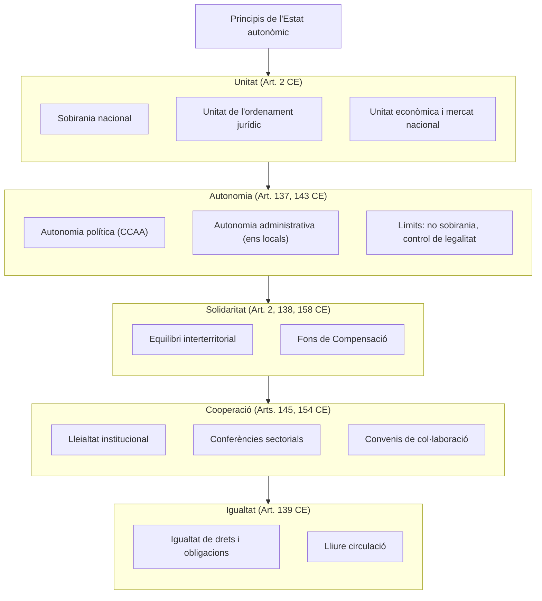
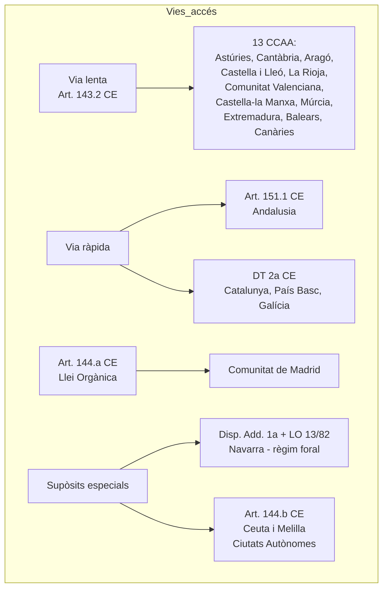
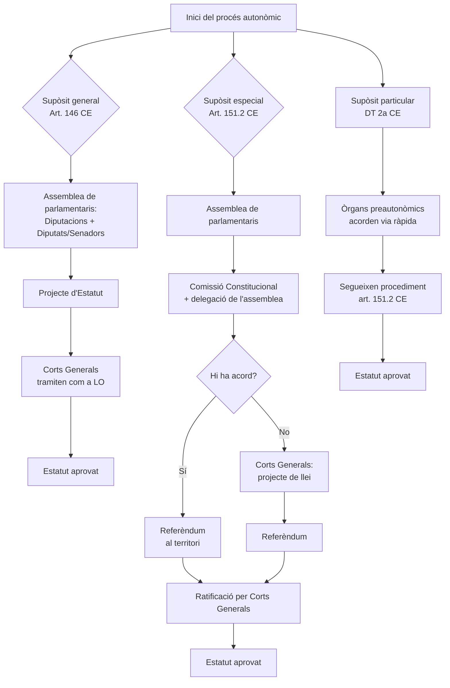
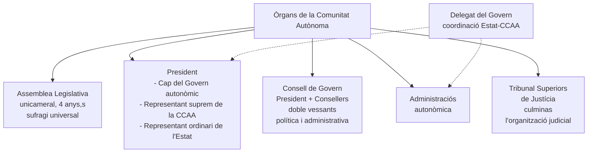
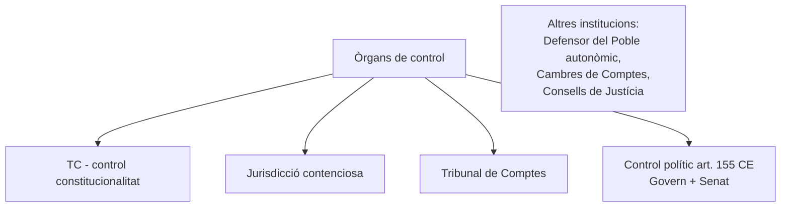
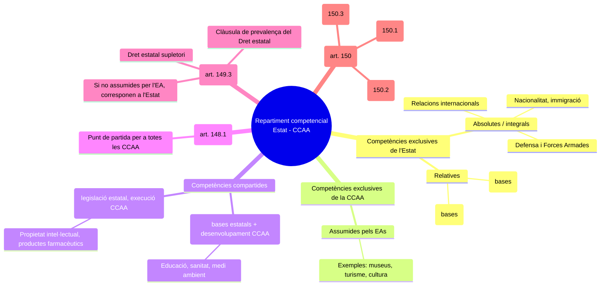
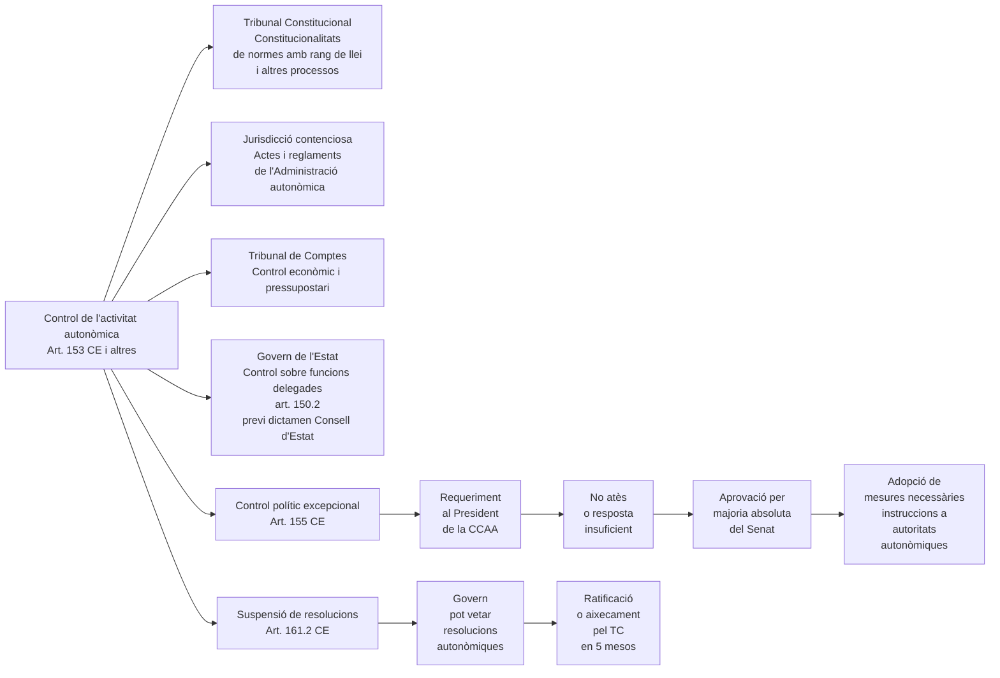
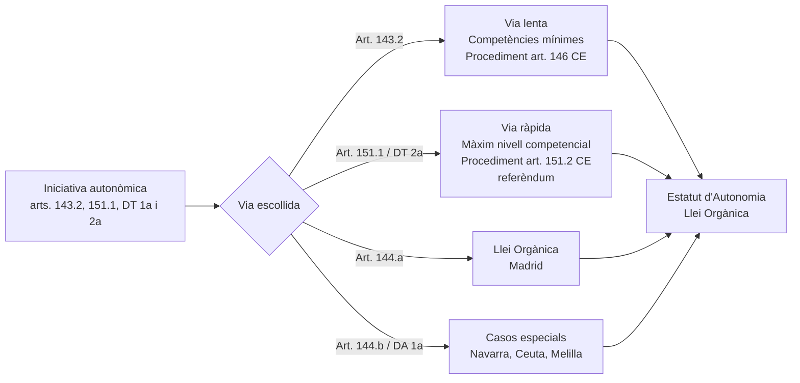

A continuació et presento diversos diagrames **Mermaid** que resumeixen els conceptes clau del Tema 8 sobre l'Estat autonòmic. Cada diagrama va precedit d'un petit text explicatiu per situar-lo dins del temari.

---

## 1. Principis de l'Estat autonòmic

Aquest diagrama mostra els principals principis que regeixen l'Estat autonòmic segons la Constitució Espanyola (CE) i la jurisprudència constitucional. El principi d'**unitat** n'és el fonament, mentre que l'**autonomia**, la **solidaritat**, la **cooperació** i la **igualtat** actuen com a principis articuladors que permeten conciliar la diversitat territorial amb la indissoluble unitat de la nació espanyola.

---

## 2. Vies d'accés a l'autonomia (classificació de Comunitats Autònomes)

Aquest diagrama organitza les diferents **vies d'accés** a l'autonomia que estableix la CE, mostrant quines Comunitats o territoris van seguir cada via. Inclou tant la “via lenta” (art. 143.2 CE) com la “via ràpida” (art. 151.1 CE i disposició transitòria 2a), així com els casos especials de Madrid per Llei Orgànica (art. 144.a CE) i les singularitats de Navarra, Ceuta i Melilla.

---

## 3. Procés d'elaboració dels Estatuts d'Autonomia

L'elaboració de l'Estatut d'Autonomia és l'últim pas perquè un territori es converteixi en Comunitat Autònoma. Aquest diagrama diferencia els tres supòsits previstos a la CE: el **general** (art. 146 CE) per a la via lenta, l’**especial** (art. 151.2 CE) per a la via ràpida, i el **particular** de la disposició transitòria 2a (que de fet aplica el procediment especial). Es visualitzen els òrgans que intervenen i la necessitat de referèndum en la via especial.

---

## 4. Institucions de les Comunitats Autònomes

Totes les Comunitats Autònomes s'organitzen al voltant d'un **sistema institucional** que, malgrat les petites peculiaritats, és força homogeni. Aquest diagrama representa els òrgans principals: l'**Assemblea Legislativa** (parlament unicameral), el **President** (amb triple condició), el **Consell de Govern** i l'**Administració autonòmica**. També s'hi afegeixen les institucions estatals de relació (Delegat del Govern) i els òrgans de control (TSJ, Tribunal de Comptes, etc.).

---

## 5. Tipus de repartiment competencial entre Estat i Comunitats Autònomes

El sistema de distribució de competències és complex. Aquest diagrama il·lustra els diferents **tipus de competències** que poden sorgir de la interacció entre les llistes dels articles 148 i 149 CE: competències exclusives (absolutes o relatives), compartides (de regulació o d'execució), competències mínimes (art. 148) i competències residuals (art. 149.3). També es mostren les vies extraestatutàries d'assumpció (lleis marc, harmonització, transferència/delegació).

---

## 6. Esquema de control de l'activitat autonòmica

Aquest diagrama aplega els diferents **mecanismes de control** als quals estan sotmesos els òrgans i l'activitat de les Comunitats Autònomes. Es distingeix el control jurisdiccional (TC, contenciós, Tribunal de Comptes), el control polític (art. 155 CE, suspensió de l'art. 161.2 CE) i el control sobre funcions delegades (art. 150.2 CE). És una visió integrada dels “frens i contrapesos” de l'Estat autonòmic.

---

## 7. Resum de les vies d'accés a l'autonomia (taula visual)

Un diagrama de flux senzill que resumeix el procés de decisió sobre quina via d'accés correspon a cada territori, des de la iniciativa autonòmica fins a l'aprovació de l'Estatut.

Aquests diagrames cobreixen els aspectes més estructurals del Tema 8. Si necessites algun altre enfocament o un diagrama més detallat sobre un apartat concret (per exemple, només les lleis de l'art. 150 o només el control de l'art. 155), no dubtis a demanar-ho.