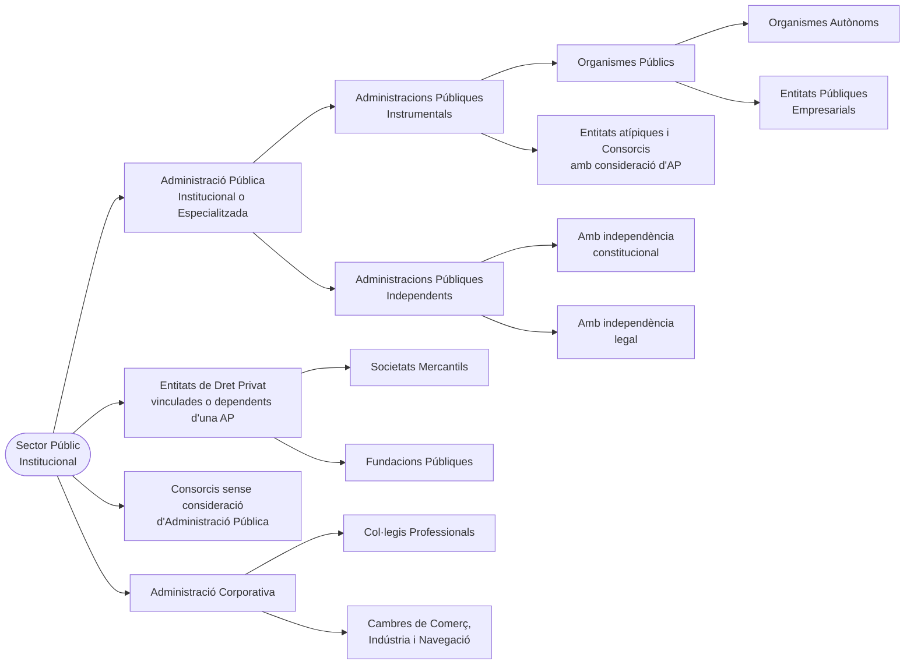

<small>

[🗂️ Carpeta DRIVE Temari](https://drive.google.com/drive/folders/1sSKkc5-HJ1vZNYgBjIAD2KNVp6jhLD9a)
FITXER: Tècnic Superior Ajuntament de Barcelona - Temari Comú - Tema 09 - Apunts.docx

</small>

---

**TEMA 09.**

- **El Municipi: concepte i elements.**
- **L'autonomia local després de la Constitució de 1978.**
- **La regulació de les competències a la Llei de Bases de Règim Local.**
- **L'organització municipal: el règim especial del municipi de Barcelona.**
- **L'organització política i l'organització executiva.**
- **Els Districtes.**
- **Organismes autònoms i entitats públiques empresarials.**
- **Societats mercantils i fundacions públiques.**
- **Altres tipus d'entitats públiques per a la gestió dels serveis públics.**

---

<!-- TOC START -->
**INDICE INTERACTIVO**

- [9.1 EL MUNICIPI: CONCEPTE](#9-1-el-municipi-concepte)
  - [9.1.1 El territori d'un municipi (Art. 10 a 38 DLeg 2/2003)](#9-1-1-el-territori-d-un-municipi-art-10-a-38-dleg-2-2003)
  - [9.1.2 Població d'un municipi](#9-1-2-poblacio-d-un-municipi)
- [9.2 L'AUTONOMIA LOCAL DESPRÉS DE LA CE](#9-2-l-autonomia-local-despres-de-la-ce)
- [9.3 ORGANITZACIÓ MUNICIPAL](#9-3-organitzacio-municipal)
  - [9.3.1 Òrgans de representació política i la seva designació. Línies generals de l'organització](#9-3-1-organs-de-representacio-politica-i-la-seva-designacio-linies-generals-de-l-organitzacio)
      - [9.3.1.1 Breu esment als grups municipals](#9-3-1-1-breu-esment-als-grups-municipals)
      - [9.3.1.2 Òrgans necessaris](#9-3-1-2-organs-necessaris)
        - [A) EL PLE: CONCEPTE I FUNCIONS (Art. 52 DLeg 2/2003)](#a-el-ple-concepte-i-funcions-art-52-dleg-2-2003)
        - [B) L'ALCALDE (Art. 53 DLeg 2/2003)](#b-l-alcalde-art-53-dleg-2-2003)
        - [C) LA COMISSIÓ DE GOVERN O JUNTA DE GOVERN LOCAL (Ar. 54 DLeg 2/2003)](#c-la-comissio-de-govern-o-junta-de-govern-local-ar-54-dleg-2-2003)
        - [D) TINENTS D'ALCALDE (Art. 55 i 56 DLeg 2/2003)](#d-tinents-d-alcalde-art-55-i-56-dleg-2-2003)
        - [E) LA COMISSIÓ ESPECIAL DE COMPTES (Art. 58 DLeg 2/2003)](#e-la-comissio-especial-de-comptes-art-58-dleg-2-2003)
      - [9.3.1.3 Òrgans complementaris](#9-3-1-3-organs-complementaris)
        - [A) SÍNDIC/A MUNICIPAL DE GREUGES (Art. 59 DLeg 2/2003)](#a-sindic-a-municipal-de-greuges-art-59-dleg-2-2003)
        - [B) COMISSIONS D'ESTUDI, D'INFORME O DE CONSULTA (Art. 60 DLeg 2/2003)](#b-comissions-d-estudi-d-informe-o-de-consulta-art-60-dleg-2-2003)
        - [C) ÒRGANS DE PARTICIPACIÓ CIUTADANA (Art. 61 a 65 DLeg 2/2003)](#c-organs-de-participacio-ciutadana-art-61-a-65-dleg-2-2003)
  - [9.3.2 Eleccions municipals: l'elecció dels regidors](#9-3-2-eleccions-municipals-l-eleccio-dels-regidors)
  - [9.3.3 El règim especial del municipi de Barcelona](#9-3-3-el-regim-especial-del-municipi-de-barcelona)
      - [9.3.3.1 La Llei 1/2006, de 13 de març, per la que es regula el Règim Especial del municipi de Barcelona](#9-3-3-1-la-llei-1-2006-de-13-de-marc-per-la-que-es-regula-el-regim-especial-del-municipi-de-barcelona)
        - [A) ESTRUCTURA](#a-estructura)
      - [9.3.3.2 L'organització municipal a l'Ajuntament de Barcelona](#9-3-3-2-l-organitzacio-municipal-a-l-ajuntament-de-barcelona)
        - [A) ORGANITZACIÓ POLÍTICA](#a-organitzacio-politica)
        - [B) ESTRUCTURA EXECUTIVA](#b-estructura-executiva)
        - [C) ORGANITZACIÓ TERRITORIAL. ELS DISTRICTES](#c-organitzacio-territorial-els-districtes)
      - [9.3.3.3 Organització funcional](#9-3-3-3-organitzacio-funcional)
- [9.4 COMPETÈNCIES MUNICIPALS](#9-4-competencies-municipals)
  - [9.4.1 Competències genèriques (Art. 66 DLeg 2/2003 i 25 LRBRL)](#9-4-1-competencies-generiques-art-66-dleg-2-2003-i-25-lrbrl)
  - [9.4.2 Serveis mínims (Art. 67 a 69 DLeg 2/2003, i 26 LRBRL)](#9-4-2-serveis-minims-art-67-a-69-dleg-2-2003-i-26-lrbrl)
  - [9.4.3 Delegació de competències](#9-4-3-delegacio-de-competencies)
  - [9.4.4 Activitats complementàries](#9-4-4-activitats-complementaries)
- [9.5 ELS RÈGIMS MUNICIPALS ESPECIALS](#9-5-els-regims-municipals-especials)
  - [9.5.1 Resum dels règims municipals especials](#9-5-1-resum-dels-regims-municipals-especials)
  - [9.5.2 Municipis amb règim de Consell Obert](#9-5-2-municipis-amb-regim-de-consell-obert)
      - [9.5.2.1 Condicions i constitució](#9-5-2-1-condicions-i-constitucio)
      - [9.5.2.2 Organització i competències](#9-5-2-2-organitzacio-i-competencies)
  - [9.5.3 Municipis de muntanya](#9-5-3-municipis-de-muntanya)
      - [9.5.3.1 Concepte](#9-5-3-1-concepte)
      - [9.5.3.2 Especialitats](#9-5-3-2-especialitats)
  - [9.5.4 Municipis turístics](#9-5-4-municipis-turistics)
  - [9.5.5 Municipis historicoartístics](#9-5-5-municipis-historicoartistics)
  - [9.5.6 Municipis industrials](#9-5-6-municipis-industrials)
  - [9.5.7 Règim especial de Barcelona](#9-5-7-regim-especial-de-barcelona)
  - [9.5.8 Règim especial dels municipis de gran població](#9-5-8-regim-especial-dels-municipis-de-gran-poblacio)
      - [9.5.8.1 Àmbit d'aplicació](#9-5-8-1-ambit-d-aplicacio)
      - [9.5.8.2 Organització i funcionament](#9-5-8-2-organitzacio-i-funcionament)
        - [A) EL PLE (Art. 122 i 123 LRBRL)](#a-el-ple-art-122-i-123-lrbrl)
        - [B) LES COMISSIONS I EL SECRETARI GENERAL DEL PLE](#b-les-comissions-i-el-secretari-general-del-ple)
        - [C) L'ALCALDE I ELS TINENTS D'ALCALDE](#c-l-alcalde-i-els-tinents-d-alcalde)
        - [D) LA JUNTA DE GOVERN LOCAL](#d-la-junta-de-govern-local)
        - [E) ELS DISTRICTES](#e-els-districtes)
      - [9.5.8.3 Gestió economicofinancera](#9-5-8-3-gestio-economicofinancera)
- [9.6 L'ADMINISTRACIÓ INSTITUCIONAL](#9-6-l-administracio-institucional)
  - [9.6.1 Concepte](#9-6-1-concepte)
  - [9.6.2 Composició del sector públic institucional](#9-6-2-composicio-del-sector-public-institucional)
  - [9.6.3 Caràcters dels ens de l'Administració institucional](#9-6-3-caracters-dels-ens-de-l-administracio-institucional)
  - [9.6.4 Règim jurídic](#9-6-4-regim-juridic)
      - [9.6.4.1 Fonts del Sector Públic institucional](#9-6-4-1-fonts-del-sector-public-institucional)
      - [9.6.4.2 L'Inventari d'Entitats del Sector Públic Estatal, Autonòmic i Local (INVENTE)](#9-6-4-2-l-inventari-d-entitats-del-sector-public-estatal-autonomic-i-local-invente)
      - [9.6.4.3 Aspectes comuns](#9-6-4-3-aspectes-comuns)
  - [9.6.5 Les Administracions especialitzades](#9-6-5-les-administracions-especialitzades)
      - [9.6.5.1 Aspectes generals](#9-6-5-1-aspectes-generals)
        - [A) CONCEPTE](#a-concepte)
        - [B) CLASSES D'ADMINISTRACIONS ESPECIALITZADES](#b-classes-d-administracions-especialitzades)
      - [9.6.5.2 Els organismes públics](#9-6-5-2-els-organismes-publics)
        - [A) RÈGIM LEGAL](#a-regim-legal)
          - [A) Creació](#a-creacio)
          - [B) Competències](#b-competencies)
          - [C) Potestats](#c-potestats)
          - [D) Organització](#d-organitzacio)
          - [E) Supervisió](#e-supervisio)
          - [F) Dissolució](#f-dissolucio)
        - [B) CLASSES D'ORGANISMES PÚBLICS](#b-classes-d-organismes-publics)
          - [A) Organismes autònoms](#a-organismes-autonoms)
          - [B) Entitats públiques empresarials](#b-entitats-publiques-empresarials)
      - [9.6.5.3 Les Administracions independents](#9-6-5-3-les-administracions-independents)
        - [A) JUSTIFICACIÓ I CLASSES](#a-justificacio-i-classes)
          - [A) Administracions amb autonomia constitucionalment garantida](#a-administracions-amb-autonomia-constitucionalment-garantida)
          - [B) Administracions amb autonomia de configuració legal](#b-administracions-amb-autonomia-de-configuracio-legal)
        - [B) RÈGIM JURÍDIC DE LES ADMINISTRACIONS INDEPENDENTS](#b-regim-juridic-de-les-administracions-independents)
      - [9.6.5.4 Els consorcis](#9-6-5-4-els-consorcis)
        - [A) EVOLUCIÓ I DEFINICIÓ](#a-evolucio-i-definicio)
        - [B) RÈGIM JURÍDIC DELS CONSORCIS](#b-regim-juridic-dels-consorcis)
          - [A) Creació](#a-creacio-2)
          - [B) Règim d'adscripció](#b-regim-d-adscripcio)
          - [C) Separació d'un consorci](#c-separacio-d-un-consorci)
          - [D) Dissolució del consorci](#d-dissolucio-del-consorci)
  - [9.6.6 Les Entitats jurídico-privades del sector públic](#9-6-6-les-entitats-juridico-privades-del-sector-public)
      - [9.6.6.1 Creació](#9-6-6-1-creacio)
      - [9.6.6.2 Objecte](#9-6-6-2-objecte)
      - [9.6.6.3 Relacions entre l'Administració General (territorial) i l'entitat](#9-6-6-3-relacions-entre-l-administracio-general-territorial-i-l-entitat)
      - [9.6.6.4 Actuació](#9-6-6-4-actuacio)
        - [A) PRESSUPOST I DESPESA PÚBLICA](#a-pressupost-i-despesa-publica)
        - [B) TITULARS DELS ÒRGANS DE GOVERN](#b-titulars-dels-organs-de-govern)
        - [C) PERSONAL](#c-personal)
        - [D) CONTRACTACIÓ PÚBLICA](#d-contractacio-publica)
        - [E) TRANSPARÈNCIA](#e-transparencia)
        - [F) RESPONSABILITAT PATRIMONIAL](#f-responsabilitat-patrimonial)
  - [9.6.7 (L'anomenada) Administració Corporativa](#9-6-7-l-anomenada-administracio-corporativa)
      - [9.6.7.1 Les corporacions de Dret Públic: concepte i classes](#9-6-7-1-les-corporacions-de-dret-public-concepte-i-classes)
      - [9.6.7.2 Els Col·legis Professionals](#9-6-7-2-els-col-legis-professionals)
        - [A) ORDENACIÓ](#a-ordenacio)
        - [B) FUNCIONS I ACTIVITATS](#b-funcions-i-activitats)
        - [C) CREACIÓ](#c-creacio)
        - [D) COL·LEGIACIÓ I EXERCICI PROFESSIONAL](#d-col-legiacio-i-exercici-professional)
        - [E) ORGANITZACIÓ](#e-organitzacio)
      - [9.6.7.3 Les Cambres de Comerç](#9-6-7-3-les-cambres-de-comerc)
<!-- TOC END -->

---

# 9.1 EL MUNICIPI: CONCEPTE 

El primer que hem de veure és el tractament constitucional del municipi recollit als Art. 137 i 140 CE. En ells veiem que **el municipi és un ens de l'organització territorial de l'Estat, d'existència obligatòria** (Art. 137 CE)**, per al qual la CE en garanteix la seva autonomia, dotat de personalitat jurídica plena i el govern i l'organització del quals correspon als respectius Ajuntaments, integrats pels Alcaldes (que els presideixen) i pels Regidors, els quals seran escollits pels veïns del municipi mitjançant sufragi universal, igual, lliure, directe i secret, en la forma establerta per la llei. Els Alcaldes seran escollits pels Regidors o pels veïns. La llei regularà les condicions en què procedeixi el règim de consell obert** (Art. 140 CE).

Els preceptes constitucionals han estat desenvolupats per la legislació estatal, principalment la **Llei 7/1985, de 2 d'abril, reguladora de les bases del règim local (LRBRL o L7/85)** i el **RDLeg 781/1986, de 18 d'abril, pel qual s'aprova el text refós de les disposicions legals vigents en matèria de règim local (RDLeg 781/86)**. Al seu torn, la regulació pròpia de Catalunya, que, com ja sabem, és de desenvolupament de la legislació bàsica de l'Estat, es troba recollida al **DLeg 2/2003, de 28 d'abril, que aprova el text refós de la llei municipal i de règim local de Catalunya (DLeg 2/03).**

Les **notes característiques del municipi** (recollides tant en la legislació bàsica estatal com en l'autonòmica, Art. 46 DLeg 2/2003) són:

- **És l'entitat bàsica de l'organització territorial.**
- **És l'element primari (via immediata) de participació ciutadana en els assumptes públics.**
- **La llei ha de garantir llur participació en tots els assumptes públics que afectin directament els seus interessos.**
- **Té autonomia per a la gestió dels seus propis assumptes.**
- **Té personalitat jurídica pròpia i plena capacitat per a l'exercici de les funcions públiques que té encomanades (representar els interessos de les col·lectivitats, gestionar els serveis públics que li són propis...).**

Per últim, els **elements necessaris** en tot municipi són:

- **Territori.**
- **Població.**
- **Organització.**

L'aspecte més important que hem d'estudiar és, lògicament la seva organització. Abans, però, farem una ullada al territori i a la població.

## 9.1.1 El territori d'un municipi (Art. 10 a 38 DLeg 2/2003) 

El nom oficial que rep el territori corresponent a un municipi concret és **TERME MUNICIPAL i és el territori dins els qual l'Ajuntament en qüestió, i només ell, pot exerceix les seves competències**. La definició que dona el DLeg 2/2003 del terme municipal és: **l'àmbit territorial on l'ajuntament exerceix les seves competències**. Al seu torn, l'Art. 12 LRBRL en fa una definició similar, tot afegint que **cada municipi pertanyerà a una sola província**.

El terme municipal ha d'atendre a les dimensions que li són més idònies per a l'exercici de les funcions públiques que l'Ajuntament té encomanades. **Tanmateix la delimitació dels límits municipals haurà de prestar també una especial consideració als criteris següents:**

- **La representació d'una col·lectivitat que té consciència com a tal.**
- **L'existència de valors històrics i tradicionals.**
- **La capacitat per a la gestió dels serveis públics que l'Ajuntament té encomanats.**

Tot i que els ajuntaments poden promoure la delimitació, atermenament i altres modificacions del terme municipal, **la creació, supressió i modificació d'aquests és una competència de la Comunitat Autònoma (a Catalunya, la Generalitat de Catalunya)** i, per tant, a Catalunya es troba regulada pel DLeg 2/2003 (a banda de la seva regulació a la LRBRL). Els **requisits** per fer aquests tipus de canvis són (Art. 13.1 LRBRL i 17 DLeg 2/2003):

- Audiència dels municipis interessats (afectats).
- Dictamen del Consell d'Estat o de l'òrgan consultiu de la Comunitat Autònoma (Consell de Garanties Estatutàries, a Catalunya). També caldrà un informe d'un òrgan anomenat Comissió de Delimitació Territorial.
- També cal informar a l'Administració de l'Estat.
- Aprovació per Decret del Consell de Govern (Govern de la Generalitat).
- Publicar-ho al BOE i al DOGC.

L'Art. 17 DLeg 2/2003 regula totes les fases del procediment per a l'alteració dels termes municipals (qui pot iniciar-lo, acords, informació pública, qui el tramita, els terminis, informes que s'hauran de fer, etc.). No cal que ho aprenguem, només que sabem que **hi ha un procediment específicament contemplat a la normativa**. A nivell de legislació bàsica estatal, la regulació equivalent es troba a l'Art. 13 LRBRL.

**La Generalitat de Catalunya haurà d'impulsar mesures de foment per a la fusió o l'agregació voluntària de municipis quan consideracions d'ordre geogràfic, demogràfic, econòmic o administratiu ho aconsellin. També haurà d'impulsar mesures per a fomentar la constitució de mancomunitats de municipis, quan la millor garantia en la prestació de serveis públics de competència municipal i l'eficàcia necessària en la seva prestació ho facin convenient**. Aquestes mesures d'impuls podran ser ajuts econòmics o qualsevol altres mesures de foment.

Les possibilitats en què un terme municipal pot ser alterat són:

- **Agregació.**
- **Fusió.**
- **Segregació**, en les seves dues modalitats.

La modificació es pot fer per **segregació** de part d'un municipi o de diversos (amb la constitució d'un nou municipi independent per part de la porció segregada; o bé agregant-se aquesta a un municipi ja existent), per **fusió** de dos o més municipis limítrofes per a constituir-ne un de nou, o per **agregació** total d'un municipi o diversos municipis a un altre de limítrof, al qual s'incorporen. Cal tenir en compte que **cap alteració de terme municipal podrà donar lloc a un terme municipal discontinu.** Quan l'alteració d'un terme municipal afecti a més d'una comarca, lògicament, s'haurà de procedir a la modificació de les demarcacions comarcals respectives (Art. 12 DLeg 2/203).

Una altra limitació és la imposada per l'Art. 26 DLeg 2/2003, el qual estableix que **en cap cas no es pot procedir a l'alteració de termes municipals si no es garanteix que, després de l'alteració, el municipi o municipis afectats disposaran de recursos ordinaris suficients per a prestar els serveis mínims obligatoris establerts per la legislació de règim local.**

La creació d'un nou municipi per raó de segregació parcial d'un municipi anterior té una sèrie de requisits quant a localització de la porció segregada, nombre de població, recursos econòmics i capacitat de gestió de serveis públics així com característiques identificadores de caire històric o cultural (Art. 15.1 DLeg 2/2003).

El Departament de Governació i Relacions Institucionals del Govern de la Generalitat compta amb un òrgan adscrit anomenat **Comissió de Delimitació Territorial** que té les funcions d'estudi o proposta en relació amb les matèries que afecten la determinació, la revisió i la modificació dels límits territorials dels ens locals de Catalunya i de les demarcacions en què s'estructura l'Administració de la Generalitat. Aquest òrgan, en la seva composició, compta amb representants de l'Administració de la Generalitat, dels ens locals i també representants d'institucions públiques i privades que tinguin relació o incidència sobre l'organització territorial de Catalunya (Art. 27 i 28 DLeg 2/2003).

Aquesta comissió té, a més, la responsabilitat d'elaborar allò conegut amb els noms de **mapa municipal** i **mapa comarcal**, els quals determinen els límits territorials dels termes municipals i les demarcacions comarcals vigents (i incorporaran, lògicament, les successives modificacions que es vagin produint).

Els canvis de **denominació, capitalitat i símbols** es troben regulats als Art. 30 i següents DLeg 2/2003.

Tots els municipis, per acord del seu respectiu ajuntament, **poden anteposar el tractament de vila o de ciutat** si tenen més de 5.000 habitants o més de 20.000 habitants respectivament (Art. 34 DLeg 2/2003).

Pel que fa al **canvi de nom d'un municipi**, aquest es fa per iniciativa de l'ajuntament (tot i que la Generalitat pot proposar als municipis les rectificacions de noms que consideri convenients) i requereix (Art. 30 a 32 DLeg 2/2003 i 14 LRBRL):

- Acord del ple de l'Ajuntament per majoria absoluta del nombre legal dels membres de la corporació.
- Abans de l'adopció de l'acord municipal, ha d'obrir-se un termini d'informació pública mínim de 30 dies.
- L'acord municipal ha de ser remés al departament competent en matèria d'Administració local.
- Si la nova denominació acordada per l'Ajuntament és susceptible de ser confosa amb la d'un altre municipi o conté incorreccions lingüístiques o no s'ajusta a la toponímia catalana, correspon al Govern (de la Generalitat), a proposta del departament competent en matèria d'Administració local, la resolució definitiva sobre el canvi de nom, prèvia audiència del municipi interessat. A tals efectes, el departament pot sol·licitar l'informe de l'Institut d'Estudis Catalans.
- Si en el termini de 3 mesos el Govern de la Generalitat no formula oposició, l'acord municipal ha de considerar-se com a definitiu i executiu.
- Anotació en un registre del Departament de Governació i Relacions Institucionals.
- Han de comunicar-se els canvis a l'Administració de l'Estat a efectes d'anotació al registre general i publicació.
- Publicació al DOGC i al BOE.
- La denominació del municipi ha de ser en castellà, en qualsevol altra llengua espanyola oficial a la respectiva Comunitat Autònoma, o en ambdues.

Per últim, cal tenir en compte que les **modificacions dels símbols del municipi (escut o emblema i bandera) requeriran d'un procediment similar al de la modificació del nom** (Art. 36 a 38 DLeg 2/2003).

## 9.1.2 Població d'un municipi 

La població d'un municipi la forma els seus **veïns, conjunt constituït pel total de persones inscrites en el padró municipal del municipi en qüestió** (al marge de la seva situació legal). L'empadronament també és una obligació legal en el sentit que l'Art. 39 DLeg 2/2003 estableix que **tota persona que visqui a Catalunya resta obligada a inscriure's en el padró del municipi en el qual resideix habitualment**.

**El Padró municipal és el registre administratiu on consten els veïns del municipi. Les seves dades constitueixen la prova de la residència al municipi. Les persones inscrites al Padró municipal són els veïns del municipi. La condició de veí o veïna s'adquireix en el mateix moment de la inscripció en el Padró municipal** (Art. 39 i 40 DLeg 2/2003 i 16.1 LRBRL).

Les dades obligatòries que s'han de fer constar al padró són (Art. 41 DLeg 2/2003 i 16.2 LRBRL):

- Nom i cognoms.
- Sexe.
- Domicili habitual.
- Nacionalitat.
- Lloc i data de naixement.
- Número de DNI o document que el substitueixi en el cas dels estrangers.
- Certificat o títol escolar o acadèmic.
- Les dades necessàries als efectes de l'elaboració del cens electoral, sempre que es garanteixi el respecte als drets fonamentals reconeguts a la CE.

La **gestió del padró municipal** és duta a terme pel corresponent Ajuntament, o bé per la Diputació provincial o el Consell comarcal quan el municipi no tingui capacitat o recursos per a fer-ho (Art. 42 DLeg 2/2003 i 17 LRBRL).

Per últim, **la condició de veí atorga un seguit de drets i deures associats,** que resumits són (Art. 43 DLeg 2/2003):

- **Ser elector i elegible** (poder votar a les eleccions municipals i/o ser escollit com a regidor). **ATENCIÓ:** aquest és un dret dels veïns, PERÒ NO DE TOTS ELS VEÏNS. Per a poder votar o ser votat en les eleccions municipals cal ser major d'edat i ser espanyol, o bé estranger comunitari resident a Espanya, o bé ciutadà d'altres països amb un acord de reciprocitat sobre participació en eleccions municipals.
- **Participar en la gestió municipal**, d'acord amb el què disposin les lleis i els reglaments propis del municipi i, en el seu cas, quan els òrgans de govern i administració municipal demanin la col·laboració amb caràcter voluntari.
- **Utilitzar els serveis públics municipals i accedir als aprofitaments comunals.**
- **Contribuir mitjançant les prestacions econòmiques i personals a la realització de les competències municipals**. Els tributs municipals s'agrupen en tres categories, a saber, impostos, taxes i contribucions especials.
- **Ser informat i dirigir sol·licituds a l'Administració municipal.**
- **Sol·licitar una consulta popular**, en els termes establerts per la llei.
- **Exigir la prestació i, si procedeix, l'establiment del servei públic corresponent,** quan constitueixi competència municipal pròpia de caràcter obligatori.
- **La resta de drets i deures establerts per les lleis i, en el seu cas, pels reglaments de la corporació.**
- **Exercir la iniciativa popular,** en els termes previstos a l'Art. 70 bis LRBRL (aquest dret no està enumerat a l'Art. 43 DLeg 2/2003, sinó a l'Art. 18.1 LRBRL).

Per a poder fer efectius tots aquests drets, els veïns poden iniciar els procediments administratius i jurisdiccionals que corresponguin per llei, demanar l'actuació del Síndic de Greuges, formular reclamacions contra l'aprovació inicial dels pressupostos o interposar recurs contenciós-administratiu contra els actes que resolguin definitivament les reclamacions que hagin interposat.

L'Art. 45 DLeg 2/2003 també fa una breu enumeració dels drets i deures dels veïns envers la comarca a què pertanyen. No cal que veiem la llista perquè coincideix quasi plenament amb la que acabem d'enumerar, a més, la regulació del tema comarcal és més propi del DLeg 4/2003 més que no pas del DLeg 2/2003.

De la lectura de la llista de drets i deures dels veïns d'un municipi es dedueix ràpidament la **idea general de participació en la gestió del municipi i dels seus assumptes**. Aquest dret de participació s'articula mitjançant diferents mecanismes que analitzem a continuació.

El primer que hem de tenir present és que, en la mesura del possible i amb els límits legals corresponents, les corporacions locals hauran de **facilitar la més amplia informació sobre llur activitat** i la participació de tots els ciutadans en la vida local (Art. 154 DLeg 2/2003). Aquesta obligació d'informació ciutadana afecta a la publicitat dels acords de la corporació, a les sessions (públiques) dels seus òrgans i a l'accés a la documentació, els arxius i els registres de la corporació (Art. 155 DLeg 2/2003). Aquests drets tenen, lògicament, una sèrie de limitacions relacionades amb la seguretat de l'Estat, la investigació de delictes, etc. Altrament, una de les garanties d'aquest dret d'informació consisteix en que **la seva denegació ha de ser motivada i justificada d'acord amb els supòsits establerts legalment.**

Uns altres mecanismes de participació ciutadana són la **publicitat de les sessions del ple municipal** (Art. 156 DLeg 2/2003) i el **dret de petició** (Art. 157 DLeg 2/2003). Pel que fa a la publicitat de les sessions del ple, la norma general és que aquestes seran públiques, tret dels casos legalment establerts en què es pugui aplicar caràcter privat (el DLeg 2/2003 fa referència als assumptes que puguin afectar el dret fonamental a l'honor, la intimitat personal i familiar i la pròpia imatge dels ciutadans, recollit a l'Art. 18.1 CE). Respecte al dret de petició, els ciutadans podran exercir-lo per escrit davant les autoritats locals tot sol·licitant l'adopció d'actes o acords en matèria de llurs competències.

Una altra via de participació ciutadana són les **associacions de veïns**. L'Art. 158 DLeg 2/2003 confereix condició **d'entitats de participació ciutadana** a les associacions constituïdes per a la defensa dels interessos generals o sectorials dels veïns. En aquest sentit, el ple municipal, per acord del mateix, les hi pot conferir un seguit de drets, principalment de participació en els assumptes que les afectin. Aquestes associacions han de constar inscrites en un registre propi municipal (sense perjudici del Registre general d'associacions de la Generalitat).

Per acabar, el darrer mitjà de participació ciutadana que analitzarem serà el de les **consultes populars**. No hem de confondre les consultes populars enteses com referèndums (en els que es crida a tot el cens electoral a participar i es garanteixen els requisits formals i legals per a validar la consulta i el seu resultat) amb els instruments dirigits a conèixer la posició o opinions de la ciutadania en relació amb un determinat aspecte (enquestes, fòrums de debat, audiències públiques, etc.). Aquí ens interessen les primeres, els referèndums.

En aquest tema en concret, els articles del DLeg que ho regulaven (159 a 161) van ser derogats per l'actual Llei 4/2010, de 17 de març, de consultes populars per via de referèndum.

L'Art. 3 L4/2010 defineix la **consulta popular per via de referèndum com un instrument de participació directa per a determinar la voluntat del cos electoral** (és a dir, les persones que tenen dret de vot en les eleccions) **sobre qüestions polítiques de transcendència especial amb les garanties pròpies del procediment electoral.**

Pel que fa a **qui pot votar-les**, ho podran fer els residents en Espanya que compleixin els mateixos requisits exigits per a l'exercici del dret de sufragi en les eleccions municipals.

Respecte a **l'objecte de les consultes**, aquestes versaran sobre assumptes de competència municipal amb transcendència especial per als interessos dels veïns, amb una sèrie de limitacions (no afectar competències, ni afectar projectes de llei en tràmit, ni matèria de finances locals).

La **naturalesa** d'aquest tipus de consultes en l'àmbit municipal és consultiva. Aquestes consultes es poden dur a terme sota dues **modalitats**, a saber, d'iniciativa institucional (la iniciativa correspon a l'alcalde o alcaldessa, o a 1/3 dels regidors; la proposta es debatuda i votada al ple i haurà de ser aprovada per majoria absoluta dels regidors per tal que el referèndum s'acabi duent a terme) o d'iniciativa popular (promoguda pels veïns del municipi, en determinades quantitats i/o percentatges legalment establerts en funció del volum de població; es presenta davant del ple per al seu debat i votació i haurà de ser aprovada per majoria absoluta dels regidors per tal que el referèndum s'acabi duent a terme).

Pel que fa a la **celebració**, s'ha de realitzar tenint en compte uns terminis i dates legalment establertes.

Contra els actes administratius de les diferents Administracions Públiques que intervenen en el referèndum (i també de l'Administració electoral) es pot interposar **recurs** contenciós-administratiu d'acord amb la legislació corresponent.

Per últim, existeix un **Registre de consultes populars per via de referèndum**, adscrit al departament competent en matèria electoral.

# 9.2 L'AUTONOMIA LOCAL DESPRÉS DE LA CE 

Segons l'Art. 137 CE, **l'Estat s'organitza territorialment en municipis, en províncies i en les comunitats autònomes que es constitueixin. Totes aquestes entitats gaudeixen d'autonomia per a la gestió dels seus respectius interessos**.

Veiem que la comunitat autònoma és una entitat que gaudeix d'autonomia per gestionar els seus interessos. La comunitat autònoma és una persona jurídica que pot ser titular de Poder legislatiu. També poden ser titulars de Poder reglamentari.

En canvi, **els ens locals** (municipis i províncies, encara que n'hi ha més), tot i gaudir per mandat constitucional de la mateixa autonomia per a la gestió dels seus interessos que les comunitats autònomes, **no tenen reconeguda la facultat d'emetre normes amb rang legal.** Aquesta diferència es justifica pel diferent abast respectiu dels interessos propis d'uns i d'altres, i pel diferent tractament que la CE els defereix: mentre que la llista de competències que poden exercir les comunitats autònomes i el territori sobre el que les exerceixen són molt més amples, i totes dues matèries estan previstes a la CE, la definició de les competències i àmbit territorial dels ens locals es remet a la legislació ordinària.

De fet, l'aprovació d'aquesta legislació ordinària (respectant la legislació bàsica estatal), és una de les competències que les comunitats autònomes han assumit als seus estatuts, de conformitat amb la interpretació que el TC ha realitzat de l'Art. 148.1.2 CE.

Veiem, doncs, com **tot i gaudir tant les comunitats autònomes com els ens locals de la mateixa autonomia, la dels segons està limitada no només per la normativa constitucional, sinó per l'estatal bàsica i l'autonòmica ordinària**.

Tot i així, l'autonomia local constitucionalment reconeguda disposa d'una eina de garantia, a saber, els **conflictes en defensa de l'autonomia local que els ens locals poden interposar davant del TC** quan considerin que algun altre ens està vulnerant la seva capacitat d'autogestió en què es tradueix l'autonomia local.

# 9.3 ORGANITZACIÓ MUNICIPAL 

## 9.3.1 Òrgans de representació política i la seva designació. Línies generals de l'organització 

Tal i com estableix la CE, la LRBRL i, en el cas de Catalunya, el DLeg 2/2003 (Art. 47), **el govern i l'administració dels municipis corresponen a l'ajuntament, integrat per l'alcalde o batlle i pels regidors** ("concejales" a la resta d'Espanya). També s'admet el **règim especial de consell obert** per a determinat tipus de municipis com veurem a continuació. En els municipis en els quals històricament s'hagi emprat una denominació diferent per a l'alcalde o els regidors, s'admet que s'empri aquesta indistintament (**denominació tradicional** o denominació legal). Per exemple, a Lleida, l'alcalde es diu paer.

Respecte als òrgans presents en l'Administració d'un municipi, aquests es classifiquen segons siguin **òrgans necessaris** (que no implica en tots els casos que siguin obligatoris, com passa, per exemple, amb la Junta de Govern Local, que existirà només en alguns casos, depenent de les característiques del municipi) i **òrgans complementaris** (Art. 48 DLeg 2/2003).

En aquest aspecte, són **òrgans necessaris**:

- **L'alcalde**, que existeix a tots els Ajuntaments.
- **El/s tinent/s d'alcalde**, que existeix a tots els Ajuntaments.
- **El ple**, que existeix a tots els Ajuntaments.
- La comissió de govern, actualment denominada **Junta de Govern Local**, només en els següents casos:
  - Municipis amb més de 5.000 habitants.
  - Municipis amb menys de 5.000 habitants quan així ho acordi el ple o així ho estableixi el seu reglament orgànic.
  - Municipis capital de comarca (independentment de quanta població tinguin).
- **La comissió especial de comptes**, que existeix a tots els Ajuntaments.

Altrament, tenen caràcter d'**òrgans complementaris**:

- **Les comissions informatives, d'estudi o de consulta.**
- **Els òrgans de participació ciutadana.**
- **El síndic/a municipal de greuges**, si ho acorda el ple per majoria absoluta, a proposta d'un grup municipal.
- **El consell assessor urbanístic**
- **La junta local de seguretat.**
- **Qualsevol altre òrgan establert pel municipi en exercici de la seva autonomia organitzativa.**

Pel que fa a l'organització, l'Art. 49 DLeg 2/2003 autoritza l'Ajuntament, en exercici de la seva autonomia organitzativa, a crear **altres òrgans municipals complementaris**, respectant en tot cas l'organització bàsica determinada per les lleis. La creació dels òrgans complementaris ha de respondre als principis d'eficàcia, economia organitzativa i participació ciutadana.

Tot i que hi ha un epígraf concret per al règim especial de **consell obert** (quan veiem l'apartat de règims municipals especials) passem ara a fer-ne una breu descripció. El règim de consell obert és un règim especial d'administració que s'admet per a municipis amb menys de 100 habitants, o bé en els municipis que comptin tradicionalment amb aquest règim de govern i administració. En aquests municipis no hi ha ajuntament (entès com a Administració del municipi). Els habitants elegeixen directament l'alcalde, per majoria simple, entre tots els habitants del municipi (majors d'edat). L'escollit passa a ser alcalde del municipi durant 4 anys i és la única figura que hi ha (no hi ha ple, ni regidors, ni junta de govern... només alcalde).

Per últim comentem també que hi ha un tipus d'entitats locals anomenades entitats locals menors (entitats locals d'àmbit territorial inferior al municipal). Un cas molt habitual i que val la pena comentar per a evitar confusions és el de les pedanies. Sovint, molts petits poblets no són municipis pròpiament dits, sinó pedanies. Aquestes són fragments d'un altre municipi major, a les quals se'ls hi ha donat un major o menor grau d'autonomia en alguna matèria per raó d'alguna particularitat d'aquest fragment de municipi (generalment particularitat de deslocalització geogràfica). Aquestes tenen un òrgan unipersonal executiu d'elecció directa (alcalde pedani) i un òrgan col·legiat de control, tot i que s'admet la compatibilitat amb el règim especial de consell obert si compleix amb les característiques anteriorment indicades.

#### 9.3.1.1 Breu esment als grups municipals 

Els grups municipals els trobem regulats als Art. 50 i 51 DLeg 2/2003. **Es poden crear per acord del ple, tot i que són d'existència obligatòria en els municipis de més de 20.000 habitants.** La seva existència és força similar a la dels grups polítics del Congrés dels Diputats (cada llista electoral amb representació pot formar un grup municipal, cap regidor no pot pertànyer a més d'un grup municipal alhora, han d'estar formats per regidors d'una mateixa llista, etc.).

A l'igual que en el Congrés dels Diputats, existeix un grup mixt. **ATENCIÓ:** el grup mixt és per als regidors que des d'un inici no han estat adscrits a un grup. **Quan un regidor, pel que sigui, abandona el grup al que pertany, NO PASSA AUTOMÀTICAMENT AL GRUP MIXT**, sinó que queda com a regidor no adscrit (excepte en el cas que l'abandonament del grup sigui perquè es desfà una coalició, i els partits segregats no tenen prou regidors com per a tenir grup propi).

Les funcions dels grups són aquelles que li atribueixin els reglaments orgànics de les corporacions locals corresponents.

#### 9.3.1.2 Òrgans necessaris 

##### A) EL PLE: CONCEPTE I FUNCIONS (Art. 52 DLeg 2/2003) 

Pel que fa a la **composició del ple**, aquest està integrat per tots els regidors i presidit per l'alcalde.

L'Art. 52 DLeg 2/2003 fa una extensa enumeració de les **atribucions** que corresponen al ple (n'enumera 18, de les lletres a fins a la r). A continuació farem una enumeració resumida de les mateixes, tot posant en negreta aquelles més importants que haurem de recordar:

- **Controlar i fiscalitzar els òrgans de govern.**
- Prendre acords relatius a temes com la participació en organitzacions supramunicipals, l'alteració del terme municipal, canvi de nom del municipi, etc.
- Aprovació i finalització d'instruments d'ordenació urbanístics.
- **Aprovar el reglament orgànic i les ordenances.**
- Crear i regular òrgans complementaris.
- **Determinar els recursos propis de caràcter tributari.** **Aprovar i modificar els pressupostos, disposar despeses** en els assumptes de la seva competència i aprovar els comptes.
- Aprovar les formes de gestió dels serveis i els expedients de municipalització.
- Acceptar la delegació de competències feta per altres Administracions públiques.
- Plantejar conflictes de competència a altres entitats locals i restants Administracions públiques.
- **Aprovar la plantilla de personal i relació de llocs de treball, retribucions complementàries, etc.**
- Exercir accions administratives i judicials i **declaració de lesivitat** d'actes de l'ajuntament.
- **Alterar la qualificació jurídica dels béns de domini públic.**
- **Concertació de determinades operacions de crèdit** per motiu d'excedir de certa quantia (la quantia acumulada de les quals, en cada exercici econòmic, excedeixi del 10% dels recursos ordinaris del pressupost).
- **Determinades contractacions i concessions** per motiu de quantia o durada (quan el seu import superi el 10% dels recursos ordinaris del pressupost, i en qualsevol cas els 6.010.121,04€ i també els contractes i les concessions plurianuals quan la seva durada sigui superior a 4 anys, i els plurianuals de menor durada quan l'import acumulat de totes les anualitats superi el percentatge o import anteriorment assenyalat).
- Aprovació de determinats projectes d'obres i serveis.
- **L'adquisició de determinats béns i drets així com alienacions patrimonials**, per motiu de quantia o classificació dels mateixos (adquisició de béns i drets quan el seu valor superi el 10% dels recursos ordinaris del pressupost i, en tot cas, quan sigui superior a 3.005.060,52€ i les alienacions patrimonials previstes al pressupost que superin els mateixos límits, o no estant previstes, quan es tracti de béns immobles o béns mobles que estiguin declarats de valor històric o artístic).
- Les atribucions que _per se_ requereixin majoria qualificada del ple.
- Les altres que expressament li atribueixin les lleis.

Addicionalment, també correspon al ple la **votació sobre la moció de censura a l'alcalde (moció de censura constructiva, com en el Congrés dels Diputats) així com la qüestió de confiança**.

De la llista, les atribucions subratllades NO són delegables, la resta sí ho són (en favor de l'Alcalde o de la Junta de Govern Local). Tampoc és delegable la votació de la moció de censura ni de la qüestió de confiança.

La LRBRL també fa una enumeració de les atribucions del Ple al seu Art. 123:

- El control i la fiscalització dels òrgans de govern.
- La votació de la moció de censura a l'Alcalde i de la qüestió de confiança plantejada per aquest, que serà pública i es realitzarà mitjançant crida nominal en tot cas i es regirà en tots els seus aspectes pel que es disposa en la legislació electoral general.
- L'aprovació i modificació dels reglaments de naturalesa orgànica. Tindran en tot cas naturalesa orgànica:

- La regulació del Ple.
- La regulació del Consell Social de la ciutat.
- La regulació de la Comissió Especial de Suggeriments i Reclamacions.
- La regulació dels òrgans complementaris i dels procediments de participació ciutadana.
- La divisió del municipi en districtes, i la determinació i regulació dels òrgans dels districtes i de les competències dels seus òrgans representatius i participatius, sense perjudici de les atribucions de l'Alcalde per a determinar l'organització i les competències de la seva administració executiva.
- La determinació dels nivells essencials de l'organització municipal, entenent per tals les grans àrees de govern, els coordinadors generals, dependents directament dels membres de la Junta de Govern Local, amb funcions de coordinació de les diferents Direccions Generals o òrgans similars integrades en la mateixa àrea de govern, i de la gestió dels serveis comuns d'aquestes o altres funcions anàlogues i les Direccions Generals o òrgans similars que culminin l'organització administrativa, sense perjudici de les atribucions de l'Alcalde per a determinar el número de cadascun de tals òrgans i establir nivells complementaris inferiors.
- La regulació de l'òrgan per a la resolució de les reclamacions econòmic-administratives.

- L'aprovació i modificació de les ordenances i reglaments municipals.
- Els acords relatius a la delimitació i alteració del terme municipal; la creació o supressió de les entitats a què es refereix l'Art. 45 LRBRL (Art. actualment derogat); l'alteració de la capitalitat del municipi i el canvi de denominació d'aquest o d'aquelles Entitats, i l'adopció o modificació de la seva bandera, ensenya o escut.
- Els acords relatius a la participació en organitzacions supramunicipals.
- La determinació dels recursos propis de caràcter tributari.
- L'aprovació dels pressupostos, de la plantilla de personal, així com l'autorització de despeses en les matèries de la seva competència. Així mateix, aprovarà el compte general de l'exercici corresponent.
- L'aprovació inicial del planejament general i l'aprovació que posi fi a la tramitació municipal dels plans i altres instruments d'ordenació prevists en la legislació urbanística.
- La transferència de funcions o activitats a altres Administracions públiques, així com l'acceptació de les delegacions o encàrrecs de gestió realitzades per altres Administracions, tret que per llei s'imposin obligatòriament.
- La determinació de les formes de gestió dels serveis, així com l'acord de creació d'organismes autònoms, d'entitats públiques empresarials i de societats mercantils per a la gestió dels serveis de competència municipal, i l'aprovació dels expedients de municipalització.
- Les facultats de revisió d'ofici dels seus propis actes i disposicions de caràcter general.
- L'exercici d'accions judicials i administratives i la defensa jurídica del Ple en les matèries de la seva competència.
- Establir el règim retributiu dels membres del Ple, del seu secretari general, de l'Alcalde, dels membres de la Junta de Govern Local i dels òrgans directius municipals.
- El plantejament de conflictes de competència a altres entitats locals i altres Administracions públiques.
- Acordar la iniciativa prevista en l'últim incís de l'Art. 121.1 LRBRL, perquè el municipi pugui ser inclòs en l'àmbit d'aplicació del Tít. X LRBRL.
- Les altres que expressament li confereixin les lleis.

Respecte al funcionament del ple, hem de saber que aquest pot funcionar en **sessions ordinàries** (convocades almenys amb 2 dies d'antelació i amb una freqüència mínima mensual, bimensual o trimestral en funció del volum de població del municipi segons l'Art. 98 DLeg 2/2003) o **extraordinàries** (a decisió de l'alcalde o d'un mínim d'1/4 part del nombre legal dels membres de la corporació).

Per a que el ple estigui **vàlidament constituït** caldrà que hi assisteixi un mínim d'1/3 del nombre legal dels membres, que mai podrà ser inferior a 3, i amb l'assistència obligatòria del seu president (és a dir, l'alcalde) i del secretari de la corporació, o de qui legalment els substitueixi.

Per últim, **la regla general d'adopció d'acords del ple serà la majoria simple** (més vots a favor que en contra en un ple vàlidament constituït) tot i que per a determinats assumptes es requerirà una majoria qualificada, com ara la majoria absoluta (aprovació o modificació del reglament orgànic de la corporació, alteració del terme municipal, creació de mancomunitats, etc.). L'adopció d'acords es produeix mitjançant **votació ordinària**, tret que el mateix ple acordi, en relació amb un cas concret, fer-ho mitjançant votació nominal. El vot pot emetre's en sentit afirmatiu o negatiu, i els membres de la corporació poden abstenir-se de votar. En cas de votacions amb resultat d'empat, ha d'efectuar-se una altra votació, i, si persisteix l'empat, decideix el **vot de qualitat del president (Alcalde)**.

##### B) L'ALCALDE (Art. 53 DLeg 2/2003) 

**L'Alcalde és el president o presidenta de la corporació** (i, com ja hem comentat abans, presideix el ple).

Respecte a la **manera de ser escollit (Art. 196 LOREG), l'alcalde és escollit pels regidors** (o bé pels veïns en el règim especial del consell obert) **EN UNA ÚNICA VOTACIÓ en la mateixa sessió de constitució de la corporació**. Poden ser candidats a alcalde els caps de llista (excepte en els municipis que funcionin en règim especial de consell obert, i els municipis compresos entre 100 i 250 habitants, en els que podran ser candidats a Alcalde tots els Regidors). Si en aquesta votació única algun dels regidors candidats obté la majoria absoluta, és proclamat alcalde. Si cap candidat obté aquesta majoria, és proclamat alcalde el cap de la llista que més vots populars hagi obtingut a les eleccions del municipi. En cas d'empat, es resoldrà per sorteig.

En el cas dels municipis d'entre 100 i 250 habitants no subjectes a règim especial de consell obert, cal tenir en compte que aquests tenen unes particularitats especials en les seves eleccions municipals (s'atorguen vots als regidors de les llistes directament, no a les llistes). En aquest cas seran candidats a alcalde tots els regidors; es farà la votació única per part dels regidors; en cas que algun dels regidors obtingui majoria absoluta serà proclamat alcalde; en cas que cap regidor l'obtingui, serà proclamat alcalde aquell regidor que més vots populars hagués obtingut en les eleccions del municipi.

**Només hi ha un cas en què es contempla una doble votació per a l'elecció de l'alcalde**. Si durant el mandat de 4 anys, l'alcalde morís, dimitís, fos declarat incapaç judicialment o bé se l'inhabilités per a l'exercici mitjançant sentència judicial ferma, automàticament prendria el control el primer tinent d'alcalde però **s'hauria d'escollir un nou alcalde per al que quedés de legislatura**. En aquest cas s'escolliria el nou alcalde entre tots els regidors (no només els caps de llista) i es faria mitjançant una primera votació per majoria absoluta i una segona votació per majoria simple (només en el cas que cap dels regidors hagués obtingut majoria absoluta en la primera votació).

Pel que fa a les **funcions de l'alcalde** (Art. 53 DLeg 2/2003), farem una enumeració resumida de les mateixes, tot destacant en negreta aquelles més importants de recordar. Acte seguit comentarem un fet molt important que és la delegació de les funcions de l'alcalde:

- **Representar l'ajuntament.**
- **Dirigir el Govern i l'Administració municipals.**
- **Convocar i presidir les sessions del ple i de la comissió de govern (junta de govern local), decidint els empats amb vot qualificat.**
- Dirigir, inspeccionar i impulsar els serveis i les obres municipals.
- Publicar, executar i fer complir els acords municipals.
- **Dictar bans.**
- **Desenvolupament de la gestió econòmica d'acord amb el pressupost municipal, autoritzant i disposant determinades despeses així com concertant determinades operacions de crèdit per motiu del seu import** (per sota dels límits que hem comentat anteriorment en què la competència passa al ple).
- **Aprovar l'oferta d'ocupació pública.**
- **Exercir la direcció superior de tot el personal de la corporació (nomenament i separació del servei de funcionaris, acomiadament de personal laboral, etc.).**
- Exercir la direcció superior de la policia municipal.
- Exercir accions judicials i administratives i la defensa de l'ajuntament en determinades matèries.
- La iniciativa per a proposar al ple la declaració de lesivitat dels actes administratius en matèries que són de la competència de l'alcaldia.
- Adoptar personalment i sota la seva responsabilitat, en cas de catàstrofe o d'infortunis públics o de greu perill d'aquests, les mesures necessàries i adequades.
- **Sancionar les faltes a la seva autoritat.**
- La contractació de determinats contractes i concessions per motiu de l'import dels mateixos.
- L'aprovació de determinats projectes d'obres o serveis.
- L'adquisició de determinats béns així com determinades alienacions de patrimoni per motiu del seu import.
- Concedir determinades llicències.
- **L'aprovació dels instruments de plantejament urbanístic.**
- Imposar sancions amb relació a les competències municipals.
- Les altres atribucions que les lleis li atribueixin expressament.

Així mateix, a l'alcalde també li correspon el **nomenament dels tinents d'alcalde**.

Finalment, hem de saber que **l'alcalde pot delegar l'exercici de les seves funcions** amb excepció expressa d'aquelles funcions que no són delegables. En la nostra llista, **HEM SUBRATLLAT AQUELLES FUNCIÓNS QUE NO SÓN DELEGABLES**. Tota la resta de funcions, inclús la nomenament de tinents d'alcalde, SÍ seran delegables.

També fa una enumeració de les funcions de l'alcalde l'Art. 125.4 LRBRL:

- Representar l'ajuntament.
- Dirigir la política, el govern i l'administració municipal, sense perjudici de l'acció col·legiada de col·laboració en la direcció política que mitjançant l'exercici de les funcions executives i administratives que li són atribuïdes per la LRBRL, realitzi la Junta de Govern Local.
- Establir directrius generals de l'acció de govern municipal i assegurar la seva continuïtat.
- Convocar i presidir les sessions de Ple i les de la Junta de Govern Local i decidir els empats amb el vot de qualitat.
- Nomenar i cessar els Tinents d'alcalde i els Presidents dels Districtes.
- Ordenar la publicació, execució i compliment dels acords dels òrgans executius de l'Ajuntament.
- Dictar bans, decrets i instruccions.
- Adoptar les mesures necessàries i adequades en casos de d'extraordinària i urgent necessitat, donant compte immediat al Ple.
- Exercir la direcció superior del personal al servei de l'Administració municipal.
- La prefectura de la Policia Municipal.
- Establir l'organització i estructura de l'Administració municipal executiva, sense perjudici de les competències atribuïdes al Ple en matèria d'organització municipal, d'acord amb allò disposat a la pròpia LRBRL.
- L'exercici de les accions judicials i administratives en matèria de la seva competència i, en cas d'urgència, en matèries de la competència del Ple, en aquest supòsit donant compte al mateix en la primera sessió que celebri per a la seva ratificació.
- La facultat de revisió d'ofici dels seus propis actes.
- L'autorització i disposició de despeses en les matèries de la seva competència.
- La resta que li atribueixin expressament les lleis i aquelles que la legislació de l'Estat o de les comunitats autònomes assignin al municipi i no s'atribueixin a d'altres òrgans municipals.

Pel que fa a la **delegació de funcions**, aquesta té uns petits requisits:

- S'ha de fer mitjançant un Decret de l'Alcaldia en el qual s'indiqui l'àmbit de delegació, les facultats que s'han delegat i les condicions de la delegació.
- Requereix l'acceptació per part de la persona o òrgan delegat.
- La delegació té efectes des de l'endemà de la data del decret.
- La delegació es pot revocar.

##### C) LA COMISSIÓ DE GOVERN O JUNTA DE GOVERN LOCAL (Ar. 54 DLeg 2/2003) 

Ja hem vist que aquest òrgan és d'**existència** **obligada en municipis de més de 5.000 habitants, o bé en aquells de menys en què així ho dicti el ple de l'ajuntament o el seu reglament orgànic i també, per últim, en el municipis que siguin capital de comarca**.

Pel que fa a la **composició**, la comissió de govern està formada per **l'alcalde, més un nombre de regidors (de nomenament i separació lliure per part de l'alcalde) no superior a 1/3 del nombre legal d'aquests**.

Per últim, les **funcions** de la comissió són bàsicament l'assistència a l'alcalde en l'exercici de les seves funcions així com l'assumpció de funcions que l'alcalde li atribueixi o el ple li delegui (respecte les corresponents a cadascun dels dos òrgans).

L'Art. 127.1 LRBRL sí que fa, però, una enumeració de les atribucions de la Junta de Govern Local:

- L'aprovació dels projectes d'ordenances i dels reglaments, inclosos els orgànics, amb excepció de les normes reguladores del Ple i les seves comissions.
- L'aprovació del projecte de pressupost.
- L'aprovació dels projectes d'instruments d'ordenació urbanística l'aprovació definitiva de la qual o provisional correspongui al Ple.
- Les aprovacions dels instruments de planejament de desenvolupament del planejament general no atribuïdes expressament al Ple, així com dels instruments de gestió urbanística i dels projectes d'urbanització.
- La concessió de qualsevol tipus de llicència, tret que la legislació sectorial l'atribueixi expressament a un altre òrgan.
- El desenvolupament de la gestió econòmica, autoritzar i disposar despeses en matèria de la seva competència, disposar despeses prèviament autoritzades pel Ple, i la gestió del personal.
- Aprovar la relació de llocs de treball, les retribucions del personal d'acord amb el pressupost aprovat pel Ple, l'oferta d'ocupació pública, les bases de les convocatòries de selecció i provisió de llocs de treball, el número i règim del personal eventual, la separació del servei dels funcionaris de l'Ajuntament, sense perjudici del que es disposa en l'Art. 99 LRBRL, l'acomiadament del personal laboral, el règim disciplinari i les altres decisions en matèria de personal que no estiguin expressament atribuïdes a un altre òrgan. La composició dels tribunals d'oposicions serà predominantment tècnica, havent de posseir tots els seus membres un nivell de titulació igual o superior a l'exigit per a l'ingrés en les places convocades. El seu president podrà ser nomenat entre els membres de la Corporació o entre el personal al servei de les Administracions públiques.
- El nomenament i el cessament dels titulars dels òrgans directius de l'Administració municipal, sense perjudici del que es disposa en la Disp. Add. 8a per als funcionaris d'Administració local amb habilitació de caràcter nacional.
- L'exercici de les accions judicials i administratives en matèria de la seva competència.
- Les facultats de revisió d'ofici dels seus propis actes.
- Exercir la potestat sancionadora tret que per llei estigui atribuïda a un altre òrgan.
- Designar als representants municipals en els òrgans col·legiats de govern o administració dels ens, fundacions o societats, sigui com sigui la seva naturalesa, en els quals l'Ajuntament sigui partícip.
- Les altres que li corresponguin, d'acord amb les disposicions legals vigents.

##### D) TINENTS D'ALCALDE (Art. 55 i 56 DLeg 2/2003) 

Els tinents d'alcalde són **designats per l'alcalde entre els membres de la comissió de govern, i quan no hi hagi, entre els regidors**.

Pel que fa al **nombre de tinents d'alcalde**, el límit està en no sobrepassar el nombre de membres de la comissió de govern o, en els casos que no hi hagi, com a màxim 1/3 del nombre de regidors (en el fons és el mateix, donat que en els casos que sí hi ha comissió de govern, el nombre de membres tampoc pot superar 1/3 del nombre total de regidors).

Per últim, les funcions dels tinents d'alcalde són:

- Substitució de l'alcalde en cas de vacant, absència o malaltia (per ordre de nomenament).
- L'exercici de les funcions que l'alcalde els hi delegui.

**ATENCIÓ:** no ens confonguem, tot i que normalment l'alcalde delega funcions a favor dels membres de la comissió de govern i, quan no n'hi hagi, en favor dels tinents d'alcalde, tot i així, això no exclou que **l'alcalde por també conferir delegacions especials per a encàrrecs específics a favor de qualsevol regidor, encara que no pertanyi a la comissió de govern o no sigui tinent d'alcalde**.

##### E) LA COMISSIÓ ESPECIAL DE COMPTES (Art. 58 DLeg 2/2003) 

L'Art. 116 LRBRL atribueix un seguit de funcions a aquesta comissió per a tots els municipis, factor pel qual es dedueix que aquests és d'**existència obligatòria per a tots els municipis**.

Respecte a la seva **composició**, aquesta comissió està integrada per membres de tots els grups polítics integrants de la corporació. El nombre de membres és proporcional a la representació de cada grup (o bé es fa una composició igual per a tots però amb vot ponderat).

Finalment, les **funcions** d'aquesta comissió són l'examen, estudi i informe dels comptes anuals de la corporació (pressupost, compte d'administració del patrimoni, entitats o organismes municipals de gestió, etc.). Per a l'exercici de les seves funcions pot requerir la informació i documentació que consideri necessària (sempre i quan sigui rellevant per al tema en qüestió). Les seves funcions s'entenen sens perjudici de les competències del Tribunal de Comptes i de la Sindicatura de Comptes.

#### 9.3.1.3 Òrgans complementaris 

A continuació veurem un molt breu resum d'alguns dels restants òrgans de l'Administració del municipi:

##### A) SÍNDIC/A MUNICIPAL DE GREUGES (Art. 59 DLeg 2/2003) 

- **Elecció:** pel ple. En primera votació per majoria de 3/5. Si no s'assoleix, segona votació per majoria absoluta. El ple l'escull i l'alcalde el nomena.
- **Durada mandat:** 5 anys amb possibilitat de cessament anticipat per motiu de renúncia expressa, mort, incapacitat sobrevinguda o condemna ferma per delicte dolós.
- **Requisits per ser síndic:** ser major d'edat, gaudir de la plenitud de drets civils i polítics i tenir la condició política de català (segons l'Art. 7 EAC, bàsicament tenir el veïnatge administratiu a Catalunya).
- **Funcions:** supervisar l'activitat de l'Administració municipal per a la defensa (amb independència i objectivitat) dels drets fonamentals i llibertats públiques dels veïns del municipi.

##### B) COMISSIONS D'ESTUDI, D'INFORME O DE CONSULTA (Art. 60 DLeg 2/2003) 

La seva **existència** és obligatòria segons els mateixos criteris que la comissió de govern (més de 5.000 habitants, o menys però que ho imposi el reglament orgànic...).

Pel que fa a les **funcions**, aquestes estudien i informen assumptes sotmesos al ple (o a la comissió de govern quan actuï per delegació del ple).

Aquests tipus de comissions es classifiquen en dues **tipologies**, a saber, **permanents** (per al tractament de temes habituals) o **temporals** (per a tractar temes específics).

La **composició** de les comissions la integra els membres que designin els grups polítics (de manera representativa proporcional o amb vot ponderat).

Per últim, cal saber que correspon al ple la determinació del nombre i denominació de les comissions d'estudi, d'informe de consulta.

##### C) ÒRGANS DE PARTICIPACIÓ CIUTADANA (Art. 61 a 65 DLeg 2/2003) 

- **Òrgans territorials de gestió desconcentrada (Art. 61 DLeg 2/2003):** el ple els pot crear per a facilitar la participació ciutadana en assumptes municipals. Per a constituir aquests òrgans, han d'aplicar-se determinades regles, com ara que han d'integrar regidors, representants de veïns i de les associacions ciutadanes i d'altres que no són importants recordar (Art. 61 DLeg 2/2003).
- **Òrgans de participació sectorial (Art. 62 i 63 DLeg 2/2003):** els pot crear el ple amb la finalitat d'integrar la participació dels ciutadans i de llurs associacions en els assumptes municipals en relació amb l'actuació pública municipal en determinats àmbits.

**Correspon a aquests òrgans de participació**, en relació amb el territori o sector material corresponent:

- **Formular propostes per a resoldre els problemes administratius que els afecten.**
- **Emetre informes a iniciativa pròpia o de l'Ajuntament, sobre matèries de competència municipal.**
- **Emetre i formular propostes i suggeriments en relació amb el funcionament dels serveis o els organismes públics municipals.**
- **Les altres de naturalesa anàloga que determini l'acord de creació.**

A banda d'aquests òrgans, també trobem:

- **Delegació de funcions (Art. 64 DLeg 2/2003):** els òrgans territorials de participació poden exercir funcions deliberatives i executives en matèries relatives a la gestió i la utilització dels serveis i béns destinats a determinades activitats.
- **Nuclis separats de població (Art. 65 DLeg 20/2003):** els grups de població que dins un municipi constitueixin nuclis separats, es poden constituir com a òrgans territorials de participació.

## 9.3.2 Eleccions municipals: l'elecció dels regidors 

Com en tots els processos electorals, és la **LOREG** qui regula les particularitats de les eleccions municipals (concretament al seu Títol III, Art. 176 a 200). En principi només cal que tinguem unes poques coses clares.

El primer que hem de saber és que a les eleccions municipals, tot i que finalment en resulti escollit l'alcalde, els ciutadans no escullen l'alcalde sinó que **escullen als regidors** (a excepció del règim especial de consell obert, on sí escullen directament a l'alcalde). Posteriorment són aquests, es regidors, qui escullen l'alcalde. 

> [!NOTE]
> Per molt que l'expresident M. Rajoy digués allò de "es el vecino el que elige al alcalde, y es el alcalde el que quiere que sean los vecinos el alcalde", doncs no, els veïns no escullen l'alcalde (excepte en els municipis de règim obert) sinó que escullen els regidors.

Aquest fet és important i sovint crea confusió, sobretot en les eleccions generals. Alguna gent es pensa que amb les eleccions general s'escull al president del govern (i, per tant, poder executiu) quan realment les eleccions són al poder legislatiu (diputats del congrés, el quals, al seu torn, escolliran el president del govern).

El **sistema d'eleccions** (excepte en els municipis d'entre 100 i 250 habitants no acollits al règim especial de consell obert, els quals presenten un seguit de particularitats) és prou similar al de les eleccions generals. Les circumscripcions electorals coincideixen amb els termes municipals. Es voten llistes tancades de partits polítics on els caps de cada llista podran ser proclamats com alcaldes.

La **durada del mandat** és de 4 anys, com en les eleccions generals.

El nombre de regidors per a cada municipi es troba regulat a l'Art. 179 LOREG conforme a la següent taula:

| **Nombre d'habitants de municipi:** | **Regidors:**                                                                                                                   |
| ----------------------------------- | ------------------------------------------------------------------------------------------------------------------------------- |
| Fins a 100 residents                | 3                                                                                                                               |
| De 101 a 250                        | 5                                                                                                                               |
| De 251 a 1.000                      | 7                                                                                                                               |
| De 1.001 a 2.000                    | 9                                                                                                                               |
| De 2.001 a 5.000                    | 11                                                                                                                              |
| De 5.001 a 10.000                   | 13                                                                                                                              |
| De 10.001 a 20.000                  | 17                                                                                                                              |
| De 20.001 a 50.000                  | 21                                                                                                                              |
| De 50.001 a 100.000                 | 25                                                                                                                              |
| De 100.001 en endavant              | Un regidor més per cada 100.000 habitants de més (o fracció), afegint-ne un de més en cas que el nombre resultant sigui parell. |

Recordem que aquest sistema no s'aplica als municipis que funcionin en règim especial de consell obert.

Fem ara un exemple de càlcul amb Barcelona i Madrid

**Barcelona, eleccions del 2015:**

- **Població:** 1.602.386 persones a 1 de gener de 2014.
- **Aplicació fórmula:**
- Els primers 100.000 habitants de Barcelona ens donen **25 regidors**.
- Ens queda una població de 1.502.386 persones, que dividides per 100.000 donen 15,02. Com que toca a un regidor per unitat o fracció, això equival a **16 regidors més**.
- **TOTAL: 41 regidors.**
- **Comprovació:** efectivament el ple de l'Ajuntament de Barcelona té 41 regidors.

**Madrid, eleccions 2015:**

- **Població: 3.166.130 persones a 1 de gener de 2014.**
- **Aplicació fórmula:**
- Els primers 100.000 habitants de Barcelona ens donen **25 regidors**.
- Ens queda una població de 3.066.130 persones, que dividides per 100.000 donen 30,60. Com que toca a un regidor per unitat o fracció, això equival a **31 regidors més**.
- Si sumem ambdues xifres obtenim 56 regidors. En ser un nombre parell li hem d'afegir **1 regidor més**.
- **TOTAL: 57 regidors (concejales en aquest cas).**
- **Comprovació:** efectivament el ple de l'Ajuntament de Madrid té 57 regidors (concejales).

## 9.3.3 El règim especial del municipi de Barcelona 

#### 9.3.3.1 La Llei 1/2006, de 13 de març, per la que es regula el Règim Especial del municipi de Barcelona 

Aquesta llei atén a la necessitat de que Barcelona, com a una de les dues ciutats més poblades d'Espanya (juntament amb Madrid, que també té el seu règim especial) disposi d'una sèrie d'especialitats, justificades en les dificultats de gestió dels assumptes municipals d'una ciutat amb aquesta dimensió.

Aquesta llei constitueix, juntament amb la Llei 22/1998, de 30 de desembre, de la Carta Municipal de Barcelona (legislació autonòmica catalana), la regulació del règim especial aplicable a la ciutat de Barcelona.

En la Carta Municipal de Barcelona no hi entrarem, ja que hi ha un tema del nostre temari (el TEMA 11) que s'hi dedica de manera exclusiva.

##### A) ESTRUCTURA 

La L1/2006 consta de 77 Art., distribuïts en 4 Tít., 5 Disp. Add., 1 Disp. Derog. i 4 Disp. Fin.

El Tít. I recull les disposicions generals així com també regula la Comissió de col·laboració interadministrativa, configurada com a òrgan de col·laboració entre les administracions estatal, autonòmica i municipal, que plasma els seus acords mitjançant convenis subscrits sobre matèries d'interès comú.

El Tít. II recull les especialitats competencials de l'Ajuntament de Barcelona en una sèrie de matèries de directa incidència en la convivència ciutadana (Port de Barcelona, el litoral, les telecomunicacions, la mobilitat i seguretat ciutadana).

El Tít. III consolida l'existència de l'anomenada "justícia de proximitat", esglaó judicial dirigit a resoldre els conflictes derivats de la convivència ciutadana (es difereix la posada en marxa dels jutjats de proximitat fins a l'aprovació de la modificació de la LOPJ).

El Tít. IV aborda la regulació del règim financer especial de l'Ajuntament de Barcelona (peculiaritats en relació amb els recursos tributaris). També s'introdueixen determinades especialitats en la regulació pròpia de cadascun dels tributs amb la finalitat de millorar-ne la gestió i el funcionament.

#### 9.3.3.2 L'organització municipal a l'Ajuntament de Barcelona 

**A l'Ajuntament de Barcelona es poden diferenciar dos nivells d'organització:**

- **Polític:** membres electes o regidors, exerceixen funcions de caràcter decisori, informatiu i/o consultiu.
- **Executiu:** sectors o branques d'intervenció directa. S'encarrega de la gestió de programes i l'execució de resolucions aprovades per l'organització política.

##### A) ORGANITZACIÓ POLÍTICA 

Són **membres de l'Ajuntament** de Barcelona els/les que resultin elegits/des **regidors/res** d'acord amb la legislació electoral i, amb les formalitats legalment exigides, prenguin possessió del càrrec.

Els **drets i deures dels membres** de l'Ajuntament estan establerts al Reglament Orgànic Municipal, a la Carta Municipal de Barcelona, a la LRBRL i al DLeg 2/2003.

Els principals **drets i deures** que preveu el referit Reglament són:

- **Dret i deure d'assistència:** amb veu i vot, a les sessions dels òrgans col·legiats municipals dels que formin part.
- **Drets econòmics:** a percebre les retribucions que els hi corresponguin, segons el seu règim de dedicació (exclusiva, parcial o sense dedicació especial; establerta per l'alcalde/essa a proposta, si s'escau, dels grups municipals).
- **Dret d'informació:** dret a obtenir, del govern i l'administració municipal, els antecedents, les dades i les informacions que siguin necessaris per al desenvolupament de llurs funcions (i que estiguin en poder dels serveis municipals). Les diferents modalitats d'accés a la informació estaran subjectes a determinades normes.
- **Capteniment:** els membres de l'Ajuntament estan obligats a observar la cortesia deguda i a respectar les normes d'ordre i funcionament dels òrgans municipals així com a guardar secret en els casos que correspongui.
- **Abstenció i recusació:** s'hauran d'abstenir de participar en els assumptes respecte dels quals incorrin en alguna de les causes d'abstenció legalment establertes. L'actuació dels membres en què concorrin les esmentades causes comportarà, si ha estat determinant, la invalidesa dels actes en què hagi intervingut. En qualsevol moment podran els interessats formular recusació d'un o més membres de l'Ajuntament.

Pel que fa a **l'estructura orgànica**, el govern municipal de Barcelona correspon, en termes de la Carta Municipal, a:

- **El Consell Municipal.**
- **L'alcalde/essa.**
- **La Comissió de Govern.**
- **Els Consells de Districte.**
- **Els presidents i regidors de Districte.**

Els tinents d'alcalde, els regidors i els òrgans i càrrecs directius de l'Administració es consideraran òrgans decisoris quan exerceixin funcions delegades o desconcentrades.

**L'alcalde/essa** **és el/la president/a de la corporació municipal** i exerceix les atribucions conferides per la Carta municipal de Barcelona, la legislació general de règim local, per les lleis sectorials i pel Reglament Orgànic Municipal.

Pel que fa a les seves **atribucions**, l'Art. 13 de la Carta municipal de Barcelona estableix:

- Dirigir el govern i l'administració municipals; impulsar i inspeccionar els serveis i les obres municipals, mitjançant les corresponents instruccions generals i singulars.
- Representar l'Ajuntament.
- Convocar i presidir les sessions del Plenari del Consell Municipal i de la Comissió de Govern.
- Organitzar l'administració municipal executiva i nomenar els tinents d'alcalde i els regidors de districte.
- Dictar decrets i bans i vetllar perquè es compleixin.
- Dur la gestió econòmica d'acord amb el pressupost aprovat; disposar despeses dins els límits de la seva competència; ordenar pagaments i retre comptes; tot això de conformitat amb el que disposa la Llei de l'Estat 39/1988, reguladora de les hisendes locals (actualment el TRLRHL), o l'específica que s'aprovi per a Barcelona, d'acord amb el que estableix l'article 142 de la dita Llei.
- Concertar operacions de crèdit, amb exclusió de les contingudes a la normativa d'hisendes locals o del que es legisli específicament per a Barcelona sempre que les dites operacions estiguin previstes pel pressupost, pel Pla general d'inversions, pel Programa d'actuació o per les bases d'execució del pressupost, i llur import acumulat, dins de cada exercici econòmic, no superi el 10% dels recursos ordinaris, excepte les de tresoreria que li corresponen si l'import acumulat de les operacions vives en cada moment no supera el 15% dels ingressos liquidats en l'exercici anterior.
- Exercir la direcció superior de tot el personal de l'Administració municipal i la prefectura de la Policia Municipal.
- Aprovar l'oferta pública d'ocupació, d'acord amb el pressupost i la plantilla aprovats pel Consell Municipal; aprovar les bases de les convocatòries per a la selecció del personal i dels concursos de provisió de llocs de treball i distribuir les retribucions complementàries que no siguin fixes i periòdiques.
- Nomenar i sancionar el personal, incloses la separació del servei dels funcionaris de la corporació i l'acomiadament del personal laboral, de les quals disposicions ha de donar compte al Plenari en la primera sessió que tingui.
- Exercir accions judicials i administratives per a la defensa jurídica de la corporació.
- Adoptar personalment i sota la seva responsabilitat, en el cas de catàstrofe o d'infortuni públic, o de risc greu d'aquests, les mesures necessàries i adequades, de les quals ha de donar compte immediatament al Plenari o a la Comissió del Consell Municipal que sigui competent per raó de la matèria.
- Sancionar les faltes de desobediència a la seva autoritat i les infraccions d'aquesta Carta, de les ordenances municipals i d'altres disposicions, si així ho disposen.
- Disposar les contractacions i les concessions de tota classe que no superin els mil milions de pessetes (6.010.121,04€), incloses les de caràcter plurianual si no tenen una durada superior als quatre anys, sempre que l'import acumulat de totes les anualitats no superi l'esmentada quantitat.
- Disposar l'adquisició de béns i drets si llur valor no supera els mil milions de pessetes (6.010.121,04€), i també l'alienació del patrimoni que no superi la quantitat indicada en els supòsits següents:

- La de béns immobles, sempre que sigui prevista pel pressupost.
- La de béns mobles, excepte els declarats de valor històric o artístic l'alienació dels quals no sigui prevista pel pressupost.

- Concedir llicències, si ho disposen les lleis i els reglaments.
- Ordenar la publicació, l'execució i el compliment dels acords de l'Ajuntament.
- Les altres que expressament li atribueixin les lleis i les que aquesta Carta i la normativa vigent assignen al municipi i no atribueixen a altres òrgans municipals.

Aquest és el llistat d'atribucions de l'alcalde segons l'Art. 13 de la Carta municipal de Barcelona i, tal i com podem veure, no difereix excessivament de les enumeracions genèriques d'atribucions dels alcaldes que fan tant el DLeg 2/2003 com la LRBRL i que hem vist amb anterioritat en aquest mateix tema. També enumera les atribucions de l'alcalde/essa de Barcelona l'Art. 22 del Reglament orgànic municipal, amb una redacció força semblant a la que tot just acabem de veure, però ampliada respecte de qüestions com l'aprovació de convenis, projectes d'obres ordinàries, llicències i instruments de gestió urbanística i planejament, presidència de meses de contractació, atorgament de premis i honors i resolució d'expedients administratius de responsabilitat patrimonial extracontractual de l'Ajuntament.

Les atribucions de l'alcalde/essa enumerades a les lletres d) i e) de l'anterior llistat són indelegables. La resta **d'atribucions poden ésser delegades o desconcentrades a**:

- **Comissió de Govern.**
- **Regidors/es.**
- **Òrgans i càrrecs directius de l'Administració executiva.**

Pel que fa als **tinents/es d'alcalde**, tal i com ja hem dit, aquests són nomenats/des lliurement per l'alcalde/essa d'entre els regidors del Consell Municipal.

Tenen la **funció principal de substituir l'alcalde/essa** en cas d'absència, malaltia o vacant (per l'ordre de nomenament d'aquest/es, tret que l'alcalde/essa hagi aprovat una determinació específica per al cas concret). En cas d'absència dels tinents/es, l'alcalde/essa podrà designar suplent un/a altre/a regidor/a.

**El Consell Municipal és l'òrgan de màxima representació política dels ciutadans en el govern de la ciutat. Està format pels/per les regidors/es i presidit per l'alcalde/essa** (és el nom que rep el Ple a l'Ajuntament de Barcelona).

Les seves **funcions** són les següents:

- **Normativa:** mitjançant l'aprovació definitiva d'ordenances, reglaments i demés.
- **Programadora:** mitjançant l'aprovació del Pla general municipal, del Programa d'actuació, Pla d'inversions i Programa financer i llurs modificacions.
- **Pressupostaria:** en aprovar definitivament els pressupostos generals municipals i els Comptes Generals.
- **Executiva:** mitjançant l'exercici de les atribucions d'aquesta naturalesa conferides per la Carta municipal de Barcelona i pel Reglament orgànic.
- **D'impuls, control, fiscalització i exigència de responsabilitat política dels altres òrgans de govern.**

Les atribucions del Consell Municipal es troben recollides a l'Art. 11 de la Carta municipal de Barcelona i a l'Art. 30.2 del Reglament orgànic. Veiem l'enumeració que fa l'Art. 11 L22/98 (Carta municipal de Barcelona):

- Impulsar, controlar i fiscalitzar els altres òrgans de govern.
- Aprovar el Codi ètic d'actuació de tot el personal al servei del municipi.
- Exercir la iniciativa per a alterar el terme municipal.
- Aprovar l'escut, la bandera i els altres símbols distintius de la ciutat
- Aprovar de manera definitiva el Reglament orgànic, les ordenances i qualsevol altra norma local l'aprovació de la qual no sigui atribuïda a cap altre òrgan municipal.
- Aprovar i modificar el Reglament orgànic que regula la composició i l'elecció dels consells de districte.
- Aprovar el Pla general d'acció municipal, del Programa d'actuació, el Pla d'inversions i el Programa financer.
- Informar dels projectes del Pla territorial general, del Pla territorial parcial i de llurs revisions o modificacions.
- Ordenar i imposar tributs, establir els preus públics, no especificats per l'Art. 16.m, i aprovar els pressupostos i els comptes.
- Aprovar de manera provisional el Pla general i les seves revisions i modificacions, en l'àmbit del seu terme municipal.
- Aprovar de manera definitiva els plans parcials i especials, les ordenances i les altres normes urbanístiques.
- Exercir activitats econòmiques, constituir societats mercantils per a dur-les a terme, i participar-hi, i crear altres ens d'interès municipal.
- Decidir sobre serveis reservats, d'acord amb el que estableixen l'Art. 86 de la LRBRL i els At. 227, 228 i 229 de la Llei 8/1987, del 15 d'abril, municipal i de règim local de Catalunya (actualment DLeg 2/2003).
- Acceptar la delegació de competències feta per altres administracions.
- Exercir accions judicials contra membres de la corporació.
- Adquirir béns i drets quan llur valor sigui superior a dos mil cinc-cents milions de pessetes (15.025.302,61€), i també fer les alienacions patrimonials en els supòsits següents:

- Quan es tracti de béns immobles, o de béns mobles que hagin estat declarats de valor històric o artístic, i l'alienació no sigui prevista pel pressupost.
- Quan, tot i ésser prevista pel pressupost, l'alienació superi les quanties indicades per a l'adquisició de béns.

- Transferir funcions, activitats o serveis a altres administracions.
- Contractar obres i concessions de tota classe si l'import supera els dos mil cinc-cents milions de pessetes (15.025.302,61€), i també si es tracta de contractes i concessions plurianuals d'una durada superior als quatre anys, o de plurianuals de menys durada si l'import acumulat de les seves anualitats és superior a la quantia damunt assenyalada.
- Acordar la participació en organitzacions supramunicipals.
- Aprovar i concertar les operacions de crèdit la quantia acumulada de les quals, dins de cada exercici econòmic, excedeix el 10% dels recursos ordinaris del pressupost, excepte les de tresoreria, que li corresponen si l'import acumulat de les operacions vives en cada moment supera el 15% dels ingressos corrents liquidats en l'exercici anterior.
- Cedir a títol gratuït béns a altres administracions, institucions públiques o entitats privades, en els supòsits autoritzats per les normes reguladores del patrimoni municipal.
- Aprovar els expedients de municipalització.
- Aprovar la plantilla de personal i la relació de llocs de treball, determinar la quantia de les retribucions fixes i periòdiques dels funcionaris, i establir el nombre i el règim del personal eventual.
- Alterar la qualificació jurídica dels béns de domini públic.
- Votar sobre la moció de censura a l'alcalde o alcaldessa i sobre la qüestió de confiança plantejada per aquest, que es regeix per la legislació electoral general.
- Les altres que aquesta Carta li atribueix.

Igual que passava amb les atribucions de l'alcalde/essa, la redacció d'atribucions del Consell Municipal que fa l'Art. 30.2 del Reglament orgànic és un pel més extensa que la que acabem de veure de l'Art. 11 L22/98.

El **funcionament del Consell Municipal** és en Plenari i en Comissions (permanents o especials). Són exercides pel Plenari totes les funcions no atribuïdes reglamentàriament ni delegades a les Comissions. El **Plenari** pot realitzar encàrrecs expressos i determinats a l'alcalde/essa, a la Comissió de Govern o a algun dels seus membres. Per contra, a les **Comissions** del Consell Municipal els hi corresponen diverses funcions com ara resolutòries (reglamentàriament atorgades o delegades pel Plenari), d'emissió de dictàmens, d'impuls de l'activitat dels òrgans de l'administració i de control i fiscalització. Una altra de les funcions importants de les Comissions és l'aprovació inicial d'ordenances i reglaments relatius al respectiu àmbit material. Tots els grups polítics integrants del Consell Municipal tenen dret a participar en les Comissions mitjançant la presència de regidors/es que en formin part. Cada Comissió ha de comptar amb un mínim de 5 regidors/es, i la composició haurà d'ésser proporcional al nombre de regidors/es de cada Grup municipal segons la seva representació al Consell Municipal. Els regidors/res que exerceixin de portaveus dels diferents grups en cada Comissió actuaran amb vot ponderat. El Plenari nomenarà a proposta de l'alcalde/essa, president/ta i vicepresident/ta de cada Comissió d'entre els/les regidors/res que la integren.

Passem ara a un altre òrgan, **els grups municipals**. Per tal d'entendre millor què són els grups polítics (municipals en aquest cas) m'agrada, personalment, fer el següent paral·lelisme: els grups municipals són al Plenari el que els partits polítics a la societat. L'adscripció dels regidors als grups municipals es regeix per les següents normes:

- Es constituirà un grup municipal per cada llista electoral que hagi obtingut representació a l'Ajuntament amb un mínim de 2 regidors/res.
- Tots/tes els/les regidors/res han de quedar adscrit/tes a un grup municipal i només a un.
- No es pot pertànyer a un grup municipal diferent d'aquell que correspongui a la llista electoral de la qual s'ha format part, llevat del grup mixt. Les formacions polítiques que integrin una coalició electoral podran formar grups independents quan es dissolgui la coalició corresponent sempre que tinguin 2 regidors/res.
- No poden constituir grup municipal separat regidors/res que pertanyin a un mateix partit.
- Cada grup designarà el seu portaveu i també pot designar un/una president/ta i un/una portaveu adjunt/a, els quals també podran assumir la representació del Grup.
- Els/les regidors/res que, al començament del seu mandat, no s'integrin en un grup, quedaran automàticament incorporats al grup mixt, el qual tindrà drets anàlegs als de la resta de grups.
- Els regidors/res que, per qualsevol causa que no sigui la dissolució d'una coalició electoral, abandonin els partits o agrupacions pels quals han estat elegits no passen al grup mixt, sinó que s'organitzen a partir de la creació de la figura dels "no adscrits" i actuen de manera aïllada i sense rebre o beneficiar-se dels recursos econòmics i materials que han de tenir a la seva disposició els grups.

Un altre òrgan és la **junta de portaveus**, presidida per l'alcalde/essa o pel tinent d'alcalde en qui delegui i integrada pels/per les portaveus dels grups municipals. Entre les seves atribucions, li correspon debatre l'ordre del dia de les sessions ordinàries del Plenari del Consell Municipal.

I ja per últim passem a la **Comissió de Govern** (nom que adopta a Barcelona l'òrgan generalment conegut com a Junta de Govern Local). Aquest òrgan està integrat per l'alcalde/essa, que la presideix, els tinents/tes d'alcalde i els regidors/res nomenats/des per resolució de l'alcalde/essa.

També poden integrar la Comissió de Govern els regidors de districte. A requeriment de l'alcalde/essa, assistiran, a efectes informatius, el/la gerent municipal i els càrrecs directius municipals.

Pel que fa a les **atribucions** d'aquest òrgan, aquestes es troben recollides a l'Art. 49 del Reglament orgànic i a l'Art. 16 L22/98. Veiem l'enumeració que ens ofereix la Carta municipal de Barcelona:

- Exercir la iniciativa del govern municipal mitjançant l'aprovació dels projectes de les següents normes i instruments i proposar als òrgans competents l'aprovació:

- Dels reglaments orgànics i ordenances i altres normes locals de la seva competència.
- Del pressupost.
- Del Pla general d'actuació municipal, el Programa d'actuació, el Pla d'inversions el Programa financer i les seves modificacions.

- Aprovar els projectes d'urbanització i donar compte d'aquesta aprovació al Consell Municipal.
- Aprovar els instruments de gestió urbanística prevists en el planejament.
- Declarar l'ocupació urgent en les expropiacions a les quals es refereix l'Art. 72 L22/98, i donar compte d'aquesta declaració al Consell Municipal.
- Aprovar les formes de gestió dels serveis, excepte els supòsits de l'Art. 11.1.m L22/98 i dels quals, d'acord amb la present Carta, corresponen a altres òrgans municipals.
- Contractar i concedir tot tipus d'obres i serveis, subministraments, consultoria i assistència, serveis i treballs específics i concrets no habituals, concedir béns si el seu import és superior a mil milions de pessetes (6.010.121,04€) i no excedeix els dos mil cinc-cents milions de pessetes (15.025.302,61€), sempre que no tinguin una durada superior als quatre anys i que l'import acumulat de totes les anualitats no superi la citada quantitat.
- Aprovar les normes específiques de cada convocatòria per a la selecció de personal, de les previstes en l'oferta pública d'ocupació, d'acord amb les bases generals aprovades per l'alcalde o alcaldessa.
- Autoritzar o denegar la compatibilitat del personal al servei de l'Ajuntament per a l'exercici d'un segon lloc de treball o activitat.
- Plantejar conflictes de competència amb altres entitats locals i administracions públiques, aquestes accions ha de ratificar-les el Consell Municipal en la primera sessió que celebri.
- Alienar béns, en els supòsits no reservats al Consell Municipal.
- Acordar la cessió onerosa per qualsevol títol de l'ús dels béns patrimonials.
- Adquirir béns a títol onerós si la despesa és superior a mil milions de pessetes (6.010.121,04€) i no excedeix els dos mil cinc-cents milions de pessetes (15.025.302,61€), o a títol gratuït si hi ha condicions o càrregues.
- Aprovar els preus públics dels serveis.
- Acordar la declaració de lesivitat dels actes de l'Ajuntament.
- Les que li delegui l'alcalde o alcaldessa.

La Comissió de Govern podrà delegar en l'alcalde/essa les atribucions que li són conferides com a pròpies per la Carta municipal de Barcelona i per la resta de les Lleis. Així mateix, pot realitzar encàrrecs a l'alcalde/essa o algun dels seus membres.

##### B) ESTRUCTURA EXECUTIVA 

Aquesta es troba integrada pel conjunt d'estructures que assumeixen la preparació, fonamentació, execució i formalització dels programes i decisions municipals. Els òrgans que integren aquesta administració executiva es troben sota la direcció dels òrgans de govern municipal.

L'organització executiva del municipi de Barcelona està encapçalada pel **Gerent municipal** i la componen:

- **Divisions i òrgans integrats en la personalitat jurídica única de l'Ajuntament.**
- **Òrgans dotats de personalitat jurídica diferenciada:** organismes autònoms locals, entitats públiques empresarials, societats privades municipals i empreses mixtes.

Pel que fa a **l'estructura municipal bàsica executiva**, aquesta està formada per:

- **Comitè Executiu** presidit per l'alcalde/essa o regidor/a en qui delegui i integrat pels gerents de sector i de districte. La vicepresidència recau sobre el Gerent Municipal. Les funcions que té atribuïdes són prendre les decisions de nivell executiu que tingui atribuïdes, fixar els criteris centrals de gestió, coordinar l'actuació dels diferents sectors de l'Administració Municipal i preparar i informar els assumptes que hagin de ser dictaminats per part de les Comissions del Consell Municipal.
- **Gerent Municipal** que encapçala l'organització executiva i és vicepresident del Comitè Executiu.
- **Gerents Territorials**, un per a cadascun dels 10 districtes de la ciutat de Barcelona.
- **Gerents Sectorials.**

##### C) ORGANITZACIÓ TERRITORIAL. ELS DISTRICTES 

La base territorial de l'Administració Municipal està formada per **10 districtes**:

- Districte 1: Ciutat Vella
- Districte 2: Eixample
- Districte 3: Sants-Montjuïc
- Districte 4: Les Corts
- Districte 5: Sarrià-Sant Gervasi
- Districte 6: Gràcia
- Districte 7: Horta-Guinardó
- Districte 8: Nou barris
- Districte 9: Sant Andreu
- Districte 10: Sant Martí

**Els districtes són òrgans territorials per a la desconcentració de la gestió i la descentralització de la participació ciutadana i per a l'aplicació d'una política municipal orientada a la correcció dels desequilibris i la representació dels interessos dels diversos barris i zones del municipi.**

Correspon al Consell Municipal acordar l'establiment de districtes, i també establir-ne el nombre i els límits territorials, l'organització i les funcions, així com la seva modificació.

Els districtes exerciran les **competències** que els siguin conferides pels òrgans de govern municipal, via delegació o desconcentració, les quals podran tenir caràcter decisori, de gestió, consultiu i de control.

Pel que fa a **l'organització dels districtes**, aquests disposen d'una estructura orgànica integrada per:

- **El Consell de Districte (amb els seus Consellers/es)**, el funcionament del qual s'articula a través de la **Junta de Portaveus de districte** i dels **Grups Municipals de districte**.
- **El President/a del Consell de Districte.**
- **El Regidor/a del Districte.**
- **La Comissió de Govern del Districte.**
- **Les comissions i òrgans consultius i de participació.**

El **Consell de Districte és l'òrgan de representació i participació col·lectiva del districte.** Està integrat per:

- **President/a del Consell.**
- **15 consellers/res.**
- **Regidor/a de Districte.**
- **Regidor/res adscrits.**

Aquests dos últims (regidor de districte i regidors adscrits) actuen amb veu però sense vot.

Les **atribucions del Consell de Districte** es troben recollides a l'Art. 23.2 L22/98:

- Aprovar, a proposta del president o presidenta del Consell de Districte, el Reglament interí d'organització i funcionament del districte.
- Aprovar el Programa d'actuació del districte i sotmetre'l al Consell Municipal.
- Proposar als òrgans de govern municipal la inclusió d'assumptes en l'ordre del dia i traslladar les propostes d'acord.
- Elaborar estudis sobre les necessitats del districte.
- Proposar a l'òrgan municipal competent l'aprovació d'instruments d'ordenació urbanística que afectin l'àmbit territorial del districte.
- Emetre informe preceptiu en els següents procediments:

- Programa d'actuació municipal.
- Instruments d'ordenació urbanística que afectin l'àmbit territorial del districte.
- Projectes d'equipaments del districte.
- Concessió d'habitatges en el territori del districte.
- Desenvolupament del procés de descentralització i participació.
- Estudi de les peticions i iniciatives individuals i col·lectives dels veïns, a l'efecte de traslladar-les, amb el corresponent informe, als òrgans municipals competents.
- Els pressupostos municipals.

- El control i fiscalització dels òrgans quan l'àmbit territorial d'actuació sigui el del districte.

Passem ara al **President/a del Consell de Districte**. **És nomenat i separat per l'alcalde/essa entre els regidors/es, a proposta del Consell del Districte**. Només podrà votar en cas d'empat.

Pel que fa a les seves **funcions**, aquestes es troben recollides a l'Art. 22.2 L22/98:

- Representar a l'Ajuntament i al districte en la demarcació del districte, sense perjudici de la funció representativa general de l'alcalde o alcaldessa.
- Convocar i presidir les sessions del Consell de Districte i establir el seu ordre del dia.
- Sotmetre al Consell de Districte el projecte de Reglament de funcionament intern del Consell.
- Sotmetre al Consell de Districte la proposta del Pla i Programa d'actuació perquè, si escau, ho aprovi.
- Elevar als altres òrgans municipals les propostes del Consell de Districte.
- Fomentar les relacions de l'Ajuntament amb les entitats cíviques i culturals del districte i informar els administrats de l'activitat municipal mitjançant els corresponents òrgans de participació.
- Convocar i presidir les sessions del Consell d'Entitats i Associacions del Districte en els supòsits que estableixin el Reglament orgànic municipal i altres òrgans consultius.
- Les altres que li delegui expressament l'alcalde o alcaldessa.

Una altra figura és els **Consellers/es del Districte, també nomenats i separats per l'alcalde/essa a proposta dels Presidents dels Grups Municipals amb presència al consistori. El nombre serà proporcional als resultats obtinguts al Districte en les eleccions municipals per a cadascun dels partits o coalicions i que hagin obtingut un mínim del 5% dels vots del districte corresponent.**

Pel que fa a les seves **funcions**, aquestes es troben recollides a l'Art. 17 d'un reglament municipal anomenat "Normes reguladores del funcionament dels districtes" (fàcilment localitzable a Internet). Aquesta norma també enumera les atribucions de la resta d'òrgans dels districtes que hem vist fins ara, en uns termes força similars a com ho fa la Carta municipal. Mentre que en la resta d'òrgans he volgut posar el llistat de funcions de la Carta municipal (per semblar-me més adient, doncs és una norma amb rang legal), per als Consellers de Districte no puc fer-ho ja que la Carta no s'hi pronuncia. Les funcions dels Consellers de Districte són:

- Assistir a les sessions del Consell del Districte.
- Assistir a les reunions de les comissions i d'altres òrgans del districte que li correspongui.
- Proposar, la inclusió a l'ordre del dia de les reunions dels diferents òrgans de participació, així com dels diferents òrgans de govern i comissions de treball del districte, d'assumptes i propostes d'acord que siguin competència de cada un d'aquests òrgans.
- Presentar propostes, a l'òrgan competent, sobre necessitats, activitats, problemes o qualsevol altre assumpte que sigui significatiu per al districte.
- Mantenir-se assabentat dels assumptes relacionats amb el districte.
- Intervenir amb caràcter institucional en les reunions públiques, per afavorir el diàleg amb els ciutadans.
- Fomentar les relacions de l'Ajuntament amb el moviment associatiu del districte i informar els administrats de l'activitat municipal mitjançant els corresponents òrgans de participació.
- Ésser convocat i assistir als actes públics convocats pel districte o l'Ajuntament en el seu àmbit territorial amb el reconeixement protocol·lari que correspon a un Conseller/a.
- Exercir les funcions que li delegui expressament el Regidor/a de Districte o el President/a del Consell de Districte.

Seguim ara amb els **Regidors de Districte**. Segons l'Art. 24 L22/98, **l'alcalde o alcaldessa ha de delegar en un regidor o regidora, que rep la denominació de regidor o regidora de districte, les seves atribucions perquè puguin ésser exercides en l'àmbit territorial del districte, sens perjudici de les corresponents als seus òrgans de govern.**

En aquest supòsit, li corresponen a aquest regidor o regidora, com a mínim, les **atribucions** següents:

- Dirigir l'administració del districte i exercir la direcció del personal adscrit.
- Impulsar i inspeccionar els serveis i les obres del districte.
- Disposar despeses dins els límits de la seva competència, autoritzar i ordenar el pagament i retre comptes.
- Elaborar la plantilla orgànica del districte i definir l'organització dels serveis.
- Vetllar per la protecció ciutadana al districte i adoptar, en cas d'emergència, les mesures necessàries de caràcter urgent per a la seguretat de les persones i els béns, de les quals ha de donar compte immediatament a l'Alcaldia, i establir la coordinació necessària, d'acord amb les directrius establertes per la Junta Local de Seguretat.
- Assegurar la relació constant del districte amb els diferents sectors de l'Administració municipal.
- Les altres que li delegui l'alcalde o alcaldessa.

**ATENCIÓ: no confonguem els regidors de districte amb els regidors adscrits al districte.** Aquesta segona figura es troba recollida a l'Art. 20 de les Normes reguladores del funcionament dels districtes, segons el **qual l'Alcalde o Alcaldessa podrà nomenar un o més regidors adscrits a cada un dels districtes a proposta dels grups municipals**. Gaudiran de veu, però no de vot, en els òrgans en què participin.

La **Junta de Portaveus (del Districte, no confondre amb la Junta de Portaveus del Consell Municipal)** **serà presidida pel President/a del Consell Municipal o el conseller/a en que delegui. Estarà formada pel Regidor/a del Districte o conseller/a en qui delegui i pels/per les portaveus de cadascun dels grups polítics presents al Consell del Districte**. Els portaveus disposaran de vot ponderat.

Pel que fa a les **atribucions** de la Junta de Portaveus del Districte:

- Aprovarà l'ordre del dia de les sessions del Consell de Districte a proposta de la Comissió de Govern del Districte.
- Determinarà les proposicions o mocions, presentades pels grups municipals, que hauran d'anar al Consell de Districte. En aquest assumpte serà d'aplicació el que determina el Reglament Orgànic Municipal.
- Per acord de la Junta podran introduir-se modificacions en l'ordre del dia del Consell.
- Podrà ser objecte de debat per la Junta qualsevol altra qüestió relacionada amb el funcionament de les sessions del Consell.

També cal fer esment als **Grups Municipals del Districte**. **Cada grup polític, amb representació al Consell del Districte, formarà un Grup Municipal de districte i designarà un conseller/a portaveu i els consellers/es representants del mateix en les diferents comissions.** L'organització executiva del districte vetllarà per a que els grups municipals disposin dels mitjans materials i humans per a poder desenvolupar la seva tasca de manera adequada.

Acabarem aquest llarg apartat parlant de la **Comissió de Govern del Districte i resta de comissions i òrgans consultius i de participació.**

Pel que fa a la **Comissió del Govern del Districte, aquest és l'òrgan executiu que assisteix el Regidor/a del Districte en la direcció del govern del districte.** Tractarà i emetrà informes relatius als assumptes que siguin competència del Consell del Districte així com les funcions que li siguin delegades. També proposarà l'ordre del dia del Consell de Districte i fixarà la de les Comissions Consultives del Govern.

La Comissió de Govern serà **formada pel Regidor/a de districte, que actuarà de president, i un mínim de cinc consellers o conselleres.** Actuarà de Secretari el/la cap de la Secretaria del Districte. **El nomenament i la separació dels conselleres i conselleres del districte membres de la Comissió de govern correspondrà al Regidor/a del Districte que haurà de designar-los d'entre els consellers i conselleres del Districte i donar-ne compte al Consell**. A les reunions de la Comissió de Govern del Districte podran assistir-hi, amb caràcter informatiu, totes aquelles persones que el Regidor/a de Districte estimi convenient, per tal d'ajudar al millor procés de presa de decisions. Amb caràcter habitual hi podran assistir, amb veu i sense vot, el/la Gerent/a del Districte i el Conseller/a Tècnic/a del districte.

D'entre la categoria de "resta d'òrgans", hem de destacar, en primer lloc, les **Comissions Consultives de Govern.** A efectes informatius, participació ciutadana i d'assistència a la gestió es crearan Comissions Consultives de Govern. Aquestes comissions podran ser estables o especials en funció dels assumptes a tractar.

El nombre i les funcions de les Comissions Consultives de Govern vindrà regulat pel reglament intern de cada districte. En tot cas però, serà preceptiva l'existència de les comissions de:

- Medi ambient, urbanisme i obres.
- Serveis a les persones i benestar social.
- Via Pública, seguretat, mobilitat i serveis municipals.

El darrer òrgan a estudiar és el **Consell Econòmic i Social de Barcelona**, introduït a la Carta municipal l'any 2010 mitjançant una modificació de la mateixa. Segons l'Art. 142 L22/98, el Consell Econòmic i Social de Barcelona **és un òrgan consultiu de l'Ajuntament, de caràcter general i de participació dels agents socials i econòmics més representatius de la ciutat de Barcelona.** La composició, l'estructura, les funcions i el règim de funcionament del Consell Econòmic i Social són els que estableixen els estatuts corresponents, aprovats pel Plenari del Consell Municipal, i el reglament del mateix Consell Econòmic i Social, que concreta els aspectes interns de la seva organització i actuació.

El Consell Econòmic i Social de Barcelona, en exercici de les seves funcions, **elabora estudis, dictàmens i propostes sobre matèries econòmiques i socials, a sol·licitud dels òrgans de govern municipal o per iniciativa pròpia**. En tot cas, li correspon emetre informes sobre el pressupost municipal, el pla general d'acció municipal, el programa d'actuació i les ordenances fiscals. També emet informes sobre els projectes locals de planificació de la formació professional, les polítiques actives d'ocupació, les grans actuacions i els projectes de transformació de la ciutat, els convenis i acords amb altres institucions sobre promoció social, econòmica i territorial, i la creació de mecanismes especials per a gestionar-los.

El Consell Econòmic i Social de Barcelona ha d'actuar amb independència i amb plena autonomia funcional. L'Ajuntament de Barcelona ha de posar a la seva disposició els recursos humans, materials i econòmics adequats per al seu funcionament, sens perjudici de la capacitat del Consell per a rebre recursos d'altres persones físiques o jurídiques, públiques o privades.

#### 9.3.3.3 Organització funcional 

Per exercir les seves funcions amb més eficàcia i eficiència en el servei que s'ofereix als ciutadans, d'acord amb els criteris d'especialització funcional i agilització de la gestió, l'ajuntament de Barcelona ha creat un **ventall d'entitats dependents amb personalitat jurídica pròpia: els organismes autònoms, les entitats públiques empresarials i les societats mercantils municipals.**

Addicionalment, l'Ajuntament de Barcelona, per a participar en la presa de decisions en àmbits en què es pot veure afectat, o col·laborar amb altres administracions o entitats privades en àrees d'interès mutu o de competències compartides, té participació, directa o indirecta, i en proporcions diverses, en un seguit **d'empreses, i està representat en diferents consorcis, fundacions i associacions.**

# 9.4 COMPETÈNCIES MUNICIPALS 

El DLeg 2/2003 i la LRBRL fan una enumeració de les competències locals i municipals fent-ne una enumeració genèrica i especificant després el nivell de serveis mínims que haurà de dispensar cada municipi en funció del seu volum de població.

## 9.4.1 Competències genèriques (Art. 66 DLeg 2/2003 i 25 LRBRL) 

La primera idea que hem de tenir clara és que **els municipis, per a la gestió dels seus interessos i dins l'àmbit de les seves competències, poden promoure tota mena d'activitats i prestar tots els serveis públics que contribueixin a satisfer les necessitats i les aspiracions de la comunitat de veïns** (Art. 66.1 DLeg 2/2003 i 25.1 LRBRL).

Així doncs, els municipis tenen **competències genèriques** en els àmbits de la participació ciutadana, de l'autoorganització, de la identitat i la representació locals, de la sostenibilitat ambiental i la gestió territorial, de la cohesió social, de les infraestructures de mobilitat, de la connectivitat, de la tecnologia de la informació i de la comunicació, dels abastaments energètics i de la gestió de recursos econòmics, amb l'abast que fixen aquesta norma i la legislació sectorial respectiva (Art. 66.2 DLeg 2/2003).

Acte seguit, el mateix Art. 66 DLeg 2/2003 passa a fer una enumeració **d'aquelles matèries en les que els municipis tenen competències pròpies:**

- La seguretat en els llocs públics.
- L'ordenació del trànsit de vehicles i persones en les vies urbanes.
- La protecció civil, la prevenció i l'extinció d'incendis.
- L'ordenació, la gestió, l'execució i la disciplina urbanístiques; la promoció i la gestió d'habitatges; els parcs i els jardins, la pavimentació de vies públiques urbanes i la conservació de camins i vies rurals.
- El patrimoni historicoartístic.
- La protecció del medi.
- Els abastaments, els escorxadors, les fires, els mercats i la defensa d'usuaris i de consumidors.
- La protecció de la salubritat pública.
- La participació en la gestió de l'atenció primària i de la salut.
- Els cementiris i els serveis funeraris.
- La prestació dels serveis socials i la promoció i la reinserció socials.
- El subministrament d'aigua i l'enllumenat públic, els serveis de neteja viària, de recollida i tractament de residus, les clavegueres i el tractament d'aigües residuals.
- El transport públic de viatgers.
- Les activitats i les instal·lacions culturals i esportives, l'ocupació de lleure, el turisme.
- La participació en la programació de l'ensenyament i la cooperació amb l'administració educativa en la creació, la construcció i el manteniment dels centres docents públics; la intervenció en els òrgans de gestió dels centres docents i la participació en la vigilància del compliment de l'escolaritat obligatòria.

L'enumeració que fa l'Art. 25.2 LRBRL és prou similar. El municipi exerceix, en tot cas, com a competències pròpies, en els termes de la legislació de l'Estat i de les comunitats autònomes, en les matèries següents:

- Urbanisme: planejament, gestió, execució i disciplina urbanística. Protecció i gestió del patrimoni històric. Promoció i gestió de l'habitatge de protecció pública amb criteris de sostenibilitat financera. Conservació i rehabilitació de l'edificació.
- Medi ambient urbà: en particular, parcs i jardins públics, gestió dels residus sòlids urbans i protecció contra la contaminació acústica, lumínica i atmosfèrica en les zones urbanes.
- Proveïment d'aigua potable a domicili i evacuació i tractament d'aigües residuals.
- Infraestructura viària i altres equipaments de la seva titularitat.
- Avaluació i informació de situacions de necessitat social i l'atenció immediata a persones en situació o risc d'exclusió social.
- Policia local, protecció civil, prevenció i extinció d'incendis.
- Trànsit, estacionament de vehicles i mobilitat. Transport col·lectiu urbà.
- Informació i promoció de l'activitat turística d'interès i àmbit local.
- Fires, mercats centrals, places, llotges i comerç ambulant.
- Protecció de la salubritat pública.
- Cementiris i activitats funeràries.
- Promoció de l'esport i instal·lacions esportives i d'ocupació del temps lliure.
- Promoció de la cultura i equipaments culturals.
- Participar en la vigilància del compliment de l'escolaritat obligatòria i cooperar amb les administracions educatives corresponents en l'obtenció dels solars necessaris per a la construcció de nous centres docents. La conservació, el manteniment i la vigilància dels edificis de titularitat local destinats a centres públics d'educació infantil, d'educació primària o d'educació especial.
- Promoció en el seu terme municipal de la participació dels ciutadans en l'ús eficient i sostenible de les tecnologies de la informació i les comunicacions.
- Actuacions en la promoció de la igualtat entre homes i dones així com contra la violència de gènere.

Tornem a repetir que aquesta **NO ÉS UNA ENUMERACIÓ DE COMPETÈNCIES MUNICIPALS** sinó un seguit de matèries on els municipis tindran (o podran tenir) alguna competència pròpia (que no tindrà pas perquè ser la competència exclusiva i integral sobre tota la matèria en si).

Per contra, les competències municipals hauran de ser atribuïdes per llei, tot ponderant i considerant:

- Els principis de descentralització, eficiència, estabilitat i sostenibilitat financera, autonomia, subsidiarietat i de màxima proximitat de la gestió administrativa als ciutadans.
- La capacitat de gestió dels municipis, amb una consideració especial a llur demografia i als sotmesos a un règim municipal especial.
- Les característiques pròpies de cada activitat pública.
- El principi d'igualtat dels ciutadans en l'accés als serveis públics.

## 9.4.2 Serveis mínims (Art. 67 a 69 DLeg 2/2003, i 26 LRBRL) 

Un cop feta l'enumeració de matèries que afectaran les competències municipals i els criteris a seguir en l'atribució del competències en favor dels municipis, **ara sí que la llei entra a regular de manera concreta quins serveis haurà de prestar cada municipi en funció del seu volum d'habitants** (Art. 67 a 69 DLeg 2/2003 i 26 LRBRL).

Els municipis, de manera independent o bé associada, han de prestar, **com a mínim**, els serveis següents:

- **En tots els municipis:**
- Enllumenat públic, cementiri, recollida de residus, neteja vial, abastament domiciliari d'aigua potable, clavegueram, accés als nuclis de població, pavimentació (i conservació) de les vies públiques. Fins aquí la redacció de l'Art. 26 LRBRL, al qual l'Art. 67 DLeg 2/2003 hi afegeix el control d'aliments i begudes.
- **En els municipis amb una població superior als 5.000 habitants:**
- A més, parc públic, biblioteca pública i tractament de residus. Fins aquí el redactat de l'Art. 26 LRBRL, al qual l'Art. 67 DLeg 2/2003 hi afegeix el mercat.
- **En els municipis amb una població superior als 20.000 habitants:**
- A més, protecció civil, prestació de serveis socials, prevenció i extinció d'incendis i instal·lacions esportives d'ús públic. Fins aquí l'enumeració de l'Art. 26 LRBRL, al qual, l'Art. 67 DLeg 2/2003 afegeix que en matèria de protecció civil, han d'elaborar els plans bàsics d'emergència municipal i els plans d'actuació i plans específics, en el cas que estiguin afectats per riscos especials o específics. En matèria de serveis socials, el finançament ha d'incloure els serveis socials de la població establerts legalment com a obligatoris.
- **En els municipis amb una població superior als 30.000 habitants (categoria que només existeix a l'Art. 67 DLeg 2/2003):**
- A més, servei de lectura pública de forma descentralitzada, d'acord amb el mapa de lectura pública.
- **En els municipis amb una població superior als 50.000 habitants:**
- A més, transport col·lectiu urbà de viatgers i protecció del medi ambient. Fins aquí el redactat de l'Art. 26 LRBRL, al qual, l'Art. 67 DLeg 2/2003 hi afegeig servei de transport adaptat que cobreixi les necessitats de desplaçament de persones amb mobilitat reduïda (aquests servei, però també l'hauran de prestar tots el municipis que siguin capital de comarca).

Aquest plantejament no ha d'operar com un mecanisme d'ofegament als petits municipis que no puguin assumir la prestació dels serveis que li correspondrien. De fet, l'Art. 26.2 LRBRL estableix que en els municipis amb una població inferior a 20.000 habitants és la diputació provincial o entitat equivalent la que ha de coordinar la prestació dels serveis de recollida i tractament de residus, proveïment d'aigua potable a domicili i evacuació i tractament d'aigües residuals, neteja viària, accés als nuclis de població, pavimentació de vies urbanes i enllumenat públic.

En els casos en que un municipi no pugui assumir-los, existeix l'eina de la **dispensa de prestació** (Art. 68 DLeg 2/2003), mitjançant la qual els municipis sol·liciten a la Generalitat la dispensa de prestar el servei en qüestió.

En aquests casos el servei el passa a prestar una instància major, generalment la comarca (tot i que quan estudiem la província veurem que la Diputació fa una gran tasca de centralització de serveis, etc.). Tot i així, quan la sol·licitud de dispensa es basi en la clara innecessarietat de la prestació del servei, aquest, mitjançant la dispensa, passa a deixar de prestar-se.

Excepte en determinats casos molt evidents d'impossibilitat flagrant per part del municipi, la tramitació de la sol·licitud de dispensa dona lloc a la **tramitació del corresponent expedient de dispensa (Art. 69 DLeg 2/2003)**, en què, a més del municipi, també hi intervenen l'Administració comarcal (el consell comarcal que correspongui), provincial (la diputació provincial que correspongui) i autonòmica (Generalitat de Catalunya). En la resolució d'aquest procediment s'establirà quina Administració haurà de prestar el servei i, si s'escau, quina haurà de ser l'aportació econòmica per part del municipi dispensat.

L'Art. 69 DLeg 2/2003 estableix els **casos en que no és necessària la instrucció d'expedient de dispensa:**

- Municipis que, per insuficiència de capacitat financera, per l'especial estructura del territori i dels assentaments de la població o per altres causes tècniques, no poden establir o prestar adequadament o eficientment els serveis mínims de la seva competència.
- Municipis en què les partides pressupostàries per a retribuir les funcions públiques necessàries constitueixen més del 50% de la seva capacitat financera.
- Municipis de població disseminada o configurats per diversos nuclis de població sempre que cap d'ells agrupi a més de 50 habitants.

La L16/2015, de 24 de juliol, de simplificació de l'activitat administrativa de l'Administració de la Generalitat i dels governs locals de Catalunya i d'impuls de l'activitat econòmica, ha afegit un Art. 69bis al DLeg 2/2003, que tracta del procediment voluntari per a la **suspensió temporal de la prestació de determinats serveis per part dels municipis**, i que estableix que els municipis han de prestar les activitats i els serveis establerts per les lleis sectorials que els són aplicables, en exercici de les competències que aquestes els atribueixin.

Així mateix, poden suspendre, excepcionalment i de forma temporal, la prestació d'activitats i serveis públics que els atribueixi una llei sectorial de Catalunya si es troben en una situació d'insuficiència de recursos en termes de capacitat fiscal. La suspensió en cap cas pot afectar els serveis mínims establerts per l'Art. 67 DLeg 2/2003.

El procediment per suspendre la prestació dels serveis públics als quals es refereix el present article té caràcter voluntari i només es pot adoptar a iniciativa de l'entitat local. La suspensió s'ha de justificar per raons d'interès general, i s'ha de basar en l'acreditació de la situació d'insuficiència de recursos en termes de capacitat fiscal, d'acord amb el que s'estableixi per reglament.

## 9.4.3 Delegació de competències 

L'Art. 27 LRBRL estableix que **l'Estat i les comunitats autònomes, en l'exercici de les seves competències respectives, poden delegar en els municipis l'exercici de les seves competències** si suposa una millora de l'eficiència de la gestió pública, contribueix a eliminar duplicitats administratives i és concorde amb la legislació d'estabilitat pressupostària i sostenibilitat financera.

**La delegació ha de determinar l'abast, el contingut, les condicions i la durada d'aquesta, que no pot ser inferior a cinc anys, així com el control d'eficiència que es reservi l'Administració delegant i els mitjans personals, materials i econòmics, que aquesta assigni sense que pugui suposar una despesa més gran** de les administracions públiques.

**La delegació s'ha d'acompanyar d'una memòria econòmica** on es justifiquin els principis a què ens hem referit i es valori l'impacte en la despesa de les administracions públiques afectades (sense que, tal i com ja hem dit, en cap cas pugui comportar una despesa més gran d'aquestes).

**L'Administració delegant pot sol·licitar l'assistència de les diputacions provincials o entitats equivalents per a la coordinació i el seguiment de les delegacions**.

El mateix Art. 27 LRBRL fa una enumeració d'algunes de les competències que es poden delegar (però no és pas una llista tancada). Així, estableix que es poden delegar, seguint criteris homogenis, entre d'altres, les competències següents:

- Vigilància i control de la contaminació ambiental.
- Protecció del medi natural.
- Prestació dels serveis socials, promoció de la igualtat d'oportunitats i la prevenció de la violència contra la dona.
- Conservació o manteniment de centres sanitaris assistencials de titularitat de la comunitat autònoma.
- Creació, manteniment i gestió de les escoles infantils d'educació de titularitat pública de primer cicle d'educació infantil.
- Realització d'activitats complementàries en els centres docents.
- Gestió d'instal·lacions culturals de titularitat de la comunitat autònoma o de l'Estat, amb estricta subjecció a l'abast i les condicions que deriven de l'article 149.1.28a de la Constitució espanyola.
- Gestió de les instal·lacions esportives de titularitat de la comunitat autònoma o de l'Estat, incloent-hi les situades en els centres docents quan s'usin fora de l'horari lectiu.
- Inspecció i sanció d'establiments i activitats comercials.
- Promoció i gestió turística.
- Comunicació, autorització, inspecció i sanció dels espectacles públics.
- Liquidació i recaptació de tributs propis de la comunitat autònoma o de l'Estat.
- Inscripció d'associacions, empreses o entitats en els registres administratius de la comunitat autònoma o de l'Administració de l'Estat.
- Gestió d'oficines unificades d'informació i tramitació administrativa.
- Cooperació amb l'administració educativa a través dels centres associats de la Universitat Nacional d'Educació a Distància.

**L'Administració delegant pot dictar instruccions tècniques de caràcter general i recollir informació sobre la gestió municipal, així com enviar comissionats i formular els requeriments pertinents per a la reparació de les deficiències observades**. En cas d'incompliment de les directrius, denegació de les informacions sol·licitades, o inobservança dels requeriments formulats, **l'Administració delegant pot revocar la delegació o executar per si mateixa la competència delegada en substitució del municipi.** Els actes del municipi es poden recórrer davant els òrgans competents de l'Administració delegant.

L'efectivitat de la delegació **requereix la seva acceptació pel municipi interessat**.

La delegació **ha d'anar acompanyada en tot cas del finançament corresponent**, per a la qual cosa és necessària l'existència de dotació pressupostària adequada i suficient en els pressupostos de l'Administració delegant per a cada exercici econòmic, i és nul·la sense aquesta dotació.

**La possibilitat de la delegació de competències de l'Administració de la Generalitat, en els termes establerts per les lleis, respecte dels municipis catalans** està admesa a l'Art. 70 DLeg 2/2003.

En aquest sentit, els municipis de més de cinquanta mil habitants, els municipis turístics que assoleixen aquesta població en sumar la mitjana ponderada anual de població turística i els altres municipis amb una població inferior que ho sol·licitin i que justifiquin una capacitat suficient de gestió tècnica, poden exercir per delegació del Govern les competències sancionadores i les establertes pels apartats 2 i 3 de l'Art 5 de la Llei 10/1990, del 15 de juny, sobre policia de l'espectacle, les activitats recreatives i els establiments públics (actualment derogada per la L11/2009, d'espectacles i activitats recreatives de Catalunya).

De la mateixa forma, el Govern pot delegar les competències sancionadores establertes per la Llei 10/1999, sobre la tinença de gossos considerats potencialment perillosos, als. ajuntaments que ho sol·licitin.

## 9.4.4 Activitats complementàries 

Igualment, d'acord amb l'Art. 71 DLeg 2/2003, **per a la gestió dels seus interessos, el municipi també pot exercir activitats complementàries de les pròpies d'altres Administracions Públiques** i, en particular, les relatives a:

- L'educació.
- La cultura, la joventut i l'esport.
- La promoció de la dona.
- L'habitatge.
- La sanitat.
- La protecció del medi.
- L'ocupació i la lluita contra l'atur.
- Els arxius, les biblioteques, els museus, els conservatoris de música i els centres de belles arts.
- El foment de les estructures agràries i la prestació de serveis d'interès públic agrari.

Per a la realització d'aquestes activitats, els municipis poden exercir les potestats d'execució que no estiguin atribuïdes per la legislació a altres Administracions públiques, inclosa, si s'escau, la de dictar reglaments interns d'organització dels serveis corresponents.

# 9.5 ELS RÈGIMS MUNICIPALS ESPECIALS 

La LRBRL només fa una regulació detallada del règim especial de Consell Obert al seu Art. 29. A banda d'aquest règim particular, l'Art. 30 LRBRL es limita a dir que **les lleis sobre règim local de les comunitats autònomes, en el marc del que estableix la LRBRL, poden establir règims especials per a municipis petits o de caràcter rural i per a aquells que reuneixin altres característiques que ho facin aconsellable, com el caràcter historicoartístic o el predomini en el seu terme de les activitats turístiques, industrials, mineres o altres de semblants**.

L'establiment de règims municipals especials al territori català es recull al Cap. III del Tít. IV DLeg 2/2003. Tanmateix, cal tenir en compte també la modificació que la Llei estatal 57/2003 ha realitzat sobre la LRBRL, a l'efecte d'introduir un nou Tít. X referit al "Règim d'organització dels municipis de gran població".

Pel que fa als règims municipals especials a la regulació catalana, segons l'Art. 72 DLeg 2/2003, **aquests són**:

- Els que funcionen en règim de consell obert.
- Els de muntanya.
- Els turístics.
- Els historicoartístics.
- Els industrials.

Nogensmenys, **les lleis reguladores dels diferents sectors de l'actuació pública poden establir també tractaments diferenciats per a determinats municipis** quan:

- Predominen en el seu terme activitats mineres.
- Tenen característiques pròpies en relació amb l'àmbit material de la regulació sectorial.
- Concorren altres circumstàncies objectives que ho justifiquen.

**L'aplicació de més d'un règim o més d'un tractament especial es pot compatibilitzar sempre que el municipi compleixi les condicions i els requisits legals exigits** en cada cas.

D'altra banda, en la fixació dels criteris de distribució del Fons de cooperació local, s'ha de tenir en compte **l'exigència de majors responsabilitats i la pèrdua de capacitat financera que es pot derivar de l'aplicació de les normes que afecten singularment els municipis amb règim especial**.

En aquest sentit, el Departament de Governació i Relacions Institucionals ha de portar un **registre en el qual s'han d'inscriure**, d'ofici o a iniciativa municipal, amb informe previ de la Comissió de Delimitació Territorial i de la Comissió Jurídica Assessora, **els municipis de règim especial**. El termini del procediment per a la inscripció, inclosos els informes previs, és de tres mesos a comptar des de la sol·licitud, en el seu cas, i el sentit de l'acte presumpte és estimatori.

## 9.5.1 Resum dels règims municipals especials 

Hi ha una sèrie de municipis que, per raó d'alguna peculiaritat, estan sotmesos a uns règims especials que afecten determinats aspectes de la seva regulació. L'Art.72 Dleg 2/2003 fa una enumeració de quins són aquests règims especials. Nosaltres afegirem una breu descripció dels seus trets més característics.

- **Règim especial de consell obert:** repassem els trets ja esmentats d'aquest règim especial. Poden funcionar amb règim de consell obert els municipis de menys de 100 habitants, els que tradicionalment compten amb aquest règim de govern i administració i els de menys de 250 habitants que ja vinguessin operant amb aquest règim anteriorment.

El govern i l'administració del municipi correspon al l'alcalde o alcaldessa i un consell general format per tots els electors (que es reunirà periòdicament i extraordinària). L'alcalde designarà una comissió d'un màxim de 4 i un mínim de 2 persones (vocals), que l'assistiran en les seves funcions i el substituiran en cas d'absència o malaltia.

- **Municipis de muntanya:** s'hi inclouen els municipis pertanyents a una comarca de muntanya (o que, sense pertànyer-hi, tenen unes característiques orogràfiques particulars). En virtut de la pertinença a aquest règim se'ls hi pot donar un tracte preferents en la realització de determinades obres i serveis, ajudes, subvencions, etc.
- **Municipis turístics:** es cataloga com a tals els que compleixen determinades característiques quan a mitja ponderada de població anual, nombre places d'allotjament turístic i de segona residència, etc. Se'ls hi apliquen disposicions específiques que estableix la legislació sobre aquesta matèria.
- **Municipis historicoartístics:** els municipis historicoartístics són declarats com a tal en funció del patrimoni històric de què disposin. En virtut d'aquesta característica poden establir convenis amb la Generalitat per a l'assistència i cooperació tècnica i econòmica per a la protecció i conservació del conjunt històric.
- **Municipis industrials:** tenen aquesta consideració els municipis en què l'activitat econòmica predominant correspon al sector secundari i la seva implantació comporta la necessitat d'establir mesures especials determinades. És la Generalitat qui estableix els criteris per a la catalogació com a municipi industrial. El fet que un municipi estigui dins aquesta categoria atorga un seguit de consideracions quant a serveis de protecció del medi, serveis municipals específics, plans econòmics i territorials, subvencions, etc.
- **Règim especial de Barcelona:** Barcelona té un règim jurídic especial establert per una llei concreta anomenada **Carta Municipal de Barcelona** (Llei 22/1998, de 30 de desembre, del Parlament de Catalunya) la qual ha provocat la posterior aprovació de la **Llei 1/2006, de 13 de març, que regula el Règim Especial de l'Ajuntament de Barcelona**. Aquest règim especial afecta l'esfera competencial i financera.
- **Règim especial de gran població:** és l'Art. 121 LRBRL el que regula quins municipis entren dins aquesta categoria, principalment en funció del volum de població dels mateixos. A Catalunya, actualment, hi ha només dos municipis que estiguin catalogats com a gran població, a saber, Barcelona i l'Hospitalet de Llobregat. Aquest fet implica una estructura organitzativa dels seus òrgans municipals un xic més complexa que no pas en el plantejament bàsic (hi entren en joc figures com els coordinadors generals d'àrees, directors generals, òrgans de suport, secretari general del ple, interventor general municipal, etc. cadascuna d'elles amb unes funcions concretes atribuïdes). Pel que fa als òrgans habituals que ja coneixem (alcalde, tinents, comissió de govern) tenen atribuïdes unes facultats que, bàsicament, coincideixen amb les que ja coneixem per als casos de municipis normals.

Un altre tret rellevant dels municipis de gran població és que hauran de dividir el seu terme municipal en districtes (presidits cadascun d'ells per un regidor), com a divisions territorials pròpies. Aquestes divisions tenen per objectiu l'impuls i desenvolupament de la participació ciutadana en la gestió dels assumptes municipals i la seva millora.

Per últim, pel que fa a la gestió economicofinancera, els municipis de gran població hauran d'ajustar la seva gestió a uns determinats criteris (estabilitat pressupostària, fiscalització, comptabilitat segons les previsions de la Llei reguladora de les hisendes locals, seguiment de despeses de serveis, etc.) tot comptant amb l'assistència d'un seguit d'òrgans que s'enumeren a continuació:

- - **Òrgan de gestió economicofinancera i pressupostària**, amb funcions de planificació i programació del pressupost, comptabilitat, tresoreria i recaptació.
    - **Òrgan de gestió tributària**, per a la consecució d'una gestió integral del sistema tributari municipal, regit pels principis d'eficiència, suficiència, agilitat i unitat en la gestió, dotat d'un seguit de competències en llur matèria.
    - **Òrgan responsable del control i de la fiscalització interna**, de la gestió economicofinancera i pressupostària (funció interventora, funció de control financer i funció de control d'eficàcia). Aquest és l'òrgan que popularment es coneix amb el nom d'**Intervenció General Municipal**.
    - **Òrgan per a la resolució de les reclamacions economicoadministratives**, amb les funcions de coneixement i resolució de les reclamacions sobre actes de gestió, liquidació, recaptació i inspecció de tributs i ingressos de dret públic, dictamen sobre projectes d'ordenances municipals i elaboració d'estudis i propostes en matèria tributària.

## 9.5.2 Municipis amb règim de Consell Obert 

L'Art. 29 LRBRL fa una breu regulació d'alguns dels aspectes més bàsics d'aquest règim, en els termes que exposarem a continuació i que són complementats per la legislació autonòmica (de desenvolupament de la legislació bàsica estatal).

Concretament la LRBRL estableix que **funcionen en Consell Obert els municipis que tradicionalment i voluntàriament comptin amb aquest singular règim de govern i administració, així com els altres en els quals per la seva localització geogràfica, la millor gestió dels interessos municipals o altres circumstàncies ho facin aconsellable** (en aquest segon cas, es requereix petició de la majoria dels veïns, decisió favorable per majoria de dos terços dels membres de l'Ajuntament i aprovació per la Comunitat Autònoma).

En el règim de Consell Obert, **el govern i l'administració municipals corresponen a un alcalde i una assemblea veïnal de la qual formen part tots els electors**.

**Els alcaldes de les corporacions de municipis de menys de 100 residents poden convocar els seus veïns a Consell Obert per a decisions d'especial transcendència per al municipi**. Si així ho fan, s'han de sotmetre obligatòriament al criteri de l'assemblea veïnal constituïda a l'efecte.

#### 9.5.2.1 Condicions i constitució 

Aquest règim està tot ell regulat a l'Art. 73 DLeg 2/2003, d'acord amb el qual **funcionen en règim de consell obert els municipis de menys de cent habitants i els municipis que tradicionalment compten amb aquest regim de govern i administració**.

**Poden també funcionar amb aquest règim especial els municipis de menys de dos-cents cinquanta habitants que gaudeixen d'aprofitaments comunals de rendiment igual o superior a la quarta part dels ingressos ordinaris del seu pressupost, o que tenen característiques especials que ho fan aconsellable**. La constitució del consell obert requereix, en aquests casos, la petició de la majoria dels veïns, la decisió favorable per majoria de dos terços dels membres de l'ajuntament i l'aprovació del Govern de la Generalitat.

L'acord de l'ajuntament ha d'adoptar-se en el termini de dos mesos des de la petició dels veïns. **El Govern ha de resoldre el procediment en el termini de tres mesos des de la tramesa de l'acord municipal, i la manca de resolució expressa en aquest termini produeix efectes estimatoris de la petició.**

#### 9.5.2.2 Organització i competències 

En aquests municipis, el govern i l'administració corresponen a un **alcalde o alcaldessa elegit d'acord amb el que disposa la legislació electoral i un consell general format per tots els electors**. L'alcalde o alcaldessa ha de designar una **comissió integrada per un mínim de dos i un màxim de quatre vocals**, que l'han d'assistir en l'exercici de les seves funcions i l'han de substituir, per ordre de designació, en cas d'absència o malaltia.

**Correspon a l'alcalde o alcaldessa representar i administrar el municipi i executar els acords adoptats pel consell general.**

**En defecte d'ús, costum o tradició local, el consell general s'ha de reunir com a mínim cada tres mesos i quan ho decideix l'alcalde o alcaldessa o ho sol·licita la quarta part, com a mínim, dels veïns, per tractar de tots els assumptes d'interès del municipi.** És aplicable supletòriament, en tot cas, el règim general de funcionament establert per al ple per la legislació de règim local.

## 9.5.3 Municipis de muntanya 

#### 9.5.3.1 Concepte 

Segons l'Art. 74 DLeg 2/2003, els municipis que formen part d'una comarca de muntanya queden integrats en el règim comarcal especial establert per la Llei de l'organització comarcal de Catalunya (DLeg 4/2003).

A més, **tenen també la consideració de municipis de muntanya els municipis que, sense pertànyer a comarques de muntanya, compleixen alguna de les condicions següents**:

- Tenir situat el 65%, com a mínim, de la superfície de llur terme en cotes superiors als 800 m.
- Tenir un pendent mitjà superior al 29% i tenir situat el 60%, com a mínim, de la superfície de llur terme en cotes superiors als 700 m.

#### 9.5.3.2 Especialitats 

Les bases de selecció del Pla director d'inversions locals de Catalunya poden establir **criteris prioritaris en relació amb les obres i els serveis que sol·licitin aquests municipis.** Els municipis de muntanya poden tenir **tractament preferencial en les ajudes i les subvencions** de caràcter sectorial que són competència de la Generalitat i gaudir dels **ajuts tècnics** i dels **altres beneficis que estableix la legislació** especifica sobre aquesta matèria.

En relació amb l'àmbit d'aplicació de les especialitats esmentades, **quan diversos municipis limítrofs compleixen les condicions esmentades, el règim específic que resulta es pot aplicar unitàriament per al conjunt dels municipis afectats**.

D'altra banda, als municipis de muntanya, **els són aplicables les disposicions específiques que estableix la legislació sectorial sobre aquesta matèria**.

## 9.5.4 Municipis turístics 

Segons l'Art. 75 DLeg 2/2003, **tenen la consideració de municipis turístics els que, d'acord amb la normativa sectorial que els regula, compleixin almenys una de les condicions següents:**

- Que la mitjana ponderada anual de població turística sigui superior al nombre de veïns i el nombre de places d'allotjament turístic i de places de segona residència sigui superior al nombre de veïns.
- Que el terme municipal inclogui una àrea territorial que tingui la qualificació de recurs turístic essencial.

Als municipis turístics **els són aplicables les disposicions específiques que estableix la legislació sobre aquesta matèria**.

## 9.5.5 Municipis historicoartístics 

Segons l'Art. 76 DLeg 2/2003, **tenen la consideració de municipis historicoartístics els que, d'acord amb la legislació específica que regula aquesta matèria:**

- Siguin declarats conjunt històric.
- Tinguin declarat conjunt històric, com a mínim, el 50% dels immobles del municipi.

Aquests municipis **han de comptar necessàriament amb un òrgan específic d'estudi de proposta en matèria de conservació, de protecció i de vigilància del patrimoni historicoartístic**.

Els municipis historicoartístics i l'Administració de la Generalitat poden establir **convenis per a determinar:**

- Les formes d'assistència i de cooperació tècnica i econòmica per a realitzar i finançar els plans especials de protecció i els projectes d'obres de conservació, de manteniment, de restauració i de rehabilitació dels immobles que integren el conjunt o el seu entorn.
- Els sistemes de participació en els òrgans de l'Administració de la Generalitat encarregats de la conservació i la protecció del patrimoni historicoartístic.
- Els sistemes de coordinació entre les dues Administracions (Ajuntament del municipi en qüestió i Generalitat de Catalunya).

## 9.5.6 Municipis industrials 

Regulats a l'Art. 77 DLeg 2/2003, **tenen la consideració de municipis industrials aquells en què l'activitat econòmica predominant correspon al sector secundari i la seva implantació comporta la necessitat d'establir les mesures especials determinades per aquest article**. El Govern de la Generalitat ha d'establir els criteris generals i els requisits per a procedir a la qualificació de municipi industrial.

**El règim especial del municipi industrial es pot concretar en els aspectes següents:**

- L'establiment d'un servei de protecció del medi adequat a la naturalesa contaminant de les activitats industrials que radiquen en el terme municipal.
- L'establiment de condicions tècniques específiques per als serveis municipals derivades de llur utilització industrial.
- La participació del municipi en l'elaboració dels plans econòmics i territorials. Aquesta participació ha de comprendre, en tot cas, l'estimació inicial de les necessitats i els dèficits existents.
- L'audiència del municipi en els expedients de concessió de subvenció, d'estímuls fiscals o d'altres ajuts a les indústries que radiquin en el seu terme.

Quan el desplegament d'aquestes mesures ho requereixi, **l'Administració de la Generalitat i els municipis industrials poden establir convenis o acords de cooperació i delegació**.

Específicament, la **planificació hidràulica** que elabori i aprovi la Generalitat ha d'establir les determinacions necessàries per a l'abastament, l'evacuació i el tractament d'aigües en els municipis o nuclis industrials.

Igualment, els plans territorials i sectorials han d'establir les **actuacions prioritàries que s'han d'aplicar en aquests municipis, i també les dotacions d'infraestructura i d'equipaments necessàries** per a equilibrar els dèficits existents.

El major cost dels serveis derivats de la condició industrial del municipi, en relació amb l'estàndard ordinari, no ha de repercutir en els residents quan les característiques d'aquests serveis ho permetin. La repercussió s'ha de realitzar en la forma que determini la legislació de finances locals i pot consistir, si s'escau, en l'establiment d'una taxa específica per a l'aprofitament i la utilització especial del domini públic.

## 9.5.7 Règim especial de Barcelona 

Segons l'Art. 78 DLeg 2/2003, **el municipi de Barcelona gaudeix del règim jurídic especial establert en la llei de la Carta Municipal de Barcelona**, aprovada mitjançant Llei 22/1998, de 30 de desembre, del Parlament de Catalunya.

Aquesta Llei va estar impugnada davant el Tribunal Constitucional pel Govern central, però la suspensió d'aplicació que aquest òrgan va decidir, s'elevà definitivament mitjançant resolució de 15 de setembre de 1999.

Tanmateix, la disposició transitòria quarta de la Llei 57/2003 conté paradoxalment el següent text: "En tant no s'aprovi el seu règim especial, el Tít. X d'aquesta llei (referint-se al nou títol de la Llei 7/1985 que inclou el règim especial de municipis de gran població) no serà d'aplicació al municipi de Barcelona". És a dir, segons la legislació estatal, la Carta Municipal de Barcelona no constitueix el seu règim especial. En el mateix sentit, l'Art. 161 RDLeg 2/2004, de 5 de març, pel qual s'aprova el Text refós de la Llei reguladora de les hisendes locals, disposa que "el municipi de Barcelona tindrà un règim financer especial, del qual serà supletori el disposat en aquesta llei."

Així doncs, per tal d'establir aquest règim especial tant des del punt de vista competencial com del financer és pel que ha estat aprovada la **Llei 1/2006, de 13 de març, que regula el règim especial de l'Ajuntament de Barcelona**. A la seva exposició de motius s'afirma, però, que tant aquesta llei com la Llei 22/1998 constitueixen la regulació del règim especial aplicable a Barcelona.

Per a un coneixement detallat dels aspectes pròpies del règim especial de la ciutat de Barcelona, cal mirar tant l'epígraf que s'hi dedica en aquest TEMA (9.3.3.), com el TEMA 11 del nostre temari, dedicat a la Carta Municipal de Barcelona.

## 9.5.8 Règim especial dels municipis de gran població 

El 17 de desembre de 2003 es va publicar el text de la L57/2003, de 16 de desembre, de mesures per a la modernització del govern local. Aquesta norma, entre moltes altres modificacions a la Llei 7/1985 (LRBRL) ha introduït en la seva redacció dos nous títols, un dels quals, el Tít. X, estableix **el règim especial d'organització dels municipis de gran població**.

#### 9.5.8.1 Àmbit d'aplicació 

Regulat al Cap. 1, Tít. X LRBRL (Art. 121), defineix les **condicions que han de concórrer en els municipis per a ésser inclosos en aquest règim especial**. Naturalment, aquestes condicions es refereixen al **nombre d'habitants de les poblacions**; així es consideren municipis de gran població, als efectes d'aplicació d'aquest règim especial:

- **Els municipis la població dels quals superi els 250.000 habitants.**
- **Els municipis capitals de província la població dels quals superi els 175.000 habitants.**
- **Els municipis capitals de província, capitals autonòmiques o seus de les institucions autonòmiques, sempre que així ho decideixi l'assemblea legislativa corresponent a iniciativa dels respectius ajuntaments.**
- **Els municipis la població dels quals superi els 75.000 habitants, que presentin circumstàncies econòmiques, socials, històriques o culturals especials, sempre que així ho decideixi l'assemblea legislativa corresponent a iniciativa dels respectius ajuntaments.**

En relació amb els canvis de població, es preveu que **els municipis amb aquest règim especial no el perdran encara que el nombre dels seus habitants es redueixi per sota la xifra determinant.**

D'altra banda, quan un municipi arribi a la població requerida per a l'aplicació del règim especial, la nova corporació disposarà d'un termini màxim de sis mesos des de la seva constitució per adaptar la seva organització. En aquest sentit, es tindran en compte les xifres oficials de població resultants de la revisió del padró municipal aprovades pel Govern central amb referència a l'1 de gener de l'any anterior al de l'inici de cada mandat del seu ajuntament.

#### 9.5.8.2 Organització i funcionament 

L'organització i funcionament dels òrgans municipals necessaris als municipis de gran població es conté al Cap. II, Tít. X LRBRL (Art. 122 i següents), que es refereix **al Ple, l'Alcalde, els Tinents d'alcalde, la Junta de Govern Local i altres disposicions comunes**.

Per tal d'iniciar l'anàlisi d'aquestes figures, però, convé partir del contingut de l'Art. 130 LRBRL, que defineix com a **òrgans superiors i directius municipals** els següents:

- **Òrgans superiors:**
  - L'alcalde.
  - Els membres de la Junta de Govern Local.
- **Òrgans directius:**
  - Els coordinadors generals de cada àrea o regidoria.
  - Els directors generals o òrgans similars que culminin l'organització administrativa dintre de cadascuna de les grans àrees o regidories.
  - El titular de l'òrgan de suport a la Junta de govern local i al regidor-secretari d'aquesta.
  - El titular de l'assessoria jurídica.
  - El Secretari general del Ple.
  - L'interventor general municipal.
  - El titular de l'òrgan de gestió tributària, si s'escau.
  - Els titulars dels màxims òrgans de direcció dels organismes autònoms i les entitats públiques empresarials locals.

El nomenament dels coordinadors generals i dels directors generals, atenent a criteris de competència professional i experiència, haurà d'efectuar-se entre funcionaris de carrera de l'Estat, de les comunitats autònomes, de les entitats locals o funcionaris d'administració local amb habilitació de caràcter nacional que pertanyin a cossos o escales classificats en el subgrup A1, tret que el Reglament Orgànic Municipal permeti que, en atenció a les característiques específiques de les funcions d'aquests òrgans directius, el seu titular no reuneixi aquesta condició de funcionari.

D'altra banda, **tots els òrgans superiors i directius queden sotmesos al règim d'incompatibilitats establert a la Llei 53/1984, de 26 de desembre, d'incompatibilitats del personal de les Administracions públiques i altres normes estatals o autonòmiques que resultin d'aplicació.**

##### A) EL PLE (Art. 122 i 123 LRBRL) 

**El Ple, format per l'Alcalde i els regidors, és l'òrgan de màxima representació política dels ciutadans en el govern municipal.**

El Ple serà **convocat i presidit pel l'Alcalde**, tret dels supòsits previstos en la LRBRL i en la legislació electoral general, **al qui correspon decidir els empats amb vot de qualitat**. L'Alcalde podrà delegar exclusivament la convocatòria i la presidència del Ple, quan ho estimi oportú, en un dels regidors.

El Ple es dotarà del seu **propi reglament**, que tindrà la naturalesa d'orgànic. Tanmateix, la regulació de la seva organització i funcionament podrà contenir-se també en el reglament orgànic municipal.

En tot cas, el Ple **comptarà amb un secretari general i disposarà de Comissions**, que estaran formades pels membres que designin els grups polítics en proporció al nombre de regidors que tinguin en el Ple.

Les funcions tant del secretari general com de les Comissions es troben llargament enumerades als Art. 122.5 i 122.4 LRBRL respectivament, tot i que les comentarem per sobre una mica més endavant.

**Correspon al Ple les atribucions següents** (Art. 123 LRBRL):

- **El control i la fiscalització dels òrgans de govern.**
- **La votació de la moció de censura a l'alcalde i de la qüestió de confiança plantejada per aquest**, que serà pública i es realitzarà mitjançant crida nominal en tot cas i es regirà en tots els seus aspectes pel que disposa la legislació electoral general.
- **L'aprovació i modificació dels reglaments de naturalesa orgànica**, especificats a l'art. 123.1.c LRBRL.
- **L'aprovació i modificació de les ordenances i reglaments municipals.**
- **Els acords relatius a la delimitació i alteració del terme municipal; la creació o supressió d'entitats referides a l'Art. 45 LRBRL (entitats inframunicipals); l'alteració de la capitalitat del municipi i el canvi de denominació d'aquest o de les entitats esmentades, i l'adopció o modificació de la seva bandera, ensenya o escut.**
- **Els acords relatius a la participació en organitzacions supramunicipals.**
- **La determinació dels recursos propis de caràcter tributari.**
- **L'aprovació dels pressupostos, de la plantilla de personal, així com l'autorització de despeses en les matèries de la seva competència. Així mateix, aprovarà el compte general de l'exercici corresponent.**
- L'aprovació inicial del planejament general i l'aprovació que posi fi a la tramesa municipal dels plans i altres instruments d'ordenació previstos en la legislació urbanística.
- **La transferència de funcions o activitats a altres Administracions Públiques, així com l'acceptació de les delegacions o comandes de gestió realitzades per altres Administracions**, llevat que per llei s'imposin obligatòriament.
- **La determinació de les formes de gestió dels serveis, així com l'acord de creació d'organismes autònoms, d'entitats públiques empresarials i de societats mercantils** per a la gestió dels serveis de competència municipal, i **l'aprovació dels expedients de municipalització.**
- **Les facultats de revisió d'ofici dels seus propis actes i disposicions de caràcter general.**
- **L'exercici d'accions judicials i administratives i la defensa jurídica del Ple** en les matèries de la seva competència.
- **Establir el règim retributiu dels membres del Ple, del seu secretari general, de l'Alcalde, dels membres de la Junta de govern local i dels òrgans directius municipals.**
- **El plantejament de conflictes de competència a altres entitats locals i altres Administracions Públiques.**
- **Acordar la iniciativa prevista per a que el municipi pugui ser inclòs en l'àmbit d'aplicació d'aquest règim especial.**
- **Els altres que expressament li confereixin les lleis.**

##### B) LES COMISSIONS I EL SECRETARI GENERAL DEL PLE 

A les **Comissions** que es creïn al si del Ple els correspondran les següents **funcions**:

- **L'estudi, informe o consulta dels assumptes que hagin d'ésser sotmesos a la decisió del Ple.**
- **El seguiment de la gestió de l'alcalde i del seu equip de govern**, sense perjudici del control superior i la fiscalització que, amb caràcter general, correspon al Ple.
- **Aquelles delegades pel Ple**, d'acord amb el que disposa la LRBRL.

Per la seva banda, c**orrespondrà al secretari general del Ple, que ho serà també de les Comissions,** les funcions següents:

- **La redacció i custòdia de les actes**, així com la supervisió i autorització d'aquestes, amb el vist i plau del president del Ple.
- **L'expedició, amb el vist i plau del President del Ple, de les certificacions dels actes i acords que s'adoptin.**
- **L'assistència al president del Ple per assegurar la convocatòria de les sessions, l'ordre en els debats i la correcta celebració de les votacions, així com la col·laboració en el normal desenvolupament dels treballs del Ple i de les Comissions.**
- **La comunicació, publicació i execució dels acords plenaris.**
- **L'assessorament legal al Ple i a les Comissions**, que serà preceptiu en els supòsits següents:
  - Quan ho ordeni així el president o quan ho sol·liciti un terç dels seus membres amb antelació suficient a la celebració de la sessió en què l'assumpte hagués de tractar-se.
  - Sempre que es tracti d'assumptes sobre matèries per a les que s'exigeixi una majoria especial.
  - Quan una llei ho exigeixi així en les matèries de competència plenària.
  - Quan, en l'exercici de la funció de control i fiscalització dels òrgans de govern, ho sol·liciti el president o la quarta part, al menys, dels regidors.

Totes aquestes funcions queden reservades a funcionaris de l'Administració local amb habilitació de caràcter nacional. El seu nomenament correspondrà al president d'acord amb la Disp. Add. 8a, tenint la mateixa equiparació que els òrgans directius previstos a l'Art. 130 LRBRL, sense perjudici del que determinin en aquest sentit les normes orgàniques que regulin el Ple.

##### C) L'ALCALDE I ELS TINENTS D'ALCALDE 

**L'alcalde ostenta la màxima representació del municipi, i és responsable de la seva gestió política davant el Ple.**

Tindrà el tractament d'Excel·lència i li correspondrà l'exercici de les **funcions següents:**

- **Representar l'ajuntament.**
- **Dirigir la política, el govern i l'administració municipal**, sense perjudici de l'acció col·legiada de col·laboració en la direcció política que, mitjançant l'exercici de les funcions executives i administratives que li són atribuïdes per la LRBRL, realitzi la Junta de govern local.
- **Establir directrius generals de l'acció de govern municipal i assegurar la seva continuïtat.**
- **Convocar i presidir les sessions del Ple i les de la Junta de Govern Local i decidir els empats amb vot de qualitat.**
- **Nomenar i cessar als tinents d'alcalde i als presidents dels districtes.**
- **Ordenar la publicació, execució i compliment dels acords dels òrgans executius de l'ajuntament.**
- **Dictar bans, decrets i instruccions.**
- **Adoptar les mesures necessàries i adequades en casos d'extraordinària i urgent necessitat,** donant compte immediat al Ple.
- **Exercir la direcció superior del personal al servei de l'Administració municipal.**
- **La Prefectura de la Policia Municipal.**
- **Establir l'organització i estructura de l'Administració municipal executiva,** sense perjudici de les competències atribuïdes al Ple en matèria d'organització municipal.
- **L'exercici de les accions judicials i administratives en matèria de la seva competència i, en cas d'urgència, en matèries de la competència del Ple**, en aquest supòsit donant compte a aquest en la primera sessió que celebri per a la seva ratificació.
- **Les facultats de revisió d'ofici dels seus propis actes.**
- **L'autorització i disposició de despeses en les matèries de la seva competència.**
- **Les altres que li atribueixin expressament les lleis i aquelles que la legislació de l'Estat o de les comunitats autònomes assignin al municipi i no s'atribueixin a altres òrgans municipals.**

**L'alcalde podrà nomenar entre els regidors que formin part de la Junta de govern local als tinents d'alcalde**, que el substituiran, per l'ordre del seu nomenament, en els casos de vacant, absència o malaltia. Els tinents d'alcalde tindran el tractament d'Il·lustríssima.

##### D) LA JUNTA DE GOVERN LOCAL 

La Junta de govern local és l**'òrgan que, sota la presidència de l'alcalde, col·labora de forma col·legiada en la funció de direcció política que a aquest correspon i exerceix les funcions executives i administratives que s'assenyalen a la LRBRL**.

**Correspon a l'alcalde nomenar i separar lliurement als membres de la Junta de govern local**, el nombre dels quals no podrà excedir d'un terç del nombre legal de membres del Ple, a més de l'alcalde. Els seus drets econòmics i prestacions socials seran els dels membres electius.

En tot cas, **per a la vàlida constitució de la Junta es requereix que el nombre de membres que ostentin la condició de regidors presents sigui superior al nombre d'aquells membres presents que no ostentin l'esmentada condició.** Això és perquè fins l'any 2013 (en què la STC 103/2013 va declarar inconstitucional l'Art. 126.2 1r incís LRBRL) l'alcalde podia nomenar com a membres de la Junta de Govern Local, persones que no fossin regidors, sempre que el seu nombre no superés 1/3 del total dels seus membres. Tot i la declaració d'inconstitucionalitat, aquesta no afectà situacions anteriors consolidades. D'aquí l'incís d'aquest paràgraf.

**Els membres de la Junta podran assistir a les sessions del Ple i intervenir en els debats**, sense perjudici de les facultats que corresponguin al seu president.

**La Junta respon políticament davant el Ple de la seva gestió de forma solidària**, sense perjudici de la responsabilitat directa de cadascú dels seus membres per la seva gestió.

**La Secretaria de la Junta correspondrà a un dels seus membres que reuneixi la condició de regidor, designat per l'alcalde**, que redactarà les actes de les sessions i certificarà sobre els seus acords.

Existirà un **òrgan de suport a la Junta i al regidor-secretari**, el titular del qual serà nomenat entre funcionaris d'Administració local amb habilitació de caràcter nacional. Les seves **funcions** seran les següents:

- L'assistència al regidor-secretari de la Junta de govern local.
- La remissió de les convocatòries als membres de la Junta.
- L'arxiu i custòdia de les convocatòries, ordres del dia i actes de les reunions.
- Vetllar per la comunicació correcta i fidel dels seus acords.

**Les deliberacions de la Junta de Govern Local són secretes**. A les seves sessions podran assistir els regidors que no pertanyin a la Junta i els titulars dels òrgans directius, en ambdós supòsits quan siguin convocats expressament per l'alcalde.

A la Junta de govern local corresponen les **funcions** següents:

- **L'aprovació dels projectes d'ordenances i dels reglaments**, inclosos els orgànics, amb excepció de les normes reguladores del Ple i de les seves comissions.
- **L'aprovació del projecte de pressupost.**
- L'aprovació dels projectes d'instruments d'ordenació urbanística l'aprovació definitiva o provisional dels quals correspongui al Ple.
- Les aprovacions dels instruments de planejament de desenvolupament del planejament general no atribuïdes expressament al Ple, així com dels instruments de gestió urbanística i dels projectes d'urbanització.
- **La concessió de qualsevol tipus de llicència**, llevat que la legislació sectorial l'atribueixi expressament a altre òrgan.
- **El desenvolupament de la gestió econòmica, autoritzar i disposar despeses en matèria de la seva competència, disposar despeses prèviament autoritzades pel Ple, i la gestió del personal**.
- **Aprovar la relació de llocs de treball, les retribucions del personal d'acord amb el pressupost aprovat pel Ple, l'oferta d'ocupació pública, les bases de les convocatòries de selecció i provisió de llocs de treball, el nombre i règim del personal eventual, la separació del servei dels funcionaris de l'ajuntament, l'acomiadament del personal laboral, el règim disciplinari** i la resta de les decisions en matèria de personal que no estiguin expressament atribuïdes a altre òrgan.
- **El nomenament i el cessament dels titulars dels òrgans directius de l'Administració municipal,** sense perjudici del que es disposa per als funcionaris d'Administració local amb habilitació de caràcter nacional.
- **L'exercici de les accions judicials i administratives en matèria de la seva competència.**
- **Les facultats de revisió d'ofici dels seus propis actes.**
- **Exercir la potestat sancionadora** llevat que per llei estigui atribuïda a un altre òrgan.
- Designar els representants municipals als òrgans col·legiats de govern o administració dels ens, fundacions o societats, sigui quina sigui la seva naturalesa, en els que l'Ajuntament sigui partícip.
- **Les altres que li corresponguin, d'acord amb les disposicions legals vigents.**

##### E) ELS DISTRICTES 

Els ajuntaments hauran de crear districtes, com a divisions territorials pròpies, dotades d'òrgans de gestió desconcentrada, per a impulsar i desenvolupar la participació ciutadana en la gestió dels assumptes municipals i la seva millora, sense perjudici de la unitat de govern i gestió del municipi.

Correspon al Ple de la corporació la creació dels districtes i la seva regulació, d'acord amb el que disposa l'Art. 123 LRBRL, així com determinar, en una norma de caràcter orgànic, el percentatge mínim dels recursos pressupostaris de la corporació que hauran de gestionar-se pels districtes, en conjunt.

**La presidència del districte correspondrà en tot cas a un regidor.**

#### 9.5.8.3 Gestió economicofinancera 

La gestió economicofinancera dels municipis inclosos en l'àmbit d'aplicació d'aquest règim especial s'ajustarà als **criteris següents**:

- **Compliment de l'objectiu d'estabilitat pressupostària**, d'acord amb el que disposi la legislació que ho reguli.
- **Separació de les funcions de comptabilitat i de fiscalització de la gestió economicofinancera.**
- **La comptabilitat s'ajustarà en tot cas a les previsions que en aquesta matèria conté la Llei reguladora de les hisendes locals.**
- L'àmbit en el que es realitzarà la fiscalització i el control de legalitat pressupostària serà el pressupost o l'estat de previsió d'ingressos i despeses, segons escaigui.
- Introducció de l'exigència del seguiment de les despeses dels serveis.
- L'assignació de recursos, de conformitat amb els principis d'eficàcia i eficiència, es farà en funció de la definició i el compliment d'objectius.
- L'administració i rendibilització dels excedents líquids i la concertació d'operacions de tresoreria es realitzaran d'acord amb les bases d'execució del pressupost i el pla financer aprovat.
- Tots el actes, documents i expedients de l'Administració municipal i de totes les entitats dependents d'aquesta, sigui quina sigui la seva naturalesa jurídica, dels que se'n derivin drets i obligacions de contingut econòmic estaran subjectes al control i fiscalització interna per l'òrgan que es determina a la LRBRL.

Pel que fa a l'estructura orgànica d'aquest sistema de gestió, les funcions en matèria economicofinancera correspondran als òrgans següents:

- **Òrgan de gestió economicofinancera i pressupostària (Art. 134 LRBRL):** les funcions de planificació i programació del pressupost, comptabilitat, tresoreria i recaptació seran exercides per l'òrgan o òrgans que es determinen en el reglament orgànic municipal. El titular o titulars d'aquest òrgan o òrgans haurà de ser un funcionari d'Administració local amb habilitació de caràcter nacional, llevat del de l'òrgan que desenvolupi les funcions de planificació i programació del pressupost.
- **Òrgan de gestió tributària (Art. 135 LRBRL):** per a la consecució d'una gestió integral del sistema tributari municipal, regit pels principis d'eficiència, suficiència, agilitat i unitat en la gestió, s'habilita al Ple dels ajuntaments dels municipis de gran població per a crear un òrgan de gestió tributària, responsable d'exercir com a pròpies les competències que a l'Administració tributària local li atribueix la legislació tributària.  
   Correspondran a aquest òrgan de gestió tributària, almenys, les **competències** següents:
  - La gestió, liquidació, inspecció, recaptació i revisió dels actes tributaris municipals.
  - La recaptació en període executiu de la resta dels ingressos de dret públic de l'ajuntament.
  - La tramesa i resolució dels expedients sancionadors tributaris relatius als tributs la competència gestora dels quals tingui atribuïda.
  - L'anàlisi i disseny de la política global d'ingressos públics pel que fa al sistema tributari municipal.
  - La proposta, elaboració i interpretació de les normes tributàries pròpies de l'ajuntament.
  - El seguiment i l'ordenació de l'execució del pressupost de despeses en tot allò relatiu a ingressos tributaris.
- **Òrgan responsable del control i de la fiscalització interna (Art. 136 LRBRL):** la funció pública de control i fiscalització interna de la gestió economicofinancera i pressupostària, en la seva triple vessant de funció interventora, funció de control financer i funció de control d'eficàcia, correspondrà a un òrgan administratiu, amb la denominació **d'Intervenció general municipal**.

La Intervenció general municipal exercirà les seves funcions amb **plena autonomia respecte dels òrgans i entitats municipals i càrrecs directius la gestió dels quals fiscalitzi**, tenint accés complet a la comptabilitat i a quants documents siguin necessaris per a l'exercici de les seves funcions.

El seu titular serà nomenat entre funcionaris d'Administració local amb habilitació de caràcter nacional.

- **Òrgan per a la resolució de les reclamacions economicoadministratives (Art. 137 LRBRL):** existirà un òrgan especialitzat en les **funcions següents:**
  - EI coneixement i resolució de les reclamacions sobre actes de gestió, liquidació, recaptació i inspecció de tributs i ingressos de dret públic, que siguin de competència municipal.
  - El dictamen sobre els projectes d'ordenances fiscals.
  - En el cas d'ésser requerit pels òrgans municipals competents en matèria tributària, l'elaboració d'estudis i propostes en aquesta matèria.

La resolució que es dicti posarà fi a la via administrativa i contra ella només cabrà la interposició del recurs contenciós-administratiu. Tanmateix, els interessats podran, amb caràcter potestatiu, presentar prèviament contra els actes previstos en l'anterior paràgraf, el recurs de reposició regulat en la Llei reguladora de les hisendes locals. Contra la resolució, si s'escau, de l'esmentat recurs de reposició, podrà interposar-se reclamació economicoadministrativa davant l'òrgan previst aquí.

Estarà constituït per un nombre imparell de membres, amb un mínim de tres, designats pel Ple, amb el vot favorable de la majoria absoluta dels membres que legalment l'integren, d'entre persones de reconeguda competència tècnica, i cessaran per alguna de les següents causes:

- A petició pròpia.
- Quan ho acordi el Ple amb la mateixa majoria que per al seu nomenament.
- Quan siguin condemnats mitjançant sentència ferma per delicte dolós.
- Quan siguin sancionats mitjançant resolució ferma per la comissió d'una falta disciplinària molt greu o greu.

El seu funcionament es basarà en criteris d'independència tècnica, celeritat i gratuïtat. La seva composició, competències, organització i funcionament, així com el procediment de les reclamacions es regularà per reglament aprovat pel Ple, d'acord en tot cas amb l'establert a la LGT i en la normativa estatal reguladora de les reclamacions economicoadministratives, sense perjudici de les adaptacions necessàries en consideració a l'àmbit d'actuació i funcionament de l'òrgan.

# 9.6 L'ADMINISTRACIÓ INSTITUCIONAL 

## 9.6.1 Concepte 

L'Administració institucional està formada per **ens públics de caràcter no territorial, que tenen personalitat jurídica independent, però estan sotmesos a la tutela de l'Estat o d'una altra institució** (Administració de l'Estat, Administració Autonòmica o Administració Local).

La característica principal de l'Administració institucional és que **no té un territori delimitat on exercir les seves funcions (per tant, el primer que hem de tenir clar és que les Administracions territorials no formen part de l'Administració institucional)**, sinó que constitueix una forma d'organitzar els serveis que es presten als ciutadans. **Pot existir en qualsevol Administració**, ja que totes les Administracions Públiques poden incloure en la seva estructura organitzativa, organismes autònoms o corporacions de Dret Públic per millorar l'organització i la prestació dels serveis que tenen encomanats.

Una definició de l'Administració institucional és **aquell sector de l'Administració Pública integrat pels ens públics menors de caràcter no territorial**.

La complexitat orgànica i funcional de l'Administració, l'existència de macrodepartaments ministerials en els quals la divisió de treball i la divisió del propi departament en serveis, seccions i negociats comporta una burocratització dels serveis que s'hi presten i la necessitat de buscar noves fórmules amb les quals fer efectius els principis de celeritat i eficàcia, són els motius que fonamenten l'existència d'un Sector Públic institucional. És aquell en el que generalment **el territori no té importància, i sí la té, en canvi, la gestió i l'eficàcia del servei, abans de qualsevol altre element**. Aquestes premisses i la desconfiança tradicional a la gestió centralitzada de l'Administració Pública sobre els recursos i serveis a que està obligada per llei, són els que van fer sorgir i estendre's els òrgans del Sector Públic institucional, com a mecanismes per optimitzar la prestació de serveis públics. Fins i tot ha deixat que siguin organismes privats o particulars els qui portin a terme aquesta activitat, de manera que persegueixin interessos públics.

## 9.6.2 Composició del sector públic institucional 

El Sector Públic comprèn dues esferes:

- Les **Administracions Públiques generals o territorials:** l'Administració General de l'Estat, les Administracions de les Comunitats Autònomes i les Entitats que integren l'Administració Local.
- El **Sector Públic institucional**, el qual s'integra per:
  - **Qualsevols Organismes Públics i Entitats de Dret Públic vinculats o dependents de les Administracions Públiques.** Responen a formes jurídiques diverses, però totes tenen en comú la seva personalitat de Dret Públic i tenen expressament la consideració d'Administracions Públiques (son les anomenades **Administracions especialitzades**).
  - **Les entitats de Dret Privat vinculades o dependents de les Administracions Públiques.** Responen bàsicament a dues formes jurídiques, a saber, **societats mercantils i fundacions, no tenen consideració d'Administracions Públiques sinó d'entitats jurídico-privades.**
  - **Les Universitats Públiques. Tenen personalitat de Dret Públic i consideració d'Administració Pública,** malgrat no es reculli expressament ni en la L39/2015 ni en la L40/2015.

## 9.6.3 Caràcters dels ens de l'Administració institucional 

Els caràcters que són predicables de l'Administració institucional són:

- **Són ens de l'Administració Pública** i com a tals disposen d'algunes de les prerrogatives de l'Administració (en forma derivada, que no pas originària, en tractar-se d'ens públics menors). Actuen en Dret Administratiu (malgrat que no sempre, en el cas de les Entitats de Dret Privat) i la impugnació dels seus actes i el seu control jurídic es fa de conformitat a les regles del Dret Administratiu.
- **Disposen de personalitat jurídica.**
- **El territori no és un element essencial**, sinó una mera delimitació del seu àmbit d'actuació (no pas com passa amb les Administracions territorials, que són les pròpies d'un territori concret).
- **Persegueixen finalitats concretes i individualitzades,** determinades a l'acte del seu reconeixement o creació. No persegueixen una generalitat o universalitat de finalitats (com sí fan les Administracions Territorials) sinó una o diverses, però concretes i individualitzades.
- **Són creats sota un criteri de _numerus apertus_,** ja que se'n poden constituir tants com finalitats concretes desitgi perseguir (cosa que no passa amb les Administracions Territorials, els òrgans de les quals són taxats i concrets).
- **Estan sotmesos a relacions de tutela, que no pas de jerarquia, amb l'Estat o l'Administració Pública Territorial que els crea.**
- **No tenen "súbdits"** (persones subordinades a elles per vincles de subjecció general).
- **La seva creació és legal** (derivada d'una llei, que no pas històrica o natural).

## 9.6.4 Règim jurídic 

#### 9.6.4.1 Fonts del Sector Públic institucional 

Les normes contingudes a la **L40/2015 (Llei de Règim Jurídic del Sector Públic)** són, en la seva gran majoria, aplicables exclusivament al Sector Públic institucional estatal (tret dels principis bàsics i la figura de l'Inventari d'Entitats del Sector Públic). També cal tenir en compte la **L28/2006, de 18 de juliol, d'Agències Estatals per a la millora dels serveis públics**.

A nivell autonòmic, la majoria de Comunitats Autònomes no han aprovat una ordenació general. En el cas de Catalunya, podem fer esment del **DLeg 2/2002, de 24 de desembre, pel qual s'aprova el Text Refós de la L4/1985, de l'Estatut de l'Empresa Pública Catalana, i la L7/2006, de 31 de maig, de l'exercici de les professions titulades i dels col·legis professionals**.

Per últim, a nivell local, trobem la regulació del Sector Públic institucional a la **LRBRL**.

#### 9.6.4.2 L'Inventari d'Entitats del Sector Públic Estatal, Autonòmic i Local (INVENTE) 

L'Art. 82.1 L40/2015 configura l'Inventari d'Entitats del Sector Públic Estatal, Autonòmic i Local com un **registre públic administratiu que garanteix la informació pública i l'ordenació de totes les entitats integrants del Sector Públic institucional, sigui quina sigui la seva naturalesa** **jurídica** **(ja sigui pública o privada).**

Aquest inventari contindrà, al menys, **informació actualitzada sobre la naturalesa jurídica, finalitat, fonts de finançament, estructura de domini, en el seu cas, la condició de mitjà propi, règims de comptabilitat, pressupostari i de control així com la classificació en termes de comptabilitat nacional**, de cadascuna de les entitats integrants del Sector Públic institucional (Art. 82.2 L40/2015).

També s'hi inscriurà, com a mínim, **la creació, transformació, fusió o extinció de qualsevol entitat integrant del Sector Públic institucional**, sigui quina sigui la seva naturalesa jurídica (Art. 82.3 L40/2015). Aquesta inscripció és requisit necessari per a obtenir el número d'identificació fiscal definitiu a l'Agència Estatal de l'Administració Tributària.

#### 9.6.4.3 Aspectes comuns 

La L40/2015 estableix uns **principis comuns d'actuació** per a totes les tipologies d'entitats que integren el Sector Públic institucional (Art. 81.1 L40/2015). Així, aquests ens, en la seva actuació, estan sotmesos als principis de:

- **Legalitat.**
- **Eficiència.**
- **Estabilitat pressupostària i sostenibilitat financera.**
- **Transparència en la gestió.**

Així mateix, totes **les Administracions Públiques hauran d'establir un sistema de supervisió contínua de les seves entitats dependents**, per tal de comprovar la subsistència dels motius que en van justificar la seva creació així com la seva sostenibilitat financera, i que haurà d'incloure la formulació expressa de propostes de manteniment, transformació o extinció (Art. 81.2 L40/2015).

Per últim, també cal tenir en compte el **principi de mutabilitat de formes jurídiques**, segons el qual qualsevol entitat de cada sector públic institucional pot transformar-se i adoptar la forma i naturalesa jurídica de qualsevol de les entitats de cada àmbit (tot i que determinats tipus de canvis estaran sotmesos a majors controls legals per part de la L40/2015, Art. 87).

## 9.6.5 Les Administracions especialitzades 

#### 9.6.5.1 Aspectes generals 

##### A) CONCEPTE 

Juntament amb les Administracions Públiques generals o territorials existeix una multitud **d'entitats de Dret Públic** (Administracions especialitzades o institucionals) creades per l'ordenament jurídic de cada nivell territorial **per a la gestió d'una parcel·la o sector dels interessos públics** de les diverses comunitats polítiques i que estan **lligades en major o menor mesura**, en virtut de determinats mecanismes jurídics, **a les Administracions Públiques generals o territorials.**

El seu principal punt en comú, a més de la personalitat de Dret Públic, és que mentre que les Administracions Públiques generals actuen sota un principi de generalitat o universalitat de finalitats, **aquestes altres estan regides per un principi d'especialitat, és a dir, es constitueixen per al desenvolupament d'una funció o d'un conjunt de funcions determinades** (per exemple, l'INEM per a gestionar les prestacions per atur i la intermediació en el mercat de treball; l'INSS per a gestionar les prestacions econòmiques de la Seguretat Social; l'antic INSALUD per a gestionar les prestacions sanitàries, etc. i també passa el mateix amb els equivalents autonòmics i/o locals).

**La denominació de les Administracions especialitzades és extraordinàriament variada i influenciada per les modes del moment**. Durant la primera època, per influència francesa, s'anomenaven **"Serveis"** (cas de l'extint Servei Nacional del Blat, i actualment del Servei Nacional de Productes Agraris, SENPA). Més tard es va emprar profusament el terme **"Institut"**, del qual prové la terminologia d'Administració Institucional (com els ja extingits INI, l'Institut de Reforma Agrària, l'Institut de Conservació de la Natura -ICONA-, l'INSAUD; o dels encara existents INSS, INAP, Institut de Crèdit Oficial -ICO-, Institut Nacional de Consum -INC-, l'Institut del Jovent, l'Institut de la Dona, l'INSERSO, etc.). I més recentment, per influència anglosaxona, s'han anomenat **"Agències"** (Agència Estatal de Gestió Tributària, Agència de Protecció de Dades, Agència Espanyola del Medicament, Agència Espanyola de Seguretat Alimentària, etc.). Cal dir que aquestes denominacions són, a més, equívoques, doncs amb freqüència un mateix terme, com el d'Agència, pot referir-se a règims ben diversos.

##### B) CLASSES D'ADMINISTRACIONS ESPECIALITZADES 

Les Administracions Públiques especialitzades **poden classificar-se en funció de dos criteris, un de substantiu i un altre de formal. Des de la primera perspectiva**, poden diferenciar-se dos tipus d'entitats públiques:

- **Administracions instrumentals:** en aquests casos **l'Entitat manté una relació de dependència amb l'Administració matriu, configurant-se com a una simple organització instrumental d'aquesta**. La creació d'aquestes Entitats instrumentals es basa en el **principi constitucional d'eficàcia** (Art. 103.1 CE), és a dir, en l'assoliment d'una major eficiència en la gestió administrativa, doncs es parteix de la premissa segons la qual l'especialització funcional de l'organització permet millorar l'eficiència en la gestió (malgrat que aquesta premissa no sempre ha de ser certa). El caràcter instrumental d'aquestes Entitats es manifesta en una sèrie de **potestats de direcció i control que l'Administració matriu té sobre l'Entitat instrumental**, de manera que, malgrat que l'existència d'una personalitat jurídica pròpia i diferenciada impedeix que es pugui parlar en rigor d'una relació jeràrquica, sí que existeix una innegable **subordinació de l'Entitat instrumental en la seva relació amb l'Administració matriu**.
- **Administracions independents:** molt menys nombroses que les anteriors, aquestes Entitats es creen amb la finalitat d'accentuar no ja el principi d'eficàcia, sinó també el **principi constitucional d'objectivitat** (Art. 103.1 CE). Per a això, **la vinculació d'aquestes Entitats amb l'Administració matriu ha de preservar un àmbit d'independència o autonomia funcional**, extraordinàriament modulable pel legislador en cada cas.

**Des de la perspectiva formal** ha d'advertir-se que no existeix un règim jurídic comú per als tres àmbits territorials (estatal, autonòmic i local). Per això, centrant-nos en el sector públic institucional estatal, **poden diferenciar-se dos tipus d'Entitats públiques:**

- **Organismes públics:** la L40/2015 (Art. 84.1) reserva aquesta forma per a **dos tipus d'Entitats de caràcter instrumental (organismes autònoms i entitats públiques empresarials) i deixa fora d'aquesta categoria d'organismes públics a les Administracions independents** (Art. 109 L40/2015). **En l'àmbit local es contemplen aquests organismes públics amb idèntic caràcter instrumental**, al que se'ls hi apliquen les regles previstes per als organismes públics estatals (Art. 85 bis LRBRL).
- **Entitats atípiques:** es tracta **d'Entitats públiques que no adopten la forma d'organismes públics**. Aquí han d'incloure's, per l'anterior, les **autoritats administratives independents, però també d'altres Administracions estatals que, tot i desproveïdes d'un estatut d'independència, no adopten la forma d'organisme públic**, com és el cas de les entitats gestores i els serveis comuns de la Seguretat Social, **si bé se'ls hi aplica en part el règim dels organismes autònoms**. És també el cas de l'Agència Estatal d'Administració Tributària o de les Autoritats Portuàries, que es regeixen per la seva legislació específica.

#### 9.6.5.2 Els organismes públics 

##### A) RÈGIM LEGAL 

Tal i com ja hem assenyalat, no existeix una normativa bàsica comuna. El règim establert a la L40/2015 és aplicable exclusivament al sector públic estatal. Per la seva banda, la LRBRL conté normes bàsiques aplicables a tot el sector públic estatal.

###### A) Creació 

En l'àmbit de l'AGE, **la creació dels organismes públics està reservada a la llei. Aquesta llei de creació ha d'especificar el tipus d'organisme públic que crea, amb identificació de les seves finalitats generals, així com el Departament de dependència o vinculació, i en el seu cas, els recursos econòmics, així com les peculiaritats del seu règim de personal, de contractació, patrimonial i qualsevols altres** que, per la seva naturalesa, exigeixin norma amb rang de llei (Art. 91.2 L40/2015). D'aquesta manera, el legislador pot modular el règim de cada organisme públic. **Amb caràcter previ a l'entrada en funcionament efectiu de cada organisme públic, hauran d'aprovar-se i publicar-se els seus estatuts** per Reial Decret del Consell de Ministres (Art. 93.2 L40/2015), **els quals estatuts hauran de desenvolupar les previsions de la llei fundacional** (de creació), les seves funcions i competències, amb indicació de les potestats administratives que pugui ostentar, la determinació de la seva estructura organitzativa, el patrimoni que se li assigni, el règim relatiu als recursos humans, patrimoni i contractació, gestió econòmica-financera, la facultat de participació en societats mercantils, entre d'altres.

**En l'àmbit de les Administracions locals, la creació, modificació, refosa i supressió d'organismes autònoms correspon al Ple de l'Entitat Local, qui aprovarà els seus estatuts**, els quals hauran de ser publicats amb caràcter previ a l'entrada en funcionament efectiu de l'organisme públic corresponent (Art. 85 bis. LRBRL).

La LRBRL també estableix que **han de quedar adscrits a una regidoria, àrea o òrgan equivalent de l'entitat local**, si bé, en el cas de les entitats públiques empresarials, també poden estar-ho a un organisme autònom local.

**En els organismes autònoms locals hi ha d'haver un consell rector**, la composició del qual la determinen els seus estatuts. **A les entitats públiques empresarials locals hi ha d'haver un consell d'administració** (amb un secretari, que haurà de ser funcionari públic al qual s'exigeixi titulació superior per ingressar), la composició del qual la determinen els seus estatuts.

**Els estatuts dels organismes públics locals han d'incloure els punts següents:**

- **La determinació dels màxims òrgans de direcció de l'organisme**, ja siguin unipersonals o col·legiats, així com **la seva forma de designació** **amb indicació dels actes i les resolucions que exhaureixin la via administrativa.**
- **Les funcions i competències de l'organisme, amb indicació de les potestats administratives generals que aquest pot exercir.**
- En el cas de les **entitats públiques empresarials**, els estatuts també han de determinar **els òrgans als quals es confereixi l'exercici de les potestats administratives**.
- **El patrimoni que se'ls assigni** per al compliment de les seves finalitats i els recursos econòmics que financen l'organisme.
- **El règim relatiu a recursos humans, patrimoni i contractació**.
- **El règim pressupostari, economicofinancer, de comptabilitat, d'intervenció, control financer i control d'eficàcia**, que han de ser, en tot cas, conformes amb la legislació sobre les hisendes locals i amb el que disposa el capítol III del títol X LRBRL.

Per últim, **aquests estatuts s'han d'aprovar i s'han de publicar amb caràcter previ a l'entrada en funcionament efectiu de l'organisme públic** corresponent.

###### B) Competències 

Tal i com hem assenyalat, **els estatuts hauran de determinar les funcions i competències de l'organisme, de manera que els organismes públics no podran realitzar funcions que no els hi estiguin expressament assignades**. Tot i així, la L40/2015 (Art. 9.1) permet que les diferents **Administracions Públiques puguin delegar l'exercici de les competències que tinguin atribuïdes en els Organismes Públics o Entitats de Dret Públic vinculats o dependents d'aquelles**. Així mateix, l'Art. 11.1 L40/2015 permet que l'encàrrec de gestió pugui fer-se **no només a un altre òrgan de la mateixa Administració sinó també a Entitats de Dret Públic vinculades o dependents de l'Administració de què es tracti**.

A nivell local, tal i com hem esmentat a l'apartat anterior, l'Art. 85 bis. 2.b) i c) estableix que **els estatuts dels organismes públics locals hauran d'incloure les funcions i competències de l'organisme, amb indicació de les potestats administratives generals que aquest pot exercir.** En el cas de les **entitats públiques empresarials**, els estatuts també han de determinar **els òrgans als quals es confereixi l'exercici de les potestats administratives**.

###### C) Potestats 

Dins de l'esfera de la seva competència, els organismes públics els hi corresponen les **potestats administratives precises per al compliment de les seves finalitats, en els termes que prevegin els seus estatuts**, si bé es tradicional l'exclusió de la potestat expropiatòria. La L40/2015 preveu que els estatuts podran atribuir als organismes públics la potestat d'ordenar aspectes secundaris del funcionament per tal de complir amb les finalitats i el servei encomanat, en el marc i l'abast establert per les disposicions que fixin el règim jurídic bàsic de l'esmentat servei (Art. 89.2 L40/2015), la qual cosa suposa reconèixer una **potestat reglamentària de caràcter organitzatiu**.

###### D) Organització 

Els organismes públics tenen **òrgans del govern** (President i Consell Rector) **i òrgans executius** (amb denominacions diverses tals com Director, Gerent, directors generals, directors executius, etc.) **que es determinen en el respectiu Estatut**. **L'Estatut pot, no obstant, preveure** **altres òrgans de govern amb atribucions distintes** (Art. 90.1 L40/2015). Així, és freqüent la creació d'un òrgan de control (econòmic-pressupostari) i, en ocasions, d'un òrgan participatiu amb funcions consultives. En general, com a clara manifestació del caràcter dependent dels organismes públics, **el President i demés titulars dels màxims òrgans de govern són lliurement nomenats i separats pel Consell de Ministres, a proposta de Ministre d'adscripció, i tenen la condició d'alts càrrecs. A més, li correspon al Ministre nomenar i separar als titulars dels òrgans directius dels Organismes Públics o Entitats de Dret Públic dependents del mateix, quan la competència no estigui atribuïda al Consell de Ministres** (Art. 61.f L40/2015).

###### E) Supervisió 

Com a clara manifestació del caràcter instrumental dels organismes públics, els Art. 95.2 i 103.2 L40/2015 estableixen que **depenen de l'Administració General de l'Estat a la que correspon la seva direcció estratègica, l'avaluació dels resultats de la seva activitat i el control de l'eficàcia**. En aquest sentit, correspon al Departament del que depengui cada organisme l'aprovació del seu **pla anual d'actuació** (Art. 92.2 L40/2015). A més, correspon al Ministre exercir el **control d'eficàcia** respecte de l'actuació dels Organismes públics dependents (Art. 61.2 L40/2015) amb l'objectiu d'avaluar el compliment dels objectius propis de l'activitat específica de l'Entitat i l'adequada utilització dels recursos, d'acord amb allò establert al seu pla d'actuació (Art. 85.2 L40/2015).

Inicialment aquestes funcions de tutela han de situar-se en el marc de les directius generals, sense descendir a actuacions concretes en relació amb supòsits determinats, tret que la llei estableixi el contrari. Altrament, **els organismes públics locals estan sotmesos a un control d'eficàcia per la regidoria, àrea o òrgan equivalent de l'entitat local a la que estiguin adscrits** (Art. 85 bis.1 LRBRL).

A més d'aquest control d'eficàcia, **l'AGE es reserva un ampli ventall de controls sobre actes dels organismes públics. Algunes potestats tenen caràcter previ a l'adopció de l'acte** (així, per a l'aprovació de determinats actes es requereix l'autorització o l'informe previ de l'AGE). El problema que presenten aquests controls previs sobre actes concrets és que un excessiu nombre de controls contradiu la pretesa agilitat o eficàcia en la gestió dels serveis públics que justifica la creació d'aquestes entitats.

Quant als **controls a posteriori**, l'Art. 114.2.d L39/2015 estableix que **als organismes públics adscrits a l'AGE posen fi a la via administrativa els actes emanats dels màxims òrgans de direcció unipersonals o col·legiats, d'acord amb el que estableixin els seus Estatuts, tret que la llei estableixi una altra cosa**. D'aquesta manera, tret que la llei estableixi el contrari, no es pot interposar recurs d'alçada davant l'AGE contra els actes dels òrgans superiors dels Organismes Públics. Altrament, l'Art. 111.c L39/2015 sí que **faculta els òrgans de l'AGE als que estiguin adscrits els Organismes Públics per a revisar d'ofici els actes dictats pel màxim òrgan rector dels Organismes Públics**.

Per últim, una altra manifestació de la naturalesa instrumental dels organismes públics està en el fet que **aquestes entitats no poden interposar un recurs contenciós-administratiu contra l'activitat de l'Administració de la que depenen** (Art. 20.c LRJCA). Així, en el cas de l'AGE, les controvèrsies jurídiques rellevants que es suscitin entre aquella i qualsevol dels seus organismes públics es resoldrà en una Comissió Delegada del Govern per a la Resolució de Controvèrsies Administratives.

**A nivell local**, l'Art. 85 bis.1.f), g), h) i i) LRBRL estableix que **els organismes públics locals estan sotmesos a controls per part de les corresponents regidories, àrees o òrgans equivalents als que hi estiguin adscrit, quant a evolució de despesa en personal, inventari de béns i drets, subscripció de contractes i, en general, control d'eficàcia.**

###### F) Dissolució 

Un altre signe evident de subordinació és el reconeixement al **govern de l'Administració matriu la capacitat per a extingir un organisme públic**. L'Art. 96.1 L40/2015 estableix que **els organismes públics estatals han de dissoldre's en determinats supòsits**, en els quals correspon al Consell de Ministres adoptar l'acord de dissolució:

- **Pel transcurs del temps d'existència assenyalat a la llei de creació.**
- **Perquè la totalitat de les seves finalitats i objectius siguin assumits pels serveis de l'AGE.**
- **Perquè les seves finalitats hagin estat plenament complertes, de forma que no es justifiqui la pervivència de l'organisme públic, i així s'hagi posat de manifest en el control d'eficàcia.**
- **Quan del seguiment del pla d'actuació resulti l'incompliment de les finalitats que van justificar la creació de l'organisme.**
- **Per trobar-se en situació de desequilibri financer durant dos exercicis pressupostaris consecutius.**
- **Per qualsevol altra causa establerta als seus estatuts.**
- **Quan així ho acordi el Consell de Ministres seguint el procediment determinat.**

##### B) CLASSES D'ORGANISMES PÚBLICS 

L'Art. 84.1.a L40/2015 estableix que els organismes públics vinculats o dependents de l'AGE es classifiquen en **Organismes Autònoms i Entitats Públiques Empresarials. Per la seva banda, en relació amb les Administracions Locals, la LRBRL també admet la possibilitat de totes dues fórmules (Art. 85.2 LRBRL) per a la gestió dels serveis públics locals. Però les Entitats Locals no són lliures per a escollir entre una o l'altra fórmula, ja que l'ús de l'Entitat Pública Empresarial requereix que quedi acreditat que és la fórmula més sostenible i eficient des de punts de vista econòmics.**

###### A) Organismes autònoms 

L'Art. 98.1 L40/2015 disposa que els organismes autònoms **desenvoluparan activitats pròpies de l'Administració Pública, tant activitats de foment, prestacionals, de gestió de serveis públics o de producció de béns d'interès públic, susceptibles de contraprestació**. Els organismes autònoms es regiran per allò disposat a la L40/2015, en la seva llei de creació, en els seus estatuts, en la L39/2015 i la resta de normes de Dret Administratiu general i especial que li sigui d'aplicació (Art. 99 L40/2015).

Els organismes autònoms tindran, per a l'acompliment de les seves finalitats, un **patrimoni propi**, diferent del de l'Administració Pública, integrat pel conjunt de béns i drets de què siguin titulars. Els **recursos econòmics** dels organismes autònoms podran provenir de les següents fonts (Art. 101 L40/2015):

- Els béns i valors que constitueixin el seu patrimoni.
- Els productes i rendes d'aquest patrimoni.
- Les consignacions específiques que tinguin assignades en els Pressupostos Generals de l'Estat.
- Les transferències corrents o de capital que procedeixin de l'Administració o entitats públiques.
- Les donacions, llegats, patrocinis i altres aportacions d'entitats privades i de particulars.
- Qualsevol altre recurs que estiguin autoritzats a percebre, segons les disposicions per las que es regeixin o que els hi puguin ser atribuïts.

###### B) Entitats públiques empresarials 

La L40/2015 declara que les entitats públiques empresarials **desenvolupen activitats prestacionals, de gestió de serveis o de producció de béns d'interès públic, susceptibles de contraprestació. Però a diferència del que passa amb els organismes autònoms, la L40/2015 estableix que les entitats públiques empresarials hauran de finançar-se majoritàriament amb ingressos de mercat i només excepcionalment podran procedir els seus ingressos de l'Administració General** (Art. 103.1 i 107.2 i 107.3 L40/2015).

D'aquesta manera, **la diferència entre organismes autònoms i entitats públiques empresarials no depèn ja de llurs activitats, sinó del règim financer de l'Entitat**, adequant-se el legislador espanyol a les normes del Sistema Europeu de Comptes Nacionals i Regionals (Reglament CE 2223/96 del Consell). Aquest criteri permet integrar les entitats públiques empresarials en el sector públic empresarial. El problema és que les vendes reals poden no assolir els objectius esperats de cobrir el 50% dels costos de producció, el que hauria de portar a la transformació o dissolució de l'entitat.

Les entitats públiques empresarials tindran, per al compliment de les seves finalitats, un **patrimoni** propi, diferent del de l'Administració Pública, integrat pel conjunt de béns i drets de que siguin titulars. **Podran finançar-se amb els ingressos que derivin de les seves operacions, obtinguts com a contraprestació de llurs activitats comercials, i amb els recursos econòmics que provinguin de les següents fonts** (Art. 107 L40/2018):

- Els béns i valors que constitueixin el seu patrimoni.
- Els productes i rendes d'aquest patrimoni i qualsevol altre recurs que els hi pugui ser atribuït.

Excepcionalment, quan així ho prevegi la seva llei de creació, podran finançar-se amb els recursos econòmics que provinguin de les següents fonts:

- Les consignacions específiques que tinguessin assignades als Pressupostos Generals de l'Estat.
- Les transferències corrents o de capital que procedeixin de les Administracions o entitats públiques.
- Les donacions, llegats, patrocinis i altres aportacions d'entitats privades i de particulars.

Quant al seu règim jurídic**, les entitats públiques empresarials es regeixen pel Dret Privat, excepte en la formació de voluntat dels seus òrgans, en l'exercici de les potestats administratives que tinguin atribuïdes i en els aspectes específicament regulats a la L40/2015, en la llei de creació i en els seus Estatuts**.

Per últim, l'Art. 103.2 L40/2015 admet que **les entitats públiques empresarials puguin dependre, no ja directament de l'AGE, sinó d'un Organisme Autònom dependent d'aquesta**, al qual li correspondrà la direcció estratègica, la avaluació dels resultats de la seva activitat i el control de l'eficàcia**. No es contempla, però, la possibilitat que una entitat pública empresarial pugui dirigir o coordinar d'altres ens de la mateixa naturalesa (aquesta possibilitat sí que s'admet per a entitats públiques empresarials locals**, Art. 85 bis.1 LRBRL).

#### 9.6.5.3 Les Administracions independents 

##### A) JUSTIFICACIÓ I CLASSES 

Aquestes Administracions aparegueren després de la CE en determinats àmbits particularment sensibles a la direcció política del Govern, si bé poden diferenciar-se dues classes:

###### A) Administracions amb autonomia constitucionalment garantida 

El cas més característic és el de les **Universitats Públiques**, a les que l'Art. 27.10 CE els hi reconeix expressament l'autonomia. També pot ser el cas de **RTVE**, ja que l'Art. 20.3 CE reconeix el control parlamentari dels medis de comunicació social dependents de l'Estat. En aquests casos, **la pròpia CE exceptua la reserva en favor del Govern de la direcció de l'Administració de l'Estat** (Art. 97 CE).

###### B) Administracions amb autonomia de configuració legal 

La L40/2015 **les agrupa com autoritats administratives independents d'àmbit estatal, i les defineix com entitats de Dret Públic que, vinculades a l'AGE i amb personalitat jurídica pròpia, tenen atribuïdes funcions de regulació o supervisió de caràcter extern sobre sectors econòmics o activitats determinades, per requerir el seu desenvolupament d'independència funcional o d'una especial autonomia respecte de l'AGE, factor que haurà de determinar-se en una norma amb rang de llei** (Art. 109.1 L40/2015). Donat que la independència d'aquestes entitats, a diferència de les anteriors, manca d'un fonament constitucional explícit, la seva autonomia és de configuració legal, i per això troba el seu límit en la garantia constitucional de la responsabilitat del Govern en la direcció de l'Administració de l'Estat (Art. 97 CE).

En aquests casos **la llei atorga una posició d'autonomia amb la finalitat de garantir la neutralitat o objectivitat de l'Administració davant el Govern** per raons molt diverses: per exemple, en el cas del Banc d'Espanya per a garantir la independència de l'autoritat monetària davant necessitats conjunturals de la política econòmica del Govern (d'acord amb les exigències derivades de la Unió Europea). De manera similar, **l'Autoritat Independent de Responsabilitat Fiscal**, creada també per exigències de la UE per al control del compliment per part de les Administracions Públiques de les regles pressupostàries. En el cas de **l'Agència Estatal de Protecció de Dades**, per tal d'assegurar el respecte per part de les Administracions estatals del dret constitucional a la protecció de les dades personals, o en el cas del **Consell de Transparència i Bon Govern**, per a garantir el respecte al dret d'accés a la informació pública. En el cas del **Consell de Seguretat Nuclear**, per a garantir a l'opinió pública la seguretat de les instal·lacions nuclears.

En l'àmbit de l'Estat, entre aquestes autoritats independents destaquen els anomenats **"organismes supervisors"**, que tenen per finalitat vetllar pel correcte funcionament de determinats sectors de l'activitat econòmica. En els darrers anys ha crescut aquest tipus d'entitats, en ocasions per exigències de la normativa comunitària, en els nous mercats que s'obrien a la competència amb la finalitat de resoldre els conflictes que poguessin sorgir entre diferents operadors, especialment en els casos en què era necessari garantir el lliure accés a infraestructures essencials (**Comissió Nacional d'Energia, Comissió del Mercat de les Telecomunicacions, Comissió Nacional del Sector Postal**, etc.). Finalment, amb la finalitat d'evitar el manteniment d'autoritats estanques que regulin determinats aspectes de sectors i optimitzar les economies d'escala, s'ha creat la **Comissió Nacional dels Mercat i la Competència**, que agrupa les funcions relatives al correcte funcionament dels mercats i sectors supervisats anteriorment per diversos organismes.

**Fins i tot quan la presència d'aquest tipus d'entitats és molt menor en l'àmbit autonòmic, també existeixen alguns casos d'autoritats independents. Pel contrari, en l'àmbit local no existeixen Administracions d'aquest tipus, doncs totes les entitats públiques locals són de caràcter instrumental.**

##### B) RÈGIM JURÍDIC DE LES ADMINISTRACIONS INDEPENDENTS 

El règim de les Administracions independents **és gairebé del tot singularitzat, doncs és modulat en cada cas pel legislador**. En aquest sentit, en l'àmbit de l'Administració de l'Estat, i a diferència de com opera en relació amb els organismes públics, **la L40/2015 no conté cap règim comú, sinó que es limita a declarar que les autoritats administratives independents es regiran per la seva Llei de creació, els seus Estatuts i la legislació especial dels sectors econòmics sotmesos a la seva supervisió i, supletòriament i sempre que sigui compatible amb la seva naturalesa i autonomia, per allò establert a la pròpia L40/2015 per als organismes autònoms, així com la resta de normes de Dret Administratiu general i especial que els hi sigui d'aplicació** (Art. 110.1 L40/2015).

Una de les claus per a garantir un estatus d'autonomia està continguda a la **designació i cessament dels titulars dels òrgans de govern de l'entitat**. En alguns casos aquesta designació correspon al Parlament, fins i tot mitjançant majoria qualificada (com passa, per exemple, amb el Director del Consell de Transparència d'Andalusia). Però **el més freqüent és la designació per part del Govern amb alguna intervenció del Parlament**, bé a títol de mera compareixença de la persona proposada davant la Comissió permanent corresponent amb caràcter previ al seu nomenament per a que es pronunciï sobre la seva idoneïtat (per exemple, els Director de l'Agència Espanyola de Protecció de Dades), o possibilitant que la Comissió pugui vetar el nomenament del candidat proposat (per exemple, la Comissió Nacional dels Mercats i la Competència), i fins i tot requerint que la Comissió parlamentària hagi de ratificar el nomenament del candidat proposat (per exemple, el President del Consell de Transparència i Bon Govern).

Així mateix, tot i que el nomenament sigui discrecional per part del Govern, és imprescindible, com a mínim, **limitar la capacitat de destitució per part del Govern, garantint una inamobilitat temporal, durant un termini que varia segons els casos**. Durant la vigència del mandat, el Govern únicament pot separar del càrrec al seu titular per causa d'incompliment greu dels seus deures, previ procediment contradictori i amb una motivació suficient de l'acte. A aquest respecte, la L3/2015, d'exercici de l'alt càrrec estableix que en els supòsits en què l'alt càrrec només pugui ser cessat per determinades causes taxades, la falta d'honorabilitat sobrevinguda serà considerada com un incompliment greu de les obligacions del càrrec declarat a través del corresponent procediment.

Per altra banda, també és important **preservar a aquestes entitats no només del cessament sinó també de la renovació del mandat, o com a màxim permetre una única reelecció**. És a dir, la impossibilitat legal de prorrogar discrecionalment el nomenament és un indicador que reforça l'autonomia de l'Entitat.

Pel que fa a l'exercici de les seves funcions, és comú la regla segons la qual **els titulars dels òrgans de l'entitat no podran sol·licitar o acceptar instruccions de cap altra entitat pública o privada**.

Respecte a les **potestats de les Administracions independents**, cal destacar que **en els casos d'autoritats independents reguladores o supervisores d'un mercat o sector, és comú atribuir a l'entitat una veritable potestat normativa sobre els operadors del sector, que es manifesta formalment a través d'instruccions i circulars** la vigència de les quals va més enllà de la genèrica potestat _ad intra_ reconeguda a l'Art. 6 L40/2015 als òrgans administratius per a dirigir les activitats dels òrgans jeràrquicament subordinats.

Per últim, l'autonomia d'aquestes entitats enfront l'Administració General es manifesta en la **possibilitat d'interposar recurs contenciós-administratiu contra l'activitat d'una Administració Pública corresponent** (Art. 20.c LRJCA).

#### 9.6.5.4 Els consorcis 

##### A) EVOLUCIÓ I DEFINICIÓ 

Des de fa dècades en l'àmbit local s'ha vingut reconeixent a les Entitats Locals en general la capacitat per a constituir un tipus **d'organitzacions públiques anomenades Consorcis i dotades de personalitat jurídica pròpia**. Així, aquesta figura ha servit per **instrumentar la cooperació voluntària** entre Ajuntaments i Diputacions Provincials, i fins i tot entre l'Administració de l'Estat o Administracions autonòmiques amb les Entitats Locals. Així, per exemple, existeixen consorcis per a la prestació del servei municipal d'extinció d'incendis. Més tard, la L30/92 va consagrar la definitiva "deslocalització" de la figura del consorci, com a simple instrument lligat a la gestió d'un conveni interadministratiu, en el que podran o no participar entitats locals. **En l'actualitat, la L40/2015 conté un règim jurídic bàsic, que per tant afecta totes les Administracions Públiques**.

L'Art 118.1 L40/2015 defineix els consorcis com **a entitats de Dret Públic, amb personalitat jurídica pròpia i diferenciada, creades per diverses Administracions Públiques o entitats integrants del sector públic institucional, entre sí o amb participació d'entitats privades, per al desenvolupament d'activitats d'interès comú a totes elles dins l'àmbit de les seves competències**.

Els consorcis poden realitzar activitats de foment, prestacionals o de gestió comuna de serveis públics, i quantes altres estiguin previstes a les lleis. Per això, els consorcis són, principalment, **estructures organitzatives per a la cooperació interadministrativa, allà on aquesta cooperació, per la seva continuïtat en el temps i la seva complexitat, requereix d'una organització específica**.

Així mateix, la possibilitat que en el consorci participin entitats privades estava ja prevista en la legislació de règim local, si bé aquesta es referia a entitats privades sense ànim de lucre que persegueixin finalitats d'interès públic, concurrents amb les de les Administracions Públiques. Aquest criteri és el que sembla seguir la L40/2015 en disposar que **en el supòsit que participin en el consorci entitats privades, el consorci no tindrà ànim de lucre** (Art. 120.3 L40/2015).

##### B) RÈGIM JURÍDIC DELS CONSORCIS 

Degut a la brevetat dels textos legals, en el règim jurídic dels consorcis ha presentat una gran rellevància el Dret singular, és a dir, allò establert en els Estatuts de cada consorci. No obstant, després de les darreres reformes legals, la Llei ha passat a ordenar, a més amb caràcter bàsic, importants aspectes del règim d'aquestes entitats. Actualment, l'Art. 119.1 L40/2015 estableix que **els consorcis es regiran per allò establert en la pròpia L40/2015, en la norma autonòmica de desenvolupament i en els seus Estatuts. I sobre els Consorcis Locals, la normes bàsiques i règim local tindran caràcter supletori respecte allò establert a la L40/2015**.

###### A) Creació 

**Els consorcis es crearan mitjançant conveni subscrit per les Administracions, organismes públics o entitats participants. En els consorcis en què participi l'AGE o els seus organismes públics i entitats vinculades o dependents es requerirà que la seva creació s'autoritzi per llei** (Art. 123 L40/2015). **Els Estatuts de cada consorci determinaran l'Administració Pública a la que estarà adscrit, objecte, finalitats i funcions, identificació de participants en el consorci, òrgans de govern i administració i causes de dissolució** (Art. 124 L40/2015).

###### B) Règim d'adscripció 

L'Art. 120 L40/2015 es preocupa perquè **cada consorci estigui adscrit a una, i només a una, de les Administracions que participen en el mateix. Per a això els Estatuts de cada consorci determinaran l'Administració Pública a la que estarà adscrit d'acord amb una sèrie de criteris, ordenats per la Llei per prioritat en la seva aplicació**: a l'Administració Pública que disposi de la majoria de vots en els òrgans de govern; que tingui facultats per a nomenar o destituir a la majoria dels membres dels òrgans executius o de personal directiu; disposi d'un major control sobre l'activitat del consorci degut a una normativa especial; financi en major mesura l'activitat desenvolupada pel consorci, entre d'altres.

###### C) Separació d'un consorci 

L'Art. 125.1 L40/2015 declara que **els membres d'un consorci tenen dret a separar-se del mateix en qualsevol moment sempre que no s'hagi assenyalat termini per a la durada del consorci. Quan el consorci tingui una durada determinada, qualsevol dels seus membres podrà separar-se abans de la finalització del termini si algun dels membres del consorci hagués incomplert alguna de les seves obligacions estatutàries i, en particular, aquelles que impedeixin l'acompliment de les finalitats per a les quals va ser creat el consorci, com és l'obligació de fer aportacions al fons patrimonial. L'exercici del dret de separació produeix la dissolució del consorci tret que la resta dels seus membres, de conformitat amb allò establert als seus estatuts, n'acordin la continuïtat i segueixin pertanyent al consorci, com a mínim, dues Administracions, o dues entitats o organismes públics vinculats o dependents de més d'una Administració** (Art. 126.1 L40/2015).

###### D) Dissolució del consorci 

**La dissolució del consorci produeix la seva liquidació i extinció. En tot cas serà causa de dissolució que les finalitats per a les que va ser creat el consorci hagin estat complertes** (Art. 127.1 L40/2015). **En allò no previst a la Llei, en la normativa autonòmica aplicable, ni en els seus Estatuts sobre el règim del dret de separació, dissolució, liquidació i extinció, s'estarà a allò previst al Codi Civil sobre la societat civil i al Text Refós de la Llei de Societats de Capital** (Art. 119.2 L40/2015).

## 9.6.6 Les Entitats jurídico-privades del sector públic 

#### 9.6.6.1 Creació 

**En el sector públic estatal, la creació d'una societat mercantil estatal o l'adquisició d'aquest caràcter de forma sobrevinguda ha de ser autoritzada mitjançant l'acord del Consell de Ministres, acord que ha d'anar acompanyat d'una proposta dels Estatuts** (Art. 114.1 L40/2015). **En canvi, per a la creació de les fundacions del sector públic estatal o l'adquisició d'aquest caràcter de forma sobrevinguda es requereix una llei que establirà les finalitats de la fundació, si bé els Estatuts han de ser aprovats per Reial Decret del Consell de Ministres** (Art. 133.3 L40/2015). En el cas de les fundacions del sector públic estatal, els Estatuts han de determinar l'Administració Pública a què estarà adscrita l'entitat, d'acord amb els criteris definits a la Llei, i similars als previstos per als consorcis (Art. 129 L40/2015).

Per la seva banda, **a l'àmbit local, la creació d'una societat mercantil és competència del Ple** (Art. 22.2.f i 123.1.k LRBRL) **previ expedient que acrediti l'oportunitat i conveniència de la mesura. Així mateix s'estableix que les Entitats Locals només podran crear societats mercantils locals de capital social exclusivament públic quan quedi acreditat, mitjançant memòria justificativa elaborada a l'efecte, que resulten més sostenibles i eficients que la gestió directa de l'activitat per la pròpia Entitat Local o mitjançant un organisme autònom**. També es prohibeixen taxativament la creació de nous ens instrumentals de segon grau amb independència de la situació econòmica deficitària o no de l'ens instrumental matriu o de primer grau. **A l'escriptura de constitució hi ha de constar el capital que han d'aportar les administracions públiques o les entitats del sector públic que en depenen a les quals correspongui la seva titularitat**. **Els estatuts han de determinar la forma de designació i el funcionament de la junta general i del consell d'administració, així com els màxims òrgans de direcció d'aquestes.**

#### 9.6.6.2 Objecte 

En general, les **societats mercantils** en mà pública tenen **dos grans finalitats: la gestió d'un servei públic o l'exercici de la iniciativa pública per al desenvolupament d'activitats econòmiques, això és, d'oferta de béns i serveis** (Art. 85.2 i 86 L40/2015).

Per la seva banda, són **activitats pròpies de les fundacions** del sector públic estatal les realitzades, **sense ànim de lucre, per al compliment de finalitats d'interès general**, amb independència de que el servei es presti en forma gratuïta o mitjançant contraprestació. A més, **les fundacions del sector públic únicament podran realitzar activitats relacionades amb l'àmbit competencial de les entitats del sector públic fundadores**, havent de coadjuvar a la consecució de les finalitats de les mateixes, sense que això suposi l'assumpció de les competències que li són pròpies, tret de previsió legal expressa (Art. 128.2 L40/2015).

Com a fet important, cal tenir en compte que l'Art. 113 L40/2015 estableix que **les societats mercantils estatals en cap cas podran disposar de facultats que impliquin l'exercici de l'autoritat pública, sens perjudici de que excepcionalment la llei pugui atribuir-les l'exercici de potestats administratives**. En el cas de **les fundacions**, l'Art. 128.2 L40/2015 estableix que **no podran exercir potestats públiques**.

#### 9.6.6.3 Relacions entre l'Administració General (territorial) i l'entitat 

Les relacions que connecten aquests ens instrumentals amb l'Administració de la que depenen són de caràcter públic. En relació amb **les societats mercantils estatals, el Ministeri de tutela exercirà el control funcional i d'eficàcia, sobre la base del pla d'actuació anual, instruirà la societat respecte a les línies d'actuació estratègica i establirà les prioritats en l'execució de les mateixes** (Art. 114.1 L40/2015 i 177 L33/2003, de 3 novembre, de Patrimoni de les Administracions Públiques).

**En casos excepcionals, degudament justificats, el titular del departament al que correspongui la tutela podrà donar instruccions a les societats, per a que realitzin determinades activitats, quan resulti d'interès públic la seva execució** (Art. 116.4 L40/2015 i 178 L33/2003).

Per la seva banda, **el Protectorat de les fundacions del sector públic serà exercit per l'òrgan de l'Administració d'adscripció que tingui atribuïda aquesta competència, que vetllarà pel compliment de les obligacions establertes a la normativa sobre fundacions, sens perjudici del compliment d'eficàcia i la supervisió contínua al que estan sotmeses aquestes entitats** (Art. 134 L40/2015 i 34.2 L50/2002, de fundacions).

#### 9.6.6.4 Actuació 

Inicialment, **tant les societats mercantils com les fundacions del sector públic es regeixen en la seva activitat amb tercers per l'ordenament jurídic privat** (Art. 113 i 130 L40/2015, 166.2 L33/2003 i 85 ter LRBRL), i, de fet, aquesta és la finalitat principal de la seva creació. No obstant, cal recordar el supòsit excepcional, comentat anteriorment, **d'exercici de potestats públiques, cas en què les entitats, tot i ser de caràcter privat, estaran subjectes a les normes de Dret Públic** (Art. 2.2.b L40/2015 i 2.2.b L39/2015).

A més, la jurisprudència ha considerat que en els casos de societats mercantils de capital exclusivament públic poden existir situacions en què, malgrat l'anterior declaració de subjecció a l'ordenament privat, siguin considerades "poder públic" i, en conseqüència, s'apliquin les regles pròpies del Dret Públic amb objecte de garantir l'efectivitat dels drets fonamentals.

Així mateix, **les societats mercantils i fundacions integrants del sector públic institucional estan subjectes en determinats aspectes a normes de Dret Públic**, degut justament a la seva pertinença al sector públic. D'entrada, aquestes **entitats estan sotmeses en la seva actuació als principis de legalitat, eficiència, estabilitat pressupostària i sostenibilitat financera així com al principi de transparència en la gestió, així com a la resta de principis generals que regeixen l'actuació de les Administracions Públiques** (Art. 2.2.b, 3 i 81.1 L40/2015).

A nivell local, l'Art.85 ter LRBRL estableix que **les societats mercantils locals es regeixen íntegrament, sigui quina sigui la seva forma jurídica, per l'ordenament jurídic privat, llevat de les matèries en què els sigui aplicable la normativa pressupostària, comptable, de control financer, de control d'eficàcia i contractació.**

A més, poden destacar-se altres aspectes de Dret Públic:

##### A) PRESSUPOST I DESPESA PÚBLICA 

Aquest és l'àmbit que des d'un inici ha afectat les entitats jurídico-privades pertanyents al sector públic, degut a un doble fonament exprés a la Constitució. Així, l'Art. 134.2 CE estableix que **els Pressupostos General de l'Estat inclouran la totalitat de les despeses i ingressos del sector públic estatal**, factor pel qual aquestes entitats han estat subjectes a la Llei General Pressupostària (actualment Art. 117.1, 130 i 132.1 L40/2015). Així mateix, donat que també la pròpia CE (Art. 136.1) declara que **el Tribunal de Comptes és el suprem òrgan fiscalitzador dels comptes i de la gestió econòmica de l'Estat, així com del sector públic**, l'Art. 4.1 LO 2/1982, del Tribunal de Comptes, **inclou en el mateix les societats estatals i resta d'empreses públiques, i disposicions similars existeixen en l'àmbit autonòmic** allí on existeix un òrgan propi comissionat pel Parlament, fiscalitzador de la despesa públic (per exemple, l'Art. 3.b.tercer de la L18/2010, de 7 de juny, de la Sindicatura de Comptes de Catalunya).

##### B) TITULARS DELS ÒRGANS DE GOVERN 

En el sector públic estatal, d'acord amb l'Art. 1.2 L3/2015, de 30 de març, reguladora de l'exercici de l'Alt Càrrec de l'Administració General de l'Estat, **tenen la condició d'alts càrrecs, i per tant estan subjectes a les seves disposicions (les de la L3/2015**), els Presidents, Vicepresidents, Directors Generals, Directors Executius i assimilats de les entitats del sector públic, tant fundacional com empresarial, que tinguin la condició de màxims responsables de les entitats i el nomenament dels quals s'efectuï per decisió del Consell de Ministres o pels seus propis òrgans de govern. **Disposicions similars s'estableixen a la legislació autonòmica.**

Així mateix, **tots els alts càrrecs o assimilats, del sector públic estatal, autonòmic i local, estan, a més, sotmesos a les normes bàsiques sobre Bon Govern** contingudes a l'Art. 25 L19/2013, de 9 de desembre, de transparència, accés a la informació pública i bon govern.

##### C) PERSONAL 

Tot i quan **el personal (necessàriament laboral)** que presta serveis en aquestes entitats, en no ser Administracions Públiques, **no té la condició d'empleat públic** (regint-se, per tant, pel Dret Laboral), **sí que està subjecte a determinades regles de Dret Públic**.

Així, aquestes entitats estan subjectes a les **limitacions previstes a la normativa pressupostària** i a les previsions anuals dels pressupostos generals, que poden posar **límits i restriccions a les retribucions** (Art. 81.1 i 117.4 L40/2015). Així mateix, la **selecció d'aquest personal ha de respectar els principis constitucionals d'igualtat, mèrit i capacitat, i en el desenvolupament de les seves funcions aquest personal està subjecte als principis ètics i de conducta propis dels empleats públics així com els hi és d'aplicació el seu règim d'incompatibilitats**.

##### D) CONTRACTACIÓ PÚBLICA 

D'entrada, **totes les entitats jurídico-privades integrants del sector públic estan** **subjectes als principis de publicitat, concurrència, transparència, confidencialitat, igualtat i no discriminació que informen la legislació de contractació pública** (recollits en diversos Art. L9/2017 i a l'Art. 46 L50/2002, de Fundacions).

Però, a més, **les entitats que compleixin determinats requisits** **definits a la legislació de contractació pública**, i imposats pel Dret Comunitari, **adquireixen la condició de poder adjudicador (PANAP, poders adjudicadors NO Administració Pública), i per això es sotmeten a aquesta legislació**.

##### E) TRANSPARÈNCIA 

Totes les entitats jurídico-privades integrants del sector públic **estan subjectes a les regles de transparència pública** ordenades a l'Art. 2.1 L19/2013 (de transparència, accés a la informació pública i bon govern), així com, en el seu cas, a les lleis autonòmiques de la matèria, amb la particularitat **que el control sobre els actes d'aquestes entitats en aquest àmbit correspon a la jurisdicció contenciosa-administrativa** (Art. 23.1 L19/2013).

A més, quan compleixen determinats requisits, similars als establerts per a la condició de poder adjudicador, les entitats del sector públic estan subjectes a L37/2007, de 16 de novembre, de reutilització de la informació del sector públic.

##### F) RESPONSABILITAT PATRIMONIAL 

D'acord amb l'Art. 81.3 L40/2015, aquestes entitats **estan subjectes al sistema de responsabilitat patrimonial extracontractual de les Administracions Públiques** (Art. 106.2 CE).

## 9.6.7 (L'anomenada) Administració Corporativa 

#### 9.6.7.1 Les corporacions de Dret Públic: concepte i classes 

Les anomenades Corporacions de Dret Públic **són organitzacions a cavall entre les Administracions Públiques i els administrats, doncs es tracta d'organitzacions de base privada, això és, integrades per particulars** (com és una associació privada), **però de creació legal** (no pas per l'exclusiva voluntat dels seus promotors), **i a les quals la llei assigna una sèrie de comeses d'interès públic, per a la consecució de les quals els hi atribueix determinades potestats públiques**.

Aquestes Corporacions **no són Administracions Públiques, sinó més aviat agents col·laboradors de l'Administració, i per això, a diferència de l'Administració, el seu sotmetiment al Dret Administratiu no afecta la totalitat de la seva activitat, sinó tan sols aquella faceta d'exercici de funcions públiques** (ja sigui per manament legal o per delegació d'una Administració) en les que aquestes organitzacions actuen "en el lloc de l'Administració", doncs en cas contrari es trencaria la finalitat d'un tractament comú als administrats exigida per la CE.

L'Art. 2.4 L39/2015 disposa que **les Corporacions de Dret Públic es regiran per la seva normativa específica en l'exercici de les funcions públiques que lis hagin estat atribuïdes per llei o delegades per una Administració Pública, i supletòriament es regiran per la L39/2015**. L'Art. 2.c L40/2015 estableix que **l'ordre jurisdiccional contenciós administratiu coneixerà de les qüestions que es suscitin en relació amb els actes i disposicions de les Corporacions de Dret Públic, adoptats en l'exercici de funcions públiques**.

Existeixen **dos grans tipus d'organitzacions socials de caràcter corporatiu**: d'una banda, **les constituïdes per a la defensa d'un interès econòmic** (Art. 52 CE, cas de les Cambres de Comerç o de les Comunitats de Regants), i de l'altra, **les constituïdes a partir de l'exercici d'una professió** (Art. 36 CE, cas dels Col·legis Professionals).

No existeix una ordenació comú a totes aquestes organitzacions, sinó que l'ordenació legal es fragmenta en les diverses categories d'entitats.

#### 9.6.7.2 Els Col·legis Professionals 

##### A) ORDENACIÓ 

L'Art. 36 CE ordena que **la llei regularà les peculiaritats pròpies del règim jurídic dels Col·legis Professionals i l'exercici de les professions titulades**. D'aquesta manera, la CE associa la figura del Col·legi Professional a l'ordenació de les professions titulades. D'acord amb la doctrina constitucional, **correspon a l'Estat dictar la legislació bàsica sobre Col·legis Professionals, en tant en quant aquestes Corporacions de Dret Públic participen de la naturalesa de les Administracions Públiques** (Art. 149.1.18 CE). **La major part dels EAs atribueixen a la respectiva Comunitat Autònoma competències de desenvolupament legislatiu i d'execució en matèria de Col·legis Professionals** (Art. 125 EAC).

**Actualment l'ordenació dels Col·legis Professionals és complexa. Cal diferenciar entre una ordenació general i una altra d'especial. L'ordenació general** està continguda en una Llei estatal bàsica preconstitucional, la **L2/1974, de 13 de febrer, sobre Col·legis Professionals**. A més, **quasi totes les Comunitats Autònomes compten amb una llei pròpia general sobre Col·legis Professionals** (en el cas de Catalunya, la L7/2006, de 31 de maig, de l'exercici de les professions titulades i dels col·legis professionals). Per la seva banda, **cada categoria de Col·legi Professional (advocats, arquitectes, metges, etc.) compta amb la seva pròpia legislació especial, presidida per la Llei de creació dels Col·legis** (llei estatal o autonòmica, segons els casos). I **cada Col·legi Professional singularment considerat compta amb els seus propis Estatuts particulars, que correspon aprovar a l'òrgan de Govern de cada Comunitat Autònoma** (en funció del control de legalitat). I, per últim, correspon al **Govern aprovar, mitjançant Reial Decret, els Estatuts Generals del Consell General** (Art. 6.2 L2/1974).

##### B) FUNCIONS I ACTIVITATS 

Entre les **funcions públiques que la llei assigna als Col·legis Professionals**, destaquen les següents (Art. 5 L2/74):

- **Ordenació de l'exercici de la professió**. Així, correspon als Col·legis Professionals aprovar les **normes deontològiques** que han de regir el desenvolupament professional, d'acord amb els principis d'ètica i dignitat professional i respecte degut als drets dels particulars. Aquí s'inclou també l'exercici de la **potestat disciplinària** en l'ordre professional i col·legial.
- **Representació institucional del col·lectiu professional, que serà exclusiva quan es tracti d'una professió subjecta a col·legiació obligatòria**. En aquest sentit correspon als Col·legis Professionals ostentar en el seu àmbit la **representació i defensa de la professió davant l'Administració**, Institucions, Tribunals, Entitats i particulars, amb legitimació per a **ser part en quants litigis afectin als interessos professionals**, així com **participació en òrgans i procediments públics (com els referents a elaboració de disposicions generals, títols acadèmics** que afectin la professió, etc.).
- **Defensa dels interessos professionals dels col·legiats, en particular contra l'intrusisme professional**.
- **Protecció dels interessos dels consumidors i usuaris dels serveis dels seus col·legiats,** protecció que ha de ser enfront a l'actuació dels propis col·legiats. Així mateix, als Col·legis de professions tècniques els hi correspon realitzar el visat dels treballs professionals quan així ho estableixi el Govern mitjançant Reial Decret, per considerar-ho el control més proporcionat (Art. 13 L2/74).

A banda d'això, els Col·legis Professionals realitzen **altres activitats de caràcter privat, com la de prestació de serveis d'interès per als col·legiats, de caràcter formatiu, cultural, assistencial i de previsió, així com al mediació i arbitratge**, entre d'altres.

##### C) CREACIÓ 

A diferència de les organitzacions privades, **els Col·legis Professionals han de crear-se per Llei, a petició dels professionals interessats** (Art. 4.1 L2/74). Ara bé, d'acord amb la doctrina constitucional, no existeix un dret dels ciutadans per a crear o per a que els poders públics creïn una Corporació de Dret Públic. Així mateix, **segons algunes lleis autonòmiques només es podran crear nous col·legis professionals respecte d'aquelles professions que tinguin titulació universitària oficial**.

Més encara, ni tan sols el legislador disposa de plena llibertat per a crear i configurar una Corporació de Dret Públic. Així, en relació amb els Col·legis Professionals, el legislador, en fer ús de l'habilitació que li confereix l'Art. 36 CE, haurà de fer-ho de forma que restringeixi el menys possible i de manera justificada, tant el dret d'associació (Art. 22 CE), com el lliure exercici professional i d'ofici (Art. 25 CE) i que en decidir, en cada cas concret, la creació d'un Col·legi Professional hagi de tenir en compte que en afectar l'existència d'aquest als drets fonamentals esmentats, només serà constitucionalment lícita quan estigui justificada per la necessitat d'un interès públic. I en tot cas, la qualificació d'una professió com a col·legiada requereix, des del punt de vista constitucional, l'existència d'interessos generals que puguin veure's afectats o, dit d'una altra manera, la necessària consecució de finalitats públiques constitucionalment rellevants.

La legitimitat d'aquesta decisió dependrà de que el col·legi desenvolupi, efectivament, funcions de tutela de l'interès dels qui són destinataris dels serveis prestats pels professionals que l'integren, així com de la relació que existeixi entre la concreta activitat professional amb determinats drets, valors i béns constitucionalment garantits (extrems que podran ser revisats pel Tribunal Constitucional).

##### D) COL·LEGIACIÓ I EXERCICI PROFESSIONAL 

**Qui ostenti la titulació requerida i reuneixi les condicions assenyalades estatutàriament tindrà dret a ser admès al Col·legi Professional que correspongui**, de tal manera que l'accés i l'exercici a professions col·legiades es regeix pel **principi d'igualtat de tracte i de no discriminació**. A més, segons la doctrina constitucional, **només per llei pot declarar-se l'obligatorietat de la col·legiació per a l'exercici d'una professió** (Art. 3.2 L2/74), obligatorietat que només es justifica per a garantir els interessos dels destinataris (no dels col·legiats). D'aquesta manera, **existeixen Col·legis Oficials la col·legiació dels quals és voluntària.**

Així mateix, **en el cas de ser obligatòria la col·legiació, aquesta és única en tot el territori estatal**, de tal manera que quan una professió s'organitzi per col·legis territorials, només caldrà la incorporació a un sol d'ells, que serà el del domicili professional únic o principal, per a exercir a tot el territori espanyol. Més encara, **els Col·legis no podran exigir cap comunicació, habilitació ni pagament de contraprestacions econòmiques** (distintes d'aquelles que s'exigeixin habitualment als seus col·legiats per la prestació dels serveis dels que siguin beneficiaris i que no es trobin coberts per la quota col·legial) **als professionals que exerceixin en un territori diferent al de col·legiació** (Art. 3.3 L2/74).

Per últim, **l'exercici de les professions col·legiades es realitza en règim de lliure competència** i està subjecte, quant a l'oferta de serveis i fixació de remuneracions, a la Llei sobre Defensa de la Competència i a la Llei sobre Competència Deslleial (Art. 2/749), el que comporta la **prohibició de fixar honoraris, ni tan sols orientatius**.

##### E) ORGANITZACIÓ 

**L'àmbit territorial dels Col·legis és molt divers**: provincial, autonòmic, nacional i/o municipal. No obstant, **dins l'àmbit territorial que tingui assenyalat cada Col·legi no pot constituir-se un altre de la mateixa professió**. Així mateix, quan estiguin constituïts diversos Col·legis de la mateixa professió, d'àmbit inferior al nacional, existirà un **Consell General**, el qual constitueix també una Corporació de Dret Públic, amb **funcions de representació davant l'AGE, a més d'aprovar els Estatuts Generals dels Col·legis d'una mateixa professió** (Art. 4.4 L2/74).

D'altra banda, la mateixa CE (Art. 36) exigeix que **l'estructura interna i el funcionament del Col·legis hauran de ser democràtics**. En aquest sentit, s'estableix que les eleccions per a la designació de les Juntes Directives o de Govern o altres òrgans anàlegs s'ajustaran al **principi de lliure i igual participació dels col·legiats**, sens perjudici que els Estatuts puguin establir fins a doble valoració del vot dels membres en exercici, respecte dels que no ho són (Art. 7.2 L2/74).

#### 9.6.7.3 Les Cambres de Comerç 

Les Cambres de Comerç, Indústria i Navegació van sorgir a Espanya a finals del s. XIX com a forma de representar els interessos generals de les empreses. Durant un segle, des de 1911 fins al 2010, el model cameral s'ha basat en l'obligada adscripció de les persones que exerceixen activitats empresarials i en l'obligatorietat en el pagament de quotes (l'anomenat "recurs cameral permanent"). En l'actualitat, **el règim d'aquestes corporacions està presidit per la Llei 4/2014, d'1 d'abril, Bàsica de les Cambres Oficials de Comerç, Indústria, Serveis i Navegació, desenvolupada per legislació de les comunitats Autònomes**.

La L4/2014 manté la **naturalesa com a corporacions de Dret Públic de les Cambres Oficials, pel que els hi assigna un conjunt de funcions públiques, qualificades expressament de caràcter públic-administratiu, i que el legislador bàsic considera de rellevància constitucional**: representació, promoció i defensa dels interessos generals del comerç, la indústria, els serveis i la navegació, i no d'un determinat sector, associació o col·lectiu d'empreses, o els interessos peculiars dels seus socis; col·laborar amb les Administracions mitjançant la realització d'actuacions materials per a la comprovació de l'acompliment dels requisits legals i verificació de establiments mercantils i industrials; actuar com a òrgan d'assessorament de les Administracions Públiques; participar amb aquestes en l'organització de la formació pràctica als centres de treball inclosa als ensenyaments de formació professional; gestionar un cens públic de totes les empreses, així com dels seus establiments, delegacions i agències situats a la seva demarcació; recopilar els costums i usos mercantils, així com les pràctiques i usos dels negocis, entre d'altres. A més, les Cambres de Comerç **poden dur a terme altres activitats, que tindran caràcter privat i es prestaran en règim de lliure competència, que contribueixin a la defensa, recolzament o foment del comerç, la indústria, els serveis i la navegació, tals com activitats de formació, mediació i arbitratge, entre d'altres** (Art. 5 L 4/2014).

Per tal de garantir el compliment d'aquestes funcions públiques, la L4/2014 estableix un **sistema d'adscripció universal a les Cambres Oficials, conforme al qual totes les persones físiques o jurídiques, nacionals o estrangeres, que exerceixin activitats comercials, industrials, de servei o navilieres en territori nacional (excloses les activitats agrícoles, ramaderes i pesqueres de caràcter primari) formaran part de les Cambres Oficials de Comerç dins de la circumscripció de les quals tinguin establiments, delegacions o agències** (Art. 7 L4/2014). No obstant, **d'aquesta pertinença o adscripció no es deriva cap obligació econòmica**, doncs s'estableix un sistema d'ingressos basat, fonamentalment, en els serveis que prestin les Cambres i en aportacions voluntàries d'empreses o entitats.

Per últim, la L4/2014 assigna a **l'Administració, estatal o autonòmica segons els casos, un conjunt de funcions de tutela**, que comprèn l'exercici de les potestats administratives d'aprovació, fiscalització, resolució de recursos, suspensió i dissolució de l'activitat dels òrgans de govern de les Cambres (Art. 34 L4/2014).